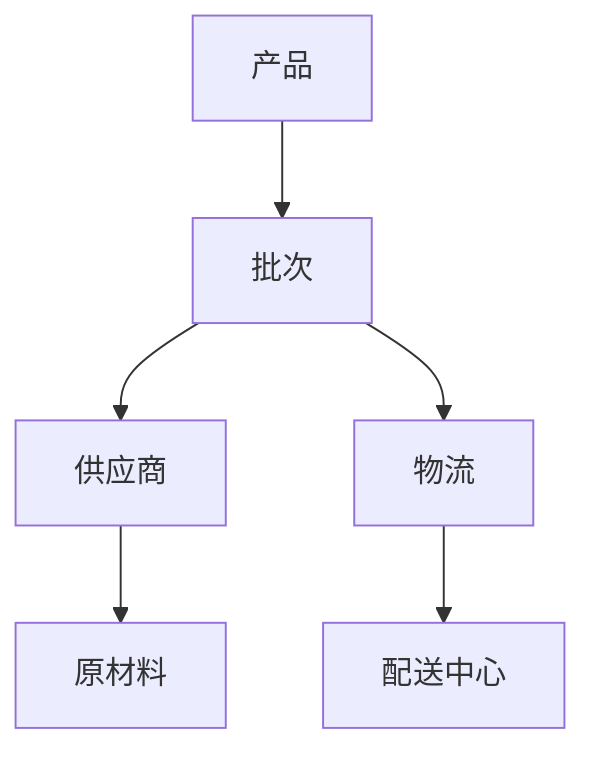
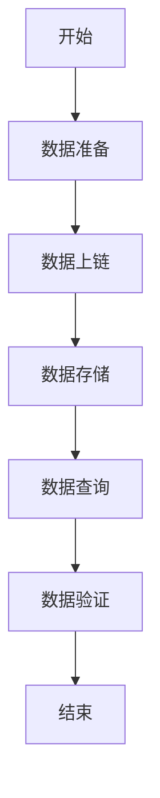
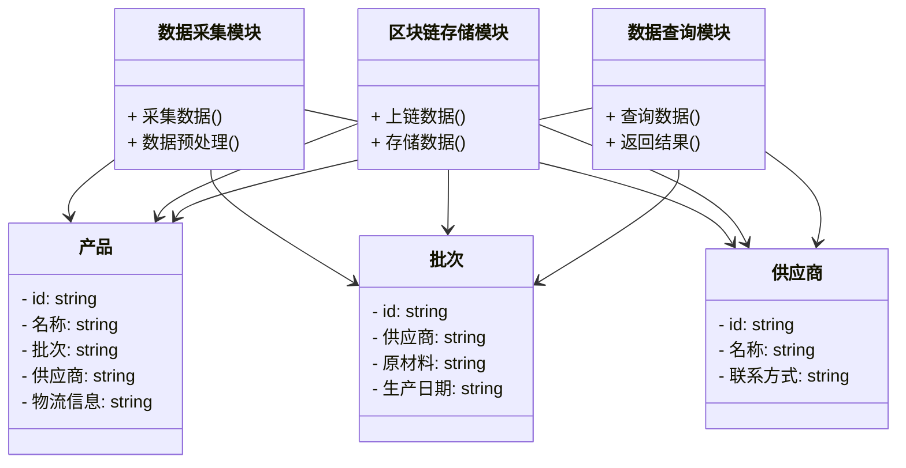
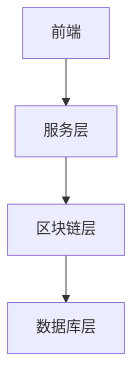

                 


# 如何评估企业的区块链供应链溯源平台

> 关键词：区块链供应链、溯源系统、评估指标、系统架构、算法原理、项目实战、最佳实践

> 摘要：本文将详细讲解如何评估企业的区块链供应链溯源平台，涵盖背景分析、核心概念、技术原理、系统架构、项目实战和最佳实践等方面，帮助读者全面理解并有效评估此类平台。

---

# 第一部分: 区块链供应链溯源平台概述

---

# 第1章: 区块链供应链溯源平台的背景与概念

## 1.1 问题背景与描述

### 1.1.1 传统供应链管理的痛点

传统供应链管理存在以下问题：

- **信息不透明**：供应链中的数据分散在不同部门或企业，难以实现全链条的信息共享。
- **数据易篡改**：纸质记录或传统数据库中的数据容易被篡改，缺乏有效的防伪机制。
- **追踪效率低**：在出现问题时，追溯产品来源需要逐层排查，耗时且效率低下。

### 1.1.2 溯源需求的迫切性

随着消费者对产品质量和来源的关注度提高，企业需要提供透明的溯源信息以增强信任。此外，监管部门也要求更高的透明度以确保合规性。

### 1.1.3 区块链技术的引入

区块链技术通过去中心化、不可篡改和可追溯的特性，为供应链溯源提供了新的解决方案。

---

## 1.2 区块链供应链溯源的核心问题

### 1.2.1 数据真实性的挑战

如何确保供应链中的数据真实可靠，防止数据篡改和伪造。

### 1.2.2 信息孤岛问题

如何实现供应链上下游企业之间的数据共享，打破信息孤岛。

### 1.2.3 追踪效率低下

如何快速、准确地追踪产品来源，特别是在出现问题时。

---

## 1.3 区块链技术如何解决这些问题

### 1.3.1 数据不可篡改性

区块链通过哈希值和链式结构确保数据的完整性和不可篡改性。

### 1.3.2 分布式特性

区块链的分布式特性使得数据可以在多个节点上同步存储，避免单点故障。

### 1.3.3 透明性与可追溯性

区块链的透明性和可追溯性使得供应链中的每个环节都可以被追踪和记录。

---

## 1.4 本章小结

本章介绍了区块链供应链溯源平台的背景、核心问题及区块链技术如何解决这些问题。

---

# 第2章: 区块链供应链溯源的核心概念与联系

## 2.1 核心概念解析

### 2.1.1 区块链

- **定义**：区块链是一种去中心化的分布式账本技术，通过加密算法和共识机制确保数据的安全性和一致性。
- **特点**：去中心化、不可篡改、透明性。

### 2.1.2 供应链

- **定义**：供应链是指从原材料采购、生产、物流到最终消费者的整个过程。
- **特点**：涉及多个环节和参与者，数据分散。

### 2.1.3 溯源系统

- **定义**：溯源系统是指通过对产品生命周期的记录和追踪，实现对产品来源的验证。
- **特点**：实时性、可追溯性。

---

## 2.2 核心概念之间的关系

### 2.2.1 区块链与供应链的结合

区块链为供应链提供了一种去中心化的数据存储和管理方式，使得供应链中的数据更加透明和可信。

### 2.2.2 溯源系统在供应链中的作用

溯源系统通过区块链技术实现供应链中每个环节的数据记录和追踪，帮助企业和消费者了解产品的来源和质量。

---

## 2.3 核心概念的属性特征对比

| 概念       | 特性                  | 区块链                          | 传统供应链                        |
|------------|-----------------------|----------------------------------|-----------------------------------|
| 数据存储   | 去中心化              | 多个节点分布式存储               | 单一中心存储                     |
| 数据安全性 | 不可篡改              | 哈希值和区块链结构确保数据不可篡改 | 易被篡改                         |
| 透明性     | 高度透明              | 所有节点可见数据                 | 信息不透明                       |
| 可追溯性   | 强大的可追溯性        | 可以追踪到每个数据的来源         | 需要人工排查                     |

---

## 2.4 ER实体关系图



---

## 2.5 本章小结

本章详细解析了区块链供应链溯源平台的核心概念，并通过对比分析和实体关系图展示了它们之间的关系。

---

# 第3章: 区块链供应链溯源的算法原理

## 3.1 区块链共识机制

### 3.1.1 工作量证明机制（PoW）

- **定义**：PoW通过计算哈希值的难度来确保区块链的安全性。
- **特点**：安全性高，但计算资源消耗大。

### 3.1.2 权益证明机制（PoS）

- **定义**：PoS通过持有代币的数量来决定记账权。
- **特点**：资源消耗低，但安全性依赖于参与者的诚信。

### 3.1.3 拜占庭容错（BFT）

- **定义**：BFT是一种适用于区块链的共识机制，允许部分节点故障或恶意。
- **特点**：适用于高性能区块链。

---

## 3.2 区块链数据结构

### 3.2.1 区块链的基本结构

- **定义**：区块链由区块组成，每个区块包含一批交易和一个区块头。
- **特点**：区块头包含哈希值和时间戳。

### 3.2.2 Merkel树的实现

- **定义**：Merkel树是一种二叉树，用于存储数据块的哈希值。
- **特点**：Merkel根可以验证数据块的完整性。

### 3.2.3 区块头与区块体的关系

- **定义**：区块头包含区块链的元数据，区块体包含具体的交易数据。
- **特点**：区块头通过哈希值引用区块体。

---

## 3.3 溯源系统实现流程

### 3.3.1 数据上链流程

- **步骤**：
  1. 数据预处理：将供应链中的数据进行格式化处理。
  2. 数据签名：对数据进行数字签名，确保数据来源的合法性。
  3. 数据打包：将数据打包成交易，并广播到区块链网络。
  4. 区块确认：通过共识机制确认数据上链。

### 3.3.2 数据查询流程

- **步骤**：
  1. 查询请求：用户或系统发起查询请求。
  2. 数据检索：从区块链中检索相关的数据块。
  3. 数据验证：通过验证签名和哈希值确保数据的完整性。

### 3.3.3 数据验证流程

- **步骤**：
  1. 数据校验：通过Merkel树验证数据是否被篡改。
  2. 时间戳验证：通过区块头的时间戳验证数据的有效性。

---

## 3.4 算法流程图



---

## 3.5 本章小结

本章详细讲解了区块链供应链溯源平台的共识机制和数据结构，并通过流程图展示了数据上链、存储和验证的流程。

---

# 第4章: 区块链供应链溯源的数学模型与公式

## 4.1 区块链中的哈希函数

### 4.1.1 SHA-256算法

- **定义**：SHA-256是一种常用的哈希函数，用于生成数据的唯一标识。
- **公式**：
  $$ H(M) = \text{SHA-256}(M) $$

### 4.1.2 梅克尔树的哈希值计算

- **定义**：Merkel树通过递归哈希计算生成根哈希值。
- **公式**：
  $$ \text{Merkel Root} = H(H(\text{左子树}) + H(\text{右子树})) $$ $$ $$

### 4.1.3 数学表达式

$$ H(M) = \text{SHA-256}(M) $$

---

## 4.2 区块链中的数字签名

### 4.2.1 私钥与公钥的关系

- **定义**：私钥用于签名，公钥用于验证签名。
- **公式**：
  $$ \text{签名} = \text{Sign}(M, \text{私钥}) $$
  $$ \text{验证} = \text{Verify}(\text{签名}, M, \text{公钥}) $$

### 4.2.2 签名验证过程

- **步骤**：
  1. 使用公钥验证签名的有效性。
  2. 通过哈希函数验证数据的完整性。

### 4.2.3 数学表达式

$$ S = \text{Sign}(M, K_{\text{私}}) $$

---

## 4.3 本章小结

本章通过数学公式和流程图详细讲解了区块链中的哈希函数和数字签名原理。

---

# 第5章: 区块链供应链溯源系统的分析与设计

## 5.1 系统功能设计

### 5.1.1 领域模型类图



---

## 5.2 系统架构设计

### 5.2.1 分层架构



### 5.2.2 模块划分

- **前端**：用户界面，展示溯源信息。
- **服务层**：处理用户请求，调用区块链接口。
- **区块链层**：管理区块链节点，处理交易和共识。
- **数据库层**：存储区块链数据和非区块链数据。

---

## 5.3 系统接口设计

### 5.3.1 数据上链接口

- **接口名称**：`postDataToBlockchain`
- **输入参数**：`productInfo`
- **输出参数**：`transactionHash`

### 5.3.2 数据查询接口

- **接口名称**：`queryDataFromBlockchain`
- **输入参数**：`productId`
- **输出参数**：`productTrace`

---

## 5.4 本章小结

本章详细讲解了区块链供应链溯源系统的功能设计和架构设计，并通过类图和流程图展示了系统的模块划分和接口设计。

---

# 第6章: 区块链供应链溯源平台的项目实战

## 6.1 环境安装

### 6.1.1 安装区块链环境

```bash
npm install -g blockchain-core
```

### 6.1.2 安装其他依赖

```bash
npm install express
npm install crypto
```

---

## 6.2 系统核心实现源代码

### 6.2.1 数据上链代码

```javascript
const crypto = require('crypto');
const blockchain = require('./blockchain-core');

function postDataToBlockchain(productInfo) {
    const hash = crypto.createHash('sha256').update(productInfo).digest('hex');
    const transaction = {
        from: '供应商地址',
        to: '区块链地址',
        value: hash,
        data: productInfo
    };
    return blockchain.postTransaction(transaction);
}
```

### 6.2.2 数据查询代码

```javascript
function queryDataFromBlockchain(productId) {
    const hash = crypto.createHash('sha256').update(productId).digest('hex');
    return blockchain.queryTransaction(hash);
}
```

---

## 6.3 代码应用解读与分析

### 6.3.1 数据上链流程

- **步骤**：
  1. 对产品信息进行哈希计算。
  2. 创建交易对象。
  3. 将交易广播到区块链网络。
  4. 返回交易哈希值。

### 6.3.2 数据查询流程

- **步骤**：
  1. 根据产品ID计算哈希值。
  2. 查询区块链中对应的数据。
  3. 返回溯源信息。

---

## 6.4 案例分析与详细讲解

### 6.4.1 案例场景

假设某企业需要追踪一批原材料的供应链信息，使用区块链供应链溯源平台进行数据记录和查询。

### 6.4.2 实施步骤

1. **数据采集**：供应商提供原材料信息并进行数据预处理。
2. **数据上链**：将原材料信息上链并生成交易哈希。
3. **数据存储**：区块链节点存储数据。
4. **数据查询**：消费者或企业查询原材料的溯源信息。

---

## 6.5 本章小结

本章通过实际案例展示了如何使用区块链供应链溯源平台，并通过代码实现和流程图详细讲解了数据上链和查询的实现过程。

---

# 第7章: 总结与最佳实践

## 7.1 评估结果与改进建议

### 7.1.1 评估结果

通过评估，区块链供应链溯源平台在数据真实性和可追溯性方面表现优异，但在性能优化和用户界面友好性方面还有提升空间。

### 7.1.2 改进建议

- **性能优化**：优化共识机制，提高区块链的吞吐量。
- **用户友好性**：优化用户界面，提升用户体验。

---

## 7.2 最佳实践 tips

### 7.2.1 数据隐私保护

在实现溯源平台时，需要注意数据隐私保护，避免敏感信息泄露。

### 7.2.2 技术融合

可以将人工智能技术与区块链技术结合，进一步提高溯源系统的智能化水平。

### 7.2.3 行业扩展

区块链供应链溯源技术可以扩展到更多行业，如医疗、食品、珠宝等。

---

## 7.3 本章小结

本章总结了区块链供应链溯源平台的评估结果，并提出了改进建议和最佳实践。

---

# 附录: 进一步阅读与学习

## 1. 推荐书籍

- 《区块链：数字货币的奥秘》
- 《供应链管理：原理与应用》

## 2. 开源项目

- GitHub上的区块链供应链溯源项目。

## 3. 在线课程

- Coursera上的区块链课程。

---

# 作者

作者：AI天才研究院/AI Genius Institute & 禅与计算机程序设计艺术 /Zen And The Art of Computer Programming

--- 

感谢您的阅读！希望本文能为您提供有价值的见解和指导，帮助您更好地评估和实施区块链供应链溯源平台。

