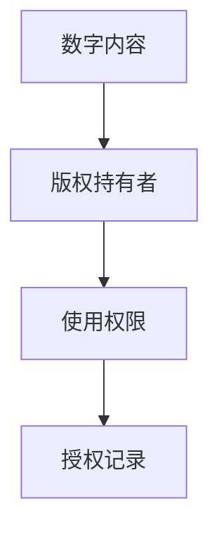
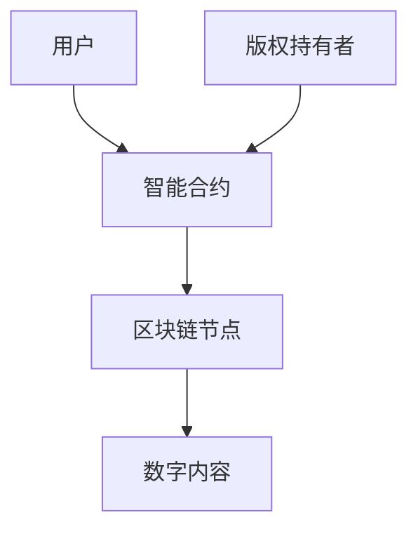

                 


# 如何评估企业的区块链数字版权保护平台

> 关键词：区块链数字版权保护，智能合约，共识机制，加密算法，数字版权管理

> 摘要：本文深入探讨了如何评估企业的区块链数字版权保护平台，从背景、核心概念、技术原理到系统架构、项目实战和最佳实践，为技术负责人、产品经理和开发者提供全面的评估方法和实现思路。

---

# 第一部分: 区块链数字版权保护平台的背景与基础

# 第1章: 数字版权保护的背景与挑战

## 1.1 数字版权保护的背景

### 1.1.1 数字化时代的版权问题

随着数字化浪潮的推进，数字内容的创作和传播变得越来越普遍。然而，数字内容的易复制性和传播性也带来了版权保护的难题。传统的版权保护方式难以应对数字环境下的侵权行为，如盗版、非法传播等。

### 1.1.2 数字版权保护的重要性

数字版权保护是确保创作者权益、促进数字内容产业健康发展的重要手段。通过有效的版权保护机制，可以防止未经授权的使用和复制，保护创作者的经济利益，同时激励更多的创新和创作。

### 1.1.3 区块链在数字版权中的应用

区块链技术以其去中心化、不可篡改和可追溯的特点，为数字版权保护提供了新的解决方案。通过区块链技术，可以实现数字内容的确权、存证、授权和追踪，确保版权信息的透明性和安全性。

## 1.2 区块链技术的基本概念

### 1.2.1 区块链的定义与特点

区块链是一种分布式账本技术，通过去中心化的节点网络记录和验证数据，确保数据的安全性和一致性。其特点包括去中心化、不可篡改、可追溯和透明性。

### 1.2.2 区块链的核心技术

- **共识机制**：确保所有节点达成一致的机制，如工作量证明（PoW）、权益证明（PoS）等。
- **智能合约**：自动执行预定义规则的脚本，用于实现复杂的业务逻辑。
- **加密算法**：保护数据隐私和安全的关键技术，如哈希函数和数字签名。

### 1.2.3 区块链的分类与应用场景

区块链可以分为公有链、联盟链和私有链。公有链适用于去中心化程度高的场景，如比特币；联盟链适用于特定机构之间的协作，如供应链金融；私有链适用于企业内部的特定场景，如内部数据管理。

## 1.3 区块链与数字版权的结合

### 1.3.1 数字版权保护的需求

数字内容的创作者和持有者需要一种可靠的方式来确权、管理和授权其作品的使用。区块链技术能够提供这种能力，确保版权信息的真实性和不可篡改性。

### 1.3.2 区块链在数字版权中的优势

- **不可篡改性**：区块链上的数据一旦记录，无法被篡改，确保版权信息的真实性和权威性。
- **可追溯性**：通过区块链，可以追踪数字内容的来源和使用情况，便于追责和管理。
- **去中心化**：区块链的去中心化特性减少了单点故障的风险，提高了系统的可靠性和安全性。

### 1.3.3 区块链数字版权保护的实现方式

通过区块链技术，可以实现数字内容的上链确权、智能合约的自动执行（如授权和收益分配）、以及使用情况的实时追踪。

## 1.4 本章小结

本章介绍了数字版权保护的背景和挑战，阐述了区块链技术的基本概念和特点，并分析了区块链在数字版权保护中的优势和实现方式。

---

# 第2章: 区块链数字版权保护的核心概念

## 2.1 数字版权保护的关键要素

### 2.1.1 数字内容的定义与特征

数字内容是指以数字形式存在的任何形式的知识产权，包括文本、图片、音乐、视频等。其特征包括易复制性、易传播性和依赖于数字载体。

### 2.1.2 数字版权的持有者与使用权限

数字版权的持有者可以是创作者、出版商或授权机构。使用权限则需要通过智能合约进行定义和管理，确保授权的合法性和透明性。

### 2.1.3 数字版权的生命周期管理

数字版权的生命周期包括创作、确权、授权、使用、终止等阶段。通过区块链技术，可以实现对版权生命周期的全链条管理。

## 2.2 区块链技术的核心原理

### 2.2.1 区块链的去中心化特性

区块链通过分布式账本和点对点网络实现了数据的去中心化存储和管理，避免了单点故障和数据篡改的风险。

### 2.2.2 区块链的共识机制

共识机制是区块链的核心技术之一，用于确保所有节点对账本状态的一致性。常见的共识机制包括工作量证明（PoW）和权益证明（PoS）。

### 2.2.3 区块链的智能合约功能

智能合约是区块链上的自动化程序，能够根据预设的规则自动执行操作。在数字版权保护中，智能合约可以用于自动授权、收益分配和使用记录的追踪。

## 2.3 区块链数字版权保护的实现原理

### 2.3.1 数字内容的上链流程

1. 数字内容通过哈希函数生成唯一标识。
2. 通过智能合约将内容的元数据（如创作者、版权信息）记录到区块链上。
3. 确保内容的不可篡改性和可追溯性。

### 2.3.2 数字版权的确权与登记

通过区块链上的智能合约，数字内容的创作者可以在线进行版权登记，系统自动生成确权证书并记录在区块链上。

### 2.3.3 数字版权的使用与授权管理

通过智能合约，数字版权的使用可以实现自动化授权和记录。每次使用都会生成记录，并通过区块链的可追溯性进行追踪。

## 2.4 核心概念对比与表格

### 2.4.1 区块链与传统版权保护的对比

| 对比维度 | 区块链 | 传统版权保护 |
|----------|--------|---------------|
| 存储方式 | 去中心化 | 中心化         |
| 确权效率 | 高       | 低             |
| 可追溯性 | 高       | 低             |
| 成本      | 较低     | 较高           |

### 2.4.2 数字版权与传统版权的对比

| 对比维度 | 数字版权 | 传统版权 |
|----------|----------|----------|
| 存储介质 | 数字化   | 实体化    |
| 复制难度 | 低       | 高         |
| 传播速度 | 快       | 慢         |

### 2.4.3 核心概念的ER实体关系图



## 2.5 本章小结

本章详细阐述了数字版权保护的核心要素，分析了区块链技术的核心原理，并通过对比和实体关系图展示了区块链数字版权保护的优势和实现方式。

---

# 第3章: 区块链数字版权保护的核心技术

## 3.1 区块链共识机制

### 3.1.1 共识机制的定义与作用

共识机制是区块链系统中确保所有节点对账本状态一致性的机制。其作用包括防止双重支付、维护网络安全和确保数据一致性。

### 3.1.2 常见的共识算法对比

| 共识算法 | 工作原理 | 优点 | 缺点 |
|----------|----------|------|------|
| PoW     | 基于计算能力 | 安全性高 | 能耗高 |
| PoS     | 基于持币数量 | 能耗低 | 安全性较低 |
| DPoS     | 基于投票机制 | 效率高 | 中心化风险 |

### 3.1.3 选择共识机制的影响因素

- **安全性**：共识机制需要能够防止恶意攻击和双重支付。
- **效率**：共识机制需要在保证安全性的前提下，尽可能提高交易处理速度。
- **成本**：共识机制的运行成本，包括计算资源和能源消耗。

## 3.2 智能合约的原理与实现

### 3.2.1 智能合约的定义与特点

智能合约是运行在区块链上的自动化程序，能够根据预设的规则自动执行操作。其特点是自动性、不可篡改性和去中心化。

### 3.2.2 智能合约的编译与部署

1. 编写智能合约代码（如Solidity语言）。
2. 使用编译器将代码编译为 bytecode。
3. 部署智能合约到区块链网络。

### 3.2.3 智能合约的执行流程

1. 用户调用智能合约的函数。
2. 合约状态被读取并验证。
3. 合约逻辑被执行，状态更新。
4. 交易被记录到区块链。

## 3.3 加密算法在数字版权中的应用

### 3.3.1 加密算法的分类与选择

加密算法主要分为对称加密和非对称加密。对称加密（如AES）适用于数据加密，非对称加密（如RSA）适用于数字签名和身份验证。

### 3.3.2 哈希函数的作用

哈希函数用于将任意长度的数据映射为固定长度的哈希值，常用于数据完整性验证和内容地址。

### 3.3.3 数字签名的实现

数字签名通过公私钥对实现，用于验证数据来源和完整性。签名过程使用私钥，验证过程使用公钥。

## 3.4 区块链数字版权保护的数学模型

数字内容的上链确权可以表示为：

$$ H = hash(content) $$

其中，$H$ 是内容的哈希值，用于唯一标识数字内容。

授权过程可以通过智能合约实现：

$$ authorize = smart\_contract(content, user) $$

其中，$authorize$ 表示授权状态，$smart\_contract$ 是智能合约函数。

## 3.5 本章小结

本章详细讲解了区块链数字版权保护的核心技术，包括共识机制、智能合约和加密算法，并通过数学模型和流程图展示了这些技术在数字版权保护中的应用。

---

# 第4章: 区块链数字版权保护的系统架构与设计

## 4.1 系统功能设计

### 4.1.1 数字内容管理模块

- 内容上链
- 版权确权
- 使用记录追踪

### 4.1.2 智能合约管理模块

- 合约部署
- 合约执行
- 合约监控

### 4.1.3 用户权限管理模块

- 用户身份验证
- 权限分配
- 权限变更

## 4.2 系统架构设计

### 4.2.1 系统架构图



### 4.2.2 系统功能模块

- 用户模块：负责内容上链、授权和使用记录查询。
- 合约模块：负责智能合约的部署和执行。
- 区块链节点：负责数据存储和共识。

## 4.3 系统接口设计

### 4.3.1 API接口

- `POST /content/upload`：上传数字内容
- `POST /contract/deploy`：部署智能合约
- `GET /content/record`：查询使用记录

### 4.3.2 接口交互流程

1. 用户调用上传接口，将数字内容发送到系统。
2. 系统生成哈希值并记录到区块链。
3. 用户可以查询使用记录，确保授权的合法性和透明性。

## 4.4 本章小结

本章设计了区块链数字版权保护系统的功能模块和架构，并通过接口交互流程展示了系统的实现方式。

---

# 第5章: 区块链数字版权保护的项目实战

## 5.1 项目环境安装

### 5.1.1 安装以太坊节点

```bash
# 安装Geth
sudo apt-get install ethereum
```

### 5.1.2 安装Solidity编译器

```bash
# 安装Solidity
npm install -g solc
```

## 5.2 系统核心实现源代码

### 5.2.1 智能合约实现

```solidity
// SPDX-License-Identifier: MIT
pragma solidity ^0.8.0;

contract Copyright {
    event ContentCreated(address indexed creator, bytes32 hash);
    
    function createContent(bytes32 hash, address creator) public {
        emit ContentCreated(creator, hash);
    }
}
```

### 5.2.2 合约部署与调用

```javascript
const hre = require("hardhat");
const { ethers } = hre;

async function main() {
    const Copyright = await hre.ethers.getContractFactory('Copyright');
    const copyright = await Copyright.deploy();
    console.log('Copyright deployed at:', copyright.address);
}

main().catch((error) => {
    console.error(error);
    process.exitCode = 1;
});
```

## 5.3 代码应用解读与分析

通过上述代码，我们可以实现数字内容的上链确权和使用记录的追踪。智能合约的`createContent`函数用于记录内容的创建，`ContentCreated`事件用于通知节点内容的变化。

## 5.4 实际案例分析

以音乐版权保护为例，创作者可以通过智能合约将音乐作品的元数据记录到区块链上。每次授权播放音乐时，智能合约会自动记录使用情况，并根据预设的规则进行收益分配。

## 5.5 本章小结

本章通过实际的项目实战，展示了如何在区块链上实现数字版权保护的系统，包括环境搭建、智能合约实现和代码调用。

---

# 第6章: 区块链数字版权保护的最佳实践与总结

## 6.1 最佳实践

### 6.1.1 系统设计中的注意事项

- 确保系统的可扩展性和灵活性。
- 选择合适的共识机制和加密算法。
- 定期进行安全审计和漏洞修复。

### 6.1.2 项目实施中的关键点

- 明确项目需求和目标。
- 选择合适的开发工具和框架。
- 确保团队成员的技术能力和协作效率。

## 6.2 项目总结与未来展望

通过区块链技术，我们可以实现高效、安全的数字版权保护。未来，随着技术的不断发展，数字版权保护将更加智能化和自动化，为创作者和用户提供更好的服务。

## 6.3 注意事项

- 确保系统的合规性，符合相关法律法规。
- 加强用户教育，提高用户的版权意识。
- 定期更新系统，应对新的技术挑战和安全威胁。

## 6.4 拓展阅读

- 《区块链技术与应用》
- 《智能合约开发指南》
- 《数字版权保护的法律与实践》

---

# 作者：AI天才研究院/AI Genius Institute & 禅与计算机程序设计艺术 /Zen And The Art of Computer Programming

---

通过以上内容，我们详细探讨了如何评估企业的区块链数字版权保护平台，从理论到实践，为技术负责人、产品经理和开发者提供了全面的指导和参考。

