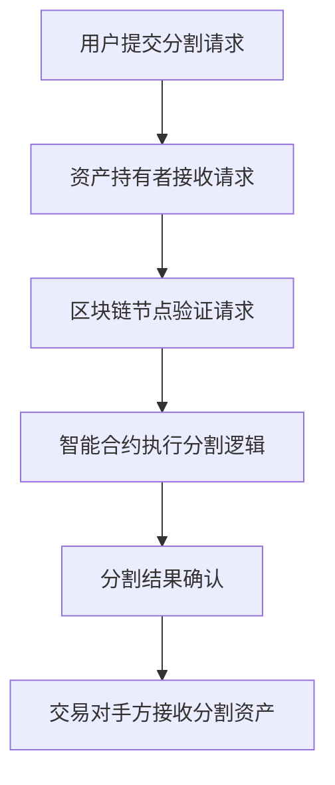
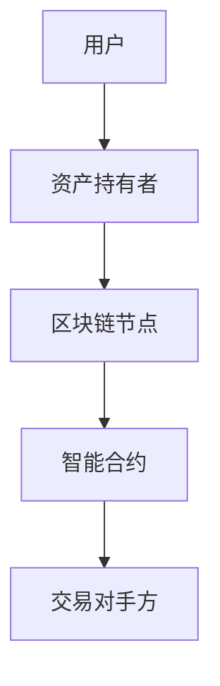
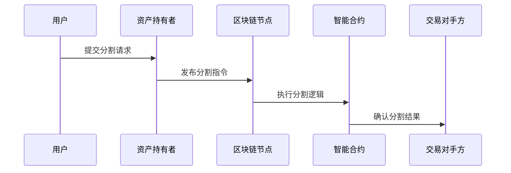

                 


# 如何评估企业的区块链数字资产分割平台

> **关键词**：区块链，数字资产，分割平台，评估方法，系统架构，安全性，合规性

> **摘要**：本文将详细探讨如何评估企业区块链数字资产分割平台。首先，我们将从区块链技术的基本概念和数字资产分割平台的背景入手，逐步分析其核心目标和关键特性。接着，我们将介绍评估的框架和方法论，包括需求分析、技术评估、安全性评估以及综合评分。随后，我们将深入探讨系统的架构设计，包括功能模块、数据流、接口设计和交互流程。最后，我们通过实际案例分析，展示如何将理论应用于实践，并总结评估的关键点和最佳实践。

---

# 第一部分: 区块链数字资产分割平台概述

## 第1章: 区块链数字资产分割平台的背景与概念

### 1.1 区块链技术的基本概念

区块链技术是一种去中心化的分布式账本技术，通过密码学和共识机制确保数据的安全性和一致性。它具有以下特点：
- **去中心化**：数据存储在多个节点上，没有单一的控制中心。
- **不可篡改**：一旦数据被写入区块链，难以被修改。
- **透明性**：所有交易记录对所有参与者公开。
- **去信任化**：通过共识机制建立信任，无需依赖中心机构。

### 1.2 数字资产的定义与分类

数字资产是指以数字化形式存在的资产，包括：
- **数字货币**：如比特币、以太坊等。
- **代币**：用于表示特定价值或权益的数字凭证。
- **数字证券**：基于区块链的数字权益证明。

数字资产的分类可以根据其用途、发行方式和价值基础进行划分。

### 1.3 区块链与数字资产分割平台的关系

区块链数字资产分割平台（以下简称“平台”）是指利用区块链技术对数字资产进行分割、管理和交易的系统。其核心功能包括：
- **资产分割**：将大额资产分割为多个小单位，提高流动性。
- **智能合约**：通过智能合约自动执行交易和结算。
- **安全性保障**：通过区块链技术确保资产的安全性和所有权的明确性。

---

## 第2章: 区块链数字资产分割的核心概念

### 2.1 数字资产分割的定义与特征

数字资产分割是指将数字资产按照一定规则分解为多个部分，每个部分可以独立流通和交易。其主要特征包括：
- **可分割性**：资产可以被分割为任意小的单位。
- **可追踪性**：每个分割后的资产都可以被追踪和记录。
- **可编程性**：通过智能合约实现自动化的交易和结算。

### 2.2 区块链数字资产分割的实体关系图

以下是数字资产分割平台的实体关系图（ER图）：

```mermaid
erDiagram
    participant 用户
    participant 资产持有者
    participant 交易对手方
    participant 区块链节点
    participant 智能合约
    用户 --> 资产持有者: 提交分割请求
    资产持有者 --> 区块链节点: 发布分割指令
    区块链节点 --> 智能合约: 执行分割逻辑
    智能合约 --> 交易对手方: 确认分割结果
```

### 2.3 区块链数字资产分割的流程图

以下是数字资产分割的流程图：



---

# 第二部分: 区块链数字资产分割平台的评估方法论

## 第3章: 区块链数字资产分割平台的评估框架

### 3.1 评估目标的确定

在评估数字资产分割平台时，我们需要明确以下几个目标：
- **安全性**：确保资产的安全性和交易的可靠性。
- **功能性**：平台是否满足企业的核心需求。
- **可扩展性**：平台是否能够支持未来的业务增长。
- **合规性**：平台是否符合相关法律法规和行业标准。

### 3.2 评估维度的设计

以下是数字资产分割平台的主要评估维度：
- **技术性能**：包括区块链的共识机制、网络性能和存储效率。
- **安全性**：包括加密算法、智能合约的安全性和漏洞修复能力。
- **功能性**：包括资产分割的粒度、交易的自动化能力以及用户界面的友好性。
- **合规性**：包括是否符合相关法律法规，如反洗钱（AML）和了解客户（KYC）要求。
- **用户体验**：包括操作的便捷性、界面的直观性和响应速度。

### 3.3 评估指标的权重分配

为了量化评估结果，我们需要为每个评估维度分配权重。以下是常见的权重分配方法：

$$
\text{总评分} = \sum_{i=1}^{n} w_i \cdot s_i
$$

其中，$w_i$ 是第 $i$ 个评估维度的权重，$s_i$ 是第 $i$ 个维度的评分。

---

## 第4章: 区块链数字资产分割平台的系统架构设计

### 4.1 系统功能模块设计

以下是数字资产分割平台的主要功能模块：
- **用户模块**：用户提交分割请求、查询资产信息。
- **资产持有者模块**：管理数字资产，发布分割指令。
- **区块链节点模块**：验证和执行分割逻辑。
- **智能合约模块**：自动执行分割和交易逻辑。
- **交易对手方模块**：接收分割后的资产，确认交易结果。

### 4.2 系统架构设计

以下是数字资产分割平台的系统架构图：



### 4.3 系统接口设计

以下是系统的主要接口设计：
- **提交分割请求接口**：用户提交分割请求，接口将请求转发给资产持有者。
- **验证分割请求接口**：区块链节点验证请求的有效性。
- **执行分割逻辑接口**：智能合约执行分割逻辑，生成分割后的资产。
- **确认分割结果接口**：交易对手方确认分割结果。

### 4.4 系统交互流程设计

以下是系统交互流程的序列图：



---

## 第5章: 区块链数字资产分割平台的项目实战

### 5.1 项目需求分析

假设某企业需要评估一个数字资产分割平台，具体需求如下：
- **资产类型**：数字证券。
- **分割粒度**：最小单位为1股。
- **交易方式**：支持场外交易和场内交易。
- **合规性要求**：符合反洗钱（AML）和了解客户（KYC）要求。

### 5.2 技术选型

根据需求，我们可以选择以下技术：
- **区块链框架**：以太坊公链或联盟链（如Hyperledger Fabric）。
- **智能合约语言**：Solidity（以太坊）或Go（Hyperledger Fabric）。
- **安全性措施**：加密算法（如椭圆曲线加密）和多重签名钱包。

### 5.3 系统实现

以下是数字资产分割平台的核心实现代码示例：

```python
# 智能合约示例（以太坊）
contract AssetSplitter {
    mapping(address => uint256) public balances;

    function splitAsset(address from, address to, uint256 amount) {
        require(balances[from] >= amount, "Insufficient balance");
        balances[from] -= amount;
        balances[to] += amount;
        emit Transfer(from, to, amount);
    }
}
```

### 5.4 实际案例分析

以某企业为例，假设该企业需要将100股数字证券分割为10股每股。平台通过智能合约自动执行分割逻辑，确保每一步操作都符合法律规定。

---

## 第6章: 总结与展望

### 6.1 评估的关键点

- **安全性**：确保数字资产的安全性和交易的可靠性。
- **功能性**：平台是否满足企业的核心需求。
- **可扩展性**：平台是否能够支持未来的业务增长。
- **合规性**：平台是否符合相关法律法规和行业标准。

### 6.2 最佳实践 tips

- **选择合适的区块链框架**：根据企业的具体需求选择公链或联盟链。
- **注重智能合约的安全性**：定期进行漏洞扫描和审计。
- **遵循合规性要求**：确保平台符合相关法律法规。

### 6.3 未来展望

随着区块链技术的不断发展，数字资产分割平台将更加智能化和自动化。未来，我们可以期待更多创新性的解决方案，如基于零知识证明的隐私保护、跨链资产分割等。

---

**作者：AI天才研究院 & 禅与计算机程序设计艺术**

