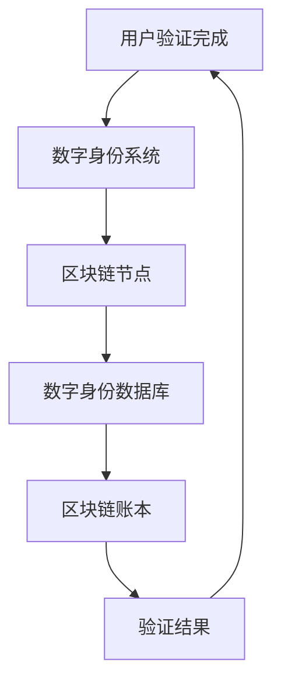
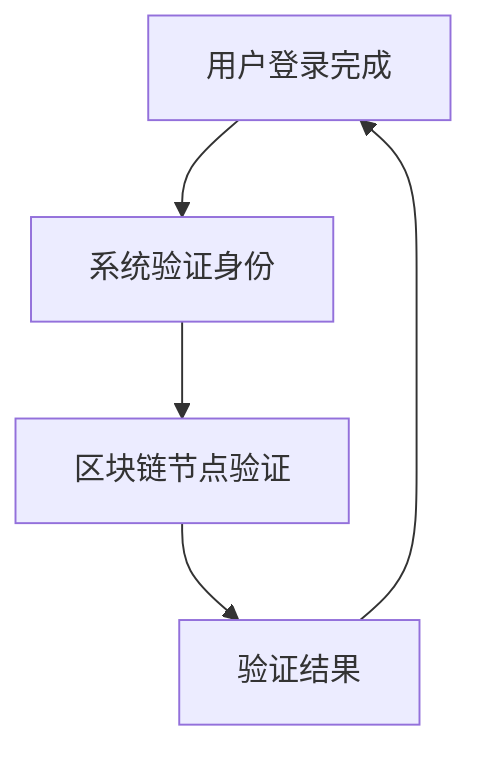
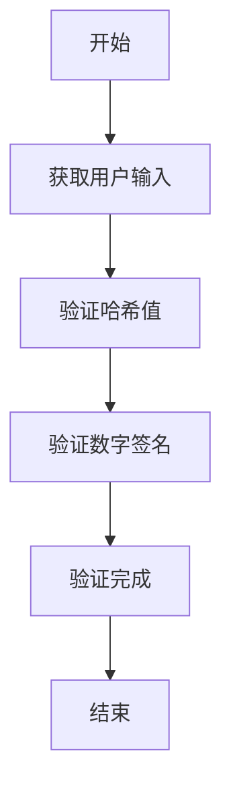
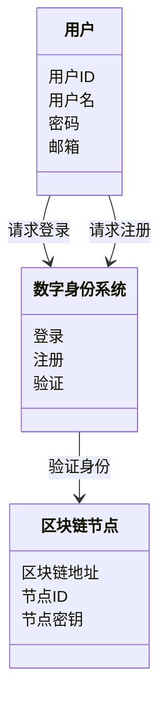
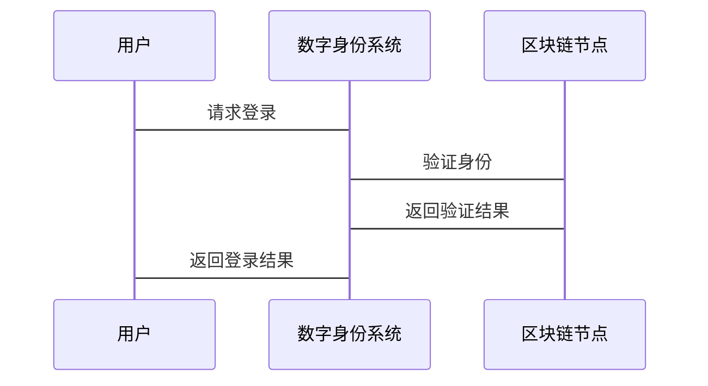

                 


# 如何评估企业的区块链数字身份系统

## 关键词：区块链、数字身份、系统评估、安全性、去中心化、加密算法、分布式系统

## 摘要：  
区块链数字身份系统是企业数字化转型中的关键基础设施，通过区块链技术实现身份的去中心化管理，提升安全性、透明性和用户隐私保护。本文将从技术原理、系统架构、安全性评估等多个角度，详细分析如何科学评估企业区块链数字身份系统，为企业提供有效的评估方法和实践指导。

---

# 第1章: 区块链数字身份系统概述

## 1.1 数字身份系统的基本概念

### 1.1.1 数字身份的定义与特点
- **数字身份**：指用户在数字空间中的唯一标识，通常包括用户的唯一标识符（如用户名、邮箱地址）和相关属性（如年龄、职业）。
- **特点**：唯一性、可验证性、安全性、动态性。

### 1.1.2 区块链技术的基本原理
- **区块链**：一种去中心化的分布式账本技术，通过密码学算法确保数据的安全性和不可篡改性。
- **关键特性**：去中心化、分布式、不可篡改、可追溯。

### 1.1.3 区块链与数字身份的结合
- 区块链技术为数字身份提供了去中心化的信任机制，解决了传统身份系统中数据孤岛、安全性不足等问题。

## 1.2 区块链数字身份系统的应用场景

### 1.2.1 金融领域的身份认证
- 区块链技术在金融领域的身份认证中，可以实现客户身份的快速验证和跨机构共享，降低欺诈风险。

### 1.2.2 医疗健康领域的身份管理
- 在医疗领域，区块链技术可以实现患者身份的隐私保护和医疗数据的安全共享，提高医疗服务质量。

### 1.2.3 政府公共服务的身份验证
- 政府可以通过区块链技术实现公民身份的统一管理，提高公共服务的效率和透明度。

## 1.3 区块链数字身份系统的评估意义

### 1.3.1 企业数字化转型的需求
- 随着企业数字化转型的推进，身份管理的需求日益增长，传统的中心化身份系统已难以满足需求。

### 1.3.2 区块链技术在身份系统中的优势
- 区块链技术通过去中心化和不可篡改的特性，提高了身份系统的安全性和可信度。

### 1.3.3 评估的重要性与目标
- 评估区块链数字身份系统，旨在确保系统的安全性、可用性和合规性，为企业提供可靠的技术支持。

---

# 第2章: 区块链数字身份系统的核心概念与联系

## 2.1 数字身份的核心要素

### 2.1.1 身份标识
- 身份标识是数字身份的核心，通常包括用户名、邮箱地址等。

### 2.1.2 身份属性
- 身份属性是用户在数字身份中的附加信息，如年龄、职业等。

### 2.1.3 身份验证
- 身份验证是通过密码、生物识别等方式验证用户身份的过程。

## 2.2 区块链技术的核心属性

### 2.2.1 分布式账本
- 分布式账本是区块链的核心数据结构，记录所有交易和数据变更。

### 2.2.2 去中心化
- 去中心化是区块链的重要特点，避免了单点故障和数据篡改的风险。

### 2.2.3 加密算法
- 加密算法用于保护数据的安全性，确保只有授权用户可以访问敏感信息。

## 2.3 区块链数字身份系统的结合模型

### 2.3.1 概念属性对比表

| **概念**   | **数字身份**       | **区块链技术**       |
|------------|--------------------|----------------------|
| 核心目标   | 确保身份的安全性    | 实现去中心化信任      |
| 数据存储   | 中心化数据库       | 分布式账本           |
| 访问控制   | 基于权限的访问     | 基于智能合约的访问   |

### 2.3.2 ER实体关系图
```mermaid
erDiagram
    actor 用户
    actor 系统
    actor 区块链节点
    database 数字身份数据库
    database 区块链账本
    用户 -> 数字身份数据库 : 登录
    用户 -> 区块链账本 : 验证身份
    区块链节点 -> 区块链账本 : 记录交易
    系统 -> 数字身份数据库 : 管理用户
```

### 2.3.3 概念模型的 mermaid 流程图


---

# 第3章: 区块链数字身份系统的算法原理

## 3.1 区块链共识机制

### 3.1.1 共识机制的定义
- 共识机制是区块链节点达成一致的算法，确保系统的一致性和可靠性。

### 3.1.2 常见共识算法对比

| **共识算法** | **特点**               | **适用场景**         |
|--------------|------------------------|----------------------|
| PoW（工作量证明） | 安全性高，但效率低      | 比特币等公链         |
| PoS（权益证明） | 效率高，但依赖质押金额   | 以太坊等公链         |
| DPoS（ delegated Proof of Stake） | 效率高，依赖代表节点   | 一些特定场景           |

### 3.1.3 共识机制对数字身份的影响
- 共识机制确保数字身份的唯一性和不可篡改性，提高了系统的安全性。

## 3.2 加密算法在数字身份中的应用

### 3.2.1 哈希函数原理
- 哈希函数将任意长度的数据映射为固定长度的哈希值，确保数据的完整性。

### 3.2.2 数字签名机制
- 数字签名通过公私钥加密技术，确保数据的完整性和不可否认性。

### 3.2.3 加密算法的数学模型
$$ H(x) = hash(x) $$
其中，\( H(x) \) 表示哈希函数的输出结果。

## 3.3 区块链数字身份系统的算法实现

### 3.3.1 算法流程图


### 3.3.2 算法实现的 mermaid 流程图


### 3.3.3 算法实现的 Python 源代码
```python
import hashlib

def calculate_hash(data):
    return hashlib.sha256(data.encode()).hexdigest()

def verify_signature(public_key, signature, data):
    try:
        # 使用 RSA 验证签名
        key = RSA.import_key(public_key)
        verifier = PKCS11.Signer(key)
        verifier.verify(data, signature)
        return True
    except Exception:
        return False
```

---

# 第4章: 数学模型与公式解析

## 4.1 哈希函数的数学模型

### 4.1.1 哈希函数的定义
- 哈希函数将输入数据映射到一个固定长度的哈希值，确保数据的完整性。

### 4.1.2 常见哈希函数的公式
$$ H(x) = hash(x) $$

### 4.1.3 哈希函数的特性
- 唯一性：不同的输入数据得到不同的哈希值。
- 碰撞 resistant：难以找到两个不同的输入数据，得到相同的哈希值。

## 4.2 数字签名的数学模型

### 4.2.1 数字签名的定义
- 数字签名通过公私钥加密技术，确保数据的完整性和不可否认性。

### 4.2.2 数字签名的公式
$$ S = sign(private\_key, data) $$

### 4.2.3 数字签名的实现过程
1. 使用私钥对数据进行签名。
2. 验证签名是否有效。

---

# 第5章: 区块链数字身份系统的系统分析与架构设计

## 5.1 问题场景介绍

### 5.1.1 企业身份管理的痛点
- 数据孤岛：不同系统之间的身份信息无法共享。
- 安全性低：中心化身份系统容易被攻击。
- 用户隐私保护不足：用户数据容易被滥用。

### 5.1.2 区块链技术如何解决这些问题
- 去中心化：避免数据孤岛，实现跨机构共享。
- 不可篡改：确保数据的安全性和可信度。
- 用户隐私保护：通过加密技术保护用户隐私。

## 5.2 系统功能设计

### 5.2.1 领域模型 mermaid 类图


### 5.2.2 系统架构设计 mermaid 架构图


### 5.2.3 系统接口设计
- 登录接口：`POST /login`
- 注册接口：`POST /register`
- 验证接口：`POST /verify`

### 5.2.4 系统交互 mermaid 序列图


---

# 第6章: 区块链数字身份系统的项目实战

## 6.1 环境安装

### 6.1.1 安装 Python 环境
```bash
python --version
pip install --upgrade pip
```

### 6.1.2 安装区块链框架
```bash
pip install eth-account eth-keyfile web3
```

## 6.2 系统核心实现源代码

### 6.2.1 登录功能实现
```python
from web3 import Web3
from eth_account import Account

def login(account, password):
    # 使用 Web3 连接区块链节点
    w3 = Web3(Web3.HTTPProvider("http://localhost:8545"))
    # 使用 Account 验证身份
    account = Account(account, password)
    try:
        signed_txn = account.signTransaction(...)
        w3.eth.sendTransaction(signed_txn)
        return "登录成功"
    except Exception as e:
        return f"登录失败: {str(e)}"
```

### 6.2.2 注册功能实现
```python
def register(account, password):
    w3 = Web3(Web3.HTTPProvider("http://localhost:8545"))
    try:
        signed_txn = w3.eth.account.signTransaction(...)
        tx_receipt = w3.eth.sendTransaction(signed_txn)
        return "注册成功"
    except Exception as e:
        return f"注册失败: {str(e)}"
```

## 6.3 案例分析与详细解读

### 6.3.1 案例背景
- 某企业希望使用区块链技术实现员工身份管理。

### 6.3.2 系统实现
1. 使用 Web3.py 连接区块链节点。
2. 实现员工注册和登录功能。
3. 使用智能合约验证员工身份。

### 6.3.3 实施效果
- 提高了员工身份管理的安全性和效率。
- 实现了跨部门的身份信息共享。

---

# 第7章: 区块链数字身份系统的最佳实践

## 7.1 关键点总结

### 7.1.1 技术选型
- 根据企业需求选择合适的区块链框架。
- 确保系统的可扩展性和可维护性。

### 7.1.2 安全性评估
- 定期进行安全审计和漏洞扫描。
- 确保系统的数据安全性和隐私保护。

### 7.1.3 性能优化
- 优化共识机制，提高系统的处理能力。
- 使用高效的加密算法，降低计算开销。

## 7.2 小结

通过科学的评估方法和最佳实践，企业可以更好地实现区块链数字身份系统的建设和管理，提高系统的安全性、可靠性和用户满意度。

---

# 作者信息

作者：AI天才研究院/AI Genius Institute & 禅与计算机程序设计艺术 /Zen And The Art of Computer Programming

