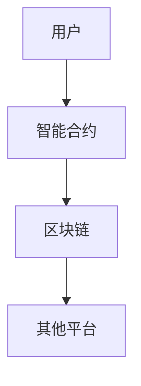
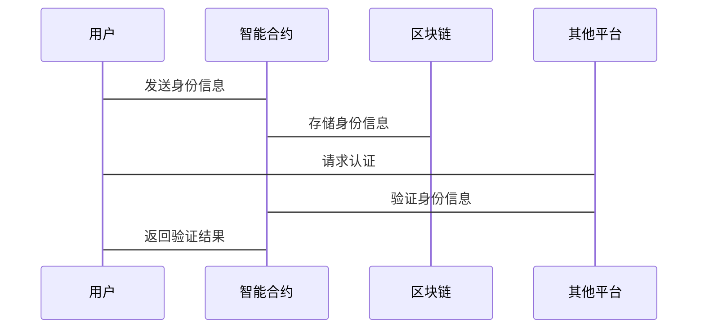
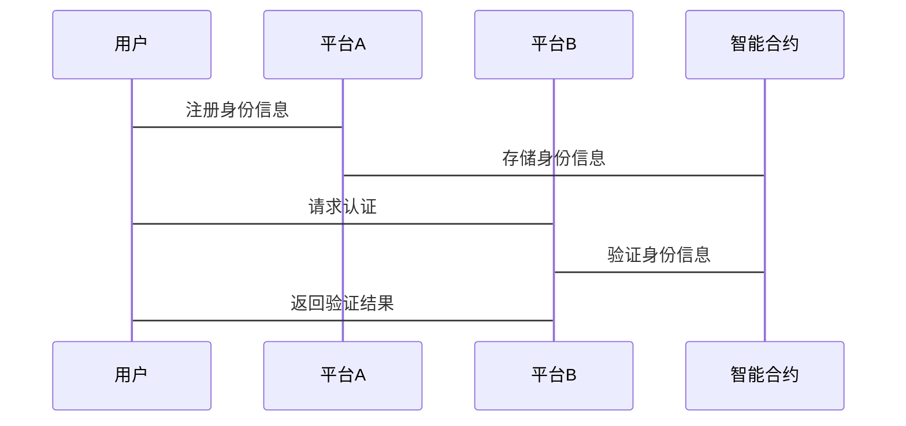

                 


# 如何评估企业的区块链数字身份跨平台认证应用

> **关键词**: 区块链, 数字身份, 跨平台认证, 系统架构, 安全性, 合规性

> **摘要**: 本文详细探讨了如何评估企业的区块链数字身份跨平台认证应用。首先介绍了区块链和数字身份管理的基本概念，分析了跨平台认证的重要性。然后深入讲解了区块链的核心原理，包括共识机制、智能合约等。接着，从算法原理、系统架构、项目实战等多个方面详细阐述了如何设计和实现区块链数字身份跨平台认证系统。最后，通过实际案例分析，总结了最佳实践和未来发展方向。

---

# 第一部分: 区块链数字身份跨平台认证概述

# 第1章: 区块链与数字身份的背景介绍

## 1.1 区块链技术基础

### 1.1.1 区块链的基本概念

区块链是一种去中心化的分布式账本技术，通过加密算法和共识机制确保数据的安全性和一致性。区块链的核心特点包括去中心化、不可篡改、透明性和可追溯性。

$$
\text{区块链 = 分布式账本 + 共识机制 + 加密算法}
$$

区块链的典型应用场景包括比特币、智能合约、供应链管理等。

### 1.1.2 区块链的核心特点

- **去中心化**: 无需依赖中心化机构，数据由所有节点共同维护。
- **不可篡改**: 通过哈希值和 Merkel 树确保数据的完整性。
- **透明性**: 所有交易记录公开可查，但用户身份可以匿名化。
- **可追溯性**: 每一笔交易都可以追溯到源头。

### 1.1.3 区块链的共识机制

共识机制是区块链的核心，用于确保所有节点达成一致。常见的共识机制包括工作量证明（PoW）、权益证明（PoS）、实用拜占庭容错（PBFT）等。

$$
\text{共识机制的作用: 确保区块链网络的一致性}
$$

**工作量证明（PoW）**: 最早用于比特币，通过计算哈希值来证明工作量。

**权益证明（PoS）**: 通过持有代币的数量来决定记账权，资源消耗较低。

**PBFT**: 适用于联盟链，能够在较短时间内达成共识。

## 1.2 数字身份管理的现状与挑战

### 1.2.1 数字身份的定义与特点

数字身份是用户在数字世界中的唯一标识，可以是用户名、邮箱、手机号或公钥等。数字身份的特点包括唯一性、可验证性和可扩展性。

$$
\text{数字身份 = 用户标识 + 权限 + 属性}
$$

### 1.2.2 当前数字身份管理的问题

- **数据孤岛**: 不同平台之间的身份信息无法互通。
- **安全性差**: 中心化机构容易成为攻击目标。
- **隐私泄露**: 用户信息可能被滥用或泄露。
- **效率低下**: 跨平台认证流程复杂，效率低。

### 1.2.3 区块链在数字身份管理中的优势

- **去中心化**: 无需依赖第三方机构，降低被攻击风险。
- **不可篡改**: 确保身份信息的真实性和完整性。
- **隐私保护**: 支持零知识证明，保护用户隐私。

## 1.3 跨平台认证的背景与意义

### 1.3.1 跨平台认证的定义

跨平台认证是指用户可以在不同平台之间使用统一的身份进行认证。例如，用户可以在 Facebook 和 Google 同时使用同一组身份信息。

### 1.3.2 跨平台认证的挑战

- **兼容性问题**: 不同平台的认证协议和格式可能不统一。
- **安全性问题**: 跨平台认证涉及多个平台，增加了安全性风险。
- **用户体验**: 誠平台认证流程复杂，可能影响用户体验。

### 1.3.3 跨平台认证的意义

- **提升用户体验**: 用户无需记住多个账号和密码。
- **降低管理成本**: 企业可以集中管理用户身份。
- **促进协作**: 跨平台认证可以促进不同平台之间的协作。

## 1.4 本章小结

本章从区块链技术和数字身份管理的基本概念出发，分析了跨平台认证的重要性和挑战，为后续章节奠定了基础。

---

# 第二部分: 区块链数字身份跨平台认证的核心概念

# 第2章: 区块链数字身份的核心原理

## 2.1 区块链的去中心化身份识别

### 2.1.1 去中心化身份识别的定义

去中心化身份识别（Decentralized Identity，DID）是一种基于区块链的技术，允许用户自主管理自己的身份信息。DID 使用去中心化的方式存储和验证身份信息。

$$
\text{DID 核心特点: 自主性、去中心化、可验证性}
$$

### 2.1.2 去中心化身份识别的实现方式

- **分布式存储**: 用户身份信息存储在区块链上，每个节点都有一份副本。
- **零知识证明**: 用户可以在不泄露隐私的情况下完成身份验证。
- **智能合约**: 通过智能合约实现身份验证的自动化。

## 2.2 区块链智能合约与身份验证

### 2.2.1 智能合约的定义与特点

智能合约是区块链上的自动执行程序，用于定义和执行双方的协议。智能合约的特点包括自动性、不可篡改性和透明性。

$$
\text{智能合约的作用: 自动执行协议}
$$

### 2.2.2 智能合约在身份验证中的应用

- **身份验证**: 用户通过智能合约调用区块链上的身份信息完成认证。
- **权限管理**: 智能合约可以根据用户身份动态调整权限。

## 2.3 跨平台认证的核心机制

### 2.3.1 跨平台认证的实现流程

1. 用户在本地生成身份信息。
2. 用户将身份信息通过智能合约发布到区块链上。
3. 其他平台通过调用智能合约验证用户身份。

### 2.3.2 跨平台认证的协议与标准

- **SAML**: 跨平台认证的常用协议。
- **OAuth 2.0**: 基于令牌的认证协议。
- **OpenID Connect**: 基于 OAuth 2.0 的扩展协议。

## 2.4 核心概念对比分析

### 2.4.1 去中心化身份识别与传统身份识别的对比

| 对比维度 | 去中心化身份识别 | 传统身份识别 |
|----------|-----------------|--------------|
| 管理方式 | 去中心化         | 中心化        |
| 安全性   | 高              | 较低          |
| 隐私性   | 好              | 差            |

### 2.4.2 智能合约与传统认证方式的对比

| 对比维度 | 智能合约         | 传统认证方式   |
|----------|-----------------|---------------|
| 自动性   | 高              | 低             |
| 可扩展性 | 高              | 低             |
| 安全性   | 高              | 中             |

---

# 第三部分: 区块链数字身份跨平台认证的算法原理

# 第3章: 区块链共识机制的数学模型

## 3.1 工作量证明机制（PoW）

### 3.1.1 PoW的数学模型

PoW 的核心是通过计算哈希值来证明工作量。矿工需要找到一个随机数，使得哈希值满足特定条件。

$$
H(m + r) < T
$$

其中，$H$ 是哈希函数，$m$ 是消息，$r$ 是随机数，$T$ 是目标值。

### 3.1.2 PoW的优缺点分析

- **优点**: 安全性高，抗女巫攻击。
- **缺点**: 资源消耗大，效率低。

## 3.2 权益证明机制（PoS）

### 3.2.1 PoS的数学模型

PoS 通过选择权重高的节点来生成区块。权重由节点持有的代币数量决定。

$$
P = \frac{a_i}{\sum_{i=1}^{n} a_i}
$$

其中，$a_i$ 是节点 $i$ 的代币数量，$P$ 是被选中的概率。

### 3.2.2 PoS的优缺点分析

- **优点**: 资源消耗低，效率高。
- **缺点**: 存在“富者越富”的问题。

## 3.3 其他共识机制的对比分析

### 3.3.1 

$$
\text{DPoS的定义: 通过投票选举见证人节点，见证人节点负责生成区块}
$$

### 3.3.2 

$$
\text{PBFT的定义: 适用于联盟链的拜占庭容错共识算法}
$$

---

# 第四部分: 区块链数字身份跨平台认证的系统架构

# 第4章: 区块链数字身份跨平台认证的系统架构

## 4.1 系统功能设计

### 4.1.1 系统功能模块

- 用户身份注册与登录
- 身份信息存储与查询
- 跨平台认证与授权

### 4.1.2 系统功能流程

1. 用户在本地生成身份信息。
2. 用户通过智能合约将身份信息发布到区块链上。
3. 其他平台通过调用智能合约验证用户身份。

## 4.2 系统架构设计

### 4.2.1 系统架构图



### 4.2.2 系统接口设计

- 用户接口: 提供身份信息注册和登录功能。
- 区块链接口: 提供智能合约调用和区块查询功能。
- 其他平台接口: 提供身份验证和授权功能。

## 4.3 系统交互流程

### 4.3.1 用户身份验证流程



### 4.3.2 跨平台认证流程



---

# 第五部分: 区块链数字身份跨平台认证的项目实战

# 第5章: 区块链数字身份跨平台认证的项目实战

## 5.1 项目背景介绍

### 5.1.1 项目目标

实现一个支持跨平台认证的区块链数字身份管理系统。

### 5.1.2 项目需求

- 用户可以在多个平台之间使用统一的身份进行认证。
- 系统支持零知识证明，保护用户隐私。
- 系统支持智能合约，实现自动化身份验证。

## 5.2 项目环境安装

### 5.2.1 安装以太坊开发环境

```bash
# 安装以太坊 SDK
npm install -g ethereum-cli
```

### 5.2.2 安装智能合约开发工具

```bash
# 安装 Solidity 编译器
npm install -g solc
```

## 5.3 项目核心实现

### 5.3.1 智能合约实现

```solidity
// SPDX-License-Identifier: MIT
pragma solidity ^0.8.0;

contract IdentityManager {
    mapping(address => bytes32) private user_identities;

    function register(address user, bytes32 identity) public {
        user_identities[user] = identity;
    }

    function verify(address user) public view returns (bytes32) {
        return user_identities[user];
    }
}
```

### 5.3.2 用户端实现

```javascript
const Web3 = require('web3');

const web3 = new Web3(new Web3.providers.HttpProvider('http://localhost:8545'));

async function registerIdentity(identity) {
    const contract = new web3.eth.Contract(ABI, contractAddress);
    const result = await contract.methods.register(identity).send();
    return result;
}

async function verifyIdentity(user) {
    const contract = new web3.eth.Contract(ABI, contractAddress);
    const result = await contract.methods.verify(user).call();
    return result;
}
```

## 5.4 项目测试与优化

### 5.4.1 测试环境搭建

```bash
# 启动本地区块链节点
web3 = Web3.createHttpProvider('http://localhost:8545');
```

### 5.4.2 功能测试

```javascript
// 注册身份
registerIdentity('user123').then(console.log);

// 验证身份
verifyIdentity('user123').then(console.log);
```

### 5.4.3 性能优化

- **并行处理**: 提高智能合约的执行效率。
- **缓存机制**: 在节点层面缓存频繁访问的身份信息。

## 5.5 项目小结

本章通过一个具体的项目案例，详细讲解了如何实现区块链数字身份跨平台认证系统，包括环境搭建、智能合约开发、用户端实现和系统测试。

---

# 第六部分: 区块链数字身份跨平台认证的总结与展望

# 第6章: 区块链数字身份跨平台认证的总结与展望

## 6.1 总结

本文从区块链技术和数字身份管理的基本概念出发，详细探讨了区块链数字身份跨平台认证的核心原理和系统架构。通过具体的项目案例，展示了如何实现一个支持跨平台认证的区块链数字身份管理系统。

## 6.2 未来展望

区块链数字身份跨平台认证技术仍处于快速发展阶段，未来可能会出现以下趋势:

1. **隐私保护**: 更多采用零知识证明等技术，进一步保护用户隐私。
2. **跨链技术**: 实现不同区块链之间的互联互通，支持多平台认证。
3. **合规性**: 随着法律法规的完善，区块链数字身份管理系统需要更加注重合规性。

## 6.3 最佳实践 tips

- **安全性**: 区块链数字身份管理系统必须注重安全性，防止黑客攻击。
- **合规性**: 系统设计需要符合相关法律法规。
- **用户体验**: 在设计系统时，必须考虑用户体验，降低用户使用门槛。

---

# 附录: 术语表

- **区块链**: 分布式账本技术，通过加密算法和共识机制确保数据的安全性和一致性。
- **数字身份**: 用户在数字世界中的唯一标识。
- **跨平台认证**: 用户可以在不同平台之间使用统一的身份进行认证。
- **智能合约**: 区块链上的自动执行程序，用于定义和执行双方的协议。
- **去中心化身份识别（DID）**: 基于区块链的去中心化身份管理技术。

---

# 参考文献

1. 《区块链技术指南》
2. 《智能合约开发实战》
3. 《数字身份管理》

---

**作者：AI天才研究院/AI Genius Institute & 禅与计算机程序设计艺术/Zen And The Art of Computer Programming**

