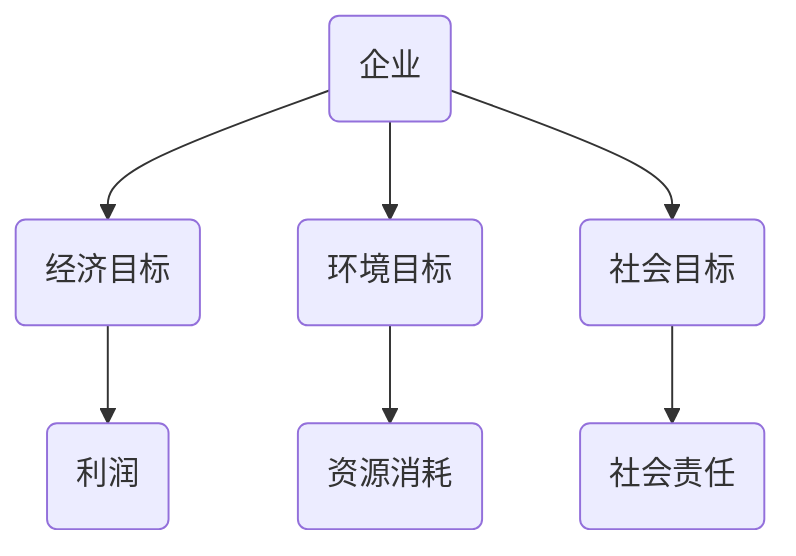
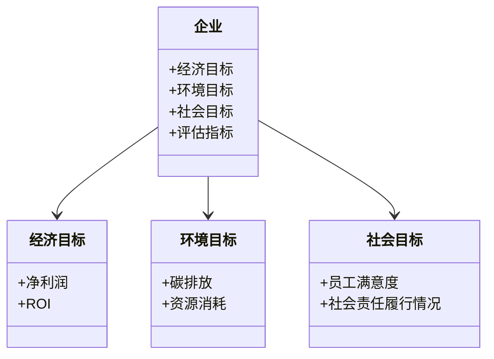

                 


# 如何评估企业的可持续发展能力

## 关键词：可持续发展能力，企业评估，生命周期评估，社会影响评估，风险管理，企业战略

## 摘要：本文将详细探讨如何系统性地评估企业的可持续发展能力，从核心概念、评估方法、工具到系统架构设计，提供全面的分析与实践指导。文章将结合实际案例，深入解析企业可持续发展能力的关键要素及其相互关系，帮助读者掌握从理论到实践的完整评估体系。

---

# 第一部分：企业的可持续发展能力概述

## 第1章：企业的可持续发展能力背景介绍

### 1.1 可持续发展能力的核心概念

#### 1.1.1 问题背景与问题描述
企业的可持续发展能力是指企业在满足当前经营需求的同时，能够确保其经营活动对环境、社会和经济的长期积极影响。随着全球对可持续发展的关注不断增加，企业需要在追求利润的同时，关注环境保护、社会责任和员工福利等多方面因素。然而，许多企业在实际操作中缺乏系统性的评估方法，导致其可持续发展能力难以量化和改进。

#### 1.1.2 可持续发展能力的定义与内涵
可持续发展能力可以定义为：企业在实现经济利益的同时，能够有效减少对环境的负面影响，并积极履行社会责任的能力。其内涵包括经济可持续性、环境可持续性和社会可持续性三个维度。

#### 1.1.3 可持续发展能力的边界与外延
可持续发展能力的边界主要集中在企业的核心业务范围内，包括生产过程、产品生命周期、员工管理和社会责任等方面。其外延则涉及企业的上下游供应链、合作伙伴以及消费者等外部利益相关者。

#### 1.1.4 可持续发展能力的概念结构与核心要素
可持续发展能力的核心要素可以分为三个维度：经济、环境和社会。每个维度都有其特定的目标和评估指标。

---

## 第2章：可持续发展能力的核心概念与联系

### 2.1 核心概念原理

#### 2.1.1 可持续发展能力的三重底线模型
三重底线模型（Triple Bottom Line）将企业的绩效分为三个维度：经济（Profit）、环境（Planet）和社会（People）。企业需要在这三个方面实现平衡，才能真正具备可持续发展能力。

#### 2.1.2 经济、环境、社会三要素的相互作用
经济目标（如利润最大化）可能与环境和社会目标产生冲突。例如，追求短期利润可能忽视环境保护和员工福利。因此，企业在制定战略时需要协调这三个目标的关系。

#### 2.1.3 可持续发展能力的系统性特征
可持续发展能力是一个复杂的系统性问题，涉及企业的各个部门和业务流程。企业需要从整体角度进行规划和管理，才能实现可持续发展目标。

### 2.2 核心概念属性特征对比表

| 要素 | 经济 | 环境 | 社会 |
|------|------|------|------|
| 核心目标 | 利润最大化 | 环境保护 | 社会责任 |
| 评估指标 | 净利润、ROI | 碳排放、资源消耗 | 员工满意度、社会责任履行情况 |
| 实施难点 | 成本控制 | 环境影响量化 | 社会责任的长期性 |

### 2.3 ER实体关系图


---

# 第二部分：可持续发展能力的评估方法与工具

## 第3章：可持续发展能力的评估方法

### 3.1 生命周期评估法

#### 3.1.1 生命周期评估的基本原理
生命周期评估（Life Cycle Assessment, LCA）是一种系统化的方法，用于评估产品或服务在整个生命周期中的环境影响。它包括原材料获取、生产、使用和废弃四个阶段。

#### 3.1.2 企业运营的生命周期分析
企业可以通过LCA方法分析其产品的环境影响，找出优化的空间。例如，减少包装材料的使用可以降低资源消耗和碳排放。

#### 3.1.3 生命周期评估的数学模型
$$ \text{环境影响} = \sum_{i=1}^{n} w_i \times x_i $$
其中，$w_i$ 是影响因素的权重，$x_i$ 是具体影响指标。

### 3.2 社会影响评估法

#### 3.2.1 社会影响评估的定义
社会影响评估（Social Impact Assessment）是通过分析企业的社会行为对社会产生的影响，包括员工福利、社区发展和企业声誉等方面。

#### 3.2.2 社会影响评估的步骤
1. 确定评估目标
2. 收集相关数据
3. 分析影响因素
4. 制定改进措施

#### 3.2.3 社会影响评估的数学公式
$$ \text{社会影响指数} = \sum_{j=1}^{m} w_j \times y_j $$
其中，$w_j$ 是社会影响因素的权重，$y_j$ 是具体社会影响指标。

## 第4章：可持续发展能力的评估工具

### 4.1 可持续发展评估模型

#### 4.1.1 可持续发展评估模型的构建
可持续发展评估模型需要综合考虑经济、环境和社会三个维度的指标，构建一个全面的评估框架。

#### 4.1.2 可持续发展评估模型的实现步骤
1. 确定评估维度
2. 收集相关数据
3. 建立评估模型
4. 进行模型验证

#### 4.1.3 可持续发展评估模型的优缺点
优点：全面性、系统性；缺点：复杂性、数据获取难度大。

### 4.2 可持续发展评分标准

#### 4.2.1 可持续发展评分标准的制定
可持续发展评分标准需要根据企业的实际情况制定，包括具体的评分指标和评分权重。

#### 4.2.2 可持续发展评分标准的实施
1. 确定评分指标
2. 设定评分权重
3. 收集数据
4. 计算评分
5. 分析结果

#### 4.2.3 可持续发展评分标准的案例分析
例如，某企业可以根据其行业特点，制定一套包含经济、环境和社会三个维度的评分标准。

---

# 第三部分：可持续发展能力的系统分析与架构设计

## 第5章：系统分析与架构设计方案

### 5.1 问题场景介绍
为了评估企业的可持续发展能力，我们需要构建一个综合性的评估系统，涵盖企业的各个业务流程和外部影响因素。

### 5.2 系统功能设计

#### 5.2.1 领域模型


### 5.3 系统架构设计

#### 5.3.1 系统架构图


### 5.4 系统接口设计

#### 5.4.1 系统接口
企业需要与外部数据源（如环境监测机构、社会责任组织等）进行数据交互，获取相关的评估指标。

### 5.5 系统交互设计

#### 5.5.1 系统交互序列图
```mermaid
sequenceDiagram
    participant 企业
    participant 环境监测机构
    participant 社会责任组织
    起始
    企业->环境监测机构: 获取环境数据
    环境监测机构->企业: 返回环境数据
    企业->社会责任组织: 获取社会责任数据
    社会责任组织->企业: 返回社会责任数据
    结束
```

---

# 第四部分：项目实战

## 第6章：项目实战

### 6.1 环境安装与工具准备

#### 6.1.1 环境安装
需要安装Mermaid、Python、Jupyter Notebook等工具。

### 6.2 核心实现源代码

#### 6.2.1 可持续发展能力评估模型的Python实现
```python
def calculate_sustainable_capability(economic_factors, environmental_factors, social_factors):
    # 经济维度评分
    economic_score = sum(economic_factors) / len(economic_factors)
    # 环境维度评分
    environmental_score = sum(environmental_factors) / len(environmental_factors)
    # 社会维度评分
    social_score = sum(social_factors) / len(social_factors)
    # 综合评分
    total_score = (economic_score + environmental_score + social_score) / 3
    return total_score

# 示例数据
economic_factors = [8, 7, 9]
environmental_factors = [6, 8, 7]
social_factors = [7, 8, 6]

print(calculate_sustainable_capability(economic_factors, environmental_factors, social_factors))
```

### 6.3 代码应用解读与分析

#### 6.3.1 代码解读
上述代码定义了一个计算可持续发展能力评分的函数，输入经济、环境和社会三个维度的评分因素，输出综合评分。

#### 6.3.2 代码分析
通过权重计算，综合考虑经济、环境和社会三个维度的评分，得出企业的可持续发展能力综合评分。

### 6.4 实际案例分析

#### 6.4.1 案例分析
以某制造企业为例，分析其可持续发展能力，根据评估模型得出评分，并提出改进建议。

### 6.5 项目小结

#### 6.5.1 项目总结
通过项目实战，我们掌握了可持续发展能力评估模型的构建和应用方法，能够将理论应用于实际。

---

# 第五部分：最佳实践、小结、注意事项与拓展阅读

## 第7章：最佳实践与小结

### 7.1 最佳实践
1. 建立全面的评估指标体系
2. 定期进行评估和改进
3. 与利益相关者进行有效沟通

### 7.2 小结
本文详细探讨了如何评估企业的可持续发展能力，从核心概念、评估方法到系统架构设计，提供了全面的分析和实践指导。

## 第8章：注意事项与拓展阅读

### 8.1 注意事项
1. 数据的准确性和完整性
2. 方法的适用性和可操作性
3. 持续改进和优化

### 8.2 拓展阅读
1. 可持续发展领域的最新研究成果
2. 其他企业的可持续发展实践经验

---

# 作者

作者：AI天才研究院/AI Genius Institute & 禅与计算机程序设计艺术 /Zen And The Art of Computer Programming

