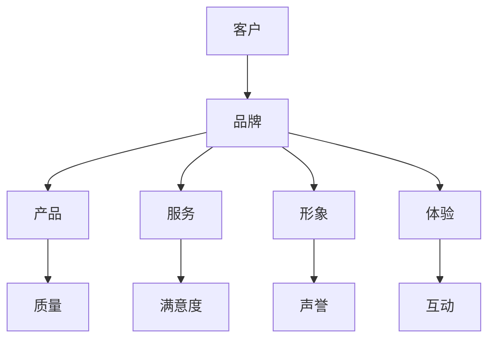
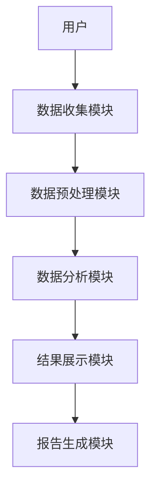
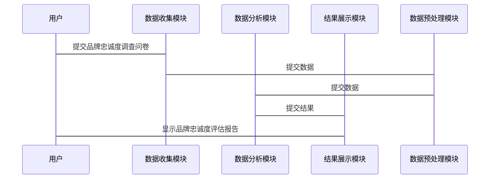

                 


# 如何评估企业的品牌忠诚度价值

> 关键词：品牌忠诚度，企业价值评估，客户关系管理，品牌资产，数据挖掘

> 摘要：本文详细探讨了如何科学评估企业的品牌忠诚度价值。通过分析品牌忠诚度的定义、核心概念、评估指标和方法，结合实际案例，系统阐述了如何利用数据挖掘技术进行品牌忠诚度评估，帮助企业优化客户关系管理，提升品牌资产价值。

---

## 第一部分: 企业品牌忠诚度价值评估的背景与概念

### 第1章: 品牌忠诚度的定义与重要性

#### 1.1 品牌忠诚度的定义
品牌忠诚度是指消费者在购买产品或服务时，对某个特定品牌持续选择和偏好的程度。它反映了消费者对企业品牌的情感依赖、信任和满意度，是企业核心竞争力的重要组成部分。

- **1.1.1 品牌忠诚度的内涵**  
  品牌忠诚度不仅仅是简单的重复购买行为，而是消费者在面对竞争品牌时，仍然选择该品牌的心理倾向。

- **1.1.2 品牌忠诚度的外延**  
  品牌忠诚度可以表现为显性行为（如重复购买）和隐性行为（如口碑推荐），是品牌与消费者之间长期互动的结果。

- **1.1.3 品牌忠诚度的核心要素**  
  包括产品质量、品牌情感、客户体验、品牌认知等多个维度。

#### 1.2 品牌忠诚度的重要性
品牌忠诚度是企业长期发展的关键因素，直接影响企业的市场份额、客户生命周期价值和品牌资产积累。

- **1.2.1 品牌忠诚度对企业价值的影响**  
  忠诚的客户通常具有较高的生命周期价值（Customer Lifetime Value, CLV），为企业带来持续的收入和利润。

- **1.2.2 品牌忠诚度与客户生命周期的关系**  
  忠诚客户更可能成为企业的长期合作伙伴，降低客户获取成本，并为企业创造更高的边际收益。

- **1.2.3 品牌忠诚度与市场竞争的关系**  
  在激烈的市场竞争中，品牌忠诚度是企业抵御竞争对手的重要屏障。

### 第2章: 企业品牌忠诚度价值评估的背景

#### 2.1 当前市场竞争的现状
随着全球化和数字化的深入，市场竞争日益激烈，消费者的选择越来越多，品牌忠诚度的价值更加凸显。

- **2.1.1 全球化竞争格局**  
  全球化使得企业面临更多的竞争对手，品牌忠诚度成为企业差异化竞争的关键。

- **2.1.2 数字化时代对企业的影响**  
  数字化技术改变了消费者的购买习惯和行为模式，数据驱动的品牌忠诚度评估成为可能。

- **2.1.3 消费者行为的变化**  
  消费者越来越依赖在线评价和社交网络，品牌忠诚度的形成受到更多外部因素的影响。

#### 2.2 企业品牌忠诚度价值评估的必要性
在数字化时代，企业需要通过科学的方法评估品牌忠诚度，以便更好地管理客户关系和优化品牌资产。

- **2.2.1 企业长期发展的需求**  
  品牌忠诚度是企业长期发展的基石，能够为企业带来持续的客户价值。

- **2.2.2 客户关系管理的重要性**  
  通过评估品牌忠诚度，企业可以识别高价值客户，制定精准的营销策略。

- **2.2.3 品牌资产的量化需求**  
  品牌忠诚度是品牌资产的重要组成部分，量化品牌忠诚度有助于企业更好地管理和优化品牌资产。

#### 2.3 企业品牌忠诚度价值评估的边界与外延
品牌忠诚度评估需要明确的边界和适用范围，以确保评估结果的科学性和实用性。

- **2.3.1 评估的边界条件**  
  包括数据来源的限制、样本量的大小、评估的时间范围等。

- **2.3.2 评估的适用范围**  
  品牌忠诚度评估适用于所有行业，但不同行业可能需要不同的评估方法。

- **2.3.3 评估的局限性**  
  品牌忠诚度评估结果受到数据质量和模型假设的影响，可能存在一定的偏差。

---

## 第二部分: 企业品牌忠诚度价值评估的核心概念与联系

### 第3章: 品牌忠诚度评估的核心概念

#### 3.1 品牌忠诚度的衡量指标
品牌忠诚度可以通过多种指标进行衡量，每种指标都有其独特的优势和适用场景。

- **3.1.1 品牌满意度**  
  品牌满意度是衡量客户对品牌产品或服务的满意程度的重要指标。通常通过客户调查和问卷收集数据。

- **3.1.2 品牌推荐度**  
  品牌推荐度反映了客户对品牌的信任程度和愿意推荐给他人的心态，是衡量品牌忠诚度的重要指标。

- **3.1.3 品牌购买忠诚度**  
  品牌购买忠诚度是指客户在面对同类产品或服务时，仍然选择该品牌的程度，可以通过市场份额和销售数据进行衡量。

#### 3.2 品牌忠诚度的核心属性
品牌忠诚度的核心属性包括品牌认知度、品牌情感忠诚度和品牌行为忠诚度。

- **3.2.1 品牌认知度**  
  品牌认知度是指消费者对品牌的熟悉程度，是品牌忠诚度的基础。

- **3.2.2 品牌情感忠诚度**  
  品牌情感忠诚度是指消费者对品牌的情感依赖和信任程度，是品牌忠诚度的重要组成部分。

- **3.2.3 品牌行为忠诚度**  
  品牌行为忠诚度是指消费者在实际购买行为中对品牌的偏好程度，是品牌忠诚度的最终体现。

#### 3.3 品牌忠诚度与相关概念的对比
品牌忠诚度与其他相关概念（如品牌知名度、品牌满意度）既有联系又有区别。

- **3.3.1 品牌知名度 vs 品牌忠诚度**  
  品牌知名度是指消费者对品牌的熟悉程度，而品牌忠诚度是指消费者对品牌的偏好程度。

- **3.3.2 品牌满意度 vs 品牌忠诚度**  
  品牌满意度是品牌忠诚度的重要影响因素，但品牌满意度高并不一定意味着品牌忠诚度高。

- **3.3.3 品牌价值 vs 品牌忠诚度**  
  品牌价值是品牌忠诚度的外在表现，而品牌忠诚度是品牌价值的重要组成部分。

### 第4章: 品牌忠诚度评估的核心要素与关系

#### 4.1 品牌忠诚度的核心要素
品牌忠诚度的评估需要考虑多个核心要素，包括产品质量与服务、品牌形象与声誉、客户体验与互动等。

- **4.1.1 产品质量与服务**  
  产品质量和服务是品牌忠诚度的基础，直接影响消费者的购买决策和品牌满意度。

- **4.1.2 品牌形象与声誉**  
  品牌形象和声誉是品牌忠诚度的重要影响因素，良好的品牌形象能够增强消费者的信任和忠诚。

- **4.1.3 客户体验与互动**  
  客户体验和互动是品牌忠诚度的重要组成部分，良好的客户体验能够增强消费者的满意度和忠诚度。

#### 4.2 品牌忠诚度的实体关系图
以下是一个简单的实体关系图，展示了品牌忠诚度评估的核心要素及其相互关系。



---

## 第三部分: 品牌忠诚度评估的算法与系统设计

### 第5章: 品牌忠诚度评估的算法原理

#### 5.1 层次分析法（AHP）
层次分析法是一种常用的决策分析方法，适用于品牌忠诚度的多因素评估。

- **5.1.1 算法原理**  
  将品牌忠诚度的影响因素分为多个层次，包括目标层（品牌忠诚度）、准则层（影响因素）和方案层（具体品牌）。通过构建比较矩阵，计算各因素的权重，最终得出品牌忠诚度的综合得分。

- **5.1.2 实施步骤**  
  1. 确定影响品牌忠诚度的因素。
  2. 构建层次分析模型。
  3. 收集专家意见，构建比较矩阵。
  4. 计算各因素的权重。
  5. 计算各品牌的综合得分。

- **5.1.3 优缺点分析**  
  层次分析法具有清晰的层次结构和较强的可操作性，但依赖于专家意见，可能存在主观性。

#### 5.2 神经网络模型
神经网络模型是一种基于机器学习的算法，适用于品牌忠诚度的预测和分类。

- **5.2.1 算法原理**  
  通过训练数据，神经网络能够学习品牌忠诚度的影响因素，从而预测客户的品牌忠诚度。

- **5.2.2 实施步骤**  
  1. 收集品牌忠诚度相关数据。
  2. 数据预处理（清洗、归一化）。
  3. 构建神经网络模型。
  4. 训练模型并进行预测。
  5. 评估模型性能。

- **5.2.3 优缺点分析**  
  神经网络模型具有较强的非线性建模能力，但需要大量数据和计算资源，且模型的可解释性较差。

#### 5.3 品牌忠诚度评估的数学模型
以下是一个简单的层次分析法数学模型示例。

$$
\text{品牌忠诚度得分} = \sum_{i=1}^{n} w_i \cdot x_i
$$

其中，$w_i$ 是第 $i$ 个因素的权重，$x_i$ 是第 $i$ 个因素的得分。

---

## 第四部分: 品牌忠诚度评估的系统设计与实现

### 第6章: 系统功能设计

#### 6.1 需求分析
品牌忠诚度评估系统需要具备数据收集、数据分析和结果展示三大功能模块。

- **6.1.1 数据收集模块**  
  包括客户调查、在线数据分析、社交媒体舆情监测等。

- **6.1.2 数据分析模块**  
  包括层次分析法和神经网络模型的实现。

- **6.1.3 结果展示模块**  
  包括品牌忠诚度的可视化展示和报告生成。

#### 6.2 系统架构设计
以下是品牌忠诚度评估系统的架构图。



#### 6.3 系统交互设计
以下是品牌忠诚度评估系统的交互流程图。



---

## 第五部分: 项目实战与案例分析

### 第7章: 项目实战

#### 7.1 环境安装与数据准备
以下是品牌忠诚度评估系统的环境安装和数据准备步骤。

1. **环境安装**  
   - 安装Python和相关库（如scikit-learn、numpy、pandas）。
   - 安装Jupyter Notebook用于数据分析和可视化。

2. **数据准备**  
   - 收集客户调查数据，包括品牌满意度、推荐度、购买频率等指标。
   - 数据清洗和预处理。

#### 7.2 核心代码实现
以下是层次分析法和神经网络模型的Python代码示例。

##### 层次分析法实现
```python
import numpy as np
from sklearn.preprocessing import normalize

# 构建比较矩阵
matrix = np.array([
    [1, 3, 2],
    [1/3, 1, 1/2],
    [1/2, 2, 1]
])

# 数据归一化
normalized_matrix = normalize(matrix)

# 计算特征向量
eigenvalues, eigenvectors = np.linalg.eigh(normalized_matrix)
weights = eigenvectors[:, 0]  # 取最大的特征向量作为权重

# 计算综合得分
scores = weights.dot([4, 5, 3])  # 假设品牌A、B、C的得分为4、5、3
print("品牌忠诚度得分：", scores)
```

##### 神经网络模型实现
```python
from sklearn.neural_networks import MLPClassifier
from sklearn.model_selection import train_test_split
from sklearn.metrics import accuracy_score

# 数据集划分
X_train, X_test, y_train, y_test = train_test_split(X, y, test_size=0.2)

# 神经网络模型训练
model = MLPClassifier(hidden_layer_sizes=(100, 50), max_iter=1000)
model.fit(X_train, y_train)

# 模型预测
y_pred = model.predict(X_test)
print("模型准确率：", accuracy_score(y_test, y_pred))
```

#### 7.3 实际案例分析
以某电商平台为例，分析其品牌忠诚度的评估过程。

1. **数据收集**  
   - 收集客户满意度、推荐度、购买频率等数据。

2. **数据分析**  
   - 使用层次分析法计算各品牌忠诚度得分。

3. **结果展示**  
   - 生成品牌忠诚度评估报告，提出优化建议。

---

## 第六部分: 总结与建议

### 第8章: 总结与建议

#### 8.1 总结
品牌忠诚度是企业核心竞争力的重要组成部分，科学评估品牌忠诚度有助于企业优化客户关系管理和提升品牌资产价值。

#### 8.2 最佳实践 tips
1. **数据质量**  
   确保数据的准确性和完整性，避免数据偏差。

2. **方法选择**  
   根据实际需求选择合适的评估方法，层次分析法适用于多因素评估，神经网络模型适用于大数据分析。

3. **持续优化**  
   定期评估品牌忠诚度，根据市场变化和客户需求不断优化品牌策略。

#### 8.3 注意事项
- 数据隐私和安全问题需要高度重视。
- 品牌忠诚度评估结果需要结合实际情况进行解读，避免片面化。

#### 8.4 拓展阅读
建议读者进一步阅读《顾客忠诚度管理》（《Customer Loyalty Management》）和《品牌管理》（《Brand Management》）等书籍，深入理解品牌忠诚度的理论和实践。

---

## 作者：AI天才研究院/AI Genius Institute & 禅与计算机程序设计艺术/Zen And The Art of Computer Programming

---

通过以上思考和分析，我们可以看到，评估企业品牌忠诚度价值需要从多个维度入手，结合定量分析和定性分析，综合运用多种方法和技术，才能得出科学、可靠的评估结果。希望本文对您有所帮助！

