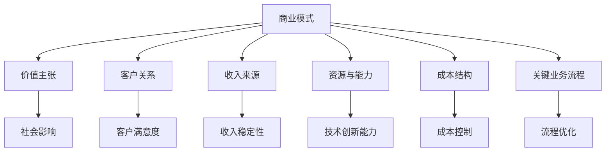
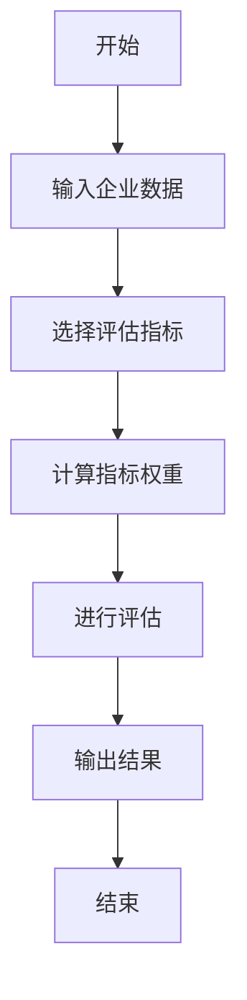
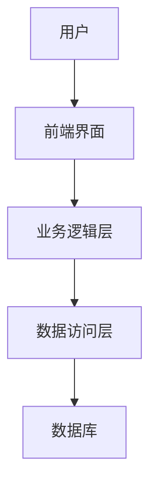
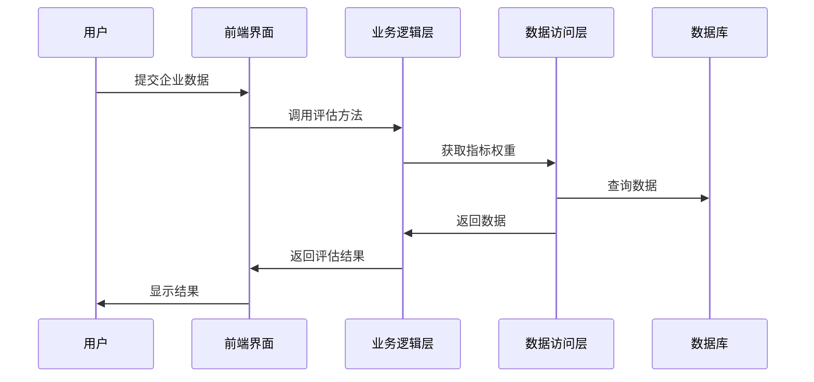

                 


# 如何评估企业的商业模式可持续性

> 关键词：企业商业模式、可持续性评估、商业分析、风险管理、经济模型

> 摘要：本文将详细介绍如何系统地评估企业的商业模式可持续性，从背景介绍、核心概念分析、算法原理到系统架构设计，结合实际案例，全面阐述如何确保企业商业模式的长期可行性。

---

## 第1章: 企业商业模式可持续性评估概述

### 1.1 企业商业模式可持续性评估的背景

#### 1.1.1 企业可持续发展的时代背景

在当前全球化和数字化的经济环境中，企业面临的竞争日益激烈，市场变化也更加迅速。企业的商业模式如果不具备可持续性，很容易在市场波动中被淘汰。因此，评估商业模式的可持续性成为企业战略管理中的关键环节。

#### 1.1.2 商业模式与企业生存的关系

商业模式是企业获取收入和利润的方式，直接关系到企业的生存和发展。一个成功的商业模式能够确保企业在市场中长期盈利，而失败的商业模式可能导致企业陷入财务困境或倒闭。

#### 1.1.3 可持续性评估的重要性

可持续性评估能够帮助企业识别商业模式中的潜在风险和机会，优化资源配置，增强企业的抗风险能力。通过评估，企业可以及时调整战略，确保商业模式的长期可行性。

### 1.2 问题背景与描述

#### 1.2.1 什么是商业模式

商业模式是企业如何创造价值、传递价值和获取价值的基本逻辑。它包括企业提供的产品或服务、目标客户、收入来源、成本结构等关键要素。

#### 1.2.2 可持续性评估的核心问题

评估商业模式的可持续性，主要是分析企业在不同市场环境和经济条件下是否能够维持稳定的收入和利润，同时满足社会和环境的可持续性要求。

#### 1.2.3 问题解决的必要性

通过评估，企业可以识别商业模式中的弱点，及时进行调整和优化，避免因市场变化或内部管理问题导致的失败。

### 1.3 问题解决与边界定义

#### 1.3.1 问题解决的目标

通过评估，确保企业的商业模式能够在不同条件下持续盈利，并具备适应市场变化的能力。

#### 1.3.2 可持续性评估的边界

评估的范围包括企业的市场环境、财务状况、管理能力、技术创新能力等方面，但不涉及企业的具体运营细节。

#### 1.3.3 相关概念的外延

商业模式可持续性评估不仅关注企业的经济绩效，还考虑社会和环境影响，强调企业的长期价值创造。

### 1.4 概念结构与核心要素

#### 1.4.1 商业模式的核心要素

- 价值主张：企业提供什么样的产品或服务。
- 客户关系：如何与客户建立关系。
- 收入来源：如何获取收入。
- 资源与能力：企业的资源和能力。
- 成本结构：企业的成本构成。
- 关键业务流程：企业的核心业务流程。

#### 1.4.2 可持续性评估的指标体系

- 经济指标：盈利能力、投资回报率等。
- 社会指标：社会责任履行情况。
- 环境指标：环境影响评估。

#### 1.4.3 概念结构图

以下是一个简化的企业商业模式可持续性概念结构图：



### 1.5 本章小结

本章从背景、问题背景、核心概念等方面介绍了企业商业模式可持续性评估的基本框架，为后续的深入分析奠定了基础。

---

## 第2章: 商业模式与可持续性评估的核心概念

### 2.1 商业模式的核心原理

#### 2.1.1 商业模式的构成要素

商业模式由价值主张、客户关系、收入来源、资源与能力、成本结构和关键业务流程构成。

#### 2.1.2 每个要素的属性特征

- 价值主张：独特性、创新性。
- 客户关系：忠诚度、满意度。
- 收入来源：稳定性、多样性。
- 资源与能力：核心竞争力、灵活性。
- 成本结构：可控性、效率。
- 关键业务流程：标准化、流程化。

#### 2.1.3 要素之间的关系

各要素相互关联，共同作用于商业模式的运行。例如，资源与能力支撑价值主张的实现，客户关系影响收入来源。

### 2.2 可持续性评估的核心原理

#### 2.2.1 可持续性评估的维度

- 经济维度：盈利能力、现金流。
- 社会维度：社会责任、员工福利。
- 环境维度：碳排放、资源消耗。

#### 2.2.2 每个维度的评估标准

- 经济维度：净利润率、投资回报率。
- 社会维度：员工满意度、社区影响力。
- 环境维度：环境影响指数、资源利用率。

### 2.3 核心概念的联系与对比

#### 2.3.1 商业模式与可持续性评估的关系

商业模式是可持续性评估的基础，而可持续性评估为商业模式的优化提供了方向。

#### 2.3.2 核心概念对比表格

以下是一个核心概念对比表：

| 对比维度 | 商业模式 | 可持续性评估 |
|----------|----------|--------------|
| 核心目标 | 创造价值 | 确保长期性 |
| 关注点 | 收入与利润 | 经济、社会、环境 |
| 工具与方法 | 价值链分析 | SWOT分析、KPI指标 |

### 2.4 ER实体关系图

以下是一个简化的企业商业模式可持续性评估的ER实体关系图：

```mermaid
erDiagram
    customer [客户] {
        id : number
        name : string
        role : string
    }
    business_model [商业模式] {
        id : number
        name : string
        description : string
    }
    sustainability_assessment [可持续性评估] {
        id : number
        criteria : string
        result : string
    }
    customer -| business_model : 参与的商业模式
    business_model -| sustainability_assessment : 评估结果
```

### 2.5 本章小结

本章通过分析商业模式和可持续性评估的核心概念及其关系，为后续的算法设计和系统实现提供了理论基础。

---

## 第3章: 可持续性评估的算法原理

### 3.1 算法原理概述

#### 3.1.1 算法的基本思想

通过量化评估指标，计算各指标的权重，最终得出商业模式的可持续性评分。

#### 3.1.2 算法的输入输出

输入：企业的商业模式数据，包括经济、社会、环境指标。

输出：可持续性评估结果，包括评分和改进建议。

### 3.2 算法流程图

以下是一个算法流程图：



### 3.3 算法的数学模型

#### 3.3.1 指标权重计算公式

$$
w_i = \frac{\sum_{j=1}^{n} a_{ij}}{\sum_{i=1}^{m} \sum_{j=1}^{n} a_{ij}}
$$

其中，\( w_i \) 是第 \( i \) 个指标的权重，\( a_{ij} \) 是第 \( i \) 个指标在第 \( j \) 个评估维度上的得分。

#### 3.3.2 综合评估公式

$$
S = \sum_{i=1}^{k} w_i \times s_i
$$

其中，\( S \) 是综合评分，\( w_i \) 是第 \( i \) 个指标的权重，\( s_i \) 是第 \( i \) 个指标的得分。

### 3.4 算法的实现与优化

#### 3.4.1 算法的实现步骤

1. 收集企业商业模式数据。
2. 确定评估指标。
3. 计算各指标权重。
4. 进行综合评估。
5. 输出评估结果。

#### 3.4.2 算法的优化建议

- 使用动态权重调整，适应市场变化。
- 引入机器学习算法，提高评估准确性。

### 3.5 本章小结

本章通过算法设计，展示了如何量化评估企业商业模式的可持续性，为实际应用提供了理论依据。

---

## 第4章: 评估系统的系统分析与架构设计

### 4.1 问题场景介绍

本章将从系统分析和架构设计的角度，详细介绍如何构建一个企业商业模式可持续性评估系统。

### 4.2 系统功能设计

#### 4.2.1 领域模型

以下是一个领域模型：

```mermaid
classDiagram
    class 企业模型 {
        id : number
        name : string
        description : string
    }
    class 评估指标 {
        id : number
        name : string
        type : string
    }
    class 评估结果 {
        id : number
        score : number
       建议 : string
    }
    企业模型 -->> 评估指标 : 包含
    评估指标 -->> 评估结果 : 生成
```

#### 4.2.2 系统架构设计

以下是一个系统架构设计图：



### 4.3 系统接口设计

系统主要接口包括：

- 数据输入接口：接收企业商业模式数据。
- 评估指标接口：定义评估指标。
- 评估结果接口：输出评估结果。

### 4.4 系统交互设计

以下是一个系统交互图：



### 4.5 本章小结

本章通过系统分析和架构设计，展示了如何构建一个高效的企业商业模式可持续性评估系统。

---

## 第5章: 项目实战

### 5.1 环境安装

#### 5.1.1 系统需求

- 操作系统：Windows 10或更高版本，或Linux系统。
- 开发工具：Python 3.8以上版本，Jupyter Notebook。
- 数据库：MySQL 5.7以上版本。

#### 5.1.2 安装依赖

安装必要的Python库，如pandas、numpy、scikit-learn等。

### 5.2 系统核心实现源代码

以下是一个Python实现的可持续性评估代码示例：

```python
import pandas as pd
import numpy as np

# 定义指标权重计算函数
def calculate_weights(matrix):
    return np.mean(matrix, axis=0)

# 定义综合评估函数
def evaluate_model(model, weights):
    return np.sum(model * weights)

# 示例数据
data = {
    '经济指标': [85, 70, 90],
    '社会指标': [75, 85, 65],
    '环境指标': [90, 80, 85]
}

df = pd.DataFrame(data)
weights = calculate_weights(df.values)
score = evaluate_model(df.values, weights)
print(f'综合评分为：{score}')
```

### 5.3 代码应用解读与分析

#### 5.3.1 代码运行结果

运行上述代码，输出综合评分。

#### 5.3.2 代码功能分析

- `calculate_weights`函数：计算各指标的平均权重。
- `evaluate_model`函数：根据权重计算综合评分。

### 5.4 实际案例分析

以某企业为例，分析其商业模式的可持续性。

#### 5.4.1 环境安装

安装必要的Python库。

#### 5.4.2 核心代码实现

编写并运行评估代码。

#### 5.4.3 代码应用解读与分析

解读评估结果，提出改进建议。

### 5.5 本章小结

本章通过实际案例，展示了如何使用代码实现企业商业模式可持续性评估。

---

## 第6章: 总结与最佳实践

### 6.1 小结

本文详细介绍了如何评估企业的商业模式可持续性，从背景、核心概念、算法设计到系统实现，为读者提供了全面的指导。

### 6.2 注意事项

- 数据质量：确保输入数据的准确性和完整性。
- 模型选择：根据实际情况选择合适的评估模型。
- 持续优化：定期更新评估指标和权重。

### 6.3 拓展阅读

推荐阅读相关书籍和文献，深入理解商业模式和可持续性评估的理论和实践。

---

## 作者：AI天才研究院/AI Genius Institute & 禅与计算机程序设计艺术 /Zen And The Art of Computer Programming

