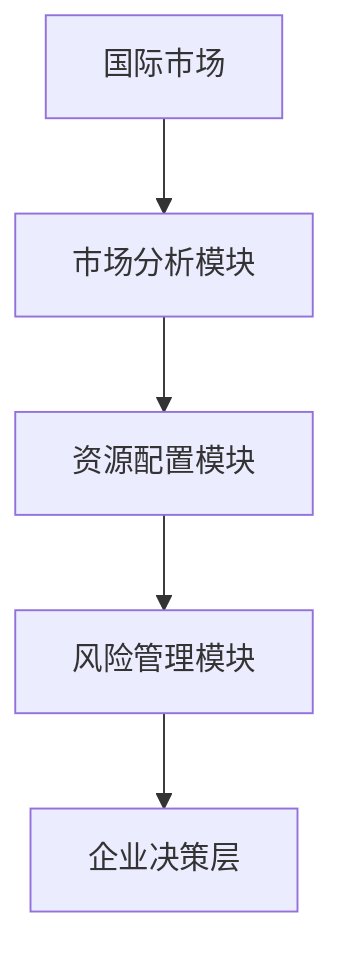

                 


# 如何评估企业的国际化战略价值

## 关键词：国际化战略、企业价值、市场分析、竞争优势、全球化、风险管理

## 摘要： 
企业在全球化进程中，国际化战略的价值评估是决定企业能否在国际市场中获得成功的关键。本文从企业国际化战略的核心概念出发，结合实际案例和理论模型，详细阐述了如何通过市场分析、竞争优势评估、风险管理等多维度方法，科学地评估国际化战略的价值，并为企业制定国际化战略提供可操作的建议和策略。文章结构清晰，内容详实，旨在帮助企业高管和战略管理者更好地理解和实施国际化战略。

---

# 第一部分: 企业国际化战略价值评估的背景与概念

## 第1章: 国际化战略的定义与重要性

### 1.1 什么是国际化战略
#### 1.1.1 国际化战略的定义
国际化战略是指企业在全球范围内配置资源、拓展市场、开展业务活动的过程。它不仅仅是将产品或服务出口到国际市场，还包括在全球范围内进行研发、生产、销售和售后服务等多环节的布局。国际化战略的核心在于通过全球化视角，优化资源配置，提升企业的竞争力和市场影响力。

#### 1.1.2 国际化战略的核心要素
- **市场定位**：选择适合企业发展的目标市场，分析市场需求和竞争环境。
- **资源配置**：在全球范围内优化人力资源、资本、技术等资源的配置。
- **风险管理**：识别和应对国际化过程中可能面临的法律、文化、经济等风险。
- **组织架构**：建立适合国际化业务的组织结构，确保全球业务的有效管理。

#### 1.1.3 国际化战略与企业发展的关系
国际化战略是企业实现可持续增长的重要手段。通过国际化，企业可以开拓新市场、降低生产成本、提升品牌影响力，并在全球范围内实现资源的最优配置。国际化战略不仅是企业向外发展的过程，也是企业内部能力提升的过程。

---

### 1.2 国际化战略的重要性
#### 1.2.1 企业全球化发展的必然趋势
随着全球经济一体化的加速，企业仅依赖国内市场难以实现持续增长。国际化战略可以帮助企业在更大的市场中寻找增长机会，分散经营风险。

#### 1.2.2 国际化战略对企业竞争力的提升作用
通过国际化，企业可以学习国际先进企业的管理经验，提升技术研发能力，优化产品和服务质量，从而在竞争中占据优势。

#### 1.2.3 国际化战略与企业长期价值创造
国际化战略不仅能够带来短期的财务回报，还能提升企业的品牌价值、市场影响力和抗风险能力，为企业创造长期价值。

---

## 第2章: 企业国际化战略的背景与现状

### 2.1 全球化经济的背景
#### 2.1.1 经济全球化的定义与发展阶段
经济全球化是指生产要素在全球范围内的自由流动和配置，包括资本、技术、劳动力和信息的跨国流动。经济全球化经历了从商品贸易到直接投资、再到跨国公司的阶段。

#### 2.1.2 数字经济时代对企业国际化的影响
数字技术的发展使得企业可以更便捷地进行跨国协作和全球资源配置。大数据、人工智能和区块链等技术的应用，为企业国际化提供了新的机遇和挑战。

#### 2.1.3 区域经济一体化与多边贸易体系
区域经济一体化（如欧盟、东盟）和多边贸易体系（如WTO）为企业国际化提供了制度性保障，降低了企业的跨国经营成本。

---

### 2.2 国际化战略的现状分析
#### 2.2.1 中国企业国际化战略的现状
近年来，中国企业加速国际化进程，尤其是在“一带一路”倡议的推动下，中国企业在全球市场中的影响力不断提升。然而，部分企业在国际化过程中仍面临文化差异、法律风险和管理能力不足等问题。

#### 2.2.2 发达国家企业国际化战略的演变
发达国家企业国际化战略经历了从“本土化”到“全球化”的演变，逐步形成了跨国经营的模式。这些企业在国际化过程中积累了丰富的经验，建立了完善的全球管理体系。

#### 2.2.3 新兴市场国家的国际化战略特点
新兴市场国家的企业在国际化过程中通常采取“渐进式”策略，先在邻近市场进行布局，逐步向全球市场扩张。

---

## 第3章: 国际化战略的核心概念与联系

### 3.1 国际化战略的核心要素
#### 3.1.1 市场分析与选择
企业在制定国际化战略时，需要对目标市场进行深入分析，包括市场规模、增长率、竞争格局、消费者需求等。例如，选择高增长市场可以为企业带来更大的增长空间。

#### 3.1.2 产品与服务的本地化
国际化战略的核心之一是产品的本地化。企业需要根据目标市场的文化、消费习惯和法规要求，对产品进行调整和优化。例如，日本市场对产品的精细度要求较高，企业需要在产品设计上进行针对性调整。

#### 3.1.3 跨文化管理与团队协作
国际化战略的实施需要跨文化管理能力。企业需要建立多元化的团队，培养员工的跨文化沟通能力和全球视野。

---

### 3.2 国际化战略与其他战略的关系
#### 3.2.1 国际化战略与企业愿景的关系
国际化战略是企业实现长期愿景的重要组成部分。企业的愿景需要与国际化战略的目标相一致，例如，成为全球行业领导者。

#### 3.2.2 国际化战略与市场进入策略的联系
企业可以根据国际化战略的目标选择不同的市场进入策略，例如直接投资、合资合作、特许经营等。不同的市场进入策略对应不同的风险和收益。

#### 3.2.3 国际化战略与风险管理的整合
国际化战略的实施需要与风险管理紧密结合。企业需要识别和评估国际化过程中可能面临的法律、政治、经济等风险，并制定相应的应对策略。

---

### 3.3 国际化战略的ER实体关系图
```mermaid
erd
    c1[企业] --[拥有]--> c2[国际市场]
    c1 --[参与] --> c3[目标市场]
    c3 --[满足] --> c4[消费者需求]
    c1 --[提供] --> c5[产品/服务]
    c5 --[满足] --> c4
    c1 --[竞争] --> c6[竞争对手]
    c6 --[影响] --> c3
```

---

## 第4章: 企业国际化战略价值的评估维度

### 4.1 评估维度概述
#### 4.1.1 市场潜力评估
企业需要评估目标市场的市场规模、增长率和竞争格局。例如，市场规模可以通过行业数据和市场调研来估算。

#### 4.1.2 企业竞争优势分析
企业需要分析自身的核心竞争力，包括成本优势、技术优势、品牌优势等。例如，某企业在技术专利方面具有优势，可以在技术密集型市场中占据优势。

#### 4.1.3 财务表现与投资回报
国际化战略的实施需要投入大量的资金和资源。企业需要评估国际化战略的投资回报率（ROI），包括收入增长、利润提升和市场份额扩大等。

---

### 4.2 评估维度的对比分析
#### 4.2.1 不同市场的竞争强度对比
企业可以通过对比不同市场的竞争强度，选择竞争相对较小的市场。例如，新兴市场可能竞争相对较低，适合企业初期布局。

#### 4.2.2 企业资源分配效率对比
企业需要评估不同市场中资源分配的效率。例如，某些市场可能需要更多的本地化投入，而另一些市场可能可以通过标准化产品快速进入。

#### 4.2.3 不同战略模式的优劣势对比
企业可以对比不同的国际化战略模式，例如出口模式、合资模式和直接投资模式。每种模式都有其优缺点，需要根据企业的实际情况选择。

---

### 4.3 评估维度的数学模型
#### 4.3.1 市场潜力评估公式
$$ \text{市场潜力} = \text{市场规模} \times \text{增长率} \times \text{渗透率} $$

#### 4.3.2 企业竞争优势分析模型
$$ \text{竞争优势} = \frac{\text{内部资源优势}}{\text{外部竞争压力}} $$

---

## 第5章: 企业国际化战略的系统分析与架构设计

### 5.1 系统分析
#### 5.1.1 问题场景介绍
企业在制定国际化战略时，需要考虑的问题包括市场选择、资源配置、风险管理等。

#### 5.1.2 系统功能设计
- 市场分析模块：用于分析目标市场的市场规模、竞争格局、消费者需求等。
- 资源配置模块：用于优化企业在全球范围内的资源分配。
- 风险管理模块：用于识别和应对国际化过程中的各种风险。

---

### 5.2 系统架构设计


---

## 第6章: 企业国际化战略的项目实战

### 6.1 案例分析
#### 6.1.1 某企业国际化战略的实施
某企业在制定国际化战略时，首先选择了新兴市场作为突破口，逐步向成熟市场扩展。

#### 6.1.2 本地化调整
企业在进入目标市场后，对产品进行了本地化调整，以满足当地消费者的需求。

#### 6.1.3 风险管理
企业通过建立风险管理团队，定期评估国际化过程中的各种风险，并制定相应的应对策略。

---

### 6.2 数据分析与结果展示
#### 6.2.1 数据来源与处理
企业可以通过市场调研、行业报告等途径获取目标市场的数据，并进行清洗和处理。

#### 6.2.2 数据分析结果
通过对数据的分析，企业可以评估不同市场的潜力和风险，为国际化战略的制定提供依据。

---

## 第7章: 企业国际化战略的最佳实践与注意事项

### 7.1 最佳实践
#### 7.1.1 选择适合的市场进入策略
企业需要根据自身的资源和目标选择适合的市场进入策略，例如直接投资和合资合作。

#### 7.1.2 加强跨文化管理能力
企业在国际化过程中需要加强跨文化管理能力，培养员工的全球视野。

#### 7.1.3 建立风险管理机制
企业需要建立完善的风险管理机制，定期评估和应对国际化过程中的各种风险。

---

### 7.2 注意事项
#### 7.2.1 避免盲目扩张
企业在国际化过程中需要避免盲目扩张，确保每一步都经过充分的市场分析和风险评估。

#### 7.2.2 注重本地化
企业在国际化过程中需要注重本地化，尊重目标市场的文化差异和消费者需求。

#### 7.2.3 加强内部沟通
企业需要加强内部沟通，确保国际化战略的顺利实施。

---

## 第8章: 结语与展望

### 8.1 结语
企业国际化战略的价值评估是企业在全球化进程中必须面对的重要课题。通过科学的评估和有效的实施，企业可以在国际市场上获得更大的成功。

### 8.2 展望
随着全球经济的不断发展和变化，企业国际化战略的价值评估也需要不断创新和优化。未来，企业需要更加注重数字化、智能化和可持续发展，以应对全球化的挑战。

---

## 作者：AI天才研究院/AI Genius Institute & 禅与计算机程序设计艺术 /Zen And The Art of Computer Programming

---

希望这篇文章能为您提供清晰的思路和实际的操作指导。如果需要更详细的内容或案例分析，可以随时与我联系。

