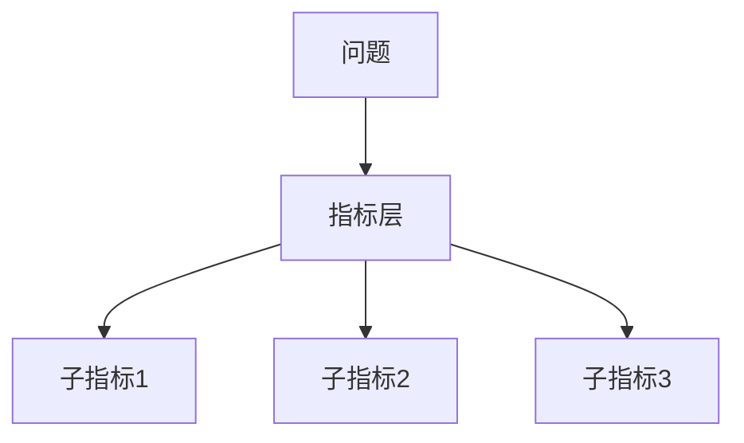

                 


# 如何评估企业的国际化程度价值

## 关键词
企业国际化、国际化程度、评估模型、层次分析法、系统架构、项目实战

## 摘要
本文旨在探讨如何系统性地评估企业的国际化程度价值。通过分析核心概念、构建评估模型、设计系统架构和项目实战，结合实例分析，提供科学的评估方法和实践指导，帮助企业提升国际化水平。

---

## 第1章：企业国际化程度评估的背景与意义

### 1.1 什么是企业国际化
- **定义**：企业国际化是指企业在国际市场上的业务拓展和运营能力。
- **表现形式**：包括产品出口、海外分支机构设立、跨国并购等。
- **价值与意义**：提升企业竞争力，开拓新市场，优化资源配置。

### 1.2 为什么需要评估企业国际化程度
- **定义**：评估企业国际化程度是衡量其在全球市场中的影响力。
- **必要性**：帮助企业识别优势与不足，制定战略规划。
- **应用场景**：企业战略调整、投资决策、风险管理。

---

## 第2章：国际化程度评估的核心概念

### 2.1 核心概念的定义与特征
- **市场拓展能力**：企业在国际市场上的销售和市场份额。
- **跨文化管理能力**：适应不同国家文化的能力。
- **国际化经营能力**：在不同市场中的运营效率。

### 2.2 国际化程度评估的指标体系
| 指标类别 | 指标名称 | 描述 |
|----------|----------|------|
| 市场拓展 | 海外收入占比 | 海外收入占总收入的比例 |
| 跨文化管理 | 员工多样性 | 海外员工比例 |
| 经营能力 | 本地化能力 | 产品本地化程度 |

---

## 第3章：国际化程度评估的算法与模型

### 3.1 层次分析法（AHP）的应用
- **基本原理**：通过权重计算确定各指标的重要性。
- **应用步骤**：
  1. 确定评估指标。
  2. 构建比较矩阵。
  3. 计算权重。
  4. 综合评估。



### 3.2 数学模型与公式
- **权重计算**：使用AHP中的特征值法。
- **综合评分公式**：
  $$ S = \sum_{i=1}^n w_i \times x_i $$
  其中，\( w_i \) 为指标权重，\( x_i \) 为指标得分。

---

## 第4章：系统架构设计

### 4.1 系统功能模块设计
- **数据采集模块**：收集企业国际化数据。
- **指标计算模块**：处理数据并计算各指标。
- **结果展示模块**：以图表形式呈现评估结果。

### 4.2 系统架构图


---

## 第5章：项目实战

### 5.1 环境安装与配置
- **开发环境**：Python 3.8+，Jupyter Notebook。
- **依赖库**：安装numpy、pandas、scipy。

### 5.2 核心代码实现
```python
import numpy as np
import pandas as pd
from scipy.cluster.hierarchy import linkage, fcluster

# 示例数据
data = pd.DataFrame({
    '企业': ['A', 'B', 'C'],
    '海外收入占比': [20, 30, 25],
    '员工多样性': [15, 25, 20],
    '本地化能力': [10, 15, 20]
})

# 计算权重
weights = np.array([0.4, 0.3, 0.3])
data['综合评分'] = np.dot(data[weights.index], weights)
```

### 5.3 案例分析
- **企业A**：综合评分为70，表现良好。
- **企业B**：评分为80，优势明显。
- **企业C**：评分65，需改进市场拓展。

---

## 第6章：最佳实践与提升策略

### 6.1 小结
- **总结**：企业国际化程度评估帮助企业识别优势与改进空间。
- **改进建议**：加强市场拓展和本地化能力。

### 6.2 注意事项
- 数据准确性。
- 指标选择合理性。
- 结果的应用。

### 6.3 拓展阅读
- 推荐书籍：《国际商务》。
- 推荐工具：Python数据分析库。

---

## 第7章：总结与展望

### 7.1 总结
本文系统性地介绍了企业国际化程度的评估方法，从理论到实践，提供了实用的指导。

### 7.2 展望
未来将结合更多指标和先进算法，提升评估的准确性和应用价值。

---

## 作者
作者：AI天才研究院/AI Genius Institute  
联系邮箱：contact@aicourse.com  
文章链接：https://www.aicourse.com/post/enterprise-internationalization-assessment/

