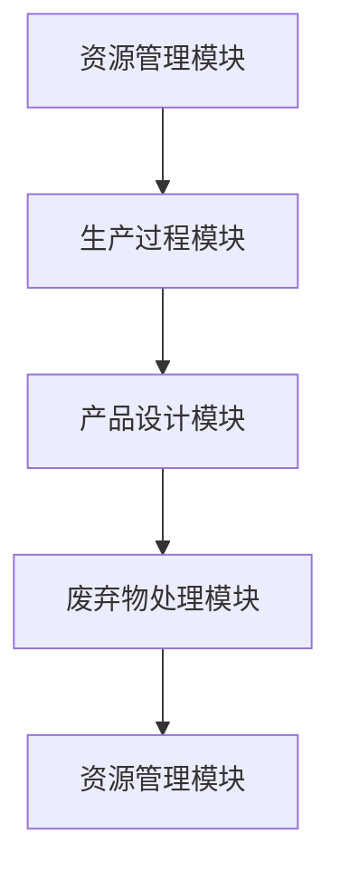

                 


# 如何评估企业的循环经济模式价值

> 关键词：循环经济模式、企业价值评估、可持续发展、资源利用效率、环境影响分析、经济模型、系统架构设计

> 摘要：本文详细探讨了如何评估企业的循环经济模式价值。通过分析循环经济模式的核心概念、评估方法、系统架构设计、项目实战案例以及成功经验，本文为读者提供了一个全面的评估框架，帮助企业在可持续发展的背景下优化资源配置、降低环境影响并实现经济效益的最大化。

---

## 第一部分: 循环经济模式的背景与概念

### 第1章: 循环经济模式的背景与核心概念

#### 1.1 循环经济模式的定义与特点

循环经济模式是一种以资源高效利用和循环利用为核心，以减少废弃物产生和环境污染为目标的经济模式。其特点是通过设计、生产、消费和回收的闭环流程，实现资源的多次利用和价值挖掘。与传统线性经济模式（资源-产品-废弃物）不同，循环经济模式强调“从摇篮到摇篮”的理念，将废弃物视为潜在的资源。

- **特点**：
  1. 资源高效利用：最大化资源的使用效率，减少资源消耗。
  2. 废弃物减量化：通过回收和再利用，减少废弃物的产生。
  3. 可持续发展：兼顾经济、社会和环境效益，实现长期的价值最大化。

#### 1.2 企业循环经济模式的背景

随着全球资源短缺、环境污染和气候变化问题的加剧，企业面临的压力也在不断增加。循环经济模式为企业提供了一种新的发展机遇，不仅能够降低运营成本，还能提升企业的社会责任形象，增强市场竞争力。

- **背景驱动因素**：
  1. **资源约束**：全球范围内资源短缺问题日益突出，企业需要寻找替代资源。
  2. **环境压力**：环境污染和气候变化要求企业减少碳足迹。
  3. **政策支持**：政府出台相关政策鼓励企业采用循环经济模式。

#### 1.3 企业循环经济模式的分类

企业循环经济模式可以根据不同的维度进行分类，主要包括以下几种：

- **按资源类型分类**：
  1. **原材料循环**：如金属、塑料等的回收再利用。
  2. **能源循环**：如可再生能源的利用和能源回收。
- **按商业模式分类**：
  1. **产品生命周期管理**：通过产品设计延长产品生命周期。
  2. **逆向物流**：通过回收和再利用减少废弃物。

### 第2章: 循环经济模式的核心要素与系统结构

#### 2.1 循环经济模式的核心要素

循环经济模式的核心要素包括以下几个方面：

- **资源输入**：企业获取所需的原材料和能源。
- **生产过程**：通过生产流程将资源转化为产品或服务。
- **产品输出**：提供符合市场需求的产品或服务。
- **废弃物处理与再利用**：对生产过程中产生的废弃物进行回收和再利用。

#### 2.2 循环经济模式的系统结构

循环经济模式的系统结构可以分为以下几个模块：

- **资源模块**：包括资源的获取、存储和分配。
- **生产模块**：包括生产流程的设计和优化。
- **产品模块**：包括产品的设计、制造和销售。
- **废弃物处理模块**：包括废弃物的分类、回收和再利用。

#### 2.3 循环经济模式的ER实体关系图

```mermaid
erDiagram
    actor 企业角色 {
        string 企业角色
    }
    actor 资源提供者 {
        string 资源类型
    }
    actor 消费者 {
        string 消费需求
    }
    actor 政府机构 {
        string 政策支持
    }
    企业角色 --> 资源提供者 : 获取资源
    企业角色 --> 消费者 : 提供产品或服务
    企业角色 --> 政府机构 : 遵守政策
    资源提供者 --> 企业角色 : 提供原材料
    消费者 --> 企业角色 : 反馈需求
    政府机构 --> 企业角色 : 提供支持
```

### 第3章: 循环经济模式的评估框架与指标体系

#### 3.1 循环经济模式的评估框架

循环经济模式的评估框架包括以下几个方面：

- **资源利用效率**：衡量资源的使用效率，包括原材料、能源等的利用率。
- **环境影响分析**：分析生产过程对环境的影响，包括碳排放、水污染等。
- **经济价值评估**：评估循环经济模式对企业经济价值的影响，包括成本节约、收益增加等。

#### 3.2 循环经济模式的评估指标

循环经济模式的评估指标可以分为以下几类：

- **资源效率指标**：
  - 资源利用率（Resource Utilization Rate）
  - 单位产品资源消耗（Resource Consumption per Unit Product）
- **环境影响指标**：
  - 碳排放强度（Carbon Emissions Intensity）
  - 废弃物产生量（Waste Generation）
- **经济价值指标**：
  - 循环经济收入（Circular Economy Revenue）
  - 成本节约（Cost Savings）

---

## 第二部分: 循环经济模式的评估方法与系统分析

### 第4章: 循环经济模式的评估方法

#### 4.1 循环经济模式的生命周期分析

生命周期分析（Life Cycle Assessment, LCA）是一种系统化的方法，用于评估产品或服务在整个生命周期中的环境影响。通过分析资源消耗、生产过程、使用阶段和废弃物处理等阶段的环境影响，帮助企业识别优化点。

- **步骤**：
  1. **定义目标与范围**：明确分析的目标和范围。
  2. **数据收集**：收集相关数据，包括资源消耗、排放数据等。
  3. **分析与优化**：分析环境影响，提出优化建议。
  4. **结果解读**：解读分析结果，制定改进措施。

#### 4.2 循环经济模式的成本收益分析

成本收益分析是一种经济评估方法，用于衡量循环经济模式的成本和收益。通过比较传统模式和循环经济模式的成本和收益，帮助企业判断是否采用循环经济模式。

- **公式**：
  - 净现值（Net Present Value, NPV）：$ NPV = \sum_{t=0}^{n} \frac{C_t}{(1 + r)^t} $
  - 内部收益率（Internal Rate of Return, IRR）：满足 $ NPV = 0 $ 的利率。

### 第5章: 循环经济模式的系统架构设计

#### 5.1 循环经济模式的系统架构

循环经济模式的系统架构可以分为以下几个模块：

- **资源管理模块**：负责资源的获取、分配和监控。
- **生产过程模块**：包括生产流程的设计和优化。
- **产品设计模块**：包括产品的设计和生命周期管理。
- **废弃物处理模块**：负责废弃物的分类、回收和再利用。

#### 5.2 循环经济模式的系统架构图



---

## 第三部分: 项目实战与案例分析

### 第6章: 循环经济模式的项目实战

#### 6.1 项目背景与目标

以某电子产品制造商为例，该企业希望通过采用循环经济模式，降低生产成本和环境影响，同时提升品牌形象。

- **项目目标**：
  1. 优化资源利用效率，减少原材料消耗。
  2. 建立逆向物流系统，实现废弃物的回收和再利用。
  3. 提高产品的生命周期，延长产品使用时间。

#### 6.2 项目实施步骤

- **步骤1**：进行资源效率分析，识别资源浪费点。
- **步骤2**：设计逆向物流系统，建立回收渠道。
- **步骤3**：优化产品设计，延长产品生命周期。
- **步骤4**：实施循环经济模式，监控和评估效果。

### 第7章: 成功经验与案例分析

#### 7.1 成功经验总结

通过分析多个企业的成功案例，总结出以下几点经验：

- **经验1**：建立完善的逆向物流系统是关键。
- **经验2**：优化产品设计，延长产品生命周期。
- **经验3**：加强与供应链的合作，实现资源的高效利用。

#### 7.2 案例分析

以某电子产品制造商为例，通过实施循环经济模式，实现了资源利用率的显著提升，同时降低了生产成本和环境影响。

---

## 第四部分: 结论与建议

### 第8章: 结论与建议

#### 8.1 结论

循环经济模式是一种可持续发展的经济模式，能够帮助企业降低资源消耗、减少环境污染，同时实现经济效益的最大化。通过生命周期分析和成本收益分析等方法，企业可以有效评估循环经济模式的价值。

#### 8.2 建议

- **建议1**：企业应加强循环经济模式的宣传和推广。
- **建议2**：政府应出台更多支持政策，鼓励企业采用循环经济模式。
- **建议3**：企业应加强与供应链的合作，实现资源的高效利用。

---

## 作者信息

作者：AI天才研究院/AI Genius Institute & 禅与计算机程序设计艺术 /Zen And The Art of Computer Programming

---

**本文通过系统的分析和实践案例，详细探讨了如何评估企业的循环经济模式价值。从理论分析到实际应用，为企业提供了一个全面的评估框架，帮助企业在可持续发展的背景下实现资源高效利用和价值最大化。**

