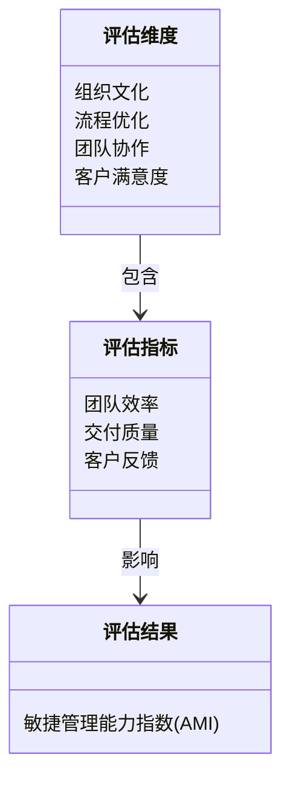

                 


# 如何评估企业的敏捷管理能力

## 关键词：敏捷管理，能力评估，企业管理，系统分析，数学模型

## 摘要：本文详细探讨了如何系统地评估企业的敏捷管理能力。通过背景介绍、核心概念分析、算法原理、系统架构设计、项目实战以及最佳实践等多维度的深入分析，为读者提供了一套科学的评估方法和工具。文章结合实际案例，详细解释了敏捷管理能力评估的必要性、核心要素、数学模型以及具体实现步骤，帮助企业在复杂多变的商业环境中提升竞争力。

---

## 第1章 敏捷管理能力评估的背景与意义

### 1.1 敏捷管理的定义与核心理念

敏捷管理是一种以快速响应变化、注重团队协作和客户满意度为核心理念的管理方法。它强调通过迭代开发、持续交付和客户反馈来优化管理流程。敏捷管理的核心原则包括：

- **个体互动高于流程和工具**：强调团队协作和面对面沟通的重要性。
- **客户合作高于合同谈判**：注重与客户建立紧密的合作关系，而非仅仅依赖合同。
- **响应变化高于遵循计划**：鼓励适应变化，而不是 rigidly 执行原定计划。
- **交付有价值的软件高于遵循计划**：强调实际成果而非过程。

### 1.2 企业敏捷管理能力评估的必要性

在当前快速变化的商业环境中，企业需要能够快速响应市场变化、客户需求和技术进步。敏捷管理能力评估可以帮助企业识别自身在敏捷转型中的优势和不足，从而制定改进策略。此外，敏捷管理能力的强弱直接关系到企业的竞争力和创新能力，尤其是在数字化转型和不确定性增加的时代背景下，敏捷管理能力已经成为企业生存和发展的关键。

### 1.3 敏捷管理能力评估的范围与边界

敏捷管理能力评估的范围通常包括以下几个方面：

- **组织结构与文化**：团队协作、扁平化管理、授权决策。
- **流程与工具**：迭代开发、持续集成、自动化测试、项目管理工具。
- **人员能力**：团队成员的技能、知识和经验。
- **客户满意度**：客户对交付成果的满意度和反馈。
- **绩效指标**：项目按时交付率、成本控制、客户满意度等。

评估的边界在于区分敏捷管理与其他管理方法的区别，例如传统瀑布模型或其他敏捷方法的混合模式。

---

## 第2章 敏捷管理能力评估的核心概念与联系

### 2.1 敏捷管理能力的核心概念

敏捷管理能力是指企业在敏捷转型过程中，能够高效地进行需求分析、项目规划、开发、测试、部署和维护的能力。这种能力不仅仅体现在技术层面，还包括组织文化、团队协作和客户关系等多个方面。

#### 2.1.1 敏捷管理能力的构成要素

- **组织结构**：扁平化管理、跨功能团队。
- **文化氛围**：鼓励创新、容错文化。
- **流程优化**：迭代开发、持续交付。
- **工具支持**：版本控制系统、项目管理工具、自动化测试工具。

#### 2.1.2 敏捷管理能力的层次结构

敏捷管理能力可以分为以下几个层次：

1. **基础层**：团队层面的能力，如任务分解、每日站会、代码审查。
2. **中间层**：项目层面的能力，如迭代计划、客户反馈、持续集成。
3. **高层**：组织层面的能力，如战略调整、文化转型、绩效评估。

### 2.2 敏捷管理能力与其他管理概念的对比

为了更好地理解敏捷管理能力的核心概念，我们需要将其与传统管理方法进行对比。

#### 2.2.1 敏捷管理与传统管理的对比

| 对比维度       | 敏捷管理                       | 传统管理                       |
|----------------|-------------------------------|---------------------------------|
| 管理目标       | 快速响应变化、客户满意度       | 稳定性、可预测性               |
| 组织结构       | 扁平化、跨功能团队             | 层级分明、部门独立             |
| 项目管理       | 迭代开发、持续交付             | 瀑布式开发、阶段划分           |
| 变化应对       | 高度灵活、快速调整           | 低弹性、遵循计划              |

#### 2.2.2 敏捷管理与项目管理的对比

| 对比维度       | 敏捷管理                       | 传统项目管理                   |
|----------------|-------------------------------|---------------------------------|
| 方法论         | 迭代开发、客户协作             | 瀑布式开发、合同驱动           |
| 计划制定       | 灵活调整、基于反馈             | 严格计划、变更控制             |
| 交付周期       | 短周期、持续交付               | 长周期、一次性交付             |

#### 2.2.3 敏捷管理与组织文化的对比

| 对比维度       | 敏捷管理                       | 传统管理                       |
|----------------|-------------------------------|---------------------------------|
| 文化氛围       | 创新、协作、容错               | 严格、层级分明、风险规避       |
| 员工授权       | 高度授权、团队自治             | 低授权、依赖管理层指令         |
| 反馈机制       | 快速反馈、持续改进             | 延时反馈、定期评估             |

### 2.3 敏捷管理能力的ER实体关系图

为了更好地理解敏捷管理能力的构成，我们可以构建一个ER实体关系图，如下所示：

```mermaid
er
actor(员工) -|> 团队: 属于
团队 -|> 项目: 参与
项目 -|> 任务: 包含
任务 -|> 交付物: 生成
交付物 -|> 客户: 提交
```

### 2.4 本章小结

本章通过定义敏捷管理的核心概念，分析了其与其他管理方法的区别，构建了敏捷管理能力的ER实体关系图，为后续的评估方法和工具的开发奠定了基础。

---

## 第3章 敏捷管理能力评估的算法原理

### 3.1 敏捷管理能力评估的算法概述

为了系统地评估企业的敏捷管理能力，我们设计了一个基于层次分析法（AHP）的评估模型。该模型通过量化各个评估维度的权重，计算企业的敏捷管理能力指数（AMI）。

#### 3.1.1 算法的基本原理

层次分析法（AHP）是一种用于多准则决策分析的方法，适用于将复杂的决策问题分解为多个层次的子问题。在本模型中，我们将敏捷管理能力的评估维度划分为组织文化、流程优化、团队协作和客户满意度四个层次。

#### 3.1.2 算法的输入与输出

- **输入**：各评估维度的权重向量。
- **输出**：敏捷管理能力指数（AMI）。

#### 3.1.3 算法的实现步骤

1. **确定评估维度**：选择关键的评估维度，如组织文化、流程优化、团队协作和客户满意度。
2. **构建层次结构**：将评估维度分为目标层、准则层和指标层。
3. **计算各层权重**：使用AHP方法计算各层的权重向量。
4. **计算综合指数**：根据各层权重计算综合指数AMI。

### 3.2 敏捷管理能力评估的数学模型

#### 3.2.1 数学模型的构建

敏捷管理能力指数（AMI）的计算公式如下：

$$
AMI = \sum_{i=1}^{n} w_i \cdot s_i
$$

其中，\(w_i\) 是第 \(i\) 个评估维度的权重，\(s_i\) 是第 \(i\) 个评估维度的评分（0-10分）。

#### 3.2.2 具体实现步骤

1. **确定权重向量**：通过专家评分法确定各评估维度的权重。
2. **收集数据**：对各评估维度进行评分。
3. **计算综合指数**：代入公式计算AMI。

#### 3.2.3 示例

假设权重向量为 \(w = [0.3, 0.2, 0.3, 0.2]\)，评分向量为 \(s = [8, 7, 9, 6]\)，则：

$$
AMI = 0.3 \times 8 + 0.2 \times 7 + 0.3 \times 9 + 0.2 \times 6 = 2.4 + 1.4 + 2.7 + 1.2 = 7.7
$$

---

## 第4章 敏捷管理能力评估的系统分析与架构设计

### 4.1 系统功能设计

#### 4.1.1 领域模型



#### 4.1.2 系统架构设计

```mermaid
archi
    评估维度层 --> 评估指标层: 包含
    评估指标层 --> 评估结果层: 影响
    评估维度层 --> 评估结果层: 直接影响
```

---

## 第5章 敏捷管理能力评估的项目实战

### 5.1 环境安装

为了实现敏捷管理能力评估系统，我们需要安装以下工具：

- **Python**：用于数据分析和建模。
- **Mermaid**：用于绘制图表。
- **Jupyter Notebook**：用于数据可视化。

### 5.2 核心实现

以下是敏捷管理能力评估系统的核心代码实现：

```python
def calculate_ami(weights, scores):
    return sum(w * s for w, s in zip(weights, scores))

# 示例
weights = [0.3, 0.2, 0.3, 0.2]
scores = [8, 7, 9, 6]
ami = calculate_ami(weights, scores)
print(f"敏捷管理能力指数(AMI) = {ami}")
```

### 5.3 实际案例分析

假设某公司进行敏捷管理能力评估，评估结果为AMI = 7.7，这意味着其敏捷管理能力处于中等水平。为了进一步优化，该公司可以针对评分较低的维度（如客户满意度）进行改进。

---

## 第6章 最佳实践与注意事项

### 6.1 最佳实践

1. **持续优化**：定期评估和优化敏捷管理能力。
2. **团队培训**：加强团队的敏捷管理知识和技能培训。
3. **工具支持**：引入高效的敏捷管理工具，如Jira、Trello等。

### 6.2 注意事项

1. **避免过度敏捷化**：并非所有场景都适合敏捷管理。
2. **注重文化建设**：敏捷管理的成功依赖于良好的组织文化。
3. **数据驱动决策**：基于数据的评估结果制定改进策略。

---

## 第7章 总结与展望

### 7.1 总结

本文系统地探讨了如何评估企业的敏捷管理能力，从背景介绍、核心概念、算法原理到系统设计和项目实战，为读者提供了一套完整的评估方法和工具。通过本文的分析，读者可以更好地理解敏捷管理能力的重要性，并能够实际应用这些方法来优化企业的管理流程。

### 7.2 展望

未来，随着数字化转型的深入，敏捷管理能力评估将变得更加重要。我们建议进一步研究如何将人工智能和大数据分析技术应用于敏捷管理能力的评估中，以提高评估的准确性和效率。

---

## 作者

作者：AI天才研究院/AI Genius Institute  
& 禅与计算机程序设计艺术 /Zen And The Art of Computer Programming

