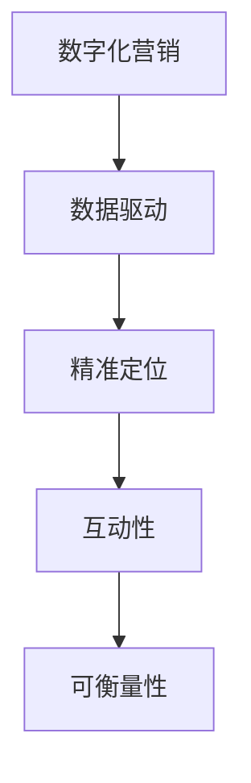
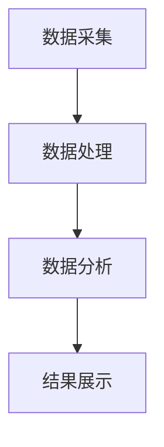
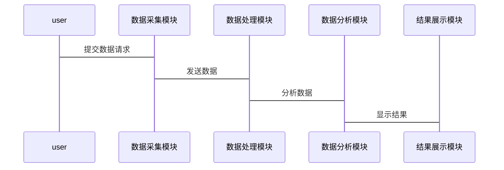

                 


# 如何评估企业的数字化营销效果

---

## 关键词：
- 数字化营销
- 营销效果评估
- 数据分析
- KPI
- 数字营销策略
- 客户行为分析
- 优化策略

---

## 摘要：
本文详细探讨了如何系统地评估企业的数字化营销效果，从核心概念、关键KPI、数据收集与处理、评估模型、结果应用到实战案例，全面解析了数字化营销效果评估的各个方面。通过理论分析与实践结合，帮助企业更好地优化营销策略，提升投资回报率。

---

# 第1章: 数字化营销效果评估的背景与核心概念

## 1.1 数字化营销的定义与特点

数字化营销是利用数字技术（如互联网、社交媒体、移动设备等）与目标受众进行互动、推广产品或服务的营销方式。其特点包括：

- **数据驱动**：依赖数据进行决策。
- **精准定位**：基于用户数据实现精准营销。
- **互动性**：与客户实时互动。
- **可衡量性**：营销效果可量化。



---

## 1.2 数字化营销效果评估的必要性

企业需要评估数字化营销效果以优化策略、降低成本并提升 ROI。

### 1.2.1 企业数字化转型的现状
- 数字化营销已成为企业核心策略。
- 数据分析技术的进步推动了营销效果的量化。

### 1.2.2 数字化营销对企业的战略意义
- 提升客户体验。
- 实现精准营销。
- 降低营销成本。

### 1.2.3 评估数字化营销效果的重要性
- 优化营销策略。
- 提高投资回报率。
- 改进客户体验。

---

## 1.3 数字化营销效果评估的核心概念

### 1.3.1 评估目标的设定
- 确定短期和长期目标。
- 示例：提高网站流量，提升转化率。

### 1.3.2 评估指标的选择
- 常用指标：UV、PV、转化率、ROI。

### 1.3.3 评估方法的多样性
- 数据分析、A/B测试、客户反馈。

---

## 1.4 本章小结
本章介绍了数字化营销的定义、特点及其评估的重要性，为后续分析奠定了基础。

---

# 第2章: 数字化营销效果评估的关键KPI

## 2.1 流量分析

### 2.1.1 独立访问量（UV）的计算
- 公式：UV = 独立访问次数。
- 示例：用户多次访问同一页面，UV仍计为1。

### 2.1.2 页面浏览量（PV）的分析
- 公式：PV = 页面访问次数。
- 示例：用户访问同一页面多次，PV增加。

### 2.1.3 跳出率的定义与优化
- 跳出率 = PV / UV。
- 优化方法：改善页面内容，提高用户体验。

---

## 2.2 转化率分析

### 2.2.1 点击率（CTR）的计算
- 公式：CTR = 点击次数 / 展示次数。
- 示例：广告展示100次，点击10次，CTR=10%。

### 2.2.2 点击到转化的路径分析
- 简化转化路径，提升用户体验。

### 2.2.3 转化率的提升策略
- 提供优惠券，优化页面设计。

---

## 2.3 投资回报率（ROI）分析

### 2.3.1 ROI的计算公式
- ROI = (净收益 / 成本) × 100%。

### 2.3.2 ROI与营销成本的关系
- 平衡ROI与成本，确保收益最大化。

### 2.3.3 ROI优化的常见方法
- 优化广告投放，提高转化效率。

---

## 2.4 客户生命周期价值（CLV）评估

### 2.4.1 CLV的定义与计算公式
- CLV = 客户的平均消费额 × 客户生命周期 × 利润率。

### 2.4.2 CLV与营销策略的关系
- 提高客户留存率，增加CLV。

### 2.4.3 CLV提升的策略
- 提供个性化服务，增强客户忠诚度。

---

## 2.5 本章小结
本章详细介绍了流量、转化率和ROI等关键KPI，为评估数字化营销效果提供了数据支持。

---

# 第3章: 数字化营销效果的数据收集与处理

## 3.1 数据收集方法

### 3.1.1 网站数据分析工具的选择
- 工具：Google Analytics、Mixpanel。

### 3.1.2 社交媒体数据的获取
- 平台：Facebook、Twitter、Instagram。

### 3.1.3 电子商务平台数据的采集
- 工具：Shopify、Amazon分析工具。

---

## 3.2 数据清洗与预处理

### 3.2.1 数据清洗的基本步骤
- 去重、填充缺失值、删除异常值。

### 3.2.2 数据去重与标准化
- 使用Python的pandas库进行数据清洗。

```python
import pandas as pd
data = pd.read_csv('data.csv')
data.drop_duplicates(inplace=True)
data['date'] = pd.to_datetime(data['date'])
```

### 3.2.3 数据异常值的处理
- 使用箱线图识别异常值。

---

## 3.3 数据分析与可视化

### 3.3.1 数据可视化工具的选择
- 工具：Matplotlib、Seaborn、Tableau。

### 3.3.2 数据图表的制作与解读
- 示例：使用Matplotlib绘制柱状图分析流量来源。

```python
import matplotlib.pyplot as plt
plt.bar(['直接访问', '广告', '邮件营销'], [25, 30, 45])
plt.title('流量来源分析')
plt.show()
```

### 3.3.3 数据可视化在效果评估中的应用
- 通过图表直观展示数据趋势。

---

## 3.4 本章小结
本章详细介绍了数据收集、清洗和可视化的步骤，为后续分析提供了可靠的数据基础。

---

# 第4章: 数字化营销效果评估的模型与方法

## 4.1 常见评估模型介绍

### 4.1.1 A/B测试模型

#### 4.1.1.1 A/B测试的原理
- 通过对比两个版本，选择表现更好的版本。

#### 4.1.1.2 A/B测试的步骤
1. 定义目标。
2. 设计实验组和对照组。
3. 分析数据，得出结论。

#### 4.1.1.3 A/B测试的优缺点
- 优点：数据可靠。
- 缺点：需要大量数据支持。

### 4.1.2 点击率预测模型

#### 4.1.2.1 点击率预测的数学模型
- 使用逻辑回归模型预测点击概率。

#### 4.1.2.2 逻辑回归模型的实现
```python
from sklearn.linear_model import LogisticRegression
model = LogisticRegression()
model.fit(X_train, y_train)
```

#### 4.1.2.3 模型评估
- 使用ROC曲线评估模型性能。

---

## 4.2 数据分析方法

### 4.2.1 数据挖掘技术
- 使用聚类分析识别高价值客户。

### 4.2.2 数据挖掘算法
- 示例：K-means算法实现客户分群。

```python
from sklearn.cluster import KMeans
model = KMeans(n_clusters=3)
model.fit(X)
```

### 4.2.3 数据挖掘在效果评估中的应用
- 分析客户行为，优化营销策略。

---

## 4.3 本章小结
本章介绍了A/B测试和逻辑回归模型等评估方法，提供了实际应用案例。

---

# 第5章: 数字化营销效果评估结果的应用

## 5.1 营销策略优化

### 5.1.1 优化广告投放
- 根据数据分析结果调整广告预算分配。

### 5.1.2 提高客户转化率
- 优化页面设计，减少跳出率。

### 5.1.3 提升客户生命周期价值
- 提供个性化推荐，增强客户忠诚度。

---

## 5.2 客户体验提升

### 5.2.1 客户行为分析
- 使用数据分析工具识别客户流失原因。

### 5.2.2 优化客户互动
- 通过社交媒体与客户保持实时互动。

### 5.2.3 提高客户满意度
- 改善客户服务流程，提升客户满意度。

---

## 5.3 投资回报率的提升

### 5.3.1 ROI优化策略
- 优化广告投放渠道，提高转化效率。

### 5.3.2 降低营销成本
- 通过数据分析减少无效广告投放。

### 5.3.3 提高营销效率
- 使用自动化工具提高营销效率。

---

## 5.4 案例分析

### 5.4.1 案例背景
- 某电商网站通过数据分析优化广告投放，提升了转化率。

### 5.4.2 数据分析结果
- 广告点击率提高10%，转化率提升20%。

### 5.4.3 结果应用
- 调整广告预算分配，优化投放渠道。

---

## 5.5 本章小结
本章通过案例分析展示了如何将数据分析结果应用于营销策略优化，提升了企业的 ROI。

---

# 第6章: 数字化营销效果评估的实战篇

## 6.1 项目实施步骤

### 6.1.1 项目背景
- 某企业希望通过数字化营销提升销售额。

### 6.1.2 数据收集与处理
- 使用Google Analytics收集网站流量数据。

### 6.1.3 数据分析与建模
- 使用逻辑回归模型预测广告点击率。

### 6.1.4 评估结果与优化策略
- 根据分析结果优化广告投放策略。

---

## 6.2 系统架构设计

### 6.2.1 系统功能设计
- 数据采集模块、数据分析模块、结果展示模块。

### 6.2.2 系统架构设计
- 使用分层架构：数据层、业务逻辑层、表现层。



### 6.2.3 系统接口设计
- 数据接口：RESTful API。

### 6.2.4 系统交互设计
- 使用序列图展示用户与系统的交互流程。



---

## 6.3 项目核心实现源代码

### 6.3.1 数据处理代码
```python
import pandas as pd
data = pd.read_csv('data.csv')
data['date'] = pd.to_datetime(data['date'])
```

### 6.3.2 数据分析代码
```python
from sklearn.linear_model import LogisticRegression
model = LogisticRegression()
model.fit(X_train, y_train)
```

### 6.3.3 结果展示代码
```python
import matplotlib.pyplot as plt
plt.bar(['A', 'B'], [0.2, 0.3])
plt.title('广告点击率对比')
plt.show()
```

---

## 6.4 项目小结
本章通过一个实战案例详细讲解了数字化营销效果评估的实施步骤，从数据收集到结果展示，为企业提供了可参考的实施路径。

---

# 第7章: 总结与未来展望

## 7.1 本章总结

- 数字化营销效果评估是企业优化营销策略的重要手段。
- 通过数据分析和模型建立，企业可以更精准地制定营销策略。

---

## 7.2 未来展望

- 数据分析技术的进一步发展将推动营销效果评估的优化。
- 人工智能和机器学习的应用将使营销策略更加智能化。

---

## 7.3 注意事项

- 数据隐私和合规性需严格遵守。
- 模型优化需结合实际业务场景。

---

## 7.4 拓展阅读

- 《数据驱动的决策》
- 《数字营销实战指南》

---

## 作者

**作者：AI天才研究院/AI Genius Institute & 禅与计算机程序设计艺术 /Zen And The Art of Computer Programming**

---

**注**：由于篇幅限制，上述内容为文章的目录和部分章节内容。完整文章将包含每个章节的详细展开，包括具体的代码实现、数学公式推导、案例分析等。

