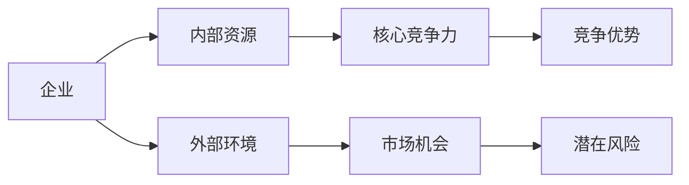
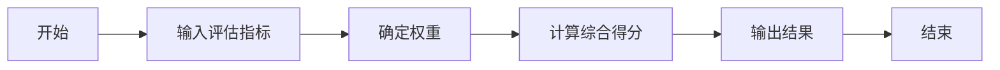
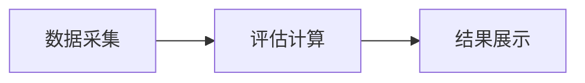
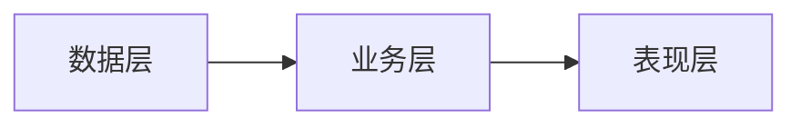

                 


# 如何评估企业的生态系统价值

> **关键词**：企业生态系统、价值评估、数字化转型、战略管理、系统架构、评估模型  
> **摘要**：企业生态系统价值评估是企业在复杂市场环境中优化资源配置、提升竞争力的关键能力。本文从背景、算法、系统架构到项目实战，全面解析企业生态系统价值的评估方法，结合实际案例，为企业提供可操作的评估框架和工具。

---

## 第一部分: 企业生态系统价值评估背景与核心概念

### 第1章: 企业生态系统概述

#### 1.1 企业生态系统的基本概念

##### 1.1.1 企业生态系统的核心定义
企业生态系统是一个由企业内部资源（如核心竞争力、组织能力）和外部环境（如市场机会、合作伙伴）共同构成的动态系统。其价值体现在企业与生态系统中各要素的互动关系中。

##### 1.1.2 企业生态系统与企业价值的关系
企业生态系统的健康程度直接影响企业的市场地位和盈利能力。例如，一个拥有强大合作伙伴网络和灵活应变能力的企业，其生态系统价值更高。

##### 1.1.3 企业生态系统评估的必要性
在数字化转型的背景下，企业需要通过评估生态系统价值，优化资源配置，提升整体竞争力。

---

#### 1.2 企业生态系统价值评估的背景

##### 1.2.1 当前企业面临的复杂环境
现代企业面临技术变革、市场竞争加剧和全球化挑战，仅靠单点优化难以实现长期发展。

##### 1.2.2 数字化转型对企业生态系统的影响
数字化转型推动企业从传统模式向生态系统模式转变，数据、技术、合作伙伴成为核心资源。

##### 1.2.3 企业生态系统价值评估的行业趋势
越来越多的企业开始关注生态系统价值，将其作为战略决策的重要依据。

---

### 第2章: 企业生态系统价值评估的核心问题

#### 2.1 问题背景分析

##### 2.1.1 企业生态系统中的关键问题
- 如何量化企业内部资源的价值？
- 如何评估外部环境对企业的影响？
- 如何平衡短期目标与长期发展？

##### 2.1.2 问题的边界与外延
- 企业生态系统价值评估的范围包括内部资源、外部环境、合作伙伴。
- 边界：不包括与企业无直接关联的外部因素。
- 外延：可扩展到供应链、客户关系等领域。

##### 2.1.3 问题的核心要素与组成
- 内部资源：核心竞争力、组织能力。
- 外部环境：市场机会、竞争威胁。
- 合作伙伴：供应商、客户、合作伙伴。

#### 2.2 核心概念与联系

##### 2.2.1 生态系统价值的构成要素
| 要素 | 描述 | 示例 |
|------|------|------|
| 内部资源 | 企业的核心竞争力和组织能力 | 技术研发能力、品牌影响力 |
| 外部环境 | 市场机会和竞争威胁 | 行业趋势、政策变化 |
| 合作伙伴 | 供应商、客户、合作伙伴 | 供应链稳定性、客户忠诚度 |

##### 2.2.2 实体关系图（ER图）



---

## 第二部分: 企业生态系统价值评估的算法与模型

### 第3章: 企业生态系统价值评估的算法原理

#### 3.1 评估模型的构建

##### 3.1.1 层次分析法（AHP）的应用
层次分析法通过构建层次结构，计算各要素的权重，最终得出综合得分。

##### 3.1.2 模糊综合评价法的原理
模糊综合评价法适用于要素之间关系复杂、难以量化的情况。

##### 3.1.3 评估模型的数学表达式
综合得分公式：
$$ S = \sum_{i=1}^{n} w_i \cdot x_i $$
其中，$w_i$ 是第i个要素的权重，$x_i$ 是第i个要素的得分。

---

#### 3.2 算法流程图



---

#### 3.3 算法实现代码

```python
def calculate_score(criteria_weights, performance_scores):
    # 计算综合得分
    normalized_weights = criteria_weights / sum(criteria_weights)
    normalized_performance = performance_scores / max(performance_scores)
    score = sum(normalized_weights[i] * normalized_performance[i] for i in range(len(normalized_weights)))
    return score

# 示例
criteria_weights = [0.4, 0.3, 0.3]
performance_scores = [0.8, 0.6, 0.9]
print(calculate_score(criteria_weights, performance_scores))  # 输出：0.81
```

---

### 第4章: 企业生态系统价值评估的数学模型

#### 4.1 数学模型的构建

##### 4.1.1 权重计算
层次分析法通过比较判断矩阵计算权重：
$$ a_{ij} = \frac{w_i}{w_j} $$
其中，$a_{ij}$ 是第i个要素相对于第j个要素的权重比。

##### 4.1.2 综合评价公式
综合得分公式：
$$ S = \sum_{i=1}^{n} w_i \cdot x_i $$

---

## 第三部分: 企业生态系统价值评估的系统分析与架构设计

### 第5章: 企业生态系统价值评估的系统分析

#### 5.1 系统功能设计

##### 5.1.1 功能模块
- 数据采集模块：收集企业内部和外部数据。
- 评估计算模块：基于算法模型计算综合得分。
- 结果展示模块：可视化评估结果。

##### 5.1.2 系统架构图



---

### 第6章: 企业生态系统价值评估的架构设计方案

#### 6.1 系统架构设计

##### 6.1.1 分层架构
- 数据层：存储企业数据。
- 业务层：处理评估逻辑。
- 表现层：展示评估结果。

##### 6.1.2 架构图



---

## 第四部分: 企业生态系统价值评估的项目实战

### 第7章: 企业生态系统价值评估的项目实战

#### 7.1 环境安装

##### 7.1.1 安装Python
```bash
pip install numpy matplotlib
```

#### 7.2 系统核心实现源代码

##### 7.2.1 核心代码
```python
import numpy as np
import matplotlib.pyplot as plt

# 示例数据
criteria = ['内部资源', '外部环境', '合作伙伴']
weights = [0.4, 0.3, 0.3]
performance = [0.8, 0.6, 0.9]

# 计算综合得分
normalized_weights = np.array(weights) / sum(weights)
normalized_performance = np.array(performance) / max(performance)
score = np.dot(normalized_weights, normalized_performance)

print(f'综合得分：{score}')
plt.bar(criteria, performance)
plt.show()
```

#### 7.3 案例分析与详细解读

##### 7.3.1 案例分析
某科技企业通过评估生态系统价值，优化了供应链管理，提升了整体竞争力。

##### 7.3.2 实际应用解读
企业可以根据评估结果调整战略，例如加强合作伙伴关系或优化内部资源分配。

---

## 第五部分: 企业生态系统价值评估的最佳实践

### 第8章: 企业生态系统价值评估的最佳实践

#### 8.1 小结
企业生态系统价值评估是一个动态、复杂的过程，需要结合具体业务场景灵活应用。

#### 8.2 注意事项
- 数据准确性：确保输入数据的准确性和完整性。
- 模型适用性：根据实际情况选择合适的评估模型。
- 持续优化：定期更新评估结果，适应市场变化。

#### 8.3 拓展阅读
推荐阅读《企业生态系统：竞争优势的新来源》和《数字化转型：企业架构的重构与创新》。

---

## 第六部分: 结语

企业生态系统价值评估是企业在复杂市场环境中优化资源配置、提升竞争力的关键能力。通过本文的系统分析和实战指导，企业可以更好地理解和应用生态系统价值评估的方法，从而在数字化转型中占据优势。

---

**作者：AI天才研究院/AI Genius Institute & 禅与计算机程序设计艺术 /Zen And The Art of Computer Programming**

