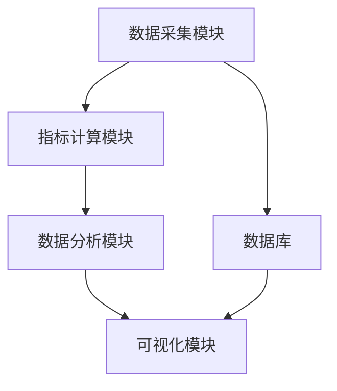

                 

# 如何评估企业的研发投入效率

> 关键词：研发投入效率评估，研发项目管理，创新成果，研发资源分配，研发回报率

> 摘要：企业研发投入效率评估是企业战略管理中的重要组成部分，涉及财务、项目管理、创新成果等多个维度。本文将系统地介绍如何从理论到实践全面评估企业的研发投入效率，包括核心概念、评估方法、工具选择和实际案例分析，帮助读者理解和优化企业的研发投入效率。

---

# 第1章 研发投入效率评估的背景与概念

## 1.1 研发投入效率评估的背景

### 1.1.1 企业研发投入的重要性  
研发投入是企业创新的核心驱动力。通过有效的研发投入，企业可以开发新产品、优化流程、提升竞争力，并在市场中占据领先地位。然而，研发投入的效率直接关系到企业的财务回报和长期发展。

### 1.1.2 研发投入效率评估的必要性  
企业在研发投入方面投入了大量资源，但如何确保这些资源被高效利用是一个关键问题。通过评估研发投入效率，企业可以识别低效环节，优化资源配置，提升整体研发绩效。

### 1.1.3 当前企业研发投入管理的挑战  
- 研发项目复杂性增加，涉及多部门协作和跨学科技术。  
- 市场需求变化快，研发周期缩短，对研发效率提出更高要求。  
- 竞争加剧，企业需要更快地将创新成果转化为实际收益。

## 1.2 研发投入效率的核心概念

### 1.2.1 研发投入的定义与分类  
- **定义**：研发投入是指企业在研发活动中投入的资源，包括资金、时间和人力资源。  
- **分类**：按用途可分为基础研究、应用研究和产品开发；按时间可分为短期、中期和长期投入。

### 1.2.2 研发投入效率的定义  
研发投入效率是指在一定时间内，企业通过研发投入所获得的创新成果与投入资源之间的比率。它衡量了研发资源的利用效果。

### 1.2.3 研发投入效率与企业绩效的关系  
研发投入效率直接影响企业的创新能力和市场竞争力。高效的研发投入能够缩短产品开发周期、降低研发成本，从而提升企业的整体绩效。

## 1.3 研发投入效率评估的边界与外延

### 1.3.1 研发投入效率评估的范围  
- 包括研发项目的立项、执行、监控和收尾阶段。  
- 涵盖研发资源的分配、使用效率和成果的商业化潜力。

### 1.3.2 研发投入效率评估的局限性  
- 数据收集的难度：研发投入涉及多个部门，数据分散且难以量化。  
- 评估指标的选择：不同行业和企业有不同的研发重点，指标选择具有主观性。  
- 时间因素：研发投入的成果可能需要较长时间才能体现，影响短期评估的准确性。

### 1.3.3 研发投入效率与其他管理指标的关系  
- 与企业整体绩效（如净利润、市场份额）密切相关。  
- 是企业战略管理的重要组成部分，影响企业的长期发展。

## 1.4 研发投入效率评估的核心要素

### 1.4.1 研发投入的资源分配  
- 资金分配：如何在不同项目之间分配研发预算。  
- 人力资源分配：如何分配研发团队的技能和工作时间。

### 1.4.2 研发项目的进度与质量  
- 进度：项目是否按时完成。  
- 质量：项目的成果是否符合预期目标。

### 1.4.3 研发成果的商业化潜力  
- 成果是否能够转化为实际产品或服务。  
- 成果的市场竞争力如何。

## 1.5 本章小结  
本章介绍了企业研发投入效率评估的背景、核心概念、边界与外延，以及评估的核心要素。通过这些内容，读者可以理解为什么评估研发投入效率至关重要，以及如何从多个维度进行评估。

---

# 第2章 研发投入效率评估的维度与方法

## 2.1 研发投入效率评估的维度

### 2.1.1 研发投入的财务维度  
- 研发投入的财务构成：包括工资、设备采购、外包费用等。  
- 研发投入的回报率分析：通过财务指标（如 ROI、ROCE）评估投入的收益。  
- 研发投入的资本化与费用化：区分资本化支出和费用化支出，影响企业的财务报表。

### 2.1.2 研发投入的项目管理维度  
- 项目进度控制：通过关键里程碑和时间表监控项目进度。  
- 资源分配：确保项目团队的技能和时间分配合理。  
- 项目质量评估：通过代码审查、测试覆盖率等指标衡量项目质量。

### 2.1.3 研发投入的创新成果维度  
- 成果数量与质量：评估专利数量、新产品数量等指标。  
- 成果的商业化潜力：评估成果是否能够带来实际收益。  
- 市场竞争力：评估成果是否具有竞争优势。

## 2.2 研发投入效率评估的方法

### 2.2.1 财务指标法  
- **ROI（投资回报率）**：计算研发投入的收益与成本的比率。  
- **ROCE（资本回报率）**：衡量研发资本的使用效率。  
- **研发周期成本分析**：比较不同项目的单位成本。

### 2.2.2 项目管理指标法  
- **进度偏差（Schedule Variance）**：比较实际进度与计划进度的差异。  
- **成本偏差（Cost Variance）**：比较实际成本与计划成本的差异。  
- **质量指标**：如代码审查通过率、测试覆盖率等。

### 2.2.3 创新成果指标法  
- **专利数量与质量**：评估研发成果的数量和影响力。  
- **新产品上市时间（TTM）**：评估研发效率。  
- **市场反馈**：通过客户满意度和市场份额变化评估成果的商业价值。

## 2.3 本章小结  
本章从财务、项目管理和创新成果三个维度详细介绍了研发投入效率评估的方法，并给出了具体的指标和计算方法。这些方法可以帮助企业全面评估研发投入的效率。

---

# 第3章 研发投入效率评估的工具与技术

## 3.1 研发投入效率评估的主要工具

### 3.1.1 财务分析工具  
- **Excel**：用于计算财务指标，如 ROI、ROCE 等。  
- **ERP 系统**：整合研发资源数据，支持实时分析。

### 3.1.2 项目管理工具  
- **JIRA**：用于跟踪项目进度和任务完成情况。  
- **Trello**：提供可视化项目管理界面，便于团队协作。

### 3.1.3 创新成果分析工具  
- **专利数据库**：如 PatentScope，用于分析专利数量和质量。  
- **市场分析工具**：如 Mintel、Euromonitor，用于评估市场反馈和竞争情况。

## 3.2 研发投入效率评估的技术

### 3.2.1 数据分析技术  
- **大数据分析**：利用 Hadoop、Spark 等工具分析海量研发数据。  
- **机器学习**：通过算法预测研发项目的成功概率和效率。

### 3.2.2 过程优化技术  
- **敏捷开发**：通过短周期迭代提高研发效率。  
- **持续集成与持续交付（CI/CD）**：自动化测试和部署，减少错误，提高效率。

### 3.2.3 指标监控技术  
- **KPI 监控平台**：实时跟踪研发项目的各项指标。  
- **可视化工具**：如 Tableau，用于展示研发效率的动态变化。

## 3.3 本章小结  
本章介绍了评估研发投入效率的主要工具和技术，包括财务分析工具、项目管理工具、创新成果分析工具，以及数据分析技术、过程优化技术和指标监控技术。这些工具和技术可以帮助企业更高效地进行研发投入效率评估。

---

# 第4章 研发投入效率评估的系统架构与实施策略

## 4.1 系统架构设计

### 4.1.1 系统功能设计  
- **数据采集模块**：整合研发项目的财务、进度和质量数据。  
- **指标计算模块**：根据预设的算法计算各项效率指标。  
- **数据分析模块**：通过机器学习算法预测研发效率趋势。  
- **可视化模块**：以图表形式展示评估结果。

### 4.1.2 系统架构设计  

### 4.1.3 系统接口设计  
- 数据接口：与ERP系统、项目管理工具对接，获取研发数据。  
- 用户接口：提供直观的仪表盘，展示各项评估指标。

## 4.2 实施策略

### 4.2.1 数据准备阶段  
- 收集研发项目的财务数据、进度数据和质量数据。  
- 确保数据的准确性和完整性。

### 4.2.2 指标计算阶段  
- 选择合适的评估指标，如 ROI、TTM 等。  
- 使用算法计算各项指标的值。

### 4.2.3 分析与优化阶段  
- 根据评估结果，识别低效环节。  
- 制定优化策略，如调整资源分配、改进项目管理流程。

## 4.3 本章小结  
本章从系统架构和实施策略两个方面，详细介绍了如何构建一个高效的研发投入效率评估系统。通过系统的实施，企业可以更科学地进行研发投入管理。

---

# 第5章 研发投入效率评估的案例分析

## 5.1 案例背景介绍

### 5.1.1 企业概况  
- 某高科技企业，年研发投入占总收入的 15%。  
- 主要业务领域：人工智能、云计算。

### 5.1.2 评估目标  
- 通过评估研发投入效率，优化资源配置，提升研发绩效。

## 5.2 评估过程

### 5.2.1 数据收集  
- 收集过去三年的财务数据、项目进度数据和质量数据。  
- 包括项目成本、项目周期、专利数量等指标。

### 5.2.2 指标计算  
- 计算 ROI、TTM、专利质量等指标。  
- 例如：2022 年 ROI 为 30%，2023 年 ROI 为 25%，2024 年 ROI 为 28%。

### 5.2.3 分析与优化  
- 通过分析发现，部分项目的 ROI 较低，可能由于资源分配不合理。  
- 调整资源分配策略，增加高 ROI 项目的投入。

## 5.3 实施效果

### 5.3.1 效果评估  
- 优化后，整体 ROI 提高了 5%。  
- 项目周期缩短了 10%。

### 5.3.2 成功经验总结  
- 建立完善的研发数据管理系统。  
- 定期评估和优化资源分配策略。

## 5.4 本章小结  
本章通过一个实际案例，展示了如何从数据收集、指标计算到分析优化的全过程，帮助读者理解如何在实际中应用研发投入效率评估的方法。

---

# 第6章 研发投入效率评估的系统架构与实施策略

## 6.1 系统架构设计

### 6.1.1 系统功能设计  
- 数据采集模块：整合研发项目的财务、进度和质量数据。  
- 指标计算模块：根据预设的算法计算各项效率指标。  
- 数据分析模块：通过机器学习算法预测研发效率趋势。  
- 可视化模块：以图表形式展示评估结果。

### 6.1.2 系统架构设计  

### 6.1.3 系统接口设计  
- 数据接口：与ERP系统、项目管理工具对接，获取研发数据。  
- 用户接口：提供直观的仪表盘，展示各项评估指标。

## 6.2 实施策略

### 6.2.1 数据准备阶段  
- 收集研发项目的财务数据、进度数据和质量数据。  
- 确保数据的准确性和完整性。

### 6.2.2 指标计算阶段  
- 选择合适的评估指标，如 ROI、TTM 等。  
- 使用算法计算各项指标的值。

### 6.2.3 分析与优化阶段  
- 根据评估结果，识别低效环节。  
- 制定优化策略，如调整资源分配、改进项目管理流程。

## 6.3 本章小结  
本章从系统架构和实施策略两个方面，详细介绍了如何构建一个高效的研发投入效率评估系统。通过系统的实施，企业可以更科学地进行研发投入管理。

---

# 第7章 研发投入效率评估的总结与展望

## 7.1 总结

### 7.1.1 核心观点回顾  
- 研发投入效率评估是企业创新管理的重要组成部分。  
- 需要从财务、项目管理和创新成果三个维度进行综合评估。  
- 通过系统化的方法和工具，可以显著提升评估的效率和准确性。

### 7.1.2 成功经验总结  
- 建立全面的评估指标体系。  
- 采用先进的数据分析技术和工具。  
- 定期优化评估方法和策略。

## 7.2 展望

### 7.2.1 挑战与机遇  
- 挑战：数据隐私问题、技术复杂性增加。  
- 机遇：人工智能和大数据技术的进一步应用。

### 7.2.2 未来发展方向  
- 推动研发投入效率评估的智能化和自动化。  
- 加强跨行业和跨领域的经验交流。  
- 提升企业对研发投入效率评估的重视程度。

## 7.3 本章小结  
本章总结了全文的核心观点，并对未来的发展方向进行了展望。通过不断优化和创新，企业可以更好地提升研发投入效率，实现可持续发展。

---

# 作者：AI天才研究院/AI Genius Institute & 禅与计算机程序设计艺术 /Zen And The Art of Computer Programming

---

# 附录：参考文献与工具列表

## 附录A 参考文献  
- [1] Smith, J. (2020). Research and Development Efficiency in Modern Enterprises.  
- [2] Brown, A. (2021). Project Management Best Practices for R&D Teams.  
- [3] Lee, H. (2022). Financial Analysis of R&D Investments.  

## 附录B 工具推荐  
- 财务分析工具：Excel、ERP系统  
- 项目管理工具：JIRA、Trello  
- 数据分析工具：Python（Pandas、NumPy）、R  
- 可视化工具：Tableau、Power BI  

---

通过以上目录结构，读者可以系统地了解如何评估企业的研发投入效率，从理论到实践，从方法到工具，全面掌握评估的核心要点。

