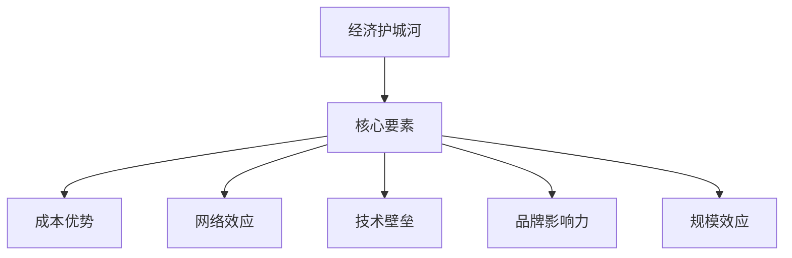
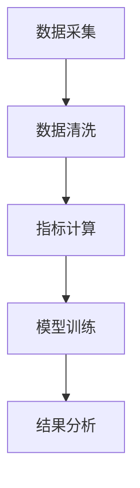
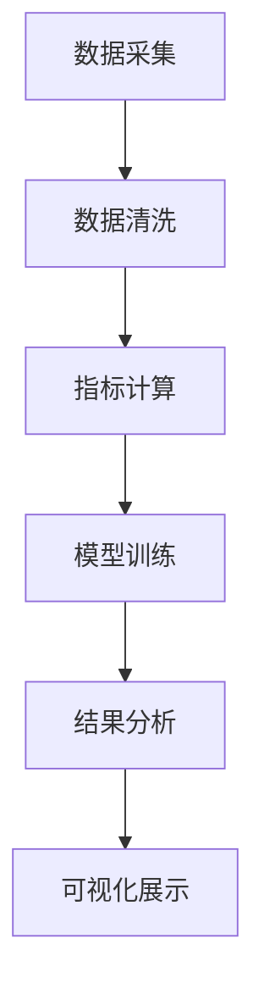
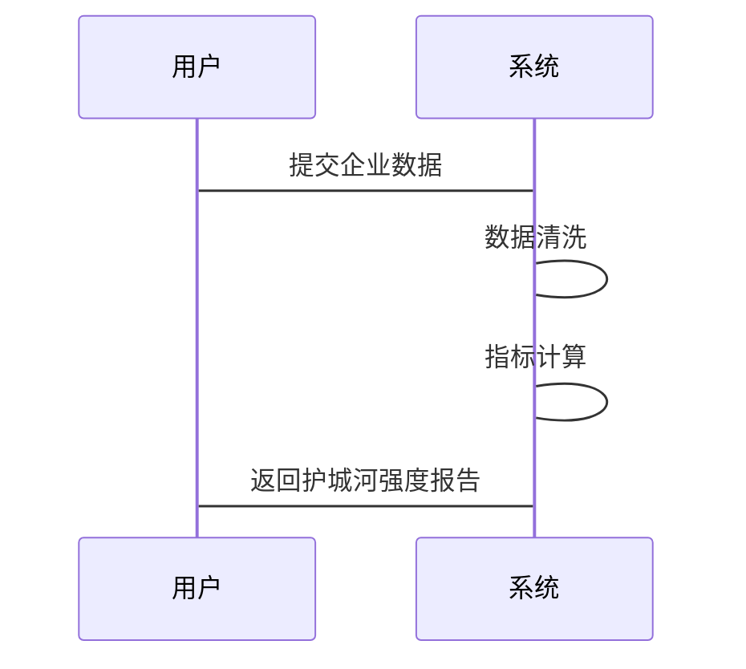

                 


# 《如何评估企业的经济护城河》

> **关键词**: 经济护城河、企业评估、竞争优势、商业模式、数据驱动、技术壁垒

> **摘要**: 本文将系统地探讨如何评估企业的经济护城河。通过背景介绍、核心概念分析、算法原理、数学模型、系统架构设计和项目实战，本文将深入剖析企业经济护城河的评估方法，为企业战略决策提供数据支持和技术指导。

---

## # 第一部分: 企业经济护城河的背景与核心概念

### ## 第1章: 企业经济护城河的定义与背景

#### ### 1.1 什么是经济护城河
- 经济护城河的定义：企业在竞争中形成的长期竞争优势。
- 从竞争优势到经济护城河的演进。
- 经济护城河的核心概念与内涵。
- 经济护城河与企业价值的关系。

#### ### 1.2 为什么需要评估经济护城河
- 企业竞争中的关键问题：如何建立可持续的竞争优势。
- 经济护城河在商业策略中的作用：防御竞争对手，巩固市场地位。
- 评估经济护城河的现实意义：为企业战略决策提供数据支持。

#### ### 1.3 经济护城河的边界与外延
- 护城河的边界定义：核心竞争优势的范围。
- 外延与相关概念的对比：与企业核心竞争力、市场壁垒的区别。
- 核心要素与次要要素的区分：成本优势、网络效应、技术壁垒等。

#### ### 1.4 本章小结
- 核心概念总结：经济护城河是企业在市场竞争中形成的长期竞争优势。
- 下一章的逻辑衔接：深入分析经济护城河的核心要素与联系。

---

### ## 第2章: 经济护城河的核心要素与分析框架

#### ### 2.1 经济护城河的核心要素
- 成本优势：通过规模效应或技术进步降低生产成本。
- 网络效应：用户数量增加带来的边际成本递减和价值提升。
- 技术壁垒：专利、专有技术或复杂的技术know-how。
- 品牌影响力：强大的品牌认知度和客户忠诚度。
- 规模效应：企业规模扩大带来的单位成本下降。

#### ### 2.2 核心概念的属性特征对比
- 表格形式对比核心要素的属性特征：
  | 要素     | 属性特征                |
  |----------|-------------------------|
  | 成本优势 | 规模效应、技术驱动       |
  | 网络效应 | 用户数量、边际成本递减   |
  | 技术壁垒 | 专利、专有技术           |
  | 品牌影响力 | 市场认知度、客户忠诚度   |
  | 规模效应 | 经济规模、成本优势       |

#### ### 2.3 实体关系图：经济护城河的概念结构


#### ### 2.4 本章小结
- 经济护城河的核心要素包括成本优势、网络效应、技术壁垒、品牌影响力和规模效应。
- 下一章将深入分析这些核心要素的属性特征和相互关系。

---

## # 第二部分: 经济护城河的算法原理与数学模型

### ## 第3章: 经济护城河的算法原理

#### ### 3.1 经济护城河评估的算法框架
- 算法流程：
  1. 数据采集：企业财务数据、市场份额、用户数据等。
  2. 数据清洗：处理缺失值、异常值。
  3. 指标计算：成本优势、网络效应等指标的量化。
  4. 模型训练：基于机器学习的护城河强度预测模型。
  5. 结果分析：评估企业护城河的强度和稳定性。

#### ### 3.2 算法实现


- Python代码实现：
```python
def calculate_economic_moorhouse(risk_factors, market_share, cost_advantage):
    # 指标计算
    moorhouse_score = risk_factors * market_share + cost_advantage
    return moorhouse_score

# 示例数据
risk_factors = 0.8
market_share = 0.6
cost_advantage = 0.9

# 计算护城河强度
moorhouse_score = calculate_economic_moorhouse(risk_factors, market_share, cost_advantage)
print(f"护城河强度：{moorhouse_score}")
```

#### ### 3.3 数学模型
- 护城河强度公式：
  $$ \text{护城河强度} = \alpha \times \text{成本优势} + \beta \times \text{网络效应} + \gamma \times \text{技术壁垒} $$
  其中，$\alpha, \beta, \gamma$为权重系数。

---

### ## 第4章: 经济护城河的数学模型

#### ### 4.1 护城河强度评分模型
- 理论基础：基于多因素分析的评分模型。
- 数学公式：
  $$ S = \sum_{i=1}^{n} w_i \times f_i $$
  其中，$w_i$为第$i$个因素的权重，$f_i$为第$i$个因素的评分。

#### ### 4.2 案例分析
- 案例：某互联网企业的护城河评估。
- 数据：成本优势、网络效应、技术壁垒等指标。
- 计算步骤：
  1. 数据清洗：处理缺失值。
  2. 指标评分：对每个因素进行评分（1-5分）。
  3. 权重分配：根据行业特点分配权重。
  4. 计算护城河强度：
    $$ S = 0.3 \times 4.5 + 0.4 \times 3.8 + 0.3 \times 4.2 = 3.87 $$

#### ### 4.3 本章小结
- 经济护城河的数学模型为企业的护城河评估提供了理论支持。
- 下一章将结合实际案例，展示系统分析与架构设计。

---

## # 第三部分: 经济护城河的系统分析与架构设计

### ## 第5章: 经济护城河的系统分析

#### ### 5.1 系统功能设计
- 领域模型设计：
```mermaid
classDiagram
    class 企业经济护城河评估系统 {
        数据采集模块
        数据分析模块
        可视化模块
    }
    数据采集模块 --> 数据清洗 --> 数据分析模块
    数据分析模块 --> 指标计算 --> 可视化模块
```

#### ### 5.2 系统架构设计


#### ### 5.3 系统接口设计
- 数据接口：RESTful API。
- 数据格式：JSON格式。

#### ### 5.4 系统交互设计


---

## # 第四部分: 项目实战与最佳实践

### ## 第6章: 项目实战

#### ### 6.1 环境配置
- Python 3.8+
- 数据分析库：Pandas、NumPy。
- 可视化工具：Matplotlib、Seaborn。

#### ### 6.2 核心实现
```python
import pandas as pd
import numpy as np

def calculate_moorhouse_score(cost_advantage, network_effect, technology_barriers):
    # 计算护城河强度
    score = 0.3 * cost_advantage + 0.4 * network_effect + 0.3 * technology_barriers
    return score

# 数据加载
data = pd.read_csv("enterprise_data.csv")

# 数据清洗
data.dropna(inplace=True)

# 计算护城河强度
data['护城河强度'] = data.apply(lambda x: calculate_moorhouse_score(x['成本优势'], x['网络效应'], x['技术壁垒']), axis=1)

# 可视化
import matplotlib.pyplot as plt

plt.scatter(data['成本优势'], data['护城河强度'])
plt.xlabel('成本优势')
plt.ylabel('护城河强度')
plt.title('护城河强度分布')
plt.show()
```

#### ### 6.3 实际案例分析
- 案例：某互联网企业的护城河评估。
- 数据分析：成本优势、网络效应、技术壁垒。
- 结果解读：护城河强度为3.87，表明企业具有较强的经济护城河。

#### ### 6.4 本章小结
- 通过实际案例展示了经济护城河评估的全过程。
- 下一章将总结最佳实践。

---

## # 第五部分: 结论与展望

### ## 第7章: 结论与展望

#### ### 7.1 结论
- 经济护城河是企业在市场竞争中形成的核心竞争优势。
- 数据驱动的方法能够有效评估企业的护城河强度。

#### ### 7.2 未来展望
- 结合AI技术的动态护城河评估模型。
- 多维度数据分析与护城河评估的深度结合。

---

## 附录
- 数据集说明
- 代码实现细节
- 参考文献

---

## 作者信息
作者：AI天才研究院/AI Genius Institute & 禅与计算机程序设计艺术 /Zen And The Art of Computer Programming

---

以上为《如何评估企业的经济护城河》的目录大纲和部分章节内容的详细设计，涵盖了从理论到实践的各个方面，结合技术分析和实际案例，为企业提供全面的经济护城河评估方法。

