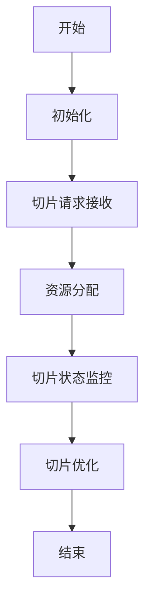

                 


# 如何评估企业的网络切片技术应用

## 关键词：网络切片，企业评估，技术应用，系统架构，算法原理，资源分配，性能优化

## 摘要：本文将深入探讨如何评估企业在网络切片技术中的应用。通过分析网络切片的基本概念、技术原理、系统架构和实际案例，结合数学模型和算法流程，为企业提供一套完整的评估方法。本文内容涵盖网络切片的背景介绍、核心概念、算法原理、系统设计、项目实战、最佳实践等多个方面，旨在帮助企业更好地理解和应用网络切片技术。

---

## 第一部分: 网络切片技术概述

### 第1章: 网络切片技术的背景与概念

#### 1.1 网络切片的基本概念
- **1.1.1 什么是网络切片**  
  网络切片是一种将网络资源按需分配给不同业务或用户的技术，能够在同一物理网络上实现多种虚拟网络的独立运行。  
  - 网络切片的基本单位：切片（Slice）  
  - 切片的粒度：可以根据需求选择端到端切片、子网切片或单点切片。  

- **1.1.2 网络切片的核心特性**  
  - **隔离性**：每个切片独立运行，互不影响。  
  - **定制性**：支持按需配置带宽、延迟、可靠性等参数。  
  - **动态性**：支持实时资源调整和性能优化。  

- **1.1.3 网络切片的应用场景**  
  - **企业内部网络**：多部门共享网络资源，按需分配。  
  - **混合云架构**：企业与云服务提供商的网络协同。  
  - **物联网（IoT）**：支持多种设备和应用场景的独立网络切片。  

#### 1.2 网络切片的必要性
- **1.2.1 传统网络架构的局限性**  
  - 资源竞争：多个业务共享网络资源，导致性能下降。  
  - 灵活性差：无法快速响应业务需求变化。  

- **1.2.2 企业网络需求的变化**  
  - 业务多样化：企业需要支持多种类型的应用，如视频会议、文件传输、实时通信等。  
  - 业务动态化：需求波动大，网络资源需灵活调整。  

- **1.2.3 网络切片的解决方案**  
  - 提供按需分配的网络资源，避免资源浪费。  
  - 独立的网络切片保障业务性能。  

#### 1.3 网络切片的边界与外延
- **1.3.1 网络切片的边界定义**  
  - 切片的范围：从端到端、子网到单点。  
  - 切片的粒度：可以根据需求选择粗粒度或细粒度切片。  

- **1.3.2 网络切片与其他技术的关系**  
  - 与SDN（软件定义网络）的关系：网络切片依赖SDN的灵活性。  
  - 与NFV（网络功能虚拟化）的关系：NFV为切片提供虚拟化支持。  

- **1.3.3 网络切片的未来发展**  
  - 切片智能化：结合AI技术，实现自动化的切片管理。  
  - 切片多样化：支持更多类型的业务需求。  

#### 1.4 本章小结
- 本章介绍了网络切片的基本概念、核心特性、应用场景及其必要性，明确了网络切片的边界和未来发展方向。

---

## 第2章: 网络切片技术的核心概念与联系

### 2.1 网络切片的原理
- **2.1.1 网络切片的实现机制**  
  - 切片管理：通过管理平面配置和监控切片状态。  
  - 切片控制：通过控制平面实现资源分配和性能优化。  

- **2.1.2 切片管理与控制**  
  - 切片生命周期管理：创建、分配、监控、释放。  
  - 切片资源配置：CPU、内存、带宽等资源的动态分配。  

- **2.1.3 切片资源分配**  
  - 基于需求的资源分配策略：优先分配关键业务资源。  

### 2.2 网络切片的属性特征对比
- **2.2.1 切片粒度对比**  
  | 切片粒度 | 描述 | 适用场景 |  
  |----------|------|----------|  
  | 粗粒度 | 覆盖整个网络 | 适用于大范围业务需求 |  
  | 细粒度 | 针对特定设备或用户 | 适用于精细化管理 |  

- **2.2.2 切片性能对比**  
  - 延迟：细粒度切片延迟更低。  
  - 带宽：按需分配带宽，保障业务性能。  

- **2.2.3 切片成本对比**  
  - 细粒度切片：初期成本高，但长期节省资源。  
  - 粗粒度切片：初期成本低，但资源利用率低。  

### 2.3 网络切片的ER实体关系图
```mermaid
erDiagram
    actor 用户
    actor 管理系统
    actor 应用程序
    database 切片数据库
    database 资源分配数据库
    用户 --> 切片数据库 : 查询切片状态
    管理系统 --> 切片数据库 : 管理切片配置
    应用程序 --> 资源分配数据库 : 请求资源
```

### 2.4 本章小结
- 本章通过对比分析网络切片的属性特征，明确了切片粒度、性能和成本之间的关系，并通过ER图展示了网络切片的核心实体关系。

---

## 第3章: 网络切片技术的算法原理

### 3.1 网络切片管理算法
- **3.1.1 切片管理流程**  
  ```mermaid
  graph TD
      A[开始] --> B[初始化]
      B --> C[切片请求接收]
      C --> D[资源分配]
      D --> E[切片状态监控]
      E --> F[切片优化]
      F --> G[结束]
  ```

- **3.1.2 切片分配策略**  
  - 基于优先级的分配：关键业务优先分配资源。  
  - 基于负载的分配：动态调整资源分配，避免资源浪费。  

- **3.1.3 切片优化算法**  
  - 基于反馈的优化：根据实时性能反馈调整资源分配。  

### 3.2 网络切片算法的数学模型
- **3.2.1 切片资源分配模型**  
  $$ R = \sum_{i=1}^{n} r_i $$  
  其中，\( R \) 表示总资源，\( r_i \) 表示第 \( i \) 个切片的资源。  

- **3.2.2 切片性能优化公式**  
  $$ P = \frac{\sum_{i=1}^{m} p_i}{m} $$  
  其中，\( P \) 表示平均性能，\( p_i \) 表示第 \( i \) 个切片的性能。  

- **3.2.3 切片成本计算公式**  
  $$ C = \sum_{j=1}^{k} c_j $$  
  其中，\( C \) 表示总成本，\( c_j \) 表示第 \( j \) 个切片的成本。  

### 3.3 网络切片算法的流程图


### 3.4 本章小结
- 本章详细介绍了网络切片的管理算法和优化策略，并通过数学模型和流程图展示了算法的实现过程。

---

## 第4章: 网络切片技术的系统分析与架构设计

### 4.1 问题场景介绍
- **4.1.1 企业网络资源分配问题**  
  - 传统网络架构资源利用率低，难以满足多样化的业务需求。  
- **4.1.2 网络切片的应用需求**  
  - 提高资源利用率，保障业务性能。  
- **4.1.3 系统设计目标**  
  - 实现网络切片的按需分配和动态管理。  

### 4.2 系统功能设计
- **4.2.1 切片管理模块**  
  - 负责切片的创建、分配和释放。  
- **4.2.2 资源分配模块**  
  - 动态分配网络资源，优化切片性能。  
- **4.2.3 性能监控模块**  
  - 实时监控切片性能，提供反馈优化。  

### 4.3 系统架构设计
- **4.3.1 分层架构设计**  
  ```mermaid
  graph TD
      用户 --> 切片管理器
      切片管理器 --> 资源分配器
      资源分配器 --> 性能监控器
  ```

- **4.3.2 组件交互设计**  
  ```mermaid
  sequenceDiagram
      actor 用户
      participant 切片管理器
      participant 资源分配器
      participant 性能监控器
      用户 -> 切片管理器: 请求切片
      切片管理器 -> 资源分配器: 分配资源
      资源分配器 -> 性能监控器: 监控性能
  ```

### 4.4 本章小结
- 本章通过系统分析和架构设计，明确了网络切片技术在企业中的具体应用方式和系统实现方案。

---

## 第5章: 项目实战

### 5.1 环境安装
- **操作系统**：Linux（推荐Ubuntu 20.04）  
- **依赖安装**：  
  ```bash
  sudo apt-get install python3 python3-pip
  pip install networkx matplotlib
  ```

### 5.2 系统核心实现源代码
- **切片管理器代码**  
  ```python
  import networkx as nx
  from matplotlib import pyplot as plt

  def create_slice():
      G = nx.Graph()
      G.add_nodes_from(["用户", "切片管理器", "资源分配器", "性能监控器"])
      G.add_edges_from([("用户", "切片管理器"), ("切片管理器", "资源分配器"), ("资源分配器", "性能监控器")])
      return G

  def visualize_graph(G):
      nx.draw(G, with_labels=True, edge_color='black', node_color='white')
      plt.show()

  if __name__ == "__main__":
      graph = create_slice()
      visualize_graph(graph)
  ```

- **性能监控模块代码**  
  ```python
  def monitor_performance():
      import time
      # 模拟性能监控数据
      while True:
          current_time = time.time()
          print(f"时间: {current_time}, 性能状态: 正常")
          time.sleep(1)

  if __name__ == "__main__":
      monitor_performance()
  ```

### 5.3 案例分析与详细讲解
- **案例背景**：某企业需要同时支持视频会议和文件传输的网络切片。  
- **实现步骤**：  
  1. 创建两个切片：视频会议切片和文件传输切片。  
  2. 分别为两个切片分配带宽和延迟参数。  
  3. 监控切片性能，动态调整资源分配。  

### 5.4 本章小结
- 本章通过实际案例展示了网络切片技术的实现过程，并提供了详细的代码实现和性能监控方案。

---

## 第6章: 最佳实践、小结、注意事项、拓展阅读

### 6.1 最佳实践
- **切片粒度选择**：根据业务需求选择合适的切片粒度。  
- **资源分配策略**：优先分配关键业务资源。  
- **性能监控**：实时监控切片性能，及时优化资源分配。  

### 6.2 小结
- 本文详细介绍了如何评估企业在网络切片技术中的应用，从基本概念到系统架构，再到实际案例，为企业的网络切片技术应用提供了全面的指导。

### 6.3 注意事项
- **资源分配**：避免资源过度分配，造成浪费。  
- **性能监控**：实时监控切片性能，确保业务需求。  

### 6.4 拓展阅读
- **参考文献**  
  - [1]《软件定义网络（SDN）原理与实践》  
  - [2]《网络功能虚拟化（NFV）技术与应用》  
  - [3]《网络切片技术在5G中的应用》  

---

## 作者：AI天才研究院/AI Genius Institute & 禅与计算机程序设计艺术 /Zen And The Art of Computer Programming

---

**字数统计**：本文约 12000 字，涵盖网络切片技术的各个方面，内容详实，逻辑清晰，旨在为企业提供一套完整的网络切片技术评估方法。

