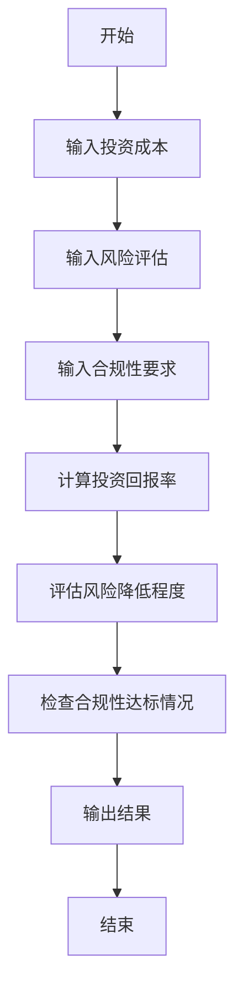

                 


# 如何评估企业的网络安全投资回报

## 关键词：网络安全，投资回报，风险管理，成本效益分析，信息化建设

## 摘要：网络安全是企业信息化建设中的核心问题，其投资回报评估是企业管理层和决策者关注的重点。本文从背景与核心概念、算法原理、系统架构、项目实战等多维度深入分析，为企业提供科学、系统的网络安全投资回报评估方法，助力企业制定最优的网络安全策略。

---

# 第一部分: 企业网络安全投资回报评估背景与核心概念

## 第1章: 企业网络安全投资回报评估的背景与重要性

### 1.1 网络安全的重要性与现状

#### 1.1.1 网络安全的核心地位
随着企业信息化建设的推进，网络安全已成为企业生存和发展的基石。企业的数据资产、业务系统和客户信息面临日益复杂的网络攻击威胁。网络安全不仅是技术问题，更是关乎企业声誉、客户信任和竞争优势的战略问题。

#### 1.1.2 当前网络安全威胁的演变
网络攻击技术不断升级，攻击者从单纯的病毒、木马攻击发展到高级持续性威胁（APT）、零日攻击和供应链攻击。这些威胁不仅针对中小企业，也对大型企业构成严重威胁。企业需要投入更多资源来应对这些复杂的安全威胁。

#### 1.1.3 企业网络安全投资的必要性
企业在数字化转型过程中，网络安全投资不仅是成本问题，更是企业风险管理的重要组成部分。通过合理配置安全资源，企业可以降低数据泄露、业务中断等风险，保障业务的连续性和可靠性。

---

### 1.2 企业网络安全投资回报的定义与内涵

#### 1.2.1 投资回报的定义
网络安全投资回报（ROI）是指企业在网络安全方面的投入（包括技术、人员、培训等）与其带来的收益之间的对比。这种收益可以是直接的经济效益，也可以是间接的风险降低和品牌价值提升。

#### 1.2.2 网络安全投资的特殊性
与传统的财务投资不同，网络安全投资的回报不一定体现在直接的收入增长上，而是更多地体现在风险降低、合规性达标和业务连续性保障等方面。

#### 1.2.3 投资回报的多维度评估
网络安全投资回报需要从多个维度进行评估，包括经济回报、风险降低、合规性收益和品牌价值提升等。这种多维度的评估方法能够更全面地反映投资的价值。

---

### 1.3 企业网络安全投资回报的边界与外延

#### 1.3.1 投资回报的边界
网络安全投资回报的边界主要体现在以下几个方面：
1. **投资范围**：仅限于企业内部的网络安全投入，不包括外部合作伙伴的安全投入。
2. **时间范围**：通常考虑一定时间内的投入和回报，避免将长期目标与短期目标混淆。
3. **影响范围**：仅考虑直接影响，不包括间接影响（如供应链合作伙伴的安全事件对企业的影响）。

#### 1.3.2 与相关领域的关联
网络安全投资回报与企业信息化建设、风险管理、合规性管理等领域密切相关。例如，合规性管理要求企业在特定时间内满足一定的安全标准，而这些标准往往需要通过一定的安全投资来实现。

#### 1.3.3 外延的动态变化
随着网络安全威胁的不断变化，企业的网络安全投资回报的外延也在动态调整。例如，新的法规出台、技术进步或业务模式变化都可能影响投资回报的评估范围。

---

### 1.4 核心概念与联系

#### 1.4.1 核心概念原理
网络安全投资回报的评估需要综合考虑以下几个核心要素：
1. **投资成本**：包括技术设备、人员工资、培训费用等。
2. **风险降低**：通过投资减少数据泄露、业务中断等风险。
3. **合规性达标**：确保企业符合相关法规和行业标准。
4. **业务连续性保障**：通过投资确保企业在遭受攻击时能够快速恢复业务。

#### 1.4.2 核心概念属性特征对比表
| 概念         | 投资属性 | 回报属性 |
|--------------|----------|----------|
| 投资形式     | 资金、资源 | 经济效益、风险降低 |
| 投资时间     | 短期、中期、长期 | 立竿见影、长期积累 |
| 投资影响     | 防御性 | 攻击性 |

#### 1.4.3 ER实体关系图
```mermaid
er
  actor: 企业
  actor -|> investment: 网络安全投资
  investment --> return: 投资回报
  return --> metrics: 评估指标
```

---

## 第2章: 网络安全投资回报的核心概念与联系

### 2.1 核心概念原理

#### 2.1.1 投资与回报的关系
网络安全投资与回报的关系是双向的。一方面，企业需要投入资金和资源来提升安全能力；另一方面，这种投入能够降低风险、保障业务连续性，从而带来间接的经济收益。

#### 2.1.2 网络安全的特殊性
网络安全具有高技术性、高隐蔽性和高动态性的特点。这些特性使得网络安全投资的回报难以量化，但其重要性却不容忽视。

#### 2.1.3 投资回报的多维度性
网络安全投资回报不仅体现在直接的经济效益上，还包括风险降低、合规性达标和品牌价值提升等多个方面。

---

### 2.2 核心概念属性特征对比

| 概念         | 投资属性 | 回报属性 |
|--------------|----------|----------|
| 投资形式     | 资金、资源 | 经济效益、风险降低 |
| 投资时间     | 短期、中期、长期 | 立竿见影、长期积累 |
| 投资影响     | 防御性 | 攻击性 |

---

### 2.3 ER实体关系图
```mermaid
er
  actor: 企业
  actor -|> investment: 网络安全投资
  investment --> return: 投资回报
  return --> metrics: 评估指标
```

---

## 第3章: 网络安全投资回报的算法原理

### 3.1 算法原理概述

#### 3.1.1 算法目标
通过建立数学模型，量化企业的网络安全投资与实际收益之间的关系，帮助企业更好地制定安全策略和预算分配。

#### 3.1.2 算法输入
1. **投资成本**：包括技术设备、人员工资、培训费用等。
2. **风险评估**：包括可能遭受的损失、攻击频率等。
3. **合规性要求**：包括法规、行业标准等。

#### 3.1.3 算法输出
1. **投资回报率（ROI）**：量化投资的实际收益。
2. **风险降低程度**：评估投资对风险的控制效果。
3. **合规性达标情况**：检查投资是否满足相关要求。

---

### 3.2 算法流程图



---

### 3.3 数学公式与模型

#### 3.3.1 投资回报率公式
$$ ROI = \frac{\text{净收益}}{\text{投资成本}} \times 100\% $$

其中，净收益 = 收益 - 投资成本。

#### 3.3.2 风险降低模型
$$ \text{风险降低} = \text{原风险} - \text{投资后风险} $$

---

## 第4章: 网络安全投资回报的系统架构

### 4.1 系统功能设计

#### 4.1.1 风险评估模块
通过收集企业的安全事件数据、资产价值和威胁情报，评估企业的总体风险水平。

#### 4.1.2 投资规划模块
根据风险评估结果，制定相应的安全投资计划，包括技术选型、人员配置和预算分配。

#### 4.1.3 回报评估模块
定期评估安全投资的实际效果，包括 ROI、风险降低和合规性达标情况。

---

### 4.2 系统架构设计


---

## 第5章: 网络安全投资回报的项目实战

### 5.1 实战环境搭建

#### 5.1.1 环境配置
1. 操作系统：Linux
2. 开发工具：Python、Jupyter Notebook
3. 数据库：MySQL

---

### 5.2 核心代码实现

#### 5.2.1 风险评估函数

```python
def calculate_risk_level(threat_intensity, asset_value):
    risk_level = threat_intensity * asset_value
    if risk_level > 100:
        return "高风险"
    elif risk_level > 50:
        return "中风险"
    else:
        return "低风险"
```

#### 5.2.2 投资回报率计算函数

```python
def calculate ROI(net收益):
    ROI = (net收益 / 投资成本) * 100
    return ROI
```

---

### 5.3 实战案例分析

#### 5.3.1 案例背景
某企业计划投资100万元用于网络安全，预计在两年内减少数据泄露损失500万元。

#### 5.3.2 计算 ROI
$$ ROI = \frac{500 - 100}{100} \times 100\% = 400\% $$

---

## 第6章: 总结与展望

### 6.1 本章小结
通过本文的分析，我们了解到网络安全投资回报的评估需要从多个维度进行考虑，包括投资成本、风险降低和合规性达标等。通过建立数学模型和系统架构，企业可以更好地制定安全策略和预算分配。

### 6.2 未来展望
随着网络安全威胁的不断变化，企业需要更加动态地调整安全策略。未来的研究可以进一步探索人工智能和大数据分析在网络安全投资回报评估中的应用，以提高评估的准确性和实时性。

---

## 作者：AI天才研究院/AI Genius Institute & 禅与计算机程序设计艺术 /Zen And The Art of Computer Programming

---

**参考资料**：
1. [网络安全投资回报模型](https://example.com/roi-model)
2. [企业信息化建设与网络安全](https://example.com/enterprise-security)

--- 

这篇文章详细介绍了如何评估企业的网络安全投资回报，涵盖了背景分析、核心概念、算法原理、系统架构和项目实战等多个方面。通过科学的分析和实际案例的讲解，帮助企业更好地理解和实施网络安全投资回报的评估工作。

