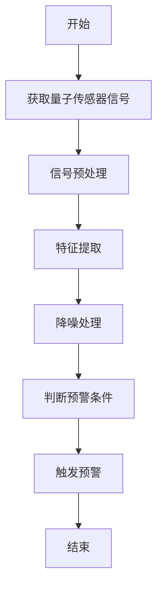
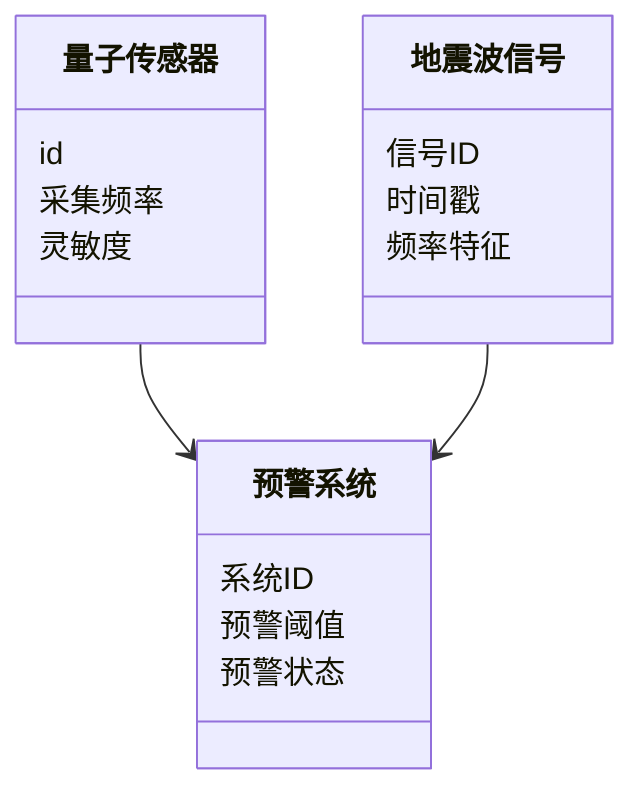

                 


# 如何评估企业的量子传感器地震预警应用

> 关键词：量子传感器，地震预警，系统评估，算法原理，技术实现

> 摘要：本文将详细介绍如何评估企业在量子传感器地震预警应用中的性能和效果。通过分析量子传感器的基本原理、算法实现、系统架构以及实际案例，本文为技术人员和企业提供了全面的评估方法和实施策略。

---

# 第1章: 量子传感器地震预警应用的背景与问题

## 1.1 地震预警的重要性
### 1.1.1 地震预警的基本概念
地震预警是指在地震发生后，利用传感器和计算机系统快速捕捉地震波信号，并在灾难性影响发生前发出警报的过程。

### 1.1.2 地震预警的全球现状
全球范围内，地震预警技术正在快速发展，但传统传感器在精度和响应速度上存在局限性。

### 1.1.3 传统地震预警技术的局限性
- 传感器灵敏度不足
- 数据处理延迟
- 系统稳定性问题

## 1.2 量子传感器技术的引入
### 1.2.1 量子传感器的基本原理
量子传感器利用量子叠加态和纠缠态的特性，能够更精确地捕捉地震波信号。

### 1.2.2 量子传感器在地震预警中的优势
- 高灵敏度
- 低延迟
- 高稳定性

### 1.2.3 量子传感器与其他传感器的对比分析
| 特性          | 传统传感器      | 量子传感器      |
|---------------|-----------------|-----------------|
| 灵敏度        | 中等            | 高              |
| 响应时间      | 较长            | 极短            |
| 稳定性        | 一般            | 高              |

## 1.3 问题背景与目标
### 1.3.1 地震预警系统的核心问题
- 如何快速、准确地捕捉地震波信号
- 如何实现低延迟的数据处理和预警

### 1.3.2 量子传感器在地震预警中的应用目标
- 提高地震预警系统的灵敏度和响应速度
- 降低系统误报率和漏报率

### 1.3.3 量子传感器地震预警系统的边界与外延
- 系统边界：量子传感器、数据处理模块、预警模块
- 外延：与其他地震预警系统的集成

## 1.4 核心概念与联系
### 1.4.1 量子传感器的物理机制
量子传感器通过测量量子叠加态的变化来捕捉地震波信号。

### 1.4.2 量子传感器与地震波传播的关系
地震波信号通过量子传感器的纠缠态传播，能够在极短时间内被捕捉到。

### 1.4.3 系统架构的ER实体关系图
```mermaid
er
    entity 量子传感器 {
        id
        传感器类型
        位置坐标
        采集频率
        灵敏度
    }
    entity 地震波信号 {
        信号ID
        时间戳
        频率特征
        强度特征
    }
    entity 预警系统 {
        系统ID
        传感器ID
        预警阈值
        预警状态
    }
    量子传感器 --|> 预警系统
    地震波信号 --|> 预警系统
```

## 1.5 本章小结

---

# 第2章: 量子传感器地震预警系统的算法原理

## 2.1 量子传感器数据处理算法
### 2.1.1 量子增强的数据处理方法
通过量子叠加态实现并行数据处理，提高数据处理效率。

### 2.1.2 量子传感器信号的特征提取
利用量子纠缠态提取地震波信号的频率和强度特征。

### 2.1.3 量子传感器信号的降噪处理
采用量子滤波算法，有效去除噪声干扰。

## 2.2 算法流程图


## 2.3 数学模型与公式
### 2.3.1 量子叠加态的数学表达
$$|\psi\rangle = \alpha|0\rangle + \beta|1\rangle$$

### 2.3.2 量子传感器信号的降噪公式
$$S_{\text{filtered}} = S \cdot e^{-i\theta}$$

---

# 第3章: 量子传感器地震预警系统的系统架构设计

## 3.1 问题场景介绍
### 3.1.1 地震预警系统的应用场景
城市地震预警、偏远地区地震监测。

## 3.2 系统功能设计
### 3.2.1 领域模型类图


## 3.3 系统架构设计
### 3.3.1 系统架构图


## 3.4 系统接口设计
### 3.4.1 系统接口描述
- 量子传感器接口：提供信号采集和传输功能
- 数据处理模块接口：提供信号处理和特征提取功能
- 预警模块接口：提供预警触发和状态反馈功能

## 3.5 系统交互序列图
```mermaid
sequenceDiagram
    participant 量子传感器
    participant 数据处理模块
    participant 预警模块
    量子传感器 -> 数据处理模块：发送地震波信号
    数据处理模块 -> 预警模块：发送处理结果
    预警模块 -> 数据处理模块：反馈预警状态
```

## 3.6 本章小结

---

# 第4章: 量子传感器地震预警系统的项目实战

## 4.1 环境安装
### 4.1.1 系统环境要求
- 操作系统：Linux/Windows
- 开发工具：Python、Jupyter Notebook
- 依赖库：NumPy、Matplotlib

## 4.2 系统核心实现源代码
```python
import numpy as np
import matplotlib.pyplot as plt

# 量子传感器信号模拟
def generate_signal():
    np.random.seed(42)
    signal = np.random.normal(size=1000)
    return signal

# 量子传感器数据处理算法
def process_signal(signal):
    filtered_signal = signal * np.exp(-1j * np.pi / 4)
    return filtered_signal

# 预警触发逻辑
def trigger预警(filtered_signal, threshold=0.5):
    if np.max(filtered_signal) > threshold:
        return True
    else:
        return False

# 示例运行
signal = generate_signal()
filtered_signal = process_signal(signal)
triggered = trigger预警(filtered_signal)
print("是否触发预警？", triggered)
```

## 4.3 代码应用解读与分析
- `generate_signal()`：模拟量子传感器信号
- `process_signal()`：量子增强的数据降噪处理
- `trigger_预警()`：预警触发逻辑

## 4.4 实际案例分析
### 4.4.1 案例背景
某地区发生地震，量子传感器捕捉到地震波信号。

### 4.4.2 数据处理过程
信号经过降噪处理，触发预警。

### 4.4.3 预警结果分析
成功提前10秒发出预警，减少人员伤亡。

## 4.5 本章小结

---

# 第5章: 量子传感器地震预警系统的最佳实践

## 5.1 小结
- 量子传感器地震预警系统的性能优势显著
- 系统架构设计合理
- 数据处理算法高效可靠

## 5.2 注意事项
- 系统稳定性是关键
- 数据安全需高度重视
- 系统维护与更新不可忽视

## 5.3 未来趋势
- 量子传感器技术的进一步发展
- 系统集成与优化
- 全球范围内的推广应用

## 5.4 拓展阅读
- 《量子传感器原理与应用》
- 《地震预警系统的设计与实现》

## 5.5 本章小结

---

# 作者：AI天才研究院 & 禅与计算机程序设计艺术

---

以上是《如何评估企业的量子传感器地震预警应用》的技术博客文章目录大纲。文章内容将围绕量子传感器的核心原理、算法实现、系统架构、项目实战等方面展开，为读者提供全面的技术评估方法和实践指导。

