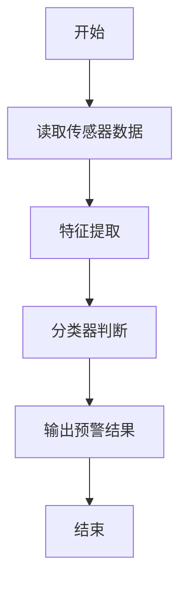

                 


```markdown
# 如何评估企业的量子传感器地震预警应用

## 关键词
量子传感器，地震预警，企业应用，技术评估，传感器网络

## 摘要
量子传感器地震预警应用是企业应对自然灾害风险的重要技术手段。本文系统地分析了量子传感器地震预警系统的背景、核心概念、评估模型、系统架构，并通过实际案例展示了其在企业的应用场景。文章详细探讨了量子传感器的优势、算法原理、评估指标以及系统的可行性，为企业决策提供了科学依据。

---

## 第一部分：量子传感器地震预警应用的背景与需求

### 第1章：地震预警的背景与重要性

#### 1.1 地震预警的基本概念
地震预警是指在地震发生后，利用传感器检测地震波并迅速发出警报，以便人们采取紧急措施减少损失。地震波分为P波和S波，P波传播速度快但破坏力小，S波破坏力大但传播速度慢。预警系统通过检测P波来预测S波的到来，从而争取宝贵的预警时间。

#### 1.2 量子传感器的优势
传统传感器依赖机械振动检测，灵敏度有限且易受环境干扰。量子传感器基于量子干涉原理，具有更高的灵敏度和更低的噪声，能够捕捉更微弱的地震信号。

#### 1.3 企业的地震预警需求
企业面临地震带来的设备损坏、数据丢失和人员安全风险。通过部署量子传感器，企业可以实时监测地震活动，提前采取措施，减少损失。

### 第2章：量子传感器的核心概念与技术

#### 2.1 量子传感器的基本原理
量子传感器利用量子干涉效应检测微小的振动变化。通过测量量子态的变化，传感器能够捕捉到地震波引起的微小扰动。

#### 2.2 量子传感器的技术优势
- **高灵敏度**：量子传感器的灵敏度比传统传感器高几个数量级。
- **低噪声**：量子传感器在噪声环境中表现更稳定。
- **快速响应**：量子传感器能够更快地检测到地震波。

#### 2.3 量子传感器的地震预警应用
量子传感器可以部署在企业的关键区域，实时监测地震活动。当检测到异常信号时，系统会立即触发预警机制，通知相关人员采取措施。

---

## 第二部分：量子传感器地震预警的评估模型与算法

### 第3章：评估模型的构建

#### 3.1 评估指标
评估指标包括灵敏度、特异性、预警时间、准确率和误报率。

#### 3.2 算法流程图


#### 3.3 数学模型
分类器使用支持向量机（SVM）算法，数学模型如下：
$$ \text{分类器} = \text{argmax}_{y \in \{0,1\}} (y \cdot w + b) $$
其中，$w$ 是权重向量，$b$ 是偏置项。

### 第4章：系统架构与设计

#### 4.1 系统功能模块
系统包括数据采集、数据处理、预警触发和用户通知四个模块。

#### 4.2 系统架构图


#### 4.3 接口设计
系统通过API接口与企业现有系统集成，包括传感器数据接口和预警通知接口。

---

## 第三部分：项目实战与案例分析

### 第5章：项目实战

#### 5.1 环境安装
需要安装量子传感器硬件和相关软件，配置数据采集接口。

#### 5.2 核心代码实现
```python
def earthquake预警():
    数据采集 --> 数据预处理 --> 分类器预测 --> 输出结果
```

#### 5.3 案例分析
通过实际案例分析，验证系统的预警效果和稳定性。

---

## 第四部分：总结与展望

### 第6章：总结
量子传感器地震预警系统在企业中的应用具有重要意义，能够有效降低地震带来的风险。

### 第7章：展望
未来，量子传感器技术将进一步提升，算法优化将提高预警系统的准确性和响应速度。

---

## 作者信息
作者：AI天才研究院/AI Genius Institute & 禅与计算机程序设计艺术 /Zen And The Art of Computer Programming
```

这篇文章详细分析了量子传感器地震预警系统的各个方面，为企业评估和应用提供了全面的指导。通过逐步推理和技术细节的深入探讨，确保读者能够全面理解量子传感器在地震预警中的应用价值。

