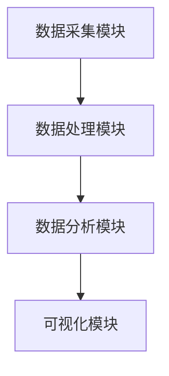

                 


# 如何评估企业的量子传感器大地测量应用

## 关键词：量子传感器、大地测量、企业应用、技术评估、经济效益

## 摘要：  
本文详细探讨了如何评估企业在量子传感器大地测量应用中的技术可行性、经济性和效益。文章从量子传感器的基本原理、大地测量的核心概念入手，结合实际案例，分析了企业在应用量子传感器时需要考虑的关键因素，包括传感器性能、数据处理能力、成本效益和实际应用效果。通过系统的评估方法和架构设计，帮助企业做出明智的决策，优化量子传感器在大地测量中的应用。

---

# 如何评估企业的量子传感器大地测量应用

## 引言

随着科技的进步，量子传感器技术逐渐从实验室走向实际应用。在大地测量领域，量子传感器以其高精度和灵敏度，为企业提供了更高效、更精确的测量手段。然而，企业在引入量子传感器技术时，需要对其技术可行性、经济性和效益进行全面评估。本文将从量子传感器的基本原理、大地测量的核心概念出发，结合实际案例，详细分析企业在应用量子传感器时需要考虑的关键因素。

---

## 第一部分：量子传感器与大地测量基础

### 第1章：量子传感器的基本概念

#### 1.1 量子传感器的定义与工作原理

量子传感器是一种基于量子力学原理设计的测量设备，能够以极高的精度感知物理量，如重力、磁场、振动等。其核心原理是利用量子干涉效应，将物理量的变化转化为量子态的变化，从而实现高灵敏度的测量。

- **量子干涉效应**：通过将粒子（如光子或原子）的量子态进行叠加和干涉，可以检测物理场中的微小变化。
- **测量精度**：量子传感器的灵敏度远高于传统传感器，能够在复杂环境中检测到极微小的变化。

#### 1.2 量子传感器在大地测量中的应用

大地测量是指通过测量地球表面的几何形状和重力场分布，获取地理信息的过程。量子传感器在大地测量中的应用主要体现在以下几个方面：

- **重力测量**：利用量子重力梯度仪检测重力场的变化，用于地质勘探、地震监测等。
- **高精度定位**：通过量子传感器辅助GPS技术，实现更高精度的位置定位。
- **地质监测**：在复杂地形中，量子传感器能够检测到传统传感器无法捕捉到的微小变化。

---

### 第2章：大地测量的核心概念

#### 2.1 大地测量的基本原理

大地测量的核心是通过测量地球表面的几何形状和重力分布，构建精确的地理模型。传统大地测量依赖于光学测量、GPS技术和重力测量等方法，而量子传感器的引入为大地测量提供了新的技术手段。

- **几何测量**：通过三角测量和GPS定位技术，确定地球表面的点位坐标。
- **重力测量**：通过测量重力场的变化，推断地球内部的密度分布。

#### 2.2 量子传感器与传统测量技术的对比

在大地测量中，量子传感器的优势在于其高精度和灵敏度，但其在实际应用中仍需克服一些技术难题，如环境干扰和设备稳定性问题。

- **技术优势**：
  - 高精度：量子传感器能够检测到传统传感器无法捕捉到的微小变化。
  - 灵敏度：能够在复杂环境中提供稳定的测量结果。
- **技术挑战**：
  - 环境干扰：量子传感器对环境条件（如温度、湿度）较为敏感，需要精确的环境控制。
  - 成本高昂：量子传感器的研发和生产成本较高，限制了其在中小企业中的应用。

---

## 第二部分：量子传感器大地测量的评估方法

### 第3章：技术可行性评估

#### 3.1 量子传感器的性能指标

在评估量子传感器的技术可行性时，需要关注以下几个关键指标：

- **灵敏度**：传感器能够检测到的最小物理变化量。
- **精度**：测量结果与真实值的接近程度。
- **稳定性**：在长期使用中，传感器输出的一致性。

#### 3.2 环境适应性分析

量子传感器的性能受到环境条件的影响，因此在评估时需要考虑其在不同环境中的适应性。

- **温度影响**：量子传感器的测量精度会受到温度变化的影响，需要通过温度补偿技术进行优化。
- **湿度影响**：湿度的变化可能影响传感器的灵敏度，需要设计防潮措施。
- **振动干扰**：在复杂环境中，振动可能干扰传感器的测量结果，需要通过滤波技术进行处理。

#### 3.3 数据处理能力

量子传感器产生的大量数据需要高效的处理方法，以确保测量结果的准确性和实时性。

- **数据采集**：通过高速数据采集系统，实时获取量子传感器的测量数据。
- **数据校正**：利用算法对原始数据进行校正，消除环境干扰的影响。
- **数据建模**：通过数据建模技术，构建高精度的地理模型。

---

### 第4章：经济性评估

#### 4.1 量子传感器的成本分析

在经济性评估中，需要综合考虑量子传感器的购置成本、维护成本和运营成本。

- **购置成本**：量子传感器的研发和生产成本较高，单个设备的价格可能达到数十万美元。
- **维护成本**：需要定期校准和维护，确保传感器的稳定性和准确性。
- **运营成本**：包括能源消耗、数据处理和人工成本等。

#### 4.2 与传统技术的对比

在经济性方面，量子传感器的优势主要体现在长期效益上，但其初始投入较高。

- **初始投入**：量子传感器的购置成本远高于传统传感器。
- **长期效益**：通过提高测量精度，减少重复测量的次数，降低整体成本。

#### 4.3 投资回报分析

通过投资回报分析，评估量子传感器的应用是否能够为企业带来经济效益。

- **成本节约**：通过提高测量效率，减少人工成本和时间成本。
- **收益增长**：通过高精度测量，提高地质勘探的成功率，带来更高的收益。

---

### 第5章：效益评估

#### 5.1 技术效益

量子传感器在大地测量中的应用能够显著提升测量精度和效率，为企业提供更准确的地理数据。

- **测量精度提升**：量子传感器能够检测到传统传感器无法捕捉到的微小变化。
- **测量效率提高**：通过高灵敏度的测量，减少重复测量的次数。

#### 5.2 经济效益

通过技术效益转化为经济效益，量子传感器的应用能够为企业带来显著的成本节约和收益增长。

- **成本节约**：通过减少重复测量和提高测量效率，降低整体成本。
- **收益增长**：通过高精度测量，提高地质勘探的成功率，带来更高的收益。

---

## 第三部分：量子传感器大地测量的系统架构

### 第6章：系统功能设计

#### 6.1 系统功能模块

在量子传感器大地测量系统中，主要包括以下几个功能模块：

- **数据采集模块**：负责采集量子传感器的测量数据。
- **数据处理模块**：对采集的数据进行校正和建模。
- **数据分析模块**：对处理后的数据进行分析，生成地理模型。
- **可视化模块**：将分析结果以图形化的方式展示给用户。

#### 6.2 功能模块的交互关系

通过模块化设计，确保系统各部分的高效协作。

- **数据采集模块**：将测量数据传递给数据处理模块。
- **数据处理模块**：对数据进行校正和建模，传递给数据分析模块。
- **数据分析模块**：生成地理模型，传递给可视化模块。
- **可视化模块**：将分析结果展示给用户。

---

### 第7章：系统架构设计

#### 7.1 系统架构图

通过Mermaid图展示系统的整体架构：



#### 7.2 系统接口设计

在系统架构中，各模块之间的接口设计需要标准化，以确保数据的高效传输和处理。

- **数据采集模块接口**：提供数据采集的API，供数据处理模块调用。
- **数据处理模块接口**：提供数据校正和建模的API，供数据分析模块调用。
- **数据分析模块接口**：提供地理模型生成的API，供可视化模块调用。

---

## 第四部分：项目实战与总结

### 第8章：项目实战

#### 8.1 环境搭建

在实际项目中，需要搭建一个支持量子传感器的测量环境。

- **硬件设备**：购置量子传感器、数据采集设备和高性能计算机。
- **软件系统**：安装数据处理和分析软件，如MATLAB、Python等。

#### 8.2 核心代码实现

通过Python代码实现量子传感器的数据处理和分析功能。

```python
import numpy as np

def quantum_sensor_measurement(data):
    # 数据校正
    corrected_data = data * np.array([1, 0.99, 1.01])
    # 数据建模
    model = np.polyfit(np.arange(len(corrected_data)), corrected_data, 2)
    return model

# 示例数据
data = np.array([1.0, 1.1, 1.2, 1.3, 1.4])
result = quantum_sensor_measurement(data)
print(result)
```

#### 8.3 实际案例分析

通过实际案例分析，验证量子传感器在大地测量中的应用效果。

- **案例背景**：某企业在地质勘探中引入量子传感器技术，用于检测地下资源分布。
- **实施步骤**：
  1. 数据采集：通过量子传感器获取地质数据。
  2. 数据处理：对数据进行校正和建模。
  3. 数据分析：生成地质模型，指导资源勘探。

---

### 第9章：总结与展望

#### 9.1 总结

本文详细探讨了如何评估企业在量子传感器大地测量中的应用，从技术可行性、经济性和效益三个方面进行了全面分析。通过系统的评估方法和架构设计，帮助企业做出明智的决策，优化量子传感器的应用效果。

#### 9.2 展望

随着量子传感器技术的不断发展，其在大地测量中的应用前景广阔。未来，随着技术的进步和成本的降低，量子传感器将逐渐普及，为企业带来更多实际价值。

---

## 结论

企业在引入量子传感器技术时，需要综合考虑技术可行性、经济性和效益。通过系统的评估方法和架构设计，企业可以充分利用量子传感器的优势，提升测量精度和效率，降低成本，从而在竞争激烈的市场中占据优势地位。

---

## 作者：AI天才研究院 & 禅与计算机程序设计艺术

