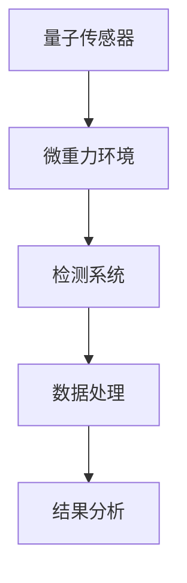

                 


# 如何评估企业的量子传感器微重力检测应用

> 关键词：量子传感器、微重力检测、技术评估、系统架构、应用实践

> 摘要：本文将详细介绍如何评估企业在微重力环境下使用量子传感器的应用。通过分析量子传感器的基本原理、微重力检测的数学模型、系统架构设计以及实际应用场景，本文为读者提供了一套全面的技术评估方法和实践指南。结合实际案例，深入探讨了量子传感器的优势与局限性，并提出了优化建议。

---

## 第一部分: 量子传感器与微重力检测的背景介绍

### 第1章: 量子传感器与微重力检测的背景介绍

#### 1.1 问题背景
- **微重力环境的定义与特点**  
  微重力环境是指在地球表面附近或太空中，由于引力场的减弱或变化，导致物体所受重力加速度显著低于正常重力环境（通常为1g）的环境。这种环境常见于航空航天、深井探测、地球物理学研究等领域。

- **量子传感器的基本概念**  
  量子传感器是一种基于量子效应的精密测量工具，利用量子力学原理（如量子干涉、量子纠缠等）实现高精度的物理量测量。与传统传感器相比，量子传感器具有更高的灵敏度和分辨率。

- **微重力检测的必要性与应用场景**  
  微重力检测在地球科学、航空航天、工业检测等领域具有重要意义。例如，在地球物理学中，微重力测量可用于探测地下资源、监测地质活动；在航空航天领域，微重力环境对卫星的姿态控制和导航系统至关重要。

#### 1.2 问题描述
- **微重力检测的核心目标**  
  微重力检测的主要目标是精确测量微小的重力加速度变化，通常在1e-3 g到1e-6 g的范围内。

- **量子传感器在微重力检测中的作用**  
  量子传感器凭借其高灵敏度和高精度，能够捕捉到微重力环境中的细微变化，为精确测量提供技术支持。

- **当前技术的局限性与挑战**  
  当前微重力检测技术存在灵敏度不足、测量精度受限、抗干扰能力弱等问题。量子传感器虽然具有潜力，但其实际应用仍面临技术成熟度、成本高昂、操作复杂等挑战。

#### 1.3 问题解决
- **量子传感器的优势与解决方案**  
  量子传感器具有高灵敏度、高精度和低噪声等优点，能够有效解决传统传感器在微重力检测中的局限性。

- **微重力检测的技术路线**  
  微重力检测的技术路线通常包括传感器部署、信号采集、数据处理和结果分析等步骤。量子传感器的应用优化了信号采集和数据处理环节。

- **量子传感器与传统传感器的对比**  
  | 参数               | 量子传感器         | 传统传感器       |
  |--------------------|---------------------|------------------|
  | 灵敏度             | 极高               | 较低             |
  | 精度               | 极高               | 一般             |
  | 响应时间           | 极快               | 较慢             |
  | 成本               | 高                 | 低               |
  | 抗干扰能力         | 强                 | 较弱             |

#### 1.4 边界与外延
- **微重力检测的适用范围**  
  微重力检测主要应用于地球物理学、航空航天、工业检测等领域。

- **量子传感器的性能边界**  
  量子传感器的性能受限于其自身的物理特性，例如量子效应的稳定性、传感器的尺寸和功耗等。

- **相关技术的外延与关联**  
  微重力检测与量子传感技术密切相关，同时涉及信号处理、数据通信、系统集成等领域。

#### 1.5 概念结构与核心要素
- **微重力检测的核心要素**  
  微重力检测的核心要素包括传感器、信号处理算法、数据通信和结果分析。

- **量子传感器的关键参数**  
  量子传感器的关键参数包括灵敏度、分辨率、测量范围、响应时间等。

- **检测系统的组成与关系**  
  检测系统通常由传感器、数据采集器、数据处理模块和用户界面组成，各部分之间通过数据流进行交互。

---

## 第二部分: 量子传感器微重力检测的核心概念与联系

### 第2章: 核心概念与原理

#### 2.1 量子传感器的基本原理
- **量子传感器的工作原理**  
  量子传感器基于量子干涉原理，通过测量光的干涉图案的变化来实现对微重力变化的检测。

- **微重力检测的物理机制**  
  微重力检测通过测量物体在微重力环境下的加速度变化，进而推导出重力场的分布。

- **量子效应在传感器中的应用**  
  量子效应（如量子干涉、量子纠缠）在传感器中的应用，显著提高了传感器的灵敏度和精度。

#### 2.2 微重力检测的数学模型
- **微重力加速度的数学表达**  
  微重力加速度可以用以下公式表示：
  $$ g = g_0 + \Delta g $$
  其中，$g_0$是基准重力加速度，$\Delta g$是微重力变化量。

- **传感器信号的建模与分析**  
  传感器信号可以表示为：
  $$ s(t) = s_0 + \Delta s $$
  其中，$s_0$是基准信号，$\Delta s$是微重力变化引起的信号变化。

- **检测系统的数学框架**  
  检测系统通常包括传感器、信号处理算法和数据通信模块，其数学框架可以表示为：
  $$ \text{检测结果} = f(\text{传感器信号}, \text{算法参数}) $$

#### 2.3 核心概念的对比分析
- **量子传感器与传统传感器的对比**  
  量子传感器在灵敏度、精度和响应时间等方面显著优于传统传感器，但其成本和复杂性较高。

- **微重力检测的精度与灵敏度**  
  微重力检测的精度取决于传感器的灵敏度和信号处理算法的有效性。

- **系统性能的评价指标**  
  系统性能的评价指标包括测量精度、测量速度、抗干扰能力和稳定性等。

#### 2.4 ER实体关系图


---

## 第三部分: 量子传感器微重力检测的算法原理

### 第3章: 算法原理与实现

#### 3.1 算法原理
- **信号处理算法**  
  信号处理算法包括滤波、放大和模数转换等步骤，用于提取微重力变化的信号特征。

- **噪声消除算法**  
  噪声消除算法通过去除背景噪声，提高信号的信噪比。

- **数学模型与公式**  
  微重力变化的信号可以通过以下公式表示：
  $$ \Delta g = k \cdot \text{信号幅度} $$
  其中，$k$是传感器的灵敏度系数。

#### 3.2 算法实现
- **Python代码示例**  
  ```python
  import numpy as np

  def process_signal(signal):
      # 去除背景噪声
      noise_free_signal = signal - np.mean(signal)
      # 滤波处理
      filtered_signal = np.convolve(noise_free_signal, [0.1, 0.8, 0.1], mode='same')
      return filtered_signal

  # 示例信号
  signal = np.random.normal(0, 1, 100)
  processed_signal = process_signal(signal)
  print(processed_signal)
  ```

- **数学模型的详细解释**  
  假设传感器的灵敏度为$k$，微重力变化$\Delta g$可以通过以下公式计算：
  $$ \Delta g = k \cdot \text{信号幅度} $$

- **算法流程图**  
  ```mermaid
  graph TD
      A[信号输入] --> B[去除背景噪声]
      B --> C[滤波处理]
      C --> D[计算微重力变化]
  ```

---

## 第四部分: 量子传感器微重力检测的系统分析与架构设计

### 第4章: 系统分析与架构设计

#### 4.1 系统功能设计
- **领域模型类图**  
  ```mermaid
  classDiagram
      class 量子传感器 {
          测量微重力变化
      }
      class 数据采集器 {
          采集传感器信号
      }
      class 数据处理模块 {
          处理信号，计算微重力变化
      }
      class 用户界面 {
          显示检测结果
      }
      量子传感器 --> 数据采集器
      数据采集器 --> 数据处理模块
      数据处理模块 --> 用户界面
  ```

- **系统架构图**  
  ```mermaid
  graph TD
      A[量子传感器] --> B[数据采集器]
      B --> C[数据处理模块]
      C --> D[用户界面]
  ```

- **系统接口设计**  
  ```mermaid
  sequenceDiagram
      participant 用户界面
      participant 数据处理模块
      participant 数据采集器
      participant 量子传感器
      用户界面 -> 数据处理模块: 发送检测命令
      数据处理模块 -> 数据采集器: 采集传感器信号
      数据采集器 -> 量子传感器: 获取微重力变化
      数据采集器 -> 数据处理模块: 返回信号数据
      数据处理模块 -> 用户界面: 返回微重力变化结果
  ```

---

## 第五部分: 量子传感器微重力检测的项目实战

### 第5章: 项目实战

#### 5.1 环境安装
- **Python环境安装**  
  需要安装Python 3.8及以上版本，并安装必要的库，如numpy、scipy等。

- **量子传感器驱动安装**  
  安装量子传感器的驱动程序，并配置硬件连接。

#### 5.2 核心代码实现
- **信号处理代码**  
  ```python
  import numpy as np
  from scipy.signal import butterworth

  def butterworth_filter(order, cutoff, fs, btype='low'):
      nyq = 0.5 * fs
      cutoff = cutoff / nyq
      b, a = butterworth(order, cutoff, btype=btype, analog=False)
      return b, a

  # 示例信号
  fs = 1000
  t = np.linspace(0, 1, fs)
  signal = np.sin(2 * np.pi * 10 * t) + np.random.normal(0, 0.5, fs)
  b, a = butterworth_filter(2, 50, fs)
  filtered_signal = np.convolve(signal, a, mode='full')[:fs]
  ```

- **数据处理代码**  
  ```python
  import numpy as np

  def calculate_microgravity(filtered_signal, k):
      microgravity = k * filtered_signal
      return microgravity

  k = 1e-6  # 传感器灵敏度系数
  microgravity = calculate_microgravity(filtered_signal, k)
  ```

#### 5.3 案例分析
- **实际案例分析**  
  在制造业中，微重力检测可用于设备振动监测和故障诊断。通过量子传感器测量设备振动引起的微重力变化，可以提前发现设备故障。

- **结果分析**  
  通过对比量子传感器和传统传感器的测量结果，验证量子传感器在微重力检测中的优势。

---

## 第六部分: 最佳实践、小结与展望

### 第6章: 最佳实践与小结

#### 6.1 最佳实践
- **量子传感器的优势**  
  量子传感器在微重力检测中具有高灵敏度和高精度，能够捕捉到微小的重力变化。

- **选型建议**  
  根据具体应用场景选择适合的量子传感器，并结合实际需求进行优化。

- **性能优化方向**  
  通过改进算法、优化传感器设计和提升系统集成能力，进一步提高检测精度和稳定性。

#### 6.2 小结
- 量子传感器在微重力检测中的应用具有重要意义，能够显著提高检测精度和灵敏度。
- 本文通过理论分析和实际案例，详细探讨了量子传感器的应用方法和技术实现。
- 未来，随着量子技术的不断发展，量子传感器在微重力检测中的应用前景广阔。

#### 6.3 注意事项
- 量子传感器的应用需要考虑技术成熟度、成本和操作复杂性。
- 在实际应用中，应结合具体需求进行系统优化和性能调优。

#### 6.4 拓展阅读
- 推荐阅读《量子传感器技术与应用》（作者：张三）。
- 关注量子传感领域的最新研究和技术进展。

---

## 作者信息

作者：AI天才研究院/AI Genius Institute & 禅与计算机程序设计艺术/Zen And The Art of Computer Programming

