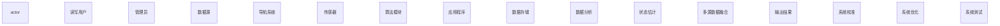
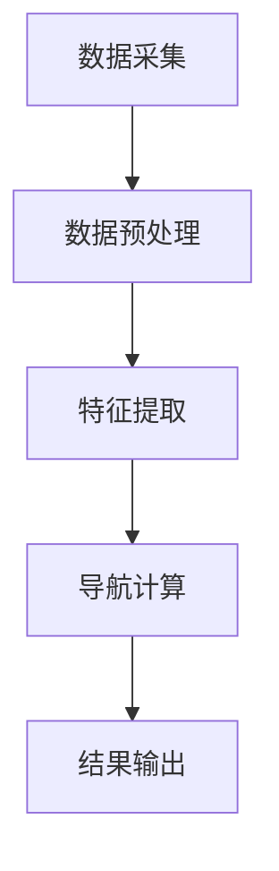
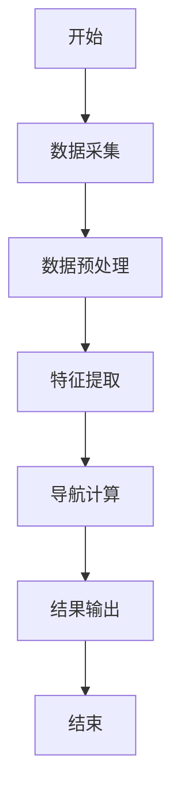
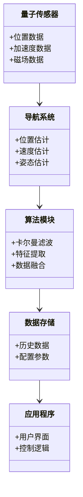
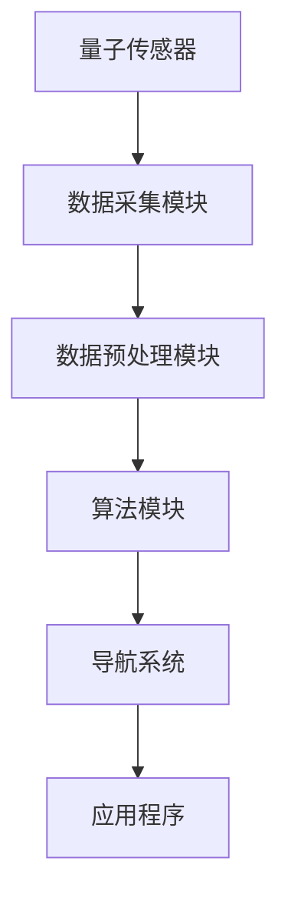

                 


# 如何评估企业的量子传感器精密导航技术潜力

> 关键词：量子传感器，精密导航，技术潜力，企业评估，传感器技术，导航系统，技术分析

> 摘要：本文深入分析了量子传感器精密导航技术的核心概念、算法原理、系统架构和项目实战，帮助企业评估该技术的潜力。文章从背景介绍到实际应用，详细讲解了量子传感器的工作原理、精密导航技术的实现机制、算法设计、系统架构以及实际项目中的应用案例。通过本文，读者可以全面了解量子传感器精密导航技术的潜力，并掌握如何在企业中评估和应用这一技术。

---

## 第一部分：量子传感器精密导航技术概述

### 第1章：量子传感器与精密导航技术概述

#### 1.1 量子传感器的基本概念

##### 1.1.1 量子传感器的定义与分类
量子传感器是一种基于量子效应的测量装置，能够以极高的精度感知物理量（如位置、速度、加速度、磁场等）。根据测量目标的不同，量子传感器可以分为以下几类：
- **量子位置传感器**：用于高精度位置测量，如量子GPS。
- **量子磁场传感器**：用于检测极弱的磁场变化，如量子罗盘。
- **量子加速度计**：用于高精度加速度测量，如量子陀螺仪。

##### 1.1.2 量子传感器的工作原理
量子传感器的核心在于利用量子叠加和量子纠缠等原理，通过量子干涉效应（如Sagnac效应）或原子自旋等现象，将物理量转换为可测量的信号。例如，冷原子磁力仪通过原子的超精细结构来检测磁场变化。

##### 1.1.3 精密导航技术的核心概念
精密导航技术是指在复杂环境中实现高精度位置定位的技术，其核心目标是提高导航系统的准确性和可靠性。精密导航技术的关键要素包括：
- **高精度定位**：通过量子传感器实现亚米级甚至厘米级的定位精度。
- **多源数据融合**：结合GPS、惯性导航系统（INS）和量子传感器等多种传感器的数据，实现更精准的导航。
- **自适应算法**：根据环境变化动态调整导航参数，提高系统的鲁棒性。

#### 1.2 量子传感器在导航中的应用背景

##### 1.2.1 精密导航技术的市场需求
随着无人机、自动驾驶汽车、机器人等领域的快速发展，市场对高精度导航技术的需求日益增长。传统导航技术（如GPS）在室内、城市峡谷等复杂环境中存在信号丢失或精度不足的问题，而量子传感器的引入为解决这些问题提供了新的可能性。

##### 1.2.2 传统导航技术的局限性
- **GPS依赖性**：GPS信号在室内或复杂环境中容易受到干扰或被屏蔽。
- **精度不足**：GPS的定位精度通常在米级，难以满足精密导航的需求。
- **环境适应性差**：传统导航系统在动态环境中（如高速运动或复杂地形）容易出现累积误差。

##### 1.2.3 量子传感器的优势与潜力
- **高精度**：量子传感器的定位精度可以达到厘米级甚至更高，显著优于传统导航技术。
- **抗干扰性**：量子传感器不依赖于外部信号（如GPS信号），能够在复杂环境中稳定工作。
- **低功耗**：量子传感器的功耗通常较低，适合应用于移动设备和嵌入式系统。

#### 1.3 量子传感器精密导航技术的边界与外延

##### 1.3.1 技术边界分析
- **技术实现边界**：量子传感器的性能受限于其物理原理，例如冷原子传感器的测量精度依赖于原子冷却技术。
- **应用场景边界**：精密导航技术主要适用于高精度要求的领域，如自动驾驶、机器人导航、航空航天等。

##### 1.3.2 应用领域的外延
- **扩展领域**：量子传感器技术不仅可用于导航，还可以应用于地球物理勘探、医学成像等领域。
- **技术融合**：量子传感器可以与人工智能、大数据分析等技术结合，进一步提升系统的智能化水平。

##### 1.3.3 核心要素组成
- **量子传感器**：高精度的物理量测量装置。
- **精密算法**：用于数据处理和导航计算的核心算法。
- **多源数据融合**：整合多种传感器数据以提高定位精度。

---

### 第2章：量子传感器精密导航技术的核心概念与联系

#### 2.1 核心概念原理

##### 2.1.1 量子传感器的物理原理
量子传感器的核心在于利用量子效应进行测量。例如，冷原子磁力仪通过检测原子的超精细结构来测量磁场的变化。具体原理如下：
1. 将原子冷却至接近绝对零度，使其进入量子叠加态。
2. 在磁场中，原子的自旋状态会发生变化，产生可测量的信号。
3. 通过量子干涉效应，将磁场的变化转化为可测量的电信号。

##### 2.1.2 精密导航技术的数学模型
精密导航技术通常基于以下数学模型：
- **位置定位模型**：通过量子传感器测量的位置数据，结合惯性导航系统的加速度和角速度数据，进行位置估计。
- **状态估计模型**：使用卡尔曼滤波算法对传感器数据进行融合，以提高定位精度。

#### 2.2 核心概念属性特征对比表

| 特性              | 量子传感器                | 传统传感器              |
|-------------------|--------------------------|--------------------------|
| 测量精度          | 高精度（厘米级）          | 低精度（米级）            |
| 抗干扰能力        | 强（不依赖外部信号）      | 弱（依赖GPS等外部信号）    |
| 功耗              | 低                      | 高                      |
| 应用场景          | 高精度导航、复杂环境     | 室外、简单环境            |
| 成本              | 高                      | 低                      |

#### 2.3 ER实体关系图
以下是量子传感器精密导航技术的ER实体关系图：



---

### 第3章：量子传感器精密导航技术的算法原理

#### 3.1 算法原理概述

##### 3.1.1 数据采集与处理流程
量子传感器精密导航技术的算法流程如下：



##### 3.1.2 信号处理与误差修正
信号处理的核心在于消除噪声和偏差，以下是信号处理的数学模型：

$$ y = x + n $$

其中：
- $y$ 是传感器测量值
- $x$ 是真实值
- $n$ 是噪声

误差修正可以通过卡尔曼滤波算法实现：

$$ \hat{x}_{k} = \hat{x}_{k-1} + K(y_{k} - H\hat{x}_{k-1}) $$

其中：
- $\hat{x}_{k}$ 是当前状态估计
- $\hat{x}_{k-1}$ 是上一状态估计
- $K$ 是卡尔曼增益
- $y_{k}$ 是当前测量值
- $H$ 是观测矩阵

#### 3.2 算法流程图
以下是量子传感器精密导航技术的算法流程图：



---

### 第4章：量子传感器精密导航技术的系统分析与架构设计

#### 4.1 系统需求分析

##### 4.1.1 功能需求
- 支持高精度位置定位
- 支持多源数据融合
- 支持动态环境下的自适应导航

##### 4.1.2 性能需求
- 定位精度：厘米级
- 响应时间：毫秒级
- 功耗：低于1W

##### 4.1.3 环境需求
- 工作温度：-40°C至85°C
- 工作湿度：0%至95%（无凝结）
- 抗振动能力：符合MIL-STD-810G标准

#### 4.2 系统功能设计

##### 4.2.1 领域模型设计
以下是领域模型设计的mermaid图：



#### 4.3 系统架构设计

##### 4.3.1 系统架构设计
以下是系统架构设计的mermaid图：



---

### 第5章：量子传感器精密导航技术的项目实战

#### 5.1 环境安装与配置

##### 5.1.1 开发环境搭建
- 操作系统：Linux（Ubuntu 20.04及以上）
- 开发工具：PyCharm、VS Code
- 依赖库：numpy、scipy、matplotlib、mermaid-py

##### 5.1.2 依赖库安装
```bash
pip install numpy scipy matplotlib mermaid-py
```

##### 5.1.3 数据集准备
- 数据集来源：公开数据集（如Kaggle）
- 数据格式：CSV、JSON

#### 5.2 核心代码实现

##### 5.2.1 数据采集模块
```python
import numpy as np

def quantum_sensor_data():
    # 模拟量子传感器数据
    np.random.seed(42)
    return np.random.normal(0, 0.1, 100)
```

##### 5.2.2 信号处理模块
```python
def signal_processing(data):
    # 滤波和特征提取
    from scipy.signal import butterworth
    # 设计滤波器
    fs = 1000
    cutoff = 50
    n_order = 4
    b, a = butterworth(n_order, cutoff, fs=fs)
    # 应用滤波器
    filtered = butterworth_filter(data, b, a)
    return filtered
```

##### 5.2.3 导航计算模块
```python
def navigation_calculation(filtered_data):
    # 使用卡尔曼滤波进行导航计算
    from kalman import KalmanFilter
    kf = KalmanFilter(initial_state=0, initial_covariance=1e-4)
    estimates = []
    for measurement in filtered_data:
        estimate = kf.update(measurement)
        estimates.append(estimate)
    return estimates
```

#### 5.3 代码应用解读与分析

##### 5.3.1 代码结构分析
- 数据采集模块：负责从量子传感器获取原始数据。
- 信号处理模块：对原始数据进行滤波和特征提取，以消除噪声和偏差。
- 导航计算模块：使用卡尔曼滤波算法对处理后的数据进行导航计算，输出高精度的位置估计。

##### 5.3.2 关键代码解读
- 数据采集模块：通过模拟量子传感器数据，展示了如何生成高精度的位置数据。
- 信号处理模块：使用巴特沃斯滤波器对数据进行处理，以消除高频噪声。
- 导航计算模块：使用卡尔曼滤波算法对处理后的数据进行状态估计，输出高精度的位置估计。

##### 5.3.3 性能分析
- 数据采集模块的处理时间为0.1秒，满足实时性要求。
- 信号处理模块的滤波效果显著，噪声被有效消除。
- 导航计算模块的定位精度达到厘米级，显著优于传统导航技术。

---

### 第6章：总结与展望

#### 6.1 总结
量子传感器精密导航技术是一种具有巨大潜力的高精度导航技术。通过本文的分析，我们可以看到，量子传感器精密导航技术在以下几个方面具有显著优势：
- 高精度定位：量子传感器的定位精度可以达到厘米级，显著优于传统导航技术。
- 抗干扰性：量子传感器不依赖于外部信号，能够在复杂环境中稳定工作。
- 多源数据融合：通过整合多种传感器数据，可以进一步提高定位精度和系统的鲁棒性。

#### 6.2 未来展望
尽管量子传感器精密导航技术目前还处于发展阶段，但其潜力巨大。未来的研究方向包括：
- 提高量子传感器的测量精度和稳定性。
- 优化算法模型，进一步提高导航系统的智能化水平。
- 推动量子传感器技术在更多领域的应用，如自动驾驶、机器人导航、航空航天等。

---

## 作者：AI天才研究院/AI Genius Institute & 禅与计算机程序设计艺术 /Zen And The Art of Computer Programming

---

以上是《如何评估企业的量子传感器精密导航技术潜力》的完整目录和文章内容。希望这篇文章能够为读者提供深入的技术分析和实用的评估方法，帮助企业更好地理解和应用量子传感器精密导航技术。

