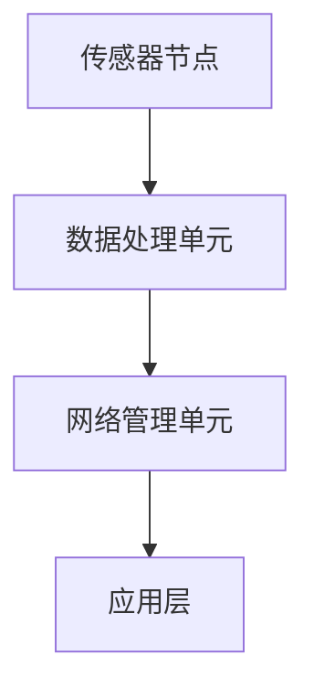

                 


# 如何评估企业的量子传感器网络应用

> 关键词：量子传感器网络、企业应用、评估方法、系统架构、算法原理

> 摘要：量子传感器网络是一种基于量子技术的新兴技术，能够提供高精度、高灵敏度的感知能力。本文详细探讨了如何评估企业在量子传感器网络中的应用，包括核心概念、算法原理、系统架构、项目实战以及最佳实践等方面，帮助企业在实际应用中更好地评估和优化量子传感器网络的性能。

---

# 第一部分: 量子传感器网络应用的背景与基础

# 第1章: 量子传感器网络概述

## 1.1 量子传感器的基本概念

### 1.1.1 量子传感器的定义与基本原理

量子传感器是一种基于量子力学原理的测量装置，通过利用量子叠加和量子纠缠等特性，实现对物理量的高精度测量。与传统传感器相比，量子传感器具有更高的灵敏度和分辨率，能够在更复杂的环境中完成精确的测量任务。

例如，基于量子干涉的传感器可以用于测量微小的位移变化，其灵敏度可以达到传统传感器的千倍甚至万倍。这种高灵敏度使得量子传感器在精密测量、环境监测、医疗诊断等领域具有广泛的应用潜力。

### 1.1.2 量子传感器与经典传感器的对比

以下是量子传感器与经典传感器在性能和原理上的对比：

| **特性**          | **量子传感器**               | **经典传感器**               |
|--------------------|-----------------------------|-----------------------------|
| **灵敏度**         | 极高，能够检测微小变化       | 较低，受噪声干扰较大         |
| **测量精度**       | 高精度，适合精密测量         | 一般精度，适合常规测量       |
| **工作原理**       | 基于量子叠加和量子纠缠       | 基于经典物理原理             |
| **应用领域**       | 精密测量、量子计算、医疗诊断 | 工业检测、环境监测、消费电子 |

### 1.1.3 量子传感器网络的构成与特点

量子传感器网络是由多个量子传感器节点组成的分布式网络，每个节点负责采集特定区域的物理量，并通过量子通信技术将数据传输到数据处理中心。其特点包括：

- **高灵敏度**：每个传感器节点都能以极高的灵敏度检测物理量。
- **分布式架构**：多个传感器节点协同工作，覆盖更大的监测范围。
- **量子通信支持**：数据传输基于量子通信技术，具有更高的安全性。

---

## 1.2 企业应用量子传感器网络的背景

### 1.2.1 量子传感器网络在企业中的重要性

随着量子技术的快速发展，量子传感器网络在企业中的应用越来越广泛。企业可以通过量子传感器网络实现对生产过程、环境条件、设备状态等的实时监测，从而提高生产效率、降低运营成本并增强安全性。

例如，在制造业中，量子传感器网络可以用于实时监测生产线上的设备状态，预测设备故障，从而避免停机损失。在能源行业，量子传感器网络可以用于监测输电线路的温度和压力变化，预防潜在的故障。

### 1.2.2 当前企业应用量子传感器网络的现状

目前，量子传感器网络的应用还处于起步阶段，主要集中在以下几个领域：

1. **精密测量**：如航空航天领域的高精度定位测量。
2. **环境监测**：如大气污染监测和地震预警。
3. **医疗诊断**：如基于量子传感器的医学成像技术。

然而，由于量子传感器技术尚不成熟，成本较高，且需要依赖复杂的量子通信技术，其在企业中的大规模应用仍面临诸多挑战。

### 1.2.3 企业应用量子传感器网络的挑战与机遇

尽管量子传感器网络在企业中的应用前景广阔，但也面临以下挑战：

- **技术成熟度**：量子传感器技术尚未完全成熟，存在稳定性差、成本高等问题。
- **安全性**：量子传感器网络的数据传输依赖于量子通信技术，但其安全性尚未得到充分验证。
- **集成难度**：量子传感器网络的集成需要高度专业化的技术支持。

与此同时，随着量子计算和量子通信技术的快速发展，量子传感器网络的应用也将迎来更多机遇，尤其是在工业自动化、智能制造等领域。

---

## 1.3 本章小结

本章介绍了量子传感器的基本概念、工作原理以及量子传感器网络的构成与特点。同时，分析了企业在应用量子传感器网络时的重要性和面临的挑战。通过本章的介绍，读者可以对量子传感器网络有一个初步的了解，为后续章节的深入分析打下基础。

---

# 第二部分: 量子传感器网络的核心概念与联系

# 第2章: 量子传感器网络的核心原理

## 2.1 量子传感器的基本原理

### 2.1.1 量子叠加原理

量子叠加原理是量子力学的核心原理之一，其基本思想是：一个量子系统可以同时处于多个状态的叠加态。例如，一个量子比特（qubit）可以同时处于0和1的叠加态，表示为：

$$
|\psi\rangle = \alpha|0\rangle + \beta|1\rangle
$$

其中，$\alpha$ 和 $\beta$ 是概率幅，满足归一化条件：

$$
|\alpha|^2 + |\beta|^2 = 1
$$

在量子传感器中，量子叠加原理被用于提高测量的灵敏度。例如，通过将多个传感器节点的信号进行叠加，可以实现对微小变化的高精度测量。

### 2.1.2 量子纠缠原理

量子纠缠是量子力学的另一个重要现象，指的是两个或多个量子系统之间的强关联性。当两个量子系统发生纠缠后，对其中一个系统的测量会立即影响另一个系统的状态，即使它们相隔很远。

在量子传感器网络中，量子纠缠技术被用于实现传感器节点之间的高效通信和数据同步。通过纠缠态的建立，可以实现传感器节点之间的无延迟数据传输，从而提高网络的响应速度和数据处理效率。

### 2.1.3 量子传感器的数据采集与处理

量子传感器的数据采集过程基于量子力学原理，通过测量量子系统的状态变化来获取物理量的值。例如，通过测量量子干涉的结果，可以得到被测物理量的精确值。

数据处理过程则依赖于量子计算技术，通过量子并行计算和量子算法的实现，可以快速处理海量传感器数据，提取有用的信息。

---

## 2.2 量子传感器网络的组网技术

### 2.2.1 量子传感器网络的组网方式

量子传感器网络的组网方式主要包括以下几种：

1. **点对点组网**：每个传感器节点直接与数据处理中心通信。
2. **网状组网**：传感器节点之间通过多跳的方式进行通信，形成网状结构。
3. **混合组网**：结合点对点组网和网状组网的优点，形成混合网络结构。

### 2.2.2 量子传感器网络的通信协议

量子传感器网络的通信协议基于量子通信技术，主要包括以下几种：

1. **量子密钥分发（QKD）**：用于建立传感器节点与数据处理中心之间的安全通信通道。
2. **量子隐形传态（QST）**：用于实现传感器数据的无损传输。

### 2.2.3 量子传感器网络的信号处理技术

量子传感器网络的信号处理技术主要包括以下几种：

1. **量子滤波**：用于消除传感器信号中的噪声，提高测量精度。
2. **量子放大**：用于放大微弱的传感器信号，提高检测灵敏度。
3. **量子调制**：用于对传感器信号进行编码和调制，便于数据传输。

---

## 2.3 量子传感器网络的核心概念对比

### 2.3.1 量子传感器与经典传感器的对比

以下是量子传感器与经典传感器在性能和原理上的对比：

| **特性**          | **量子传感器**               | **经典传感器**               |
|--------------------|-----------------------------|-----------------------------|
| **灵敏度**         | 极高，能够检测微小变化       | 较低，受噪声干扰较大         |
| **测量精度**       | 高精度，适合精密测量         | 一般精度，适合常规测量       |
| **工作原理**       | 基于量子叠加和量子纠缠       | 基于经典物理原理             |
| **应用领域**       | 精密测量、量子计算、医疗诊断 | 工业检测、环境监测、消费电子 |

### 2.3.2 量子传感器网络与经典传感器网络的对比

以下是量子传感器网络与经典传感器网络的对比：

| **特性**          | **量子传感器网络**            | **经典传感器网络**            |
|--------------------|----------------------------|-----------------------------|
| **灵敏度**         | 极高，能够检测微小变化        | 较低，受噪声干扰较大          |
| **数据传输**       | 基于量子通信，安全性高        | 基于经典通信，安全性较低      |
| **网络架构**       | 分布式架构，节点之间高度关联  | 分布式架构，节点之间相对独立  |
| **应用场景**       | 高精度测量、量子计算、医疗诊断| 工业检测、环境监测、消费电子 |

### 2.3.3 量子传感器网络的优缺点分析

以下是量子传感器网络的优缺点分析：

- **优点**：
  - 高灵敏度和高精度，能够检测微小变化。
  - 基于量子通信技术，数据传输安全性高。
  - 分布式架构，能够覆盖更大的监测范围。

- **缺点**：
  - 技术尚不成熟，稳定性较差。
  - 成本较高，难以大规模应用。
  - 对环境条件要求较高，容易受到干扰。

---

## 2.4 量子传感器网络的ER实体关系图

以下是量子传感器网络的ER实体关系图：



---

# 第三部分: 量子传感器网络的算法原理

# 第3章: 量子传感器数据处理算法

## 3.1 量子叠加算法

### 3.1.1 算法原理

量子叠加算法是一种基于量子叠加原理的算法，用于对传感器数据进行并行处理。其基本思想是将多个传感器节点的信号进行叠加，从而提高测量的灵敏度和精度。

### 3.1.2 算法实现步骤

以下是量子叠加算法的实现步骤：

1. **初始化量子状态**：将传感器节点的信号表示为量子叠加态。
2. **量子叠加操作**：对量子叠加态进行操作，使其反映被测物理量的变化。
3. **测量量子状态**：通过量子测量技术，获取叠加态的结果，提取被测物理量的值。

### 3.1.3 算法的数学模型

量子叠加算法的数学模型如下：

$$
|\psi\rangle = \sum_{i=1}^{n} \alpha_i |i\rangle
$$

其中，$\alpha_i$ 是传感器节点 $i$ 的信号幅值，$|i\rangle$ 是传感器节点 $i$ 的状态。

---

## 3.2 量子纠缠算法

### 3.2.1 算法原理

量子纠缠算法是一种基于量子纠缠原理的算法，用于实现传感器节点之间的高效通信和数据同步。其基本思想是通过建立传感器节点之间的纠缠态，实现数据的无损传输。

### 3.2.2 算法实现步骤

以下是量子纠缠算法的实现步骤：

1. **建立纠缠态**：将两个传感器节点的信号建立纠缠态。
2. **传输纠缠态**：通过量子通信技术，将纠缠态从一个传感器节点传输到另一个传感器节点。
3. **测量纠缠态**：通过测量纠缠态的结果，获取传感器节点之间的关联信息。

### 3.2.3 算法的数学模型

量子纠缠算法的数学模型如下：

$$
|\psi\rangle = \frac{1}{\sqrt{2}} (|0\rangle_A |1\rangle_B + |1\rangle_A |0\rangle_B)
$$

其中，$|A\rangle$ 和 $|B\rangle$ 分别表示两个传感器节点的状态。

---

## 3.3 量子传感器数据处理算法的实现

### 3.3.1 量子叠加算法的Python代码实现

以下是量子叠加算法的Python代码实现：

```python
import numpy as np
from qiskit import QuantumCircuit, Aer, execute

# 初始化量子电路
qc = QuantumCircuit(2, 2)

# 应用量子叠加操作
qc.h(0)
qc.cx(0, 1)
qc.measure(0, 0)
qc.measure(1, 1)

# 模拟量子电路
simulator = Aer.get_backend('qasm_simulator')
job = execute(qc, simulator)
result = job.result()

# 输出结果
print(result.get_counts())
```

### 3.3.2 量子纠缠算法的Python代码实现

以下是量子纠缠算法的Python代码实现：

```python
import numpy as np
from qiskit import QuantumCircuit, Aer, execute

# 初始化量子电路
qc = QuantumCircuit(2, 2)

# 应建

