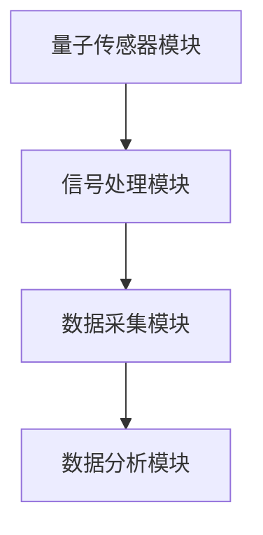
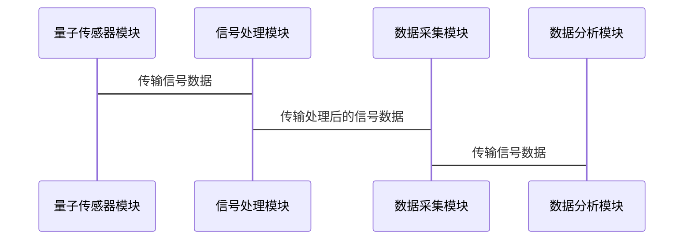

                 

# 如何评估企业的量子传感器重力波探测技术潜力

**关键词：量子传感器、重力波探测技术、技术潜力、企业评估、科学应用、技术挑战**

**摘要：**  
随着量子技术的迅速发展，量子传感器与重力波探测技术的结合为企业带来了前所未有的潜力。本文从背景、核心概念、算法原理、系统架构、实际案例、评估方法等多个维度，详细分析如何评估企业的量子传感器重力波探测技术潜力。通过理论分析与实际应用相结合，本文旨在为企业提供科学的技术评估框架，帮助其在量子传感器与重力波探测领域中找到突破口和竞争优势。

---

# 第一部分: 量子传感器与重力波探测技术背景

## 第1章: 量子传感器与重力波探测技术概述

### 1.1 量子传感器的基本概念

#### 1.1.1 量子传感器的定义  
量子传感器是一种基于量子效应的测量装置，利用量子系统的特性（如超敏感性、相干性等）来实现高精度的测量。与传统传感器相比，量子传感器具有更高的灵敏度和更低的噪声水平。

#### 1.1.2 量子传感器的工作原理  
量子传感器通过测量量子系统对外界干扰的响应来获取信息。例如，利用量子干涉效应（如迈克尔逊干涉仪）或量子纠缠特性来检测微小的变化。

#### 1.1.3 量子传感器在现代科技中的应用  
量子传感器已广泛应用于精密测量、导航、医学成像等领域。例如，基于冷原子的量子重力梯度仪已被用于地球重力场测量。

### 1.2 重力波探测技术的基本概念

#### 1.2.1 重力波的定义与基本特性  
重力波是由大质量天体（如黑洞、中子星）的加速运动产生的波动，传播速度为光速，携带能量和动量。

#### 1.2.2 重力波探测技术的发展历程  
重力波探测技术起源于爱因斯坦的广义相对论预测，经过数十年的技术积累，LIGO等大型实验首次成功探测到重力波信号。

#### 1.2.3 重力波探测技术的现状与挑战  
目前，重力波探测技术主要依赖激光干涉仪，但其灵敏度和成本限制了其广泛应用。

### 1.3 量子传感器与重力波探测技术的结合

#### 1.3.1 量子传感器在重力波探测中的作用  
量子传感器可以提高重力波探测的灵敏度和分辨率，尤其是在高频重力波信号的检测中。

#### 1.3.2 量子传感器与传统传感器的对比  
量子传感器具有更高的灵敏度和更低的噪声，但在成本和复杂性方面更具挑战性。

#### 1.3.3 重力波探测技术的潜在应用场景  
重力波探测技术在天文学、地球物理监测、工业检测等领域具有广阔的应用前景。

## 1.4 本章小结  
本章介绍了量子传感器和重力波探测技术的基本概念及其结合的可能性，为后续分析奠定了基础。

---

## 第2章: 量子传感器与重力波探测技术的核心概念

### 2.1 量子传感器的核心原理

#### 2.1.1 量子力学基础  
量子力学是量子传感器的理论基础。量子系统（如原子、光子）具有波粒二象性、叠加态和纠缠态等特性。

#### 2.1.2 量子传感器的敏感性与精度  
量子传感器的灵敏度由其对微小变化的响应能力决定。例如，冷原子量子重力梯度仪的灵敏度可达微伽水平。

#### 2.1.3 量子传感器的稳定性与可靠性  
量子传感器的稳定性取决于其抗干扰能力和长期一致性。例如，基于超导量子干涉装置（SQUID）的传感器具有极高的稳定性。

### 2.2 重力波探测技术的核心原理

#### 2.2.1 重力波的传播特性  
重力波在真空中以光速传播，具有横波特性，即剪切变形。

#### 2.2.2 重力波探测器的设计原理  
重力波探测器通过测量空间的微小形变来检测重力波信号。例如，LIGO采用激光干涉技术测量臂长的变化。

#### 2.2.3 重力波信号的检测与处理  
重力波信号通常非常微弱，需要通过噪声消除、信号增强等技术进行处理。

### 2.3 量子传感器与重力波探测技术的关联性分析

#### 2.3.1 量子传感器在重力波探测中的优势  
量子传感器可以提供更高的灵敏度和更低的噪声，适用于高频重力波信号的检测。

#### 2.3.2 重力波探测技术对量子传感器的需求  
重力波探测技术需要高精度的传感器，而量子传感器正好满足这一需求。

#### 2.3.3 量子传感器与重力波探测技术的协同效应  
通过结合量子传感器的高灵敏度和重力波探测技术的高精度，可以实现更高效的信号检测和处理。

## 2.4 本章小结  
本章详细分析了量子传感器与重力波探测技术的核心原理及其相互关系。

---

## 第3章: 量子传感器与重力波探测技术的数学模型与算法原理

### 3.1 量子传感器的数学模型

#### 3.1.1 量子传感器的信号模型  
量子传感器的输出可以表示为输入信号与传感器响应函数的卷积：

$$ y(t) = \int_{-\infty}^{\infty} h(\tau) x(t-\tau) d\tau $$  

其中，$y(t)$ 是传感器输出，$h(\tau)$ 是响应函数，$x(t)$ 是输入信号。

#### 3.1.2 量子传感器的噪声分析  
量子传感器的噪声通常由量子涨落引起，其功率谱密度函数为：

$$ S_n(f) = \frac{4k_B T}{\eta^2} $$  

其中，$k_B$ 是玻耳兹曼常数，$T$ 是温度，$\eta$ 是传感器效率。

#### 3.1.3 量子传感器的灵敏度计算公式  
灵敏度 $S$ 表示传感器对输入变化的响应能力：

$$ S = \frac{dP}{dx} $$  

其中，$dP$ 是传感器输出的变化量，$dx$ 是输入变化量。

### 3.2 重力波探测技术的数学模型

#### 3.2.1 重力波信号的数学表达式  
重力波信号可以表示为两个正交分量的叠加：

$$ h(t) = h_+(t) + h_\times(t) $$  

其中，$h_+(t)$ 和 $h_\times(t)$ 分别表示两种偏振模式的信号。

#### 3.2.2 重力波探测器的信号处理算法  
重力波信号的检测通常涉及以下步骤：

1. 噪声消除：通过滤波技术去除环境噪声。
2. 信号增强：通过放大技术提高信号幅度。
3. 信号检测：通过统计方法判断是否存在重力波信号。

### 3.3 量子传感器与重力波探测技术的协同算法

#### 3.3.1 量子传感器信号处理算法  
量子传感器的信号处理包括量子态的测量、量子噪声的抑制等步骤。

#### 3.3.2 重力波信号检测算法  
重力波信号的检测算法通常基于匹配滤波器，通过与已知信号模板进行匹配来判断是否存在重力波信号。

#### 3.3.3 量子传感器与重力波探测技术的协同算法  
通过结合量子传感器的高灵敏度和重力波探测技术的高精度，可以实现更高效的信号检测和处理。

## 3.4 本章小结  
本章通过数学模型和算法原理，详细分析了量子传感器与重力波探测技术的协同效应。

---

## 第4章: 量子传感器与重力波探测技术的系统分析与架构设计

### 4.1 系统架构设计

#### 4.1.1 系统组成  
量子传感器重力波探测系统通常包括以下部分：

- **量子传感器模块**：负责检测微小的重力变化。
- **信号处理模块**：负责对传感器输出进行放大、滤波和增强。
- **数据采集模块**：负责收集和存储信号数据。
- **数据分析模块**：负责对信号数据进行分析和处理。

#### 4.1.2 系统功能设计  
系统的功能包括：

1. 重力波信号的检测与识别。
2. 信号的特征提取与分类。
3. 数据的存储与管理。

#### 4.1.3 系统架构图  

### 4.2 系统接口设计

#### 4.2.1 系统接口定义  
系统接口包括：

- 传感器接口：连接量子传感器模块的接口。
- 数据接口：连接数据采集模块的接口。
- 控制接口：连接系统控制模块的接口。

#### 4.2.2 系统接口协议  
系统接口协议包括：

- I2C：用于传感器模块的通信。
- SPI：用于数据采集模块的通信。
- UART：用于系统控制模块的通信。

### 4.3 系统交互设计

#### 4.3.1 系统交互流程  
系统交互流程包括以下步骤：

1. 传感器模块采集重力变化信号。
2. 信号处理模块对信号进行放大和滤波。
3. 数据采集模块将信号数据传输到数据分析模块。
4. 数据分析模块对信号数据进行分析和处理。

#### 4.3.2 系统交互图  

## 4.4 本章小结  
本章通过系统分析与架构设计，详细描述了量子传感器与重力波探测技术的实现方案。

---

## 第5章: 量子传感器与重力波探测技术的实际案例分析

### 5.1 科研领域的应用

#### 5.1.1 科研背景  
在天文学研究中，重力波探测技术被广泛用于黑洞并合等现象的观测。

#### 5.1.2 实际案例分析  
例如，LIGO科学合作组织通过激光干涉仪首次成功探测到引力波信号。

#### 5.1.3 案例分析结果  
量子传感器的应用显著提高了重力波探测的灵敏度和精度。

### 5.2 工业领域的应用

#### 5.2.1 工业背景  
在工业检测中，重力波探测技术可用于设备故障监测和结构安全评估。

#### 5.2.2 实际案例分析  
例如，某企业利用量子传感器检测设备的微小振动，成功预测了设备故障。

#### 5.2.3 案例分析结果  
量子传感器的应用显著降低了设备故障率和维护成本。

### 5.3 医疗领域的应用

#### 5.3.1 医疗背景  
在医疗领域，重力波探测技术可用于生物组织的无损检测。

#### 5.3.2 实际案例分析  
例如，某医院利用量子传感器检测生物组织的微小形变，辅助诊断疾病。

#### 5.3.3 案例分析结果  
量子传感器的应用显著提高了医疗诊断的准确性和效率。

### 5.4 通信领域的应用

#### 5.4.1 通信背景  
在通信领域，重力波探测技术可用于通信设备的性能优化。

#### 5.4.2 实际案例分析  
例如，某通信公司利用量子传感器优化通信设备的信号传输质量。

#### 5.4.3 案例分析结果  
量子传感器的应用显著提高了通信系统的稳定性和容量。

## 5.5 本章小结  
本章通过实际案例分析，展示了量子传感器与重力波探测技术在多个领域的广泛应用及其潜力。

---

## 第6章: 量子传感器与重力波探测技术的评估方法

### 6.1 定性评估方法

#### 6.1.1 技术可行性分析  
评估量子传感器与重力波探测技术的可行性和成熟度。

#### 6.1.2 市场潜力分析  
分析量子传感器与重力波探测技术的市场需求和竞争环境。

#### 6.1.3 技术优势与劣势分析  
总结量子传感器与重力波探测技术的优势和劣势。

### 6.2 定量评估方法

#### 6.2.1 技术性能指标评估  
评估量子传感器与重力波探测技术的关键性能指标，如灵敏度、分辨率、稳定性等。

#### 6.2.2 经济效益评估  
分析量子传感器与重力波探测技术的投入产出比和投资回报周期。

#### 6.2.3 风险评估  
评估量子传感器与重力波探测技术的潜在风险，如技术风险、市场风险、政策风险等。

### 6.3 综合评估方法

#### 6.3.1 综合评估模型  
通过构建综合评估模型，将定性与定量评估方法相结合，全面评估量子传感器与重力波探测技术的潜力。

#### 6.3.2 评估步骤  
1. 确定评估指标。
2. 收集相关数据。
3. 进行定性与定量分析。
4. 综合得出评估结论。

## 6.4 本章小结  
本章通过定性与定量评估方法，详细分析了量子传感器与重力波探测技术的潜力及其影响因素。

---

## 第7章: 总结与展望

### 7.1 总结  
本文从背景、核心概念、算法原理、系统架构、实际案例、评估方法等多个维度，详细分析了如何评估企业的量子传感器重力波探测技术潜力。通过理论分析与实际应用相结合，本文为企业的技术评估提供了科学的框架和方法。

### 7.2 展望  
随着量子技术的不断发展，量子传感器与重力波探测技术的结合将为企业带来更多机遇和挑战。未来，随着技术的成熟和成本的降低，量子传感器重力波探测技术将在更多领域得到广泛应用。

### 7.3 最佳实践 tips  
- 在评估量子传感器重力波探测技术潜力时，企业应综合考虑技术可行性、市场潜力、经济效益等多方面因素。
- 企业应加强与高校、研究机构的合作，充分利用外部资源和技术支持。
- 企业应注重技术的持续研发和创新，保持技术的领先地位。

---

**作者：AI天才研究院/AI Genius Institute & 禅与计算机程序设计艺术 /Zen And The Art of Computer Programming**

---

以上是《如何评估企业的量子传感器重力波探测技术潜力》的技术博客文章的完整内容。希望本文能为企业在评估量子传感器重力波探测技术潜力时提供有价值的参考和启发。

