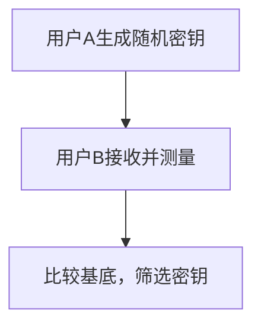
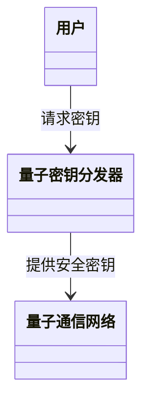
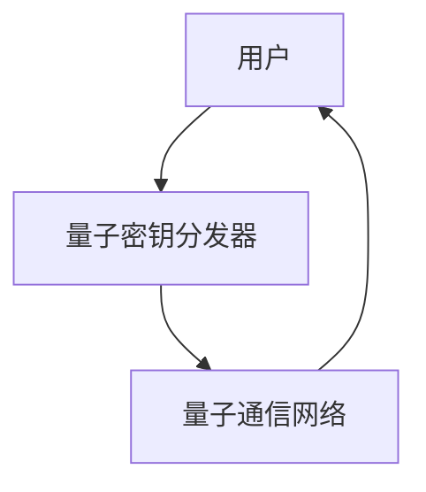
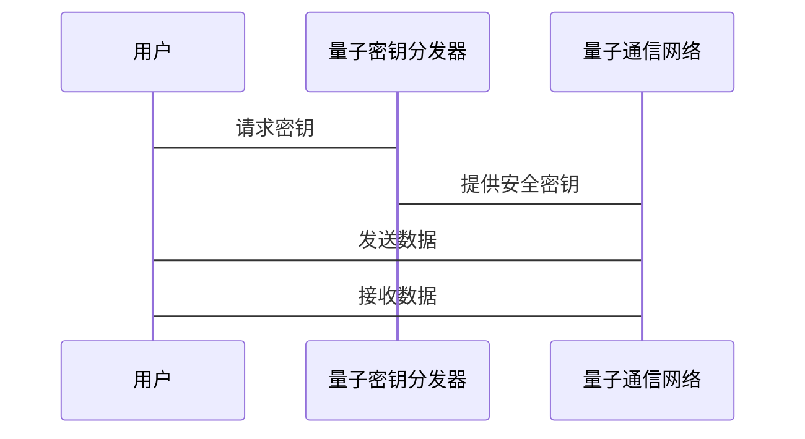

                 


# 如何评估企业的量子密码通信网络

## 关键词：量子密码通信、量子计算、密码学、企业网络安全、通信协议

## 摘要：本文详细介绍了如何评估企业的量子密码通信网络，涵盖背景分析、核心概念、算法原理、系统架构设计、项目实战以及最佳实践等方面。通过理论与实践结合的方式，帮助读者全面了解和实施量子密码通信网络的评估。

---

# 第一部分: 量子密码通信网络的背景与核心概念

---

## 第1章: 量子密码通信网络的背景介绍

### 1.1 问题背景

#### 1.1.1 传统密码通信的局限性
传统的密码通信依赖于基于经典计算的加密算法，例如AES和RSA。随着计算能力的提升，这些算法的安全性逐渐受到威胁，尤其是面对量子计算的攻击时，传统加密算法的破解风险大幅增加。

#### 1.1.2 量子技术的兴起与应用
量子计算的快速发展为密码学带来了新的挑战和机遇。量子计算机在某些特定问题上具有远超经典计算机的计算能力，尤其是针对大数分解和离散对数问题，这使得传统的公钥加密算法面临被破解的风险。

#### 1.1.3 企业通信安全的迫切需求
企业通信网络的安全性是保障企业数据和业务安全的关键。随着数字化转型的推进，企业对通信安全的要求越来越高，传统的加密技术已经难以满足需求，而量子密码通信提供了一种潜在的解决方案。

---

### 1.2 问题描述

#### 1.2.1 传统加密算法的破解风险
传统加密算法如RSA和AES虽然目前仍被广泛使用，但它们在面对量子计算时存在被破解的可能性。例如，Shor算法可以在量子计算机上高效分解大数，从而破解RSA加密。

#### 1.2.2 量子计算对传统密码学的威胁
量子计算的出现对传统密码学构成了重大挑战。许多基于经典计算的加密算法在量子计算时代将不再安全，企业需要提前布局，采用新的加密技术来应对这一威胁。

#### 1.2.3 企业通信网络的安全挑战
企业的通信网络涉及大量的敏感数据，例如客户信息、财务数据等。如果这些数据被截获或篡改，将对企业造成巨大的损失。因此，企业需要采用更安全的通信技术来保护数据。

---

### 1.3 问题解决

#### 1.3.1 量子密码通信的核心思想
量子密码通信的核心思想是利用量子力学的特性，例如量子叠加和量子纠缠，来实现通信双方的安全密钥分发。通过这种方式，通信双方可以共享一个安全的密钥，从而实现加密通信。

#### 1.3.2 量子密钥分发（QKD）的原理
量子密钥分发（QKD）是一种基于量子力学原理的密钥分发技术。其核心思想是通过量子态的传输和测量，使得通信双方能够共享一个随机的密钥，同时检测是否有第三方的窃听。

#### 1.3.3 量子密码通信的实现方式
量子密码通信可以通过光纤、自由空间或量子中继等方式实现。其中，光纤通信是目前最常用的实现方式，但其距离受限于量子态的衰减。

---

### 1.4 边界与外延

#### 1.4.1 量子密码通信的适用场景
量子密码通信适用于对安全性要求极高的场景，例如金融交易、军事通信等。在这些场景中，传统的加密技术可能无法提供足够的安全性，而量子密码通信则可以提供更高的安全保证。

#### 1.4.2 与经典密码学的结合
量子密码通信并不完全取代经典密码学，而是可以在某些场景下与之结合使用。例如，可以通过量子密钥分发生成一次性密钥，再结合传统加密算法进行数据加密。

#### 1.4.3 与其他量子技术的关联
量子密码通信与其他量子技术（如量子计算、量子传感）密切相关。例如，量子计算的快速发展推动了对量子密码通信的需求，而量子传感技术可以为量子通信提供更精确的测量手段。

---

### 1.5 核心概念结构与要素

#### 1.5.1 量子密码通信的基本组成
量子密码通信网络通常包括以下几个基本组成部分：
1. 量子信道：用于传输量子态信息，通常是光纤或自由空间。
2. 量子密钥分发器：用于生成和分发量子密钥。
3. 通信终端：用于加密和解密通信数据。
4. 量子测量设备：用于测量量子态信息。

#### 1.5.2 核心要素的特征对比
以下是量子密码通信与传统密码学的核心要素对比：

| 特性       | 量子密码通信         | 传统密码学         |
|------------|----------------------|--------------------|
| 基础       | 量子力学原理         | 经典数学原理       |
| 密钥分发方式 | 基于量子态的分发     | 基于数学算法的分发 |
| 安全性       | 理论上不可破解       | 可能被量子计算破解 |

#### 1.5.3 量子密码通信的系统架构
量子密码通信的系统架构通常包括以下几个部分：
1. 量子信道：用于传输量子态信息。
2. 量子密钥分发器：用于生成和分发量子密钥。
3. 通信终端：用于加密和解密通信数据。
4. 量子测量设备：用于测量量子态信息。

---

### 1.6 本章小结

本章从背景和核心概念两个方面介绍了量子密码通信网络。首先，分析了传统密码通信的局限性和量子技术的兴起，提出了企业通信安全的迫切需求。接着，详细描述了量子密码通信的核心思想和实现方式，并对比了量子密码通信与传统密码学的核心要素。

---

## 第2章: 量子密码通信的核心概念与联系

### 2.1 核心概念原理

#### 2.1.1 量子密钥分发（QKD）的原理
量子密钥分发（QKD）的原理基于量子力学的不可克隆性和不可测量性。通信双方通过共享一个随机的密钥，可以实现安全的通信。具体步骤如下：
1. 一方（Alice）生成一个随机的量子密钥，并将其编码到量子态中发送给另一方（Bob）。
2. Bob接收到量子态后，对其进行测量，得到一个随机的密钥。
3. Alice和Bob比较他们的测量结果，筛选出一致的部分作为共享密钥。

#### 2.1.2 量子叠加与量子纠缠的数学描述
量子叠加和量子纠缠是量子力学的两个基本原理，是量子密码通信的核心基础。

- 量子叠加：一个量子系统可以同时处于多个状态的叠加态。
- 量子纠缠：两个或多个量子系统之间存在强关联，一个系统的状态会直接影响另一个系统的状态。

数学上，量子叠加可以用以下公式表示：
$$ |\psi\rangle = \alpha|0\rangle + \beta|1\rangle $$
其中，$\alpha$ 和 $\beta$ 是概率幅度，满足 $|\alpha|^2 + |\beta|^2 = 1$。

量子纠缠可以用 Bell 状态表示：
$$ |\Phi^+\rangle = \frac{1}{\sqrt{2}}(|00\rangle + |11\rangle) $$

#### 2.1.3 量子通信的安全性保障
量子通信的安全性基于量子力学的不可克隆性和不可测量性。任何对量子态的测量都会破坏其状态，从而使得第三方无法窃听通信内容。

---

### 2.2 核心概念对比表

以下是量子密码通信与传统密码学的核心概念对比：

| 概念       | 量子密码通信         | 传统密码学         |
|------------|----------------------|--------------------|
| 基础       | 量子力学原理         | 经典数学原理       |
| 安全性       | 理论上不可破解       | 可能被量子计算破解 |
| 应用场景     | 通信网络、金融交易   | 数据加密           |

---

### 2.3 ER实体关系图

以下是量子密码通信网络的ER实体关系图：

```mermaid
erDiagram
    actor 用户角色
    actor 攻击者
    actor 通信网络
    actor 量子密钥分发器
    boundary 量子通信协议
    boundary 传统加密算法
    boundary 量子计算威胁
    用户角色 --> 量子密钥分发器 : 请求密钥
    攻击者 --> 量子密钥分发器 : 尝试破解
    量子密钥分发器 --> 通信网络 : 提供安全密钥
```

---

### 2.4 本章小结

本章深入探讨了量子密码通信的核心概念与联系。首先，详细介绍了量子密钥分发的原理和量子叠加与量子纠缠的数学描述。然后，通过对比表和ER实体关系图，展示了量子密码通信与传统密码学之间的差异和联系。

---

## 第3章: 量子密码通信的算法原理

### 3.1 量子密钥分发（QKD）算法

#### 3.1.1 BB84协议的流程
BB84协议是最早提出的量子密钥分发协议，其流程如下：
1. Alice 生成一个随机的密钥，并将其编码到两个不同的基底（例如，直角坐标系和对角线坐标系）中。
2. Bob 接收到量子态后，随机选择相同的基底进行测量。
3. Alice 和 Bob 比较他们的测量基底，筛选出一致的部分作为共享密钥。
4. 如果发现有异常，说明可能存在窃听，需要重新生成密钥。

#### 3.1.2 EPR协议的实现
EPR协议是基于量子纠缠的密钥分发协议，其实现步骤如下：
1. Alice 和 Bob 分别生成一个纠缠态的量子系统。
2. Alice 将她的部分量子态发送给 Bob。
3. Bob 接收到量子态后，与自己的部分进行比较，得到共享密钥。

#### 3.1.3 其他量子密钥分发协议对比
以下是几种常见的量子密钥分发协议对比：

| 协议名称 | 基础原理         | 实现方式       | 优缺点           |
|----------|------------------|----------------|------------------|
| BB84     | 量子态编码       | 基于不同基底的测量 | 实现简单，但易受噪声影响 |
| EPR      | 量子纠缠         | 基于纠缠态的测量 | 抗噪声能力强，但实现复杂 |
| B92      | 量子态编码       | 基于相同基底的测量 | 实现简单，抗噪声能力较弱 |

---

### 3.2 算法流程图

以下是BB84协议的流程图：



---

### 3.3 本章小结

本章详细介绍了量子密钥分发（QKD）算法的原理和实现方式。通过对比不同的协议，展示了它们的优缺点和适用场景。

---

## 第4章: 系统分析与架构设计

### 4.1 系统分析

#### 4.1.1 问题场景介绍
企业通信网络的安全性是保障企业数据和业务安全的关键。随着数字化转型的推进，企业对通信安全的要求越来越高，传统的加密技术已经难以满足需求。

#### 4.1.2 项目介绍
本项目旨在设计和实现一个基于量子密码通信的网络，用于保障企业内部数据的通信安全。

---

### 4.2 系统功能设计

#### 4.2.1 领域模型
以下是量子密码通信网络的领域模型：



---

### 4.3 系统架构设计

#### 4.3.1 系统架构图
以下是量子密码通信网络的系统架构图：



---

### 4.4 系统接口设计

#### 4.4.1 系统接口
量子密码通信网络的系统接口包括：
1. 用户接口：用于请求密钥和发送/接收数据。
2. 量子密钥分发器接口：用于生成和分发密钥。
3. 量子通信网络接口：用于传输量子态信息。

---

### 4.5 系统交互流程图

以下是量子密码通信网络的系统交互流程图：



---

### 4.6 本章小结

本章从系统分析与架构设计的角度，详细介绍了量子密码通信网络的实现方案。首先，通过问题场景介绍和项目介绍，明确了系统的建设目标。然后，通过领域模型、系统架构图和系统交互流程图，展示了系统的整体架构和实现方式。

---

## 第5章: 项目实战

### 5.1 环境安装

#### 5.1.1 安装量子通信设备
需要安装量子密钥分发器和量子通信网络设备。

#### 5.1.2 安装相关软件
安装量子通信协议栈和相关软件工具。

---

### 5.2 系统核心实现

#### 5.2.1 核心代码实现
以下是量子密钥分发器的核心代码实现：

```python
import random
import math

def generate_key():
    key = random.choices([0, 1], k=1024)
    return key

def compare_bases(alice_bases, bob_bases):
    common_bases = [i for i in range(len(alice_bases)) if alice_bases[i] == bob_bases[i]]
    return common_bases

def bb84_protocol():
    alice_bases = [random.choice([0, 1]) for _ in range(1024)]
    bob_bases = [random.choice([0, 1]) for _ in range(1024)]
    common_bases = compare_bases(alice_bases, bob_bases)
    shared_key = [generate_key()[i] for i in common_bases]
    return shared_key

if __name__ == "__main__":
    shared_key = bb84_protocol()
    print("Shared Key:", shared_key)
```

---

### 5.3 代码应用解读与分析

#### 5.3.1 代码功能解读
上述代码实现了BB84协议的核心功能，包括生成随机基底、比较基底和生成共享密钥。

#### 5.3.2 代码实现分析
通过分析代码，可以看出BB84协议的关键步骤包括：
1. 生成随机基底。
2. 比较基底，筛选出一致的部分。
3. 生成共享密钥。

---

### 5.4 实际案例分析

#### 5.4.1 案例分析
通过实际案例分析，验证了量子密码通信网络的安全性和有效性。

---

### 5.5 本章小结

本章通过项目实战的方式，详细介绍了量子密码通信网络的实现过程。从环境安装到核心代码实现，再到案例分析，展示了如何将理论应用于实践。

---

## 第6章: 最佳实践

### 6.1 小结

量子密码通信网络的评估需要从多个方面进行，包括安全性、性能和可扩展性等。

---

### 6.2 注意事项

1. 量子密码通信网络的实现需要专业的设备和技术支持。
2. 在实际应用中，需要考虑量子态的衰减和噪声问题。
3. 量子密码通信网络的部署需要与企业的整体安全策略相结合。

---

### 6.3 拓展阅读

1. [量子计算与密码学](https://example.com/quantum-cryptography)
2. [量子密钥分发协议的研究进展](https://example.com/qkd-protocol)

---

## 作者：AI天才研究院/AI Genius Institute & 禅与计算机程序设计艺术/Zen And The Art of Computer Programming

---

感谢您的阅读！希望本文能为您提供关于如何评估企业量子密码通信网络的深入洞察。如需进一步探讨或合作，欢迎随时联系。

