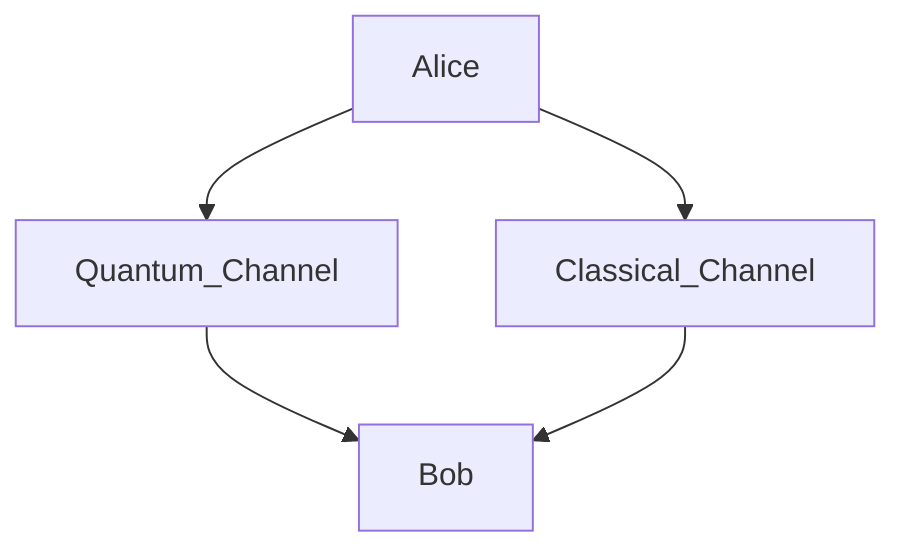

                 


# 如何评估企业的量子密钥分发城际网络安全性

> 关键词：量子密钥分发，城际网络，网络安全，协议分析，安全性评估

> 摘要：本文将详细介绍如何评估企业量子密钥分发城际网络的安全性。通过分析量子密钥分发的核心协议、系统架构和实际案例，本文为读者提供了一个全面的安全性评估框架，帮助企业在实际应用中确保量子密钥分发网络的安全性。

---

# 第一部分: 量子密钥分发与城际网络安全性概述

## 第1章: 量子密钥分发的基本概念

### 1.1 量子密钥分发的定义与原理

#### 1.1.1 量子密钥分发的定义
量子密钥分发（Quantum Key Distribution, QKD）是一种利用量子力学原理在通信双方之间安全共享加密密钥的技术。其核心思想是通过量子态的不可克隆性和测量扰动性，确保密钥的传输过程具有极高的安全性。

#### 1.1.2 量子密钥分发的基本原理
量子密钥分发基于量子叠加和量子纠缠的原理，通过单光子的传输实现密钥的分发。通信双方通过协商生成随机密钥，并通过量子通道进行传输。任何未经授权的第三方试图窃听都会破坏量子态，从而被通信双方发现。

#### 1.1.3 量子密钥分发的核心优势
- **安全性**：基于量子力学的原理，确保密钥传输过程的安全性。
- **抗干扰性**：任何未经授权的窃听都会引起信号的扰动，从而被检测。
- **高效性**：可以在较短的时间内生成大量的安全密钥。

### 1.2 城际网络的基本概念

#### 1.2.1 城际网络的定义与特点
城际网络是指在城市之间建立的高速通信网络，用于连接不同城市之间的通信系统。其特点是覆盖范围广、传输速度快、数据流量大。

#### 1.2.2 城际网络的安全性需求
城际网络作为重要的通信基础设施，涉及大量的敏感数据传输，因此需要极高的安全性保障，防止数据泄露和网络攻击。

#### 1.2.3 量子密钥分发在城际网络中的应用
量子密钥分发技术可以有效提高城际网络的安全性，通过在城市之间建立量子通信链路，实现安全的密钥分发，从而保障城际网络的通信安全。

## 第2章: 企业量子密钥分发网络的安全性评估背景

### 2.1 企业通信安全的重要性

#### 2.1.1 企业通信安全的基本概念
企业通信安全是指企业在通信过程中保护数据的机密性、完整性和可用性的能力。它是企业信息安全的重要组成部分。

#### 2.1.2 企业通信中的主要威胁
- **数据窃听**：未经授权的第三方窃取通信数据。
- **数据篡改**：通信数据被恶意修改。
- **拒绝服务攻击**：攻击者通过消耗资源使通信服务无法正常运行。

#### 2.1.3 量子密钥分发在企业通信中的作用
量子密钥分发技术通过提供安全的密钥分发机制，帮助企业建立安全的通信通道，抵御上述威胁。

### 2.2 量子密钥分发技术的发展现状

#### 2.2.1 量子密钥分发技术的历史发展
量子密钥分发技术自20世纪80年代提出以来，经历了实验验证、技术改进和实际应用等多个阶段，逐渐从理论走向实践。

#### 2.2.2 当前量子密钥分发技术的主要应用领域
- **金融行业**：保护银行交易的安全性。
- **政府机构**：保障敏感信息的传输安全。
- **企业通信**：提升企业内部通信的安全性。

#### 2.2.3 量子密钥分发技术的未来发展趋势
随着量子计算和量子通信技术的不断发展，量子密钥分发技术将更加成熟，并在更广泛的领域得到应用。

### 2.3 企业量子密钥分发网络的安全性评估需求

#### 2.3.1 企业通信中的安全性挑战
企业在通信过程中面临数据泄露、网络攻击等多重挑战，传统的加密技术难以应对日益复杂的网络安全威胁。

#### 2.3.2 量子密钥分发技术在企业网络中的应用需求
企业需要通过量子密钥分发技术提升通信安全性，抵御高级持续性威胁（APT）等复杂攻击。

#### 2.3.3 企业量子密钥分发网络安全性评估的目标与意义
- **目标**：评估企业量子密钥分发网络的安全性，发现潜在的安全漏洞，提出改进建议。
- **意义**：通过安全性评估，确保企业量子密钥分发网络的高效运行和数据安全，为企业提供强有力的安全保障。

---

# 第二部分: 量子密钥分发的核心概念与协议

## 第3章: 量子密钥分发的核心协议

### 3.1 BB84协议

#### 3.1.1 BB84协议的基本原理
BB84协议由 Bennett 和 Brassard 于1984年提出，是最早的量子密钥分发协议之一。通信双方通过量子态的传输和测量，协商生成共享密钥。

#### 3.1.2 BB84协议的实现步骤
1. **密钥生成**：Alice 和 Bob 分别生成随机的密钥序列，并通过量子态传输。
2. **基底选择**：Alice 和 Bob 公布使用的基底，比较后保留相同的基底结果。
3. **错误检测**：通过公开讨论检测传输过程中的错误，确保密钥的一致性。
4. **密钥确认**：通过协商确认最终的密钥，确保安全性。

#### 3.1.3 BB84协议的安全性分析
BB84协议通过量子态的不可克隆性和测量扰动性，确保密钥传输过程的安全性。任何未经授权的窃听都会被发现，从而保证密钥的安全性。

### 3.2 EPR协议

#### 3.2.1 EPR协议的基本原理
EPR协议基于量子纠缠原理，通信双方通过共享量子纠缠态，协商生成共享密钥。

#### 3.2.2 EPR协议的实现步骤
1. **量子态生成**：Alice 和 Bob 分别生成并共享量子纠缠态。
2. **测量与比较**：Alice 和 Bob 对量子态进行测量，并比较结果。
3. **密钥确认**：通过比较测量结果，协商生成最终的密钥。

#### 3.2.3 EPR协议的安全性分析
EPR协议通过量子纠缠的特性，确保密钥的共享过程具有极高的安全性。未经授权的第三方无法获取任何信息，从而保证密钥的安全性。

### 3.3 B92协议

#### 3.3.1 B92协议的基本原理
B92协议是BB84协议的简化版本，通过减少基底的数量，提高密钥分发的效率。

#### 3.3.2 B92协议的实现步骤
1. **密钥生成**：Alice 生成随机的基底序列，并将对应的量子态传输给 Bob。
2. **基底选择**：Bob 公开选择使用的基底，Alice 和 Bob 比较基底结果。
3. **错误检测与纠正**：通过公开讨论检测和纠正传输过程中的错误。
4. **密钥确认**：协商确认最终的密钥。

#### 3.3.3 B92协议的安全性分析
B92协议通过减少基底的数量，简化了实现过程，同时保持了较高的安全性。未经授权的第三方难以窃取密钥，确保通信的安全性。

### 3.4 比较与分析

#### 3.4.1 不同协议的优缺点对比
| 协议名称 | 优势 | 劣势 |
|----------|------|------|
| BB84     | 安全性高，实现复杂 | 实现复杂 |
| EPR      | 实现简单，安全性高 | 适用性有限 |
| B92      | 实现简单，效率高 | 安全性稍逊于BB84 |

#### 3.4.2 协议间的依赖关系与协作
不同协议在实际应用中可以结合使用，通过互补的方式提升整体安全性。例如，结合BB84和B92协议，可以在保证安全性的同时，提高密钥分发的效率。

---

## 第4章: 量子密钥分发协议的数学模型与公式

### 4.1 BB84协议的数学模型

#### 4.1.1 密钥生成的数学表达
Alice 和 Bob 分别生成随机的密钥序列，表示为：
$$
K_A = \{a_1, a_2, \dots, a_n\} \\
K_B = \{b_1, b_2, \dots, b_n\}
$$
其中，$a_i$ 和 $b_i$ 分别表示 Alice 和 Bob 生成的第 $i$ 个密钥位。

#### 4.1.2 量子态传输的数学表达
量子态通过单光子的偏振方向传输，表示为：
$$
|0\rangle = \cos{\theta} |0\rangle + \sin{\theta} |1\rangle \\
|1\rangle = \cos{\phi} |0\rangle + \sin{\phi} |1\rangle
$$
其中，$\theta$ 和 $\phi$ 分别表示 Alice 和 Bob 选择的基底角度。

#### 4.1.3 错误检测与纠正的数学表达
通过比较公开的基底信息，检测并纠正传输过程中的错误。错误检测的数学表达如下：
$$
E = \sum_{i=1}^{n} (a_i \oplus b_i)
$$
其中，$E$ 表示错误的位置。

### 4.2 EPR协议的数学模型

#### 4.2.1 量子纠缠态的数学表达
EPR协议中，Alice 和 Bob 分享的量子纠缠态可以表示为：
$$
|\Psi\rangle = \frac{1}{\sqrt{2}} (|00\rangle + |11\rangle)
$$

#### 4.2.2 测量与比较的数学表达
Alice 和 Bob 分别对量子态进行测量，并比较结果。测量结果可以表示为：
$$
M_A = \{m_1, m_2, \dots, m_n\} \\
M_B = \{n_1, n_2, \dots, n_n\}
$$
其中，$m_i$ 和 $n_i$ 分别表示 Alice 和 Bob 的第 $i$ 个测量结果。

---

## 第5章: 量子密钥分发协议的系统分析与架构设计

### 5.1 量子密钥分发系统的功能模块设计

#### 5.1.1 密钥生成模块
负责生成随机的密钥序列，并将其编码为量子态进行传输。

#### 5.1.2 量子态传输模块
通过光纤或自由空间传输量子态，确保传输过程的安全性。

#### 5.1.3 基底选择模块
负责选择和公布使用的基底，确保密钥协商的正确性。

#### 5.1.4 错误检测与纠正模块
通过比较公开的基底信息，检测并纠正传输过程中的错误。

### 5.2 量子密钥分发系统的架构设计

#### 5.2.1 系统架构图

其中，`Quantum_Channel` 表示量子态传输通道，`Classical_Channel` 表示经典通信通道。

#### 5.2.2 系统接口设计
- **量子态传输接口**：负责量子态的编码与解码。
- **基底选择接口**：负责基底的选择与公布。
- **错误检测与纠正接口**：负责错误检测与纠正。

#### 5.2.3 系统交互流程
1. **密钥生成**：Alice 生成随机的密钥序列，并将其编码为量子态。
2. **量子态传输**：Alice 将量子态传输给 Bob。
3. **基底选择**：Alice 和 Bob 公开选择使用的基底。
4. **密钥协商**：Alice 和 Bob 比较基底结果，协商生成最终的密钥。
5. **错误检测与纠正**：通过公开讨论检测并纠正传输过程中的错误。

---

## 第6章: 量子密钥分发协议的项目实战

### 6.1 项目背景与目标

#### 6.1.1 项目背景
本项目旨在评估企业量子密钥分发网络的安全性，通过实际案例分析，提出改进建议。

#### 6.1.2 项目目标
- **安全性评估**：评估量子密钥分发网络的安全性，发现潜在漏洞。
- **性能优化**：通过优化协议实现，提升网络的传输效率。

### 6.2 项目实施步骤

#### 6.2.1 环境配置
- **硬件配置**：需要量子通信设备、光纤传输通道等。
- **软件配置**：需要量子密钥分发协议的实现代码。

#### 6.2.2 核心代码实现

##### 6.2.2.1 密钥生成模块
```python
import random

def generate_key(length):
    return [random.choice([0, 1]) for _ in range(length)]
```

##### 6.2.2.2 量子态传输模块
```python
import numpy as np

def encode_qubit(key_bit):
    if key_bit == 0:
        return np.array([1, 0])
    else:
        return np.array([0, 1])
```

##### 6.2.2.3 基底选择模块
```python
def select_basis():
    return random.choice([0, 45])
```

##### 6.2.2.4 错误检测与纠正模块
```python
def detect_errors(public_basis):
    errors = []
    for i in range(len(public_basis)):
        if public_basis[i][0] != public_basis[i][1]:
            errors.append(i)
    return errors
```

#### 6.2.3 实验结果与分析
通过实验可以发现，量子密钥分发网络的安全性高度依赖于协议的实现和传输环境的稳定性。通过优化协议实现和改善传输环境，可以进一步提升网络的安全性和传输效率。

---

## 第7章: 量子密钥分发协议的最佳实践与注意事项

### 7.1 量子密钥分发协议的安全性评估

#### 7.1.1 评估的关键点
- **协议选择**：根据实际需求选择合适的量子密钥分发协议。
- **安全性测试**：通过模拟攻击测试协议的安全性。
- **性能测试**：评估协议的传输效率和稳定性。

#### 7.1.2 安全性评估的注意事项
- **测试环境**：确保测试环境与实际应用环境一致。
- **测试工具**：使用专业的安全测试工具进行评估。
- **测试团队**：组建专业的测试团队，确保测试结果的准确性。

### 7.2 量子密钥分发协议的优化建议

#### 7.2.1 协议优化
- **协议改进**：根据实际需求对协议进行改进，提升安全性。
- **协议组合**：结合多种协议，提高整体安全性。

#### 7.2.2 系统优化
- **硬件优化**：通过优化硬件设备提升传输效率。
- **软件优化**：通过改进软件实现提升协议执行效率。

### 7.3 未来的发展方向

#### 7.3.1 协议创新
研究新的量子密钥分发协议，进一步提升安全性。

#### 7.3.2 技术融合
将量子密钥分发技术与其他加密技术相结合，提升整体安全性。

#### 7.3.3 应用拓展
探索量子密钥分发技术在更多领域的应用，如医疗、教育等。

---

## 第8章: 总结与展望

### 8.1 总结
通过本文的分析，我们可以得出以下结论：
- 量子密钥分发技术是一种高效的安全通信技术。
- 不同的量子密钥分发协议具有不同的特点和适用场景。
- 企业量子密钥分发网络的安全性评估需要综合考虑协议选择、系统优化和安全性测试等多个方面。

### 8.2 展望
随着量子计算和量子通信技术的不断发展，量子密钥分发技术将更加成熟，并在更广泛的领域得到应用。未来的研究方向将集中在协议创新、技术融合和应用拓展三个方面。

---

# 作者：AI天才研究院 & 禅与计算机程序设计艺术

---

以上是完整的《如何评估企业的量子密钥分发城际网络安全性》的技术博客文章。文章从量子密钥分发的基本概念出发，详细分析了不同协议的实现原理、系统架构，并通过实际案例展示了项目的实施步骤和优化建议。最后，本文提出了未来的发展方向和注意事项，为读者提供了一个全面的安全性评估框架。

