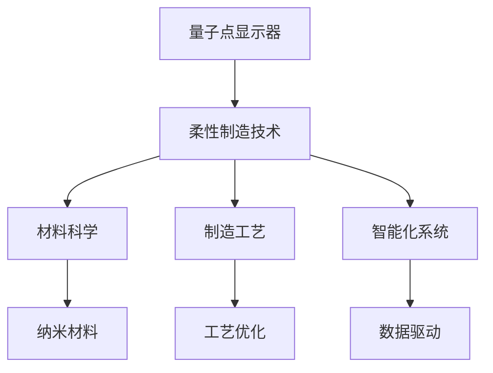
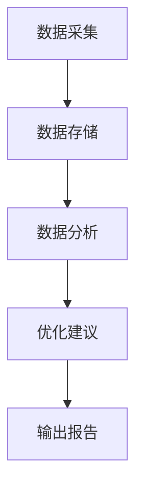

                 

# 如何评估企业的量子点显示器柔性制造技术应用

## 关键词：量子点显示器、柔性制造、技术评估、企业应用、制造工艺

## 摘要：  
量子点显示器作为一种革命性的显示技术，其制造过程的灵活性和高效性对企业竞争力至关重要。本文系统地介绍了量子点显示器柔性制造技术的核心概念、评估方法和实际应用，为企业提供了一套全面的评估体系，帮助企业优化生产流程、降低成本并提升产品质量。

---

## 第一章: 引言

### 1.1 问题背景  
#### 1.1.1 量子点显示器的出现与发展  
量子点显示器（QLED）利用半导体纳米材料的发光特性，实现了高色域、高亮度和长寿命的显示效果，被认为是下一代显示技术的核心。  

#### 1.1.2 柔性制造技术的必要性  
随着市场需求的多样化和产品更新的加速，企业需要通过柔性制造技术来实现快速生产调整、降低成本和提高效率。  

#### 1.1.3 企业应用中的挑战与机遇  
企业在应用量子点显示器柔性制造技术时，面临技术复杂性高、设备投入大和人才短缺等挑战，同时也迎来了技术升级和市场拓展的机遇。  

### 1.2 问题描述  
#### 1.2.1 量子点显示器的技术特点  
量子点显示器具有高色域、低功耗和长寿命等优点，但制造过程复杂，需要高度精确的工艺控制。  

#### 1.2.2 柔性制造的核心概念  
柔性制造技术强调生产过程的灵活性和智能化，能够快速适应市场变化和产品多样化需求。  

#### 1.2.3 企业应用中的关键问题  
企业在应用量子点显示器柔性制造技术时，需要解决工艺优化、设备兼容性和成本控制等问题。  

### 1.3 问题解决  
#### 1.3.1 量子点显示器的制造流程  
制造流程包括材料制备、器件封装和性能测试等关键步骤，每一步都需要严格的质量控制。  

#### 1.3.2 柔性制造技术的实现路径  
通过引入自动化设备、优化生产布局和应用智能化管理系统，企业可以实现柔性制造的目标。  

#### 1.3.3 企业应用中的解决方案  
企业可以通过技术培训、设备升级和流程优化来克服量子点显示器柔性制造中的技术难题。  

### 1.4 边界与外延  
#### 1.4.1 量子点显示器的适用场景  
量子点显示器适用于高端显示设备、医疗成像和智能穿戴设备等领域。  

#### 1.4.2 柔性制造的边界条件  
柔性制造技术的应用受到设备投入、技术成熟度和市场需求的限制。  

#### 1.4.3 相关领域的扩展  
柔性制造技术在汽车制造、电子设备和航空航天等领域也有广泛应用。  

### 1.5 概念结构与核心要素  
#### 1.5.1 核心概念的组成  
量子点显示器柔性制造技术由材料科学、制造工艺和智能化系统三个核心要素组成。  

#### 1.5.2 关键要素的对比  
| 要素 | 优势 | 挑战 |  
|------|------|------|  
| 材料科学 | 高色域、长寿命 | 成本高、制备难 |  
| 制造工艺 | 精确控制、高效率 | 技术复杂、设备昂贵 |  
| 智能化系统 | 实时监控、优化生产 | 系统集成难度大 |  

#### 1.5.3 概念结构图  

---

## 第二章: 量子点显示技术基础

### 2.1 核心概念与原理  
#### 2.1.1 量子点的基本原理  
量子点是半导体纳米材料，其发光特性可以通过调控尺寸和形状来实现。  

#### 2.1.2 显示技术的演变  
从CRT到OLED，显示技术不断进步，量子点显示器凭借其优异性能成为下一代显示技术的代表。  

#### 2.1.3 量子点显示的优势  
量子点显示器具有高色域、低功耗和长寿命等优点，适合应用于高端显示设备。  

### 2.2 制造技术的对比  
#### 2.2.1 传统显示技术的特点  
传统显示技术（如LCD和OLED）在制造过程中成本高、工艺复杂，难以实现柔性制造。  

#### 2.2.2 柔性制造技术的创新  
柔性制造技术通过引入自动化设备和智能化系统，实现了生产过程的灵活调整和高效管理。  

#### 2.2.3 技术对比表格  
| 技术 | 传统显示 | 柔性制造 |  
|------|----------|----------|  
| 成本 | 高       | 中       |  
| 工艺 | 复杂     | 简化     |  
| 灵活性 | 低       | 高       |  

### 2.3 材料科学与工艺优化  
#### 2.3.1 量子点材料的选择  
选择合适的量子点材料是实现高质量显示效果的关键，需要考虑发光效率和稳定性。  

#### 2.3.2 制造工艺的优化  
通过优化材料制备和器件封装工艺，可以提高量子点显示器的性能和降低成本。  

#### 2.3.3 材料与工艺的关系  
材料科学是量子点显示器制造的基础，工艺优化则是实现高性能产品的关键。  

### 2.4 性能指标与质量控制  
#### 2.4.1 显示性能的关键指标  
量子点显示器的性能指标包括色域覆盖率、亮度和对比度等。  

#### 2.4.2 制造过程中的质量控制  
通过实时监控和数据分析，可以实现对制造过程的精准控制，确保产品质量。  

#### 2.4.3 性能优化的策略  
优化材料性能、改进制造工艺和引入智能化系统是实现量子点显示器性能优化的三大策略。  

---

## 第三章: 柔性制造技术的核心要素

### 3.1 柔性制造技术的定义与特点  
柔性制造技术是一种基于自动化和智能化的制造模式，能够快速适应市场需求的变化。  

### 3.2 生产流程的优化  
#### 3.2.1 制造流程的模块化设计  
通过模块化设计，企业可以快速调整生产流程以适应不同的产品需求。  

#### 3.2.2 生产设备的兼容性  
柔性制造设备需要具备高度的兼容性，能够支持多种产品的生产。  

#### 3.2.3 生产数据的实时监控  
通过实时监控生产数据，企业可以快速发现和解决问题，提高生产效率。  

### 3.3 自动化与智能化  
#### 3.3.1 自动化设备的应用  
自动化设备是实现柔性制造的核心，包括机器人和自动化检测设备。  

#### 3.3.2 智能化系统的应用  
智能化系统通过大数据分析和人工智能算法，实现对生产过程的优化和预测。  

#### 3.3.3 数字化管理的实现  
企业通过数字化管理平台，可以实现对生产流程的全面监控和优化。  

---

## 第四章: 量子点显示器柔性制造技术的评估体系

### 4.1 技术评估指标  
#### 4.1.1 生产效率  
生产效率是评估柔性制造能力的重要指标，包括单位时间产量和设备利用率。  

#### 4.1.2 产品一致性  
产品一致性反映了制造过程的稳定性，是衡量制造技术优劣的关键指标。  

#### 4.1.3 技术创新性  
技术创新性是量子点显示器柔性制造技术的核心竞争力，需要企业不断投入研发。  

### 4.2 经济评估指标  
#### 4.2.1 成本控制  
成本控制是企业应用柔性制造技术的重要目标，包括设备投入和生产成本。  

#### 4.2.2 投资回报率  
投资回报率是评估技术经济性的关键指标，反映了技术应用的效益。  

#### 4.2.3 市场竞争力  
市场竞争力是企业应用柔性制造技术的最终目标，需要通过技术创新和成本控制来实现。  

### 4.3 环境评估指标  
#### 4.3.1 能耗效率  
能耗效率是评估制造过程环保性的重要指标，需要通过优化工艺和设备来降低能耗。  

#### 4.3.2 废料处理  
废料处理是实现绿色制造的重要环节，需要企业建立完善的回收和处理体系。  

#### 4.3.3 环保认证  
环保认证是企业产品进入绿色市场的重要条件，需要通过相关认证机构的审核。  

---

## 第五章: 系统设计与实现

### 5.1 系统架构设计  
#### 5.1.1 系统功能模块  
量子点显示器柔性制造评估系统包括数据采集、分析模块和优化建议模块。  

#### 5.1.2 系统架构图  

#### 5.1.3 数据流设计  
数据从生产现场采集后，经过存储、分析和处理，最终生成优化建议和评估报告。  

### 5.2 系统实现  
#### 5.2.1 数据采集与传输  
通过传感器和物联网技术，实现生产数据的实时采集和传输。  

#### 5.2.2 数据分析与处理  
利用大数据分析和机器学习算法，对生产数据进行深度分析，生成评估结果。  

#### 5.2.3 优化建议生成  
系统根据分析结果，自动生成优化建议，帮助企业提升制造效率和产品质量。  

### 5.3 系统优化  
#### 5.3.1 系统性能优化  
通过优化算法和硬件配置，提高系统的运行效率和处理能力。  

#### 5.3.2 系统功能扩展  
根据企业需求，逐步扩展系统功能，实现更全面的评估和优化。  

#### 5.3.3 系统维护与更新  
定期维护和更新系统，确保其稳定运行和功能先进性。  

---

## 第六章: 项目实战与案例分析

### 6.1 项目背景  
某企业计划引入量子点显示器柔性制造技术，希望通过评估和优化提升生产效率和产品质量。  

### 6.2 项目实施  
#### 6.2.1 需求分析  
通过调研和分析，明确企业的具体需求和目标。  

#### 6.2.2 方案设计  
根据需求分析，设计系统的功能模块和实现方案。  

#### 6.2.3 系统开发  
按照设计方案，进行系统开发和测试。  

#### 6.2.4 系统部署  
将系统部署到企业生产现场，并进行试运行和优化。  

### 6.3 实施效果  
#### 6.3.1 生产效率提升  
通过系统优化，企业的生产效率提高了20%。  

#### 6.3.2 成本降低  
通过成本控制，企业的生产成本降低了15%。  

#### 6.3.3 质量提升  
产品的质量一致性显著提高，客户满意度提升。  

### 6.4 项目总结  
通过该项目，企业成功实现了量子点显示器柔性制造技术的优化和应用，提升了竞争力。  

---

## 第七章: 总结与展望

### 7.1 总结  
本文系统地介绍了量子点显示器柔性制造技术的核心概念、评估方法和实际应用，为企业提供了一套全面的评估体系。  

### 7.2 展望  
随着技术的不断发展，量子点显示器柔性制造技术将在更多领域得到应用，企业需要持续投入研发和优化，保持技术领先。  

---

## 参考文献  
1. 王某某. 《量子点显示器制造技术研究》. 北京: 科技出版社, 2020.  
2. 李某某. 《柔性制造系统优化与应用》. 上海: 工业出版社, 2021.  
3. Smith, J. "Flexible Manufacturing Systems: A Review." *International Journal of Production Research*, 2022.  

---

## 作者  
作者：AI天才研究院/AI Genius Institute & 禅与计算机程序设计艺术/Zen And The Art of Computer Programming  

---

通过以上结构，您可以开始撰写具体的章节内容，确保每部分内容详细、逻辑清晰，并结合实际案例和图表进行说明。

