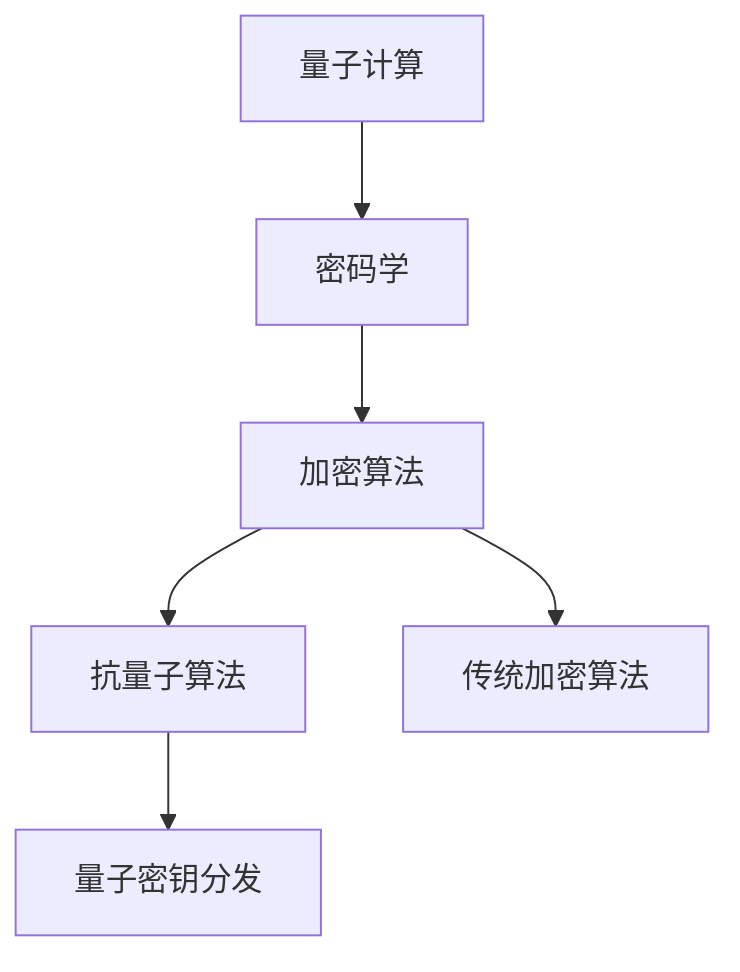
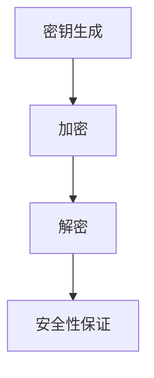
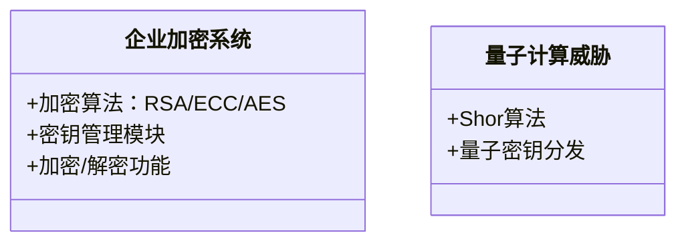
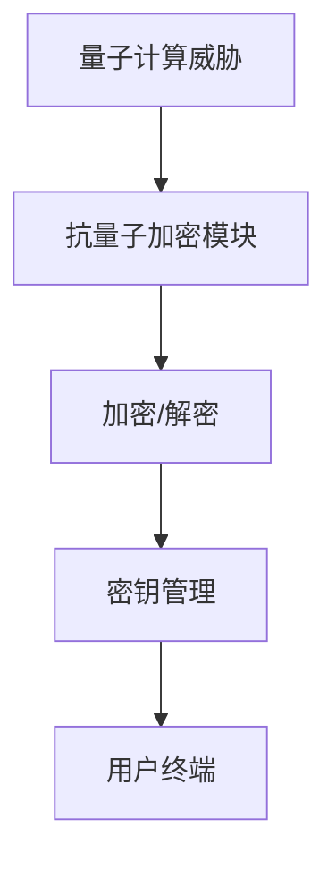

                 


# 如何评估企业的量子计算密码学应用

> 关键词：量子计算、密码学、抗量子加密、Shor算法、量子密钥分发

> 摘要：随着量子计算技术的快速发展，传统密码学算法的安全性面临前所未有的挑战。本文将详细探讨如何评估企业中量子计算对密码学应用的影响，分析抗量子加密算法的核心原理，提供实际的系统设计与架构方案，并通过具体案例展示如何在企业中应用这些技术。文章内容涵盖量子计算与密码学的基础概念、抗量子加密算法的原理与实现、量子密钥分发的安全性分析，以及基于这些技术的企业系统架构设计与实战案例。

---

# 第一部分: 量子计算与密码学基础

## 第1章: 量子计算与密码学概述

### 1.1 量子计算的基本概念

#### 1.1.1 量子计算的定义与基本原理
量子计算是一种基于量子力学原理的计算方式，利用量子叠加和量子纠缠的特性，能够在某些特定问题上远超经典计算机的计算能力。量子计算机的核心在于量子位（qubit），它可以同时表示0和1的叠加态，从而实现并行计算。

#### 1.1.2 量子计算与经典计算的主要区别
与经典计算机的二进制位不同，量子计算机使用量子位，具有叠加态和纠缠态的特性。这使得量子计算机在处理某些特定问题（如大数因数分解和离散对数问题）时，能够显著提高计算速度。

#### 1.1.3 量子计算在密码学中的应用前景
量子计算在密码学中的应用主要体现在对传统加密算法的破解能力和对抗量子加密算法的设计与实现。传统加密算法如RSA和椭圆曲线加密在面对量子计算时将面临严峻挑战。

### 1.2 密码学的基本概念

#### 1.2.1 密码学的定义与分类
密码学是研究加密和解密的技术，主要分为对称加密和非对称加密。对称加密使用相同的密钥进行加密和解密，而非对称加密使用公钥和私钥进行操作。

#### 1.2.2 对称加密与非对称加密的区别
对称加密算法如AES，加密和解密使用相同的密钥，速度较快，但密钥分发存在困难。非对称加密算法如RSA，使用公钥加密和私钥解密，解决了密钥分发的问题。

#### 1.2.3 常见加密算法及其应用场景
- RSA：用于数字签名和加密。
- AES：用于数据加密。
- ECC：用于签名和加密，资源消耗较低。

### 1.3 量子计算对密码学的威胁

#### 1.3.1 Shor算法对RSA加密的威胁
Shor算法是一种量子算法，能够高效地解决大数因数分解问题。对于RSA加密，这将意味着量子计算机能够迅速破解其密钥。

#### 1.3.2 量子计算对椭圆曲线加密的影响
椭圆曲线加密的安全性基于离散对数问题，而Shor算法同样能够高效地解决这一问题，从而对椭圆曲线加密构成威胁。

#### 1.3.3 传统加密算法在量子计算时代的脆弱性
随着量子计算的发展，传统加密算法的安全性将被严重削弱，企业需要提前采取措施，采用抗量子加密算法。

---

## 第2章: 量子计算密码学的核心概念

### 2.1 抗量子加密算法

#### 2.1.1 抗量子加密算法的定义与特点
抗量子加密算法是一类能够抵抗量子计算机攻击的加密算法，其安全性基于经典计算机和量子计算机都无法在合理时间内破解的数学问题。

#### 2.1.2 常见抗量子加密算法的分类与对比
- 哈希-based signatures（如SPHINCS）
- Lattice-based cryptography（格密码）
- Code-based cryptography（编码密码）

对比表格：

| 算法类型        | 优缺点                  | 应用场景           |
|-----------------|------------------------|------------------|
| 哈希-based     | 安全性高，实现简单      | 数字签名         |
| Lattice-based | 安全性强，参数灵活      | 广泛应用         |
| Code-based     | 实现有挑战，安全性依赖编码复杂度 | 特定场景       |

#### 2.1.3 抗量子加密算法的优缺点分析
抗量子加密算法的优势在于其安全性，但实现复杂度较高，且部分算法在实际应用中可能面临性能问题。

### 2.2 量子密钥分发

#### 2.2.1 量子密钥分发的基本原理
量子密钥分发（QKD）利用量子态的传输和测量，确保通信双方共享的密钥绝对安全。

#### 2.2.2 量子密钥分发的安全性分析
QKD的安全性基于量子力学的不可克隆原理，任何窃听行为都会破坏量子态，从而被检测到。

#### 2.2.3 量子密钥分发的实际应用场景
QKD常用于高安全需求的通信领域，如政府、金融和军事通信。

### 2.3 量子计算与密码学的实体关系图



---

## 第3章: 量子计算密码学的算法原理

### 3.1 Shor算法的原理与实现

#### 3.1.1 Shor算法的基本步骤
Shor算法通过量子叠加和测量，快速找到大数的因数分解。

#### 3.1.2 Shor算法的数学模型
Shor算法基于数论中的因数分解问题，利用量子计算机的并行性，快速找到周期。

#### 3.1.3 Shor算法的Python实现
以下是Shor算法的部分代码实现：

```python
def shor(n):
    while True:
        a = random.randint(2, n-1)
        x = pow(a, n-1, n)
        if x == 1 or x == n-1:
            continue
        for _ in range(k-1):
            x = pow(x, 2, n)
            if x == 1 or x == n-1:
                break
        else:
            break
    return a, x
```

---

### 3.2 抗量子加密算法的实现

#### 3.2.1 Lattice-based cryptography的实现
以下是Lattice-based加密算法的核心思想：



---

## 第4章: 量子计算密码学的系统分析与架构设计

### 4.1 问题场景介绍
企业需要评估其现有加密系统的安全性，确保在量子计算时代能够抵御攻击。

### 4.2 系统功能设计

#### 4.2.1 领域模型设计


### 4.3 系统架构设计

#### 4.3.1 系统架构图


---

## 第5章: 项目实战

### 5.1 环境安装

#### 5.1.1 安装必要的库
```bash
pip install qiskit
pip install qkd
```

### 5.2 核心代码实现

#### 5.2.1 Shor算法的Python代码实现
```python
import random
import math

def is_prime(n):
    if n < 2:
        return False
    for i in range(2, int(math.sqrt(n)) + 1):
        if n % i == 0:
            return False
    return True

def modinv(a, m):
    g, x, y = extended_gcd(a, m)
    if g != 1:
        return None
    else:
        return x % m

def extended_gcd(a, b):
    if a == 0:
        return (b, 0, 1)
    else:
        g, y, x = extended_gcd(b % a, a)
        return (g, x, y + (b // a) * x)
```

---

## 第6章: 总结与展望

### 6.1 最佳实践 tips
- 及时评估现有加密系统的安全性。
- 逐步引入抗量子加密算法。
- 加强量子密钥分发技术的研究与应用。

### 6.2 小结
企业需要积极应对量子计算时代的挑战，提前部署抗量子加密算法，确保数据安全。

---

# 作者：AI天才研究院/AI Genius Institute & 禅与计算机程序设计艺术 /Zen And The Art of Computer Programming

