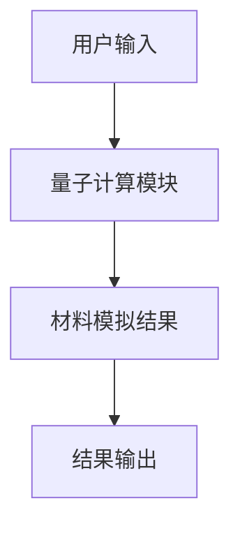
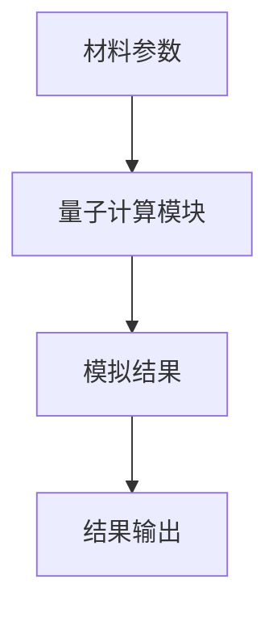

                 


# 如何评估企业的量子计算材料设计应用

> 关键词：量子计算，材料设计，企业应用，算法原理，系统架构

> 摘要：本文将深入探讨如何评估企业在材料设计中应用量子计算的效果。从量子计算的基本概念到材料设计的核心原理，再到具体的算法实现和系统架构，我们将逐步分析，帮助企业更好地理解和应用量子计算技术。

---

## 第一章: 量子计算的基本概念与背景

### 1.1 量子计算的定义与特点

#### 1.1.1 量子计算的基本概念
量子计算是一种利用量子力学原理进行计算的技术，其核心在于利用量子叠加和量子纠缠等特性，通过量子比特（qubit）来进行信息处理。与经典计算使用的二进制位不同，量子计算能够同时处理多个状态，从而在某些问题上具有指数级的计算速度。

#### 1.1.2 量子计算与经典计算的区别
- 经典计算基于二进制，每个位只能是0或1。
- 量子计算基于量子比特，可以同时处于多个状态的叠加态。

#### 1.1.3 量子计算的核心技术
- 量子比特的实现：如超导电路、离子阱、光子等。
- 量子门与量子电路：如Hadamard门、CNOT门等。

### 1.2 材料设计的基本原理

#### 1.2.1 材料设计的核心要素
材料设计的核心在于理解原子和分子的排列方式及其相互作用，从而预测或设计出具有特定物理、化学性质的新材料。

#### 1.2.2 材料计算的基本方法
- 第一性原理计算：基于量子力学的基本方程，计算材料的电子结构和性质。
- 分子动力学模拟：通过计算分子间的作用力，模拟材料的行为。

#### 1.2.3 材料设计的挑战与机遇
- 挑战：计算复杂度高，实验验证困难。
- 机遇：通过量子计算提高计算效率，加速新材料的开发。

### 1.3 量子计算在材料设计中的应用前景

#### 1.3.1 量子计算在材料科学中的潜力
量子计算能够处理复杂的量子系统，为材料科学提供新的研究工具。

#### 1.3.2 企业应用量子计算材料设计的优势
- 提高研发效率
- 降低实验成本
- 拓展新材料的应用领域

#### 1.3.3 量子计算材料设计的未来发展趋势
随着量子计算机的发展，材料设计将更加依赖量子计算技术。

---

## 第二章: 量子计算与材料设计的核心概念

### 2.1 量子计算的基本原理

#### 2.1.1 量子叠加与量子纠缠
- 量子叠加：量子比特可以同时处于多个状态。
- 量子纠缠：多个量子比特之间存在关联，一个比特的状态会影响另一个。

#### 2.1.2 量子态的表示与操作
量子态用向量表示，操作通过矩阵进行。

#### 2.1.3 量子门与量子电路
- 量子门：如Hadamard门、Pauli门等。
- 量子电路：由量子门和量子线组成。

### 2.2 材料设计的量子模型

#### 2.2.1 量子力学在材料设计中的应用
- 电子结构计算：通过量子力学方程计算材料的电子结构。
- 性质预测：预测材料的力学、热学等性质。

#### 2.2.2 量子计算模拟材料结构的原理
通过量子计算模拟原子和分子的排列，预测材料的性质。

#### 2.2.3 量子计算在材料性质预测中的作用
- 提高计算精度
- 减少实验次数
- 加速新材料开发

### 2.3 量子计算与材料设计的结合

#### 2.3.1 量子计算在材料设计中的核心问题
- 如何高效地模拟材料结构
- 如何准确地预测材料性质

#### 2.3.2 量子计算模拟材料的可行性分析
- 技术可行性：量子计算机的计算能力
- 实验验证：模拟结果与实验结果的对比

#### 2.3.3 量子计算与材料设计的协同效应
- 理论与实验的结合
- 计算与模拟的互补

---

## 第三章: 量子计算材料设计的评估方法

### 3.1 量子计算模拟材料设计的方法

#### 3.1.1 基于量子力学的第一性原理计算
- 基本原理：从量子力学的基本方程出发，计算材料的性质。
- 实现方法：通过量子计算机模拟电子结构。

#### 3.1.2 量子蒙特卡洛模拟
- 方法：通过随机采样模拟材料的行为。
- 应用：预测材料的热力学性质。

#### 3.1.3 量子态密度计算
- 定义：材料中电子的分布密度。
- 应用：分析材料的电子结构。

### 3.2 量子计算模拟的性能指标

#### 3.2.1 计算精度与误差分析
- 精度：模拟结果与实际值的接近程度。
- 误差：由于量子噪声或算法限制导致的误差。

#### 3.2.2 计算效率与资源消耗
- 效率：完成模拟所需的时间。
- 资源：量子比特的数量和质量。

#### 3.2.3 模拟结果的验证与校准
- 验证：通过实验或经典计算验证模拟结果。
- 校准：调整模拟参数以提高准确性。

### 3.3 量子计算在材料设计中的应用评估

#### 3.3.1 应用场景的选择与优化
- 选择：根据问题特点选择合适的量子算法。
- 优化：通过参数调整提高计算效率。

#### 3.3.2 评估指标的定义与量化
- 指标：如计算时间、精度、资源消耗等。
- 量化：将指标转化为可量化的数值。

#### 3.3.3 评估结果的分析与改进
- 分析：找出影响计算效率的关键因素。
- 改进：优化算法或调整系统架构。

---

## 第四章: 量子计算材料设计的算法原理

### 4.1 量子算法的基本原理

#### 4.1.1 量子傅里叶变换
- 定义：量子版本的傅里叶变换。
- 应用：用于周期性问题的求解。

#### 4.1.2 量子叠加算法
- 原理：利用量子叠加加速计算。
- 应用：如数据库搜索问题。

#### 4.1.3 量子门的组合与设计
- 组合：通过组合不同的量子门实现复杂的算法。
- 设计：根据问题特点设计量子电路。

### 4.2 量子计算在材料设计中的具体算法

#### 4.2.1 量子模拟算法
- 算法：模拟量子系统的演化。
- 应用：预测材料的动态行为。

#### 4.2.2 量子优化算法
- 算法：如量子退火算法。
- 应用：优化材料的结构和性能。

#### 4.2.3 量子线性方程组求解
- 算法：求解大型线性方程组。
- 应用：分析材料的电子结构。

### 4.3 量子算法的实现与优化

#### 4.3.1 算法的实现步骤
- 步骤：定义问题、选择算法、实现量子电路。

#### 4.3.2 算法的优化方法
- 方法：减少量子门的数量、降低量子比特的使用。

#### 4.3.3 算法的验证与测试
- 验证：通过经典计算验证结果。
- 测试：在实际系统中测试算法的性能。

---

## 第五章: 量子计算材料设计的系统架构

### 5.1 系统架构的基本概念

#### 5.1.1 系统功能设计
- 功能：输入材料参数、运行量子算法、输出模拟结果。

#### 5.1.2 系统架构图


#### 5.1.3 系统接口设计
- 输入接口：接收材料参数和量子算法设置。
- 输出接口：提供模拟结果和性能指标。

### 5.2 系统架构的具体实现

#### 5.2.1 系统功能模块
- 材料参数输入模块
- 量子算法运行模块
- 结果处理与输出模块

#### 5.2.2 系统架构设计


#### 5.2.3 系统交互流程
- 流程：用户输入参数 → 运行算法 → 输出结果。

### 5.3 系统优化与扩展

#### 5.3.1 系统优化方法
- 优化量子算法，减少计算资源消耗。
- 提高系统并行处理能力。

#### 5.3.2 系统扩展方向
- 支持更多种类的量子算法。
- 提供更丰富的材料模拟功能。

---

## 第六章: 量子计算材料设计的项目实战

### 6.1 项目环境安装

#### 6.1.1 安装量子计算库
- 库：如Qiskit、Cirq。
- 安装命令：`pip install qiskit`.

#### 6.1.2 安装材料模拟工具
- 工具：如Gaussian、VASP。
- 安装命令：`pip install pyMaterials`.

### 6.2 项目核心实现

#### 6.2.1 量子算法实现
```python
from qiskit import QuantumCircuit, execute, Aer

def quantum_algorithm(n):
    qc = QuantumCircuit(n)
    # 实现量子叠加
    qc.h(range(n))
    qc.measure_all()
    return qc
```

#### 6.2.2 材料模拟实现
```python
def material_simulation():
    # 模拟材料结构
    return result
```

### 6.3 项目运行与结果分析

#### 6.3.1 项目运行步骤
- 编写量子算法代码。
- 运行程序，获取模拟结果。

#### 6.3.2 结果分析与解读
- 分析模拟结果的准确性。
- 对比经典计算和量子计算的效率。

#### 6.3.3 案例分析
- 实例：模拟某种新材料的电子结构。
- 分析：比较量子计算与经典计算的结果差异。

---

## 第七章: 最佳实践与小结

### 7.1 最佳实践

#### 7.1.1 选择合适的量子算法
- 根据问题特点选择适合的算法。

#### 7.1.2 优化系统架构
- 通过优化减少资源消耗，提高效率。

#### 7.1.3 结合实验验证
- 将量子计算结果与实验数据对比，提高准确性。

### 7.2 小结

通过本文的详细分析，我们了解了如何评估企业在材料设计中应用量子计算的效果。从基本概念到具体实现，再到系统优化，每一步都至关重要。量子计算在材料设计中的应用前景广阔，但也面临诸多挑战，需要企业持续投入和优化。

---

## 作者信息

作者：AI天才研究院/AI Genius Institute & 禅与计算机程序设计艺术 /Zen And The Art of Computer Programming

---

以上是整篇文章的详细大纲和内容，希望对您有所帮助！

