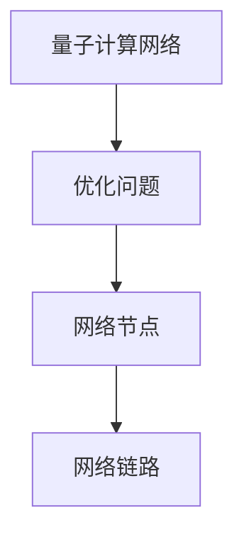

                 

# 如何评估企业的量子计算网络优化应用

> 关键词：量子计算、网络优化、企业应用、算法原理、系统架构

> 摘要：量子计算作为一项革命性技术，正在逐步改变企业网络优化的模式。本文从量子计算的基本概念出发，详细探讨其在网络优化中的核心原理、算法实现、系统架构以及实际应用案例，为企业评估量子计算网络优化应用提供全面的分析和指导。

---

## 第一部分: 量子计算网络优化应用概述

### 第1章: 量子计算与网络优化的背景介绍

#### 1.1 量子计算的基本概念
量子计算是一种基于量子力学原理的计算方式，与经典计算相比，其核心优势在于并行计算能力和处理复杂问题的效率。量子计算利用量子叠加和纠缠的特性，可以在更短的时间内解决复杂的优化问题。

#### 1.2 企业网络优化的现状与挑战
传统网络优化方法依赖于经典算法，存在计算效率低、处理复杂度高的问题。随着企业网络规模的扩大，传统方法在处理大规模数据时显得力不从心。量子计算的引入为企业提供了更高效的解决方案。

#### 1.3 量子计算网络优化的核心要素
量子计算网络优化的核心要素包括量子算法、量子计算资源、网络模型和优化目标。这些要素共同作用，确保量子计算在网络优化中的有效应用。

---

## 第二部分: 量子计算网络优化的核心概念与联系

### 第2章: 量子计算网络优化的核心原理

#### 2.1 量子叠加与量子纠缠在网络优化中的应用
量子叠加允许系统同时处于多个状态，从而可以并行处理多个优化方案。量子纠缠则通过关联性提高计算的效率，帮助快速找到最优解。

#### 2.2 量子计算网络优化的数学模型与公式
在优化问题中，量子计算通过构建数学模型，利用量子算法找到最优解。例如，使用Grover算法进行路由优化，可以通过数学公式描述其计算过程。

#### 2.3 量子计算网络优化的概念属性特征对比表格

| 概念 | 特征 | 描述 |
|------|------|------|
| 量子叠加 | 并行性 | 同时处理多个状态 |
| 量子纠缠 | 关联性 | 系统中各部分的强关联性 |

#### 2.4 量子计算网络优化的ER实体关系图

---

## 第三部分: 量子计算网络优化的算法原理

### 第3章: 量子计算网络优化算法的详细讲解

#### 3.1 量子算法的基本原理
量子算法通过量子叠加和纠缠的特性，能够在多项式时间内解决某些复杂问题。例如，Grover算法可以用于解决无向图的最小路径问题。

#### 3.2 量子计算网络优化的具体算法
Grover算法在网络优化中的应用展示了量子计算的优势。通过数学公式和代码示例，详细讲解其在路由优化中的具体实现。

---

## 第四部分: 量子计算网络优化的系统分析与架构设计

### 第4章: 系统分析与架构设计方案

#### 4.1 问题场景介绍
企业网络优化的场景包括数据传输、路由规划和资源分配。量子计算可以显著提高这些过程的效率。

#### 4.2 系统功能设计
系统功能设计包括数据输入、算法执行、结果输出和优化评估。通过Mermaid类图展示系统架构。

#### 4.3 系统架构设计
系统架构设计采用分层结构，包括量子计算引擎、优化算法模块和结果展示模块。

---

## 第五部分: 量子计算网络优化的项目实战

### 第5章: 项目实战

#### 5.1 环境安装
安装必要的量子计算库和开发工具，例如Qiskit和Cirq。

#### 5.2 系统核心实现源代码
通过Python代码实现量子计算网络优化的具体算法，例如使用Grover算法进行路由优化。

#### 5.3 代码应用解读与分析
详细解读代码实现，分析其在网络优化中的具体应用。

---

## 第六部分: 量子计算网络优化的最佳实践与总结

### 第6章: 最佳实践与总结

#### 6.1 小结
总结量子计算在网络优化中的优势和应用场景，强调其对企业效率提升的重要性。

#### 6.2 注意事项
提示企业在实施量子计算网络优化时需要注意的问题，例如硬件资源的投入和算法的选择。

#### 6.3 未来展望
展望量子计算技术的发展，预测其在网络优化中的未来应用方向。

---

作者：AI天才研究院/AI Genius Institute & 禅与计算机程序设计艺术 /Zen And The Art of Computer Programming

