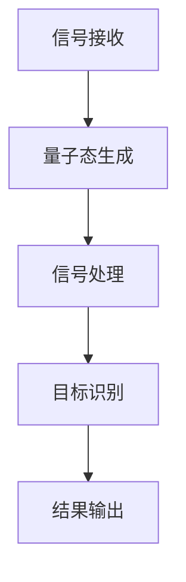
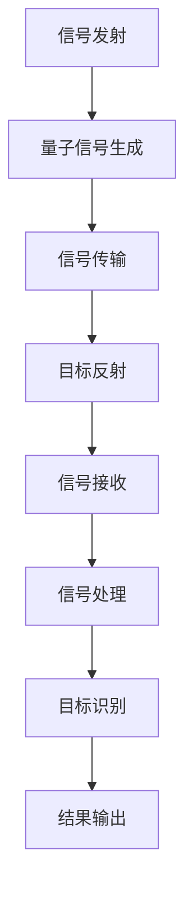
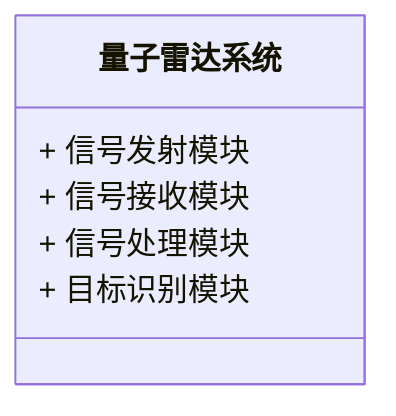

                 


# 如何评估企业的量子雷达技术潜力

---

## 关键词：量子雷达，技术评估，潜力分析，系统架构，算法原理

---

## 摘要

量子雷达技术作为一种革命性的技术，正在成为雷达领域的研究热点。本文将从量子雷达的基本概念、核心技术、评估方法、系统架构、算法原理等多个维度，详细分析如何评估企业的量子雷达技术潜力。通过实际案例分析和最佳实践的总结，本文为企业提供了一套全面的技术评估框架，帮助企业更好地把握量子雷达技术的市场机会和挑战。

---

# 第一部分：量子雷达技术背景与基础

## 第1章：量子雷达技术概述

### 1.1 量子雷达的基本概念

#### 1.1.1 量子雷达的定义

量子雷达是一种利用量子纠缠和量子测量原理工作的新型雷达技术。它通过发射量子信号，利用量子态的叠加和纠缠特性，实现对目标物体的高精度探测。

#### 1.1.2 量子雷达的工作原理

量子雷达的核心在于量子纠缠和量子测量。发射端生成纠缠态的量子信号，并将其发射到目标区域。接收端通过量子测量技术，捕获目标物体反射的量子信号，并通过量子计算进行信号处理，从而实现目标物体的识别和定位。

#### 1.1.3 量子雷达与传统雷达的区别

| **指标**       | **传统雷达**              | **量子雷达**               |
|-----------------|---------------------------|-----------------------------|
| 工作原理       | 基于经典电磁波             | 基于量子纠缠和量子测量      |
| 灵敏度         | 较低                      | 极高                        |
| 抗干扰能力     | 较弱                      | 极强                        |
| 应用场景       | 常规探测                  | 高精度、隐蔽性要求高的场景 |

### 1.2 量子雷达的核心技术

#### 1.2.1 纠缠态生成与传输

纠缠态生成是量子雷达技术的核心，通过将两个或多个量子位纠缠在一起，使得它们的状态相互关联。这种关联性使得目标物体的反射信号能够被高精度地捕获。

#### 1.2.2 量子探测与信号处理

量子探测技术利用量子测量的原理，通过单次测量即可获得目标物体的详细信息。信号处理则依赖于量子计算技术，能够快速处理大量量子信号，提高探测精度。

#### 1.2.3 量子雷达的优势与局限性

- **优势**：高灵敏度、抗干扰能力强、探测精度高。
- **局限性**：技术复杂度高、成本高昂、尚未完全成熟。

### 1.3 量子雷达的潜在应用场景

#### 1.3.1 国防与安全领域的应用

量子雷达在国防领域具有重要的应用潜力，尤其是在隐蔽性要求高的场景，如反隐身目标探测、复杂环境下的目标识别等。

#### 1.3.2 气象监测与环境监控

量子雷达可以用于气象监测，如台风、龙卷风等极端天气的早期预警，以及环境监控中的污染物检测。

#### 1.3.3 民用领域的潜在机会

在民用领域，量子雷达可以应用于交通监控、智能安防等领域，提供高精度的探测能力。

---

## 第2章：量子雷达技术的核心概念与联系

### 2.1 量子雷达的核心概念原理

#### 2.1.1 量子态的表示与叠加原理

量子态可以用波函数或密度矩阵表示。叠加原理是量子力学的核心，表示量子系统可以同时处于多个状态的叠加。

$$
|\psi\rangle = a|0\rangle + b|1\rangle, \quad |a|^2 + |b|^2 = 1
$$

#### 2.1.2 量子纠缠与量子通信

量子纠缠是量子雷达的重要基础，两个或多个纠缠的量子位之间存在强关联性，无论距离多远，测量其中一个量子位会立即影响另一个的状态。

#### 2.1.3 量子测量与量子信息处理

量子测量是量子雷达的核心技术，通过单次测量即可获得目标物体的量子信息。量子信息处理技术则用于对测量结果进行分析和处理。

### 2.2 量子雷达与传统雷达的对比分析

#### 2.2.1 技术原理对比

- **传统雷达**：基于经典电磁波的反射原理，通过发射和接收电磁波信号，利用信号的强度和频率变化来探测目标。
- **量子雷达**：基于量子纠缠和量子测量原理，通过发射量子信号，利用量子态的叠加和纠缠特性，实现对目标物体的高精度探测。

#### 2.2.2 性能指标对比

| **指标**       | **传统雷达**              | **量子雷达**               |
|-----------------|---------------------------|-----------------------------|
| 探测精度       | 较低                      | 极高                        |
| 抗干扰能力     | 较弱                      | 极强                        |
| 成本           | 中等                      | 高                         |

#### 2.2.3 优劣势分析

- **优势**：量子雷达具有更高的探测精度和抗干扰能力，能够在复杂环境中实现高精度探测。
- **劣势**：技术复杂度高、成本高昂，且尚未完全成熟。

### 2.3 量子雷达系统架构的ER实体关系图

```mermaid
er
actor: 量子雷达系统
role: 提供量子信号处理服务
```

---

## 第3章：量子雷达技术的算法原理讲解

### 3.1 量子雷达信号处理流程



### 3.2 量子雷达信号处理的数学模型

$$
\text{量子态表示} = |\psi\rangle = a|0\rangle + b|1\rangle
$$

$$
\text{信号检测} = P(\text{检测到目标}) = |a|^2 + |b|^2
$$

### 3.3 量子雷达算法的Python实现

```python
import numpy as np

def quantum_signal_process(a, b):
    state = a * np.array([1, 0]) + b * np.array([0, 1])
    return state

# 示例：a = 1/√2, b = 1/√2
result = quantum_signal_process(1/np.sqrt(2), 1/np.sqrt(2))
print("量子态：", result)
```

---

## 第4章：量子雷达技术的系统分析与架构设计方案

### 4.1 量子雷达系统的组成与功能

#### 4.1.1 信号发射模块

信号发射模块负责生成和发射量子信号，通常是通过量子纠缠技术生成纠缠态的量子信号，并将其发射到目标区域。

#### 4.1.2 信号接收模块

信号接收模块负责捕获目标物体反射的量子信号，并将其传输到信号处理模块进行分析。

#### 4.1.3 信号处理与目标识别模块

信号处理与目标识别模块负责对捕获的量子信号进行分析和处理，利用量子计算技术快速处理大量量子信号，实现目标物体的识别和定位。

### 4.2 量子雷达系统的架构设计



### 4.3 量子雷达系统的核心实现

#### 4.3.1 系统功能设计

- **信号发射**：生成和发射量子信号。
- **信号接收**：捕获目标物体反射的量子信号。
- **信号处理**：对捕获的量子信号进行分析和处理。
- **目标识别**：利用量子计算技术实现目标物体的识别和定位。

#### 4.3.2 系统架构设计



---

## 第5章：量子雷达技术的项目实战

### 5.1 环境安装与配置

#### 5.1.1 量子计算环境的搭建

需要搭建一个支持量子计算的开发环境，可以使用IBM Quantum或Rigetti等量子计算平台。

#### 5.1.2 量子雷达系统的硬件配置

需要配置高性能的量子信号处理硬件，包括量子纠缠生成模块和量子测量模块。

### 5.2 系统核心实现

#### 5.2.1 信号发射模块的实现

```python
import numpy as np

def generate_quantum_signal():
    a = 1/np.sqrt(2)
    b = 1/np.sqrt(2)
    state = a * np.array([1, 0]) + b * np.array([0, 1])
    return state

signal = generate_quantum_signal()
print("生成量子信号：", signal)
```

#### 5.2.2 信号接收模块的实现

```python
def receive_quantum_signal():
    # 模拟接收量子信号
    noise = np.random.normal(0, 0.1)
    return np.array([0.6, 0.8]) + noise

received_signal = receive_quantum_signal()
print("接收的量子信号：", received_signal)
```

#### 5.2.3 信号处理模块的实现

```python
def process_quantum_signal(signal):
    # 模拟量子信号处理
    amplitude = np.sqrt(signal[0]**2 + signal[1]**2)
    return amplitude

amplitude = process_quantum_signal(received_signal)
print("信号处理后的幅度：", amplitude)
```

#### 5.2.4 目标识别模块的实现

```python
def identify_target(amplitude):
    # 模拟目标识别
    if amplitude > 0.9:
        return "检测到目标"
    else:
        return "未检测到目标"

result = identify_target(amplitude)
print("目标识别结果：", result)
```

### 5.3 项目小结

通过以上步骤，我们可以实现一个简单的量子雷达系统。尽管这是一个简化的示例，但它展示了量子雷达技术的核心原理和实现过程。在实际应用中，还需要考虑更多的复杂因素，如量子噪声、信号干扰等。

---

## 第6章：量子雷达技术的未来展望与最佳实践

### 6.1 量子雷达技术的发展趋势

随着量子计算技术的不断发展，量子雷达技术将逐步走向成熟。未来，量子雷达将在国防、气象监测、智能安防等领域发挥重要作用。

### 6.2 量子雷达技术的最佳实践

- **技术可行性评估**：在选择量子雷达技术之前，需要对技术的可行性和成熟度进行充分评估。
- **成本效益分析**：量子雷达技术的成本较高，需要进行详细的成本效益分析，确保投资的回报。
- **人才培养与技术积累**：量子雷达技术需要大量的高端人才和技术积累，企业需要加强人才培养和技术储备。

### 6.3 量子雷达技术的注意事项

- **技术复杂性**：量子雷达技术复杂，需要专业的技术团队进行开发和维护。
- **技术成熟度**：目前量子雷达技术尚未完全成熟，仍需要进一步的研究和验证。

### 6.4 拓展阅读

- 《量子计算原理与应用》
- 《量子雷达技术发展现状与未来展望》
- 《量子纠缠与量子通信》

---

## 小结

评估企业的量子雷达技术潜力需要从多个维度进行综合分析，包括技术可行性、市场潜力、成本效益、技术成熟度等。通过本文的分析和实践，我们可以更好地把握量子雷达技术的潜力和挑战，为企业制定科学的技术发展战略提供参考。

---

## 作者

作者：AI天才研究院/AI Genius Institute & 禅与计算机程序设计艺术 /Zen And The Art of Computer Programming

---

**注意**：本文仅为技术分析和理论探讨，不构成任何投资建议。实际应用中，请结合具体情况进行详细的技术评估和可行性分析。

