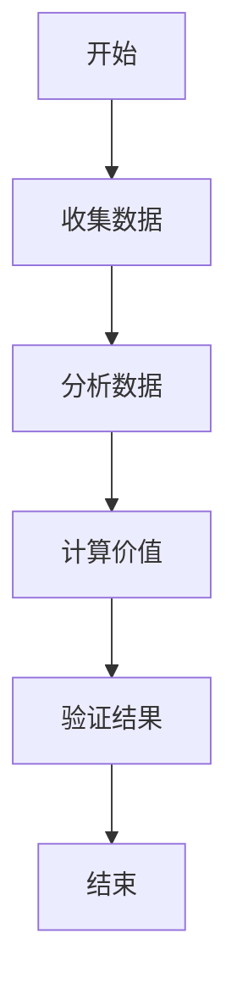
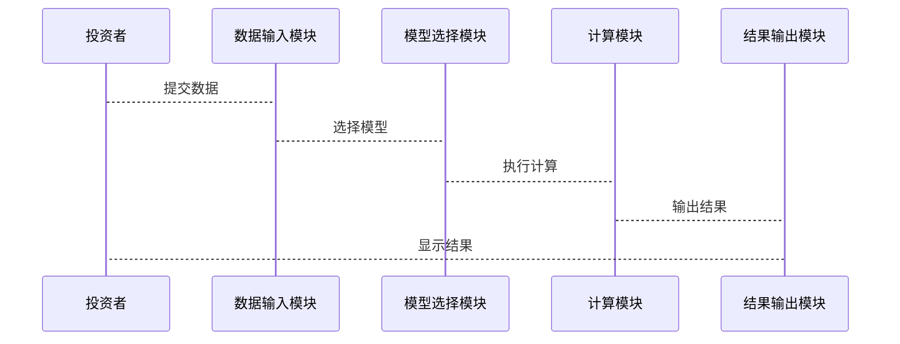

                 


# 如何评估初创企业的价值

## 关键词：初创企业，价值评估，DCF模型，创业投资，企业估值

## 摘要：评估初创企业的价值是一个复杂而关键的过程，涉及多方面的因素。本文将从背景介绍、核心概念、算法原理、系统分析、项目实战和最佳实践等方面，详细探讨如何科学、系统地评估初创企业的价值。

---

## 第一部分：背景介绍

### 第1章：评估初创企业价值的核心概念

#### 1.1 问题背景

- **1.1.1 初创企业价值评估的重要性**  
  初创企业的价值评估是投资者、创业者和企业管理者关注的核心问题。准确评估企业的价值有助于做出明智的投资决策，优化资源配置，并为企业的未来发展提供方向。

- **1.1.2 传统企业估值方法的局限性**  
  传统的企业估值方法（如市盈率、市净率等）在评估初创企业时往往不够准确，因为初创企业通常具有高成长性、高风险性和轻资产等特点，传统方法难以捕捉这些特征。

- **1.1.3 初创企业的独特挑战**  
  初创企业通常处于早期阶段，数据有限，市场不确定性大，且缺乏稳定的收入来源。这些因素使得初创企业的价值评估更具挑战性。

#### 1.2 问题描述

- **1.2.1 初创企业的定义与特点**  
  初创企业是指在成立初期的企业，通常具有创新性、高成长性和较小的规模。它们可能处于种子阶段、发展期或接近成熟期。

- **1.2.2 价值评估的复杂性**  
  初创企业的价值评估涉及多个不确定性因素，如市场需求、技术可行性、团队能力和融资情况等。这些因素使得评估过程复杂且具有挑战性。

- **1.2.3 初创企业与传统企业的区别**  
  初创企业通常具有更强的创新性和灵活性，但同时也面临更高的风险。传统企业的估值方法在初创企业中往往不适用。

#### 1.3 问题解决

- **1.3.1 初创企业价值评估的目标**  
  初创企业价值评估的目标是通过分析企业的财务状况、市场潜力、团队能力和商业模式，确定其在当前市场条件下的合理价值。

- **1.3.2 初创企业价值评估的方法**  
  常见的评估方法包括DCF模型、创业投资模型、相对估值法和情景分析法等。每种方法都有其优缺点，适用于不同的情况。

- **1.3.3 初创企业价值评估的步骤**  
  价值评估通常包括数据收集、模型选择、假设设定、计算和验证等步骤。整个过程需要细致分析和多次迭代。

#### 1.4 边界与外延

- **1.4.1 初创企业价值评估的适用范围**  
  初创企业价值评估适用于投资者、创业者、风险投资机构和企业内部管理者。它帮助各方做出更明智的决策。

- **1.4.2 初创企业价值评估的限制条件**  
  初创企业价值评估依赖于假设和模型，其结果可能存在较大误差。此外，数据的不完整性和市场的不确定性也会对评估结果产生影响。

- **1.4.3 初创企业价值评估的未来趋势**  
  随着人工智能和大数据技术的发展，未来的价值评估将更加依赖于动态数据和实时分析，评估方法也将更加多样化和精确化。

#### 1.5 概念结构与核心要素组成

- **1.5.1 初创企业价值评估的核心要素**  
  初创企业价值评估的核心要素包括财务状况、市场潜力、团队能力、商业模式和技术壁垒。这些因素共同决定了企业的价值。

- **1.5.2 初创企业价值评估的逻辑框架**  
  初创企业价值评估的逻辑框架通常包括以下几个步骤：数据收集、假设设定、模型选择、计算和验证。

- **1.5.3 初创企业价值评估的系统模型**  
  初创企业价值评估的系统模型将企业视为一个复杂的系统，考虑内部和外部的各种因素，通过系统分析来确定企业的整体价值。

---

## 第二部分：核心概念与联系

### 第2章：评估初创企业价值的核心概念

#### 2.1 核心概念原理

- **2.1.1 初创企业的财务状况分析**  
  初创企业的财务状况分析包括收入、支出、现金流和资产负债表的分析。财务健康状况是评估企业价值的重要基础。

- **2.1.2 初创企业的市场潜力分析**  
  市场潜力分析包括市场规模、增长率、竞争格局和目标客户分析。市场潜力是评估企业未来增长的关键因素。

- **2.1.3 初创企业的团队能力分析**  
  团队能力分析包括管理团队的经验、能力和稳定性。一个强大的团队是企业成功的重要保障。

#### 2.2 概念属性特征对比表格

| 初创企业特征 | 传统企业特征 |
|--------------|--------------|
| 高风险       | 较低风险     |
| 高成长性     | 增速较慢     |
| 轻资产       | 重资产       |
| 创新驱动     | 传统模式     |

#### 2.3 ER实体关系图架构

```mermaid
erd
    entity 初创企业 {
        初创企业ID
        名称
        成立时间
        所属行业
    }
    entity 投资者 {
        投资者ID
        名称
        投资金额
    }
    entity 财务数据 {
        财务数据ID
        收入
        利润
        现金流
    }
    初创企业 --> 投资者 : 获得投资
    初创企业 --> 财务数据 : 包含
```

---

## 第三部分：算法原理讲解

### 第3章：评估初创企业价值的算法原理

#### 3.1 算法原理

- **3.1.1 初创企业价值评估的数学模型**  
  常用的数学模型包括贴现现金流模型（DCF）、创业投资模型和相对估值模型。DCF模型通过预测未来现金流并将其贴现来确定企业价值。

- **3.1.2 初创企业价值评估的公式推导**  
  DCF模型的公式为：  
  $$ 企业价值 = \sum_{t=1}^{n} \frac{\text{现金流}_t}{(1 + r)^t} + \frac{终值}{(1 + r)^n} $$  
  其中，r是折现率，n是预测期。

- **3.1.3 初创企业价值评估的案例分析**  
  例如，假设某初创企业未来5年的现金流分别为100万、150万、200万、250万和300万，折现率为10%。计算企业价值如下：

  $$ 企业价值 = \frac{100}{1.1} + \frac{150}{1.1^2} + \frac{200}{1.1^3} + \frac{250}{1.1^4} + \frac{300}{1.1^5} $$

#### 3.2 mermaid流程图



#### 3.3 Python代码示例

```python
def discounted_cash_flow(cash_flows, discount_rate):
    value = 0
    for t, cash_flow in enumerate(cash_flows):
        value += cash_flow / (1 + discount_rate) ** t
    return value

cash_flows = [100, 150, 200, 250, 300]
discount_rate = 0.1
enterprise_value = discounted_cash_flow(cash_flows, discount_rate)
print(f"企业价值：{enterprise_value}")
```

#### 3.4 数学公式与详细讲解

- **贴现率计算**  
  贴现率通常基于企业的风险等级和市场利率。对于初创企业，由于风险较高，贴现率往往在10%到20%之间。

- **终值计算**  
  终值通常基于永续增长模型，假设企业未来现金流以固定增长率增长。

---

## 第四部分：系统分析与架构设计方案

### 第4章：评估初创企业价值的系统分析与架构设计

#### 4.1 问题场景介绍

- **系统问题场景**  
  初创企业价值评估系统需要处理大量不确定性和复杂性，涉及多个数据源和模型。

#### 4.2 项目介绍

- **项目目标**  
  开发一个高效的初创企业价值评估系统，帮助投资者和企业管理者做出明智的决策。

- **系统功能设计**  
  系统功能包括数据输入、模型选择、计算和结果输出。系统架构采用模块化设计，便于扩展和维护。

#### 4.3 系统架构设计


#### 4.4 系统交互设计



---

## 第五部分：项目实战

### 第5章：评估初创企业价值的项目实战

#### 5.1 环境安装

- **工具与库安装**  
  需要安装Python、Pandas、NumPy和Matplotlib等工具。

#### 5.2 核心代码实现

```python
import numpy as np
import pandas as pd
import matplotlib.pyplot as plt

def calculate_enterprise_value(cash_flows, discount_rate):
    value = 0
    for t, cf in enumerate(cash_flows):
        value += cf / (1 + discount_rate) ** t
    return value

# 示例数据
cash_flows = np.array([100, 150, 200, 250, 300])
discount_rate = 0.1

enterprise_value = calculate_enterprise_value(cash_flows, discount_rate)
print(f"企业价值：{enterprise_value}")

# 可视化现金流贴现过程
plt.figure(figsize=(10, 6))
plt.plot(range(len(cash_flows)), cash_flows / (1 + discount_rate) ** range(len(cash_flows)), 'b-')
plt.xlabel('年份')
plt.ylabel('贴现值')
plt.title('现金流贴现过程')
plt.grid(True)
plt.show()
```

#### 5.3 案例分析

- **案例分析**  
  假设一家初创企业的未来现金流为100万、150万、200万、250万和300万，折现率为10%。根据DCF模型，计算其企业价值。

#### 5.4 项目总结

- **项目总结**  
  通过项目实战，我们掌握了如何使用Python进行现金流贴现计算，并学会了如何通过可视化工具展示计算过程。

---

## 第六部分：最佳实践

### 第6章：评估初创企业价值的最佳实践

#### 6.1 小结

- **核心内容回顾**  
  初创企业价值评估是一个复杂但关键的过程，需要综合考虑财务状况、市场潜力、团队能力和商业模式等因素。

#### 6.2 注意事项

- **数据准确性**  
  数据的准确性和完整性对评估结果至关重要。确保数据来源可靠，分析方法科学。

- **模型选择**  
  根据企业的具体情况选择合适的评估模型，避免盲目使用单一模型。

- **风险控制**  
  初创企业具有高风险性，评估时应充分考虑各种可能的风险因素，并制定相应的风险管理策略。

#### 6.3 拓展阅读

- **推荐书籍**  
  1. 《创业者的圣经》
  2. 《企业估值的艺术》

---

## 作者

作者：AI天才研究院/AI Genius Institute & 禅与计算机程序设计艺术 /Zen And The Art of Computer Programming

---

通过以上结构和内容的组织，这篇文章详细探讨了如何评估初创企业的价值，从背景介绍到系统设计，再到项目实战，层层深入，为读者提供了全面的指导和实用的工具。

