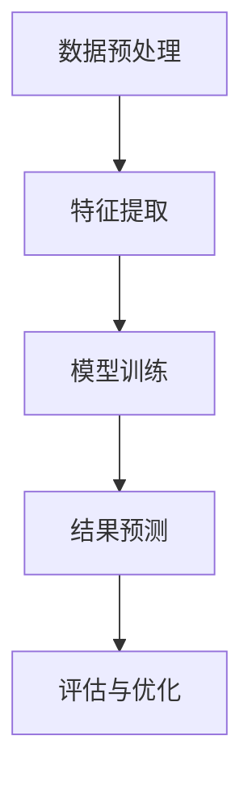
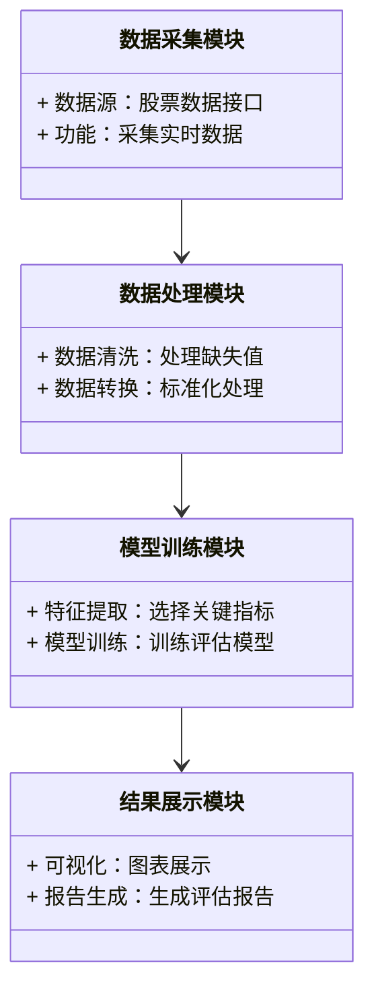
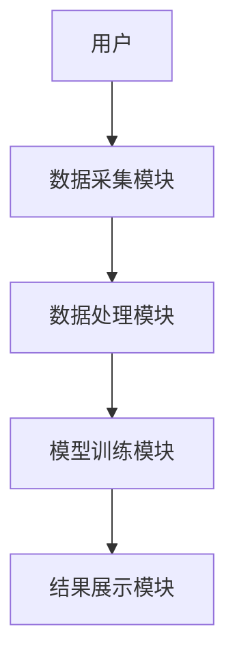
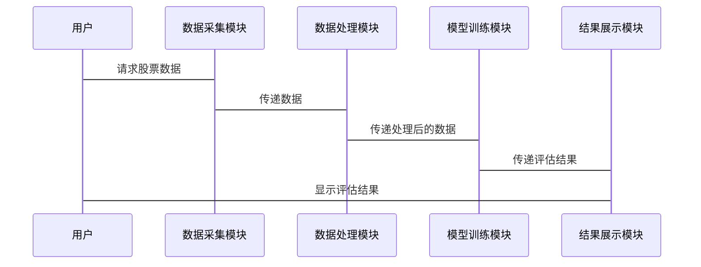

                 


# 如何评估特价股票的质量和持续性

> 关键词：特价股票、股票质量、股票持续性、股票评估、股票投资

> 摘要：本文将详细介绍如何评估特价股票的质量和持续性。首先，我们从特价股票的定义和特点入手，分析其在市场中的定位和投资价值。接着，我们将探讨影响股票质量的核心因素，包括财务指标、市场表现和公司基本面等。通过建立数学模型和算法，我们提供了一种科学的股票质量评估方法。最后，我们结合实际案例，展示了如何将这些方法应用于项目实战，并总结了最佳实践和注意事项。本文旨在帮助投资者更好地理解和评估特价股票的质量和持续性。

---

# 第1章: 特价股票的定义与特点

## 1.1 特价股票的定义与分类

### 1.1.1 特价股票的定义
特价股票是指价格相对较低的股票，通常具有较高的增长潜力。这类股票通常来自中小型企业或新兴行业，价格较低，但波动性较大。

### 1.1.2 特价股票的分类
特价股票可以分为以下几类：
- 市场低估型：市场价格低于内在价值的股票。
- 增长型：公司具有高增长潜力，但当前股价被低估。
- 周期型：受行业周期影响较大的股票。

### 1.1.3 特价股票与普通股票的区别
| 特性 | 特价股票 | 普通股票 |
|------|----------|----------|
| 价格 | 较低     | 较高     |
| 风险 | 较高     | 较低     |
| 潜力 | 较高     | 较稳定   |

---

## 1.2 特价股票的市场特点

### 1.2.1 特价股票的市场定位
特价股票通常出现在中小盘股中，市场流动性较低，价格波动较大。

### 1.2.2 特价股票的交易特点
- 交易量小，价格敏感。
- 易受市场情绪影响。
- 适合长期投资。

### 1.2.3 特价股票的投资机会与风险
- 投资机会：高增长潜力，价格反弹空间大。
- 投资风险：流动性差，市场波动大。

---

## 1.3 特价股票评估的重要性

### 1.3.1 为什么需要评估特价股票的质量
- 把握投资机会，避免亏损。
- 优化投资组合，分散风险。

### 1.3.2 特价股票评估的常见误区
- 仅看价格，忽视基本面。
- 忽略行业周期和市场环境。

### 1.3.3 评估特价股票的必要性与意义
- 帮助投资者做出科学决策。
- 提高投资效率，降低风险。

---

# 第2章: 特价股票质量评估的核心概念

## 2.1 股票质量的核心指标

### 2.1.1 财务指标分析
- **市盈率（P/E）**：股价与每股收益的比值，反映市场对公司价值的评估。
- **市净率（P/B）**：股价与每股净资产的比值，衡量股价是否合理。
- **股息率**：每年派发的股息与股价的比率，反映投资回报率。

### 2.1.2 市盈率与市净率
- 市盈率低，可能意味着股票被低估。
- 市净率低，可能意味着公司资产被低估。

### 2.1.3 股息率与股息支付率
- 股息率高，可能意味着较高的投资回报。
- 股息支付率高，可能意味着公司盈利状况良好。

---

## 2.2 特价股票的持续性评估

### 2.2.1 公司基本面分析
- **收入与利润**：公司收入增长稳定，利润持续增长。
- **资产负债表**：资产健康，负债可控。
- **现金流**：现金流充裕，公司运营稳定。

### 2.2.2 行业环境与竞争分析
- 行业前景：行业处于上升期，公司具有竞争优势。
- 市场份额：公司市场份额稳定或增长。

### 2.2.3 管理团队与公司治理
- 管理团队能力强，公司治理透明。
- 公司战略清晰，发展目标明确。

---

## 2.3 特价股票质量评估的边界与外延

### 2.3.1 评估范围的界定
- 仅评估财务指标，还是包括市场、行业等多方面因素。

### 2.3.2 评估方法的选择
- 定量分析 vs 定性分析。
- 单指标分析 vs 综合指标分析。

### 2.3.3 评估结果的应用场景
- 投资决策：是否买入、卖出或持有。
- 风险控制：调整投资组合。

---

# 第3章: 特价股票质量评估的数学模型与算法

## 3.1 特价股票评估的核心算法

### 3.1.1 线性回归模型
- 通过历史数据预测股票价格。
- 公式：$$ y = \beta_0 + \beta_1 x_1 + \beta_2 x_2 + \dots + \beta_n x_n $$

### 3.1.2 支持向量机模型
- 用于分类问题，判断股票质量。
- 公式：$$ y = \text{sign}(w \cdot x + b) $$

### 3.1.3 随机森林模型
- 用于特征重要性分析和预测。
- 公式：$$ y = \sum_{i=1}^{n} \text{Tree}(x_i) $$

---

## 3.2 算法原理与流程图

### 3.2.1 算法原理


---

## 3.3 算法实现与代码示例

### 3.3.1 数据预处理
```python
import pandas as pd
data = pd.read_csv('stock_data.csv')
data = data.dropna()
```

### 3.3.2 特征提取
```python
from sklearn.preprocessing import StandardScaler
scaler = StandardScaler()
X_scaled = scaler.fit_transform(X)
```

### 3.3.3 模型训练与预测
```python
from sklearn.linear_model import LinearRegression
model = LinearRegression()
model.fit(X_train, y_train)
y_pred = model.predict(X_test)
```

### 3.3.4 代码实现
```python
import numpy as np
import pandas as pd
from sklearn.model_selection import train_test_split
from sklearn.linear_model import LinearRegression
from sklearn.metrics import mean_squared_error

# 数据加载与预处理
data = pd.read_csv('stock_data.csv')
X = data[['市盈率', '市净率', '股息率']]
y = data['股票质量评分']
X_train, X_test, y_train, y_test = train_test_split(X, y, test_size=0.2, random_state=42)

# 模型训练
model = LinearRegression()
model.fit(X_train, y_train)

# 模型预测
y_pred = model.predict(X_test)

# 模型评估
 mse = mean_squared_error(y_test, y_pred)
 print(f"均方误差：{mse}")
```

---

## 3.4 数学模型与公式

### 3.4.1 线性回归模型公式
$$ y = \beta_0 + \beta_1 x_1 + \beta_2 x_2 + \dots + \beta_n x_n $$

### 3.4.2 支持向量机模型公式
$$ y = \text{sign}(w \cdot x + b) $$

### 3.4.3 随机森林模型公式
$$ y = \sum_{i=1}^{n} \text{Tree}(x_i) $$

---

# 第4章: 特价股票评估系统的架构设计

## 4.1 项目介绍

### 4.1.1 项目背景
- 特价股票评估系统旨在帮助投资者快速、准确地评估股票质量。

### 4.1.2 项目目标
- 提供一个基于机器学习的股票评估工具。

---

## 4.2 系统功能设计

### 4.2.1 功能模块
- 数据采集模块：采集股票数据。
- 数据处理模块：清洗和预处理数据。
- 模型训练模块：训练股票评估模型。
- 结果展示模块：可视化评估结果。

### 4.2.2 领域模型（类图）


---

## 4.3 系统架构设计

### 4.3.1 系统架构图


### 4.3.2 系统接口设计
- 数据接口：提供API接口，供其他系统调用。
- 模型接口：提供预测接口，供其他系统使用。

---

## 4.4 系统交互设计

### 4.4.1 交互流程


---

# 第5章: 项目实战与案例分析

## 5.1 环境安装与配置

### 5.1.1 安装Python
- 安装Python 3.8或更高版本。

### 5.1.2 安装依赖库
- 安装pandas、scikit-learn、matplotlib等库。

```bash
pip install pandas scikit-learn matplotlib
```

---

## 5.2 系统核心实现

### 5.2.1 数据预处理
```python
import pandas as pd
data = pd.read_csv('stock_data.csv')
data = data.dropna()
```

### 5.2.2 特征提取
```python
from sklearn.preprocessing import StandardScaler
scaler = StandardScaler()
X_scaled = scaler.fit_transform(X)
```

### 5.2.3 模型训练
```python
from sklearn.linear_model import LinearRegression
model = LinearRegression()
model.fit(X_train, y_train)
```

### 5.2.4 模型预测
```python
y_pred = model.predict(X_test)
```

---

## 5.3 实际案例分析

### 5.3.1 数据来源
- 数据来源：某股票交易平台提供的历史数据。

### 5.3.2 案例分析
- 数据分析：选择某只特价股票，分析其市盈率、市净率等指标。
- 模型预测：使用训练好的模型预测该股票的质量评分。

---

## 5.4 项目总结

### 5.4.1 项目成果
- 成功构建了股票评估系统。
- 提高了股票评估的效率和准确性。

### 5.4.2 项目经验
- 数据质量对模型性能影响重大。
- 模型选择需要结合实际应用场景。

---

# 第6章: 最佳实践与注意事项

## 6.1 最佳实践

### 6.1.1 数据来源的选择
- 数据来源要可靠，数据质量要高。

### 6.1.2 模型的选择
- 根据具体场景选择合适的模型。

### 6.1.3 模型的优化
- 定期更新模型，保持其准确性。

---

## 6.2 注意事项

### 6.2.1 风险提示
- 特价股票波动较大，投资需谨慎。

### 6.2.2 模型的局限性
- 模型无法预测市场情绪的变化。
- 数据偏差可能导致评估结果不准确。

---

## 6.3 拓展阅读

### 6.3.1 推荐书籍
- 《股票投资的智慧》
- 《算法交易：数学模型与实践》

### 6.3.2 推荐网站
- 某著名股票交易平台的博客和分析报告。

---

# 作者：AI天才研究院/AI Genius Institute & 禅与计算机程序设计艺术 /Zen And The Art of Computer Programming

---

本文通过详细的分析和实际案例，全面讲解了如何评估特价股票的质量和持续性。从基础概念到数学模型，从系统设计到项目实战，再到最佳实践，为投资者提供了科学、系统的指导。希望本文能帮助读者更好地理解和应用股票评估的方法，做出更明智的投资决策。

