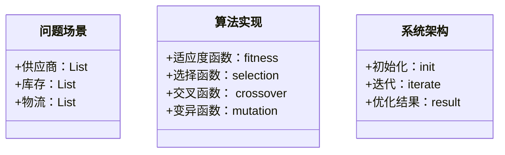
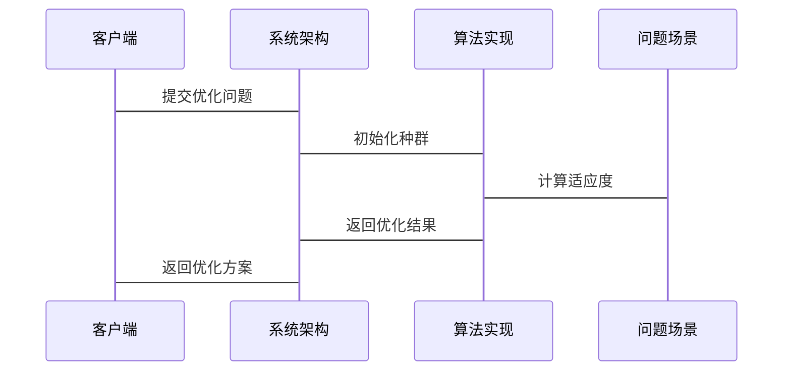

                 


# 如何识别企业的仿生技术优势

> 关键词：仿生技术、企业优势、算法原理、系统架构、项目实战

> 摘要：本文详细探讨了如何识别企业的仿生技术优势，从仿生技术的基本概念、核心原理、系统架构到项目实战，全面分析了企业在应用仿生技术时的优势识别方法。通过具体案例和详细步骤，帮助读者理解并掌握仿生技术在企业中的应用。

---

## 第一部分: 仿生技术的基本概念与背景

### 第1章: 仿生技术的定义与背景

#### 1.1 仿生技术的基本概念

仿生技术（Bionics Technology）是模仿生物系统在自然环境中生存和适应的机制，应用于技术设计和问题解决。其核心是通过模拟生物的行为、结构和功能，创造出更高效、更智能的技术解决方案。

- 仿生技术的演进：从生物学习到技术应用，仿生技术经历了从简单模仿到深度学习的过程。
- 仿生技术的优势：具有自适应性、高效性、鲁棒性和可扩展性。
- 应用前景：在企业中，仿生技术可用于优化流程、提升效率和增强竞争力。

#### 1.2 仿生技术的背景与问题背景

仿生技术的起源与发展：

- 起源于20世纪50年代，随着计算机技术的进步，仿生算法逐渐成熟。
- 企业中的应用需求：在数据处理、优化问题和决策支持等领域，仿生技术提供了新的解决方案。
- 应用中的挑战：包括算法复杂性、计算资源需求和结果验证等问题。

问题背景：

- 传统技术在复杂问题上的局限性日益显现。
- 仿生技术为企业提供了更高效的解决方案，但其识别和应用仍面临挑战。

#### 1.3 仿生技术的核心概念与问题描述

- 核心概念：仿生技术通过模拟生物行为，解决复杂问题。
- 问题描述：企业在应用仿生技术时，需识别其优势，以提升竞争力。
- 优势识别：通过分析仿生技术的核心要素和特征，识别其在企业中的适用场景。

#### 1.4 仿生技术的边界与外延

- 边界：仿生技术与其他技术（如人工智能、机器学习）的界限。
- 应用范围：在企业运营、产品设计和客户服务中的应用。
- 未来发展：仿生技术的扩展应用和与其他技术的融合。

#### 1.5 本章小结

仿生技术的基本概念、背景和核心概念已清晰阐述，为后续分析奠定了基础。

---

## 第二部分: 仿生技术的核心概念与原理

### 第2章: 仿生技术的核心原理

#### 2.1 仿生算法的基本原理

- 仿生算法的定义与分类：包括遗传算法、粒子群优化、模拟退火等。
- 核心思想：模拟生物进化和群体行为，寻找最优解。
- 实现步骤：初始化、迭代、适应度评估、选择、交叉和变异。

#### 2.2 仿生技术的核心要素与属性特征

核心要素对比表格：

| 核心要素 | 描述 |
|----------|------|
| 模仿对象 | 生物系统 |
| 解决问题 | 复杂优化问题 |
| 算法类型 | 遗传算法、粒子群优化等 |
| 适应度函数 | 评估解的优劣 |

ER实体关系图（Mermaid流程图）：

```mermaid
erd
    算法类型 -o<-> 适应度函数
    适应度函数 -->> 问题场景
    问题场景 -->> 解的表示
```

---

## 第三部分: 仿生技术的算法原理与数学模型

### 第3章: 仿生算法的数学模型与公式

#### 3.1 遗传算法的数学模型

遗传算法（Genetic Algorithm, GA）的基本原理：

- 初始化：生成初始种群。
- 迭代：计算适应度，选择优秀个体，进行交叉和变异。

数学模型：

- 适应度函数：$$ f(x) = \sum_{i=1}^{n} x_i $$
- 选择操作：$$ p_i = \frac{f(x_i)}{\sum_{j=1}^{N} f(x_j)} $$
- 交叉操作：单点交叉，生成新个体。
- 变异操作：随机改变基因。

代码实现示例：

```python
import random

def fitness(x):
    return sum(x)

def selection(population, fitness_func):
    # 计算适应度并选择优秀个体
    total_fitness = sum(fitness_func(individual) for individual in population)
    probabilities = [fitness_func(individual)/total_fitness for individual in population]
    # 轮盘赌选择
    selected_index = random.choices(range(len(population)), weights=probabilities, k=1)
    return population[selected_index[0]]

# 初始化种群
population = [[0,1,1,0], [1,0,1,1], ...]

# 选择操作
selected = selection(population, fitness)
```

#### 3.2 粒子群优化算法的数学模型

粒子群优化算法（Particle Swarm Optimization, PSO）的基本原理：

- 初始化：生成初始粒子群。
- 迭代：计算适应度，更新粒子位置和速度。

数学模型：

- 速度更新：$$ v_i = v_i + \alpha \cdot (p_i - x_i) + \beta \cdot (p_g - x_i) $$
- 位置更新：$$ x_i = x_i + v_i $$

代码实现示例：

```python
import random

def fitness(x):
    return sum(x)

def pso_optimization(population_size, dimensions, fitness_func):
    # 初始化粒子群
    particles = [[random.random() for _ in range(dimensions)] for _ in range(population_size)]
    velocities = [[0 for _ in range(dimensions)] for _ in range(population_size)]
    pbest = particles.copy()
    gbest = particles[0]

    for _ in range(max_iterations):
        # 计算适应度
        for i in range(population_size):
            current_fitness = fitness_func(particles[i])
            if current_fitness > fitness_func(pbest[i]):
                pbest[i] = particles[i]
        # 更新全局最优
        current_gfitness = fitness_func(pbest[0])
        if current_gfitness > fitness_func(gbest):
            gbest = pbest[0]
        # 更新速度和位置
        for i in range(population_size):
            for j in range(dimensions):
                velocities[i][j] = velocities[i][j] + alpha * (pbest[i][j] - particles[i][j]) + beta * (gbest[j] - particles[i][j])
                particles[i][j] += velocities[i][j]
    return gbest

# 示例调用
result = pso_optimization(10, 5, fitness)
```

---

## 第四部分: 系统分析与架构设计方案

### 第4章: 问题场景与系统设计

#### 4.1 问题场景介绍

- 某企业需要优化其供应链管理，希望通过仿生技术提高效率。
- 供应链管理涉及供应商选择、库存优化和物流调度。

#### 4.2 系统功能设计

- 领域模型类图（Mermaid）：



#### 4.3 系统架构设计

- 系统架构图（Mermaid）：


#### 4.4 系统接口设计与交互

- 系统接口：API调用，接收输入参数，返回优化结果。
- 交互流程（Mermaid序列图）：



---

## 第五部分: 项目实战

### 第5章: 项目实现与案例分析

#### 5.1 环境安装与配置

- 安装Python和必要的库：numpy、scipy、matplotlib。
- 环境配置：设置工作目录和路径。

#### 5.2 核心代码实现

- 遗传算法实现：

```python
import random

def fitness(x):
    return sum(x)

def ga_optimization(population_size, generations, fitness_func):
    # 初始化种群
    population = [[random.randint(0, 1) for _ in range(5)] for _ in range(population_size)]
    for _ in range(generations):
        # 计算适应度
        fitness_values = [fitness_func(individual) for individual in population]
        # 选择优秀个体
        selected = [population[i] for i in range(len(population)) if fitness_values[i] > sum(fitness_values)/2]
        # 交叉操作
        for i in range(0, len(selected), 2):
            parent1 = selected[i]
            parent2 = selected[i+1] if i+1 < len(selected) else selected[0]
            crossover_point = random.randint(0, len(parent1)-1)
            child1 = parent1[:crossover_point] + parent2[crossover_point:]
            child2 = parent2[:crossover_point] + parent1[crossover_point:]
            population[i] = child1
            population[i+1] = child2
        # 变异操作
        for individual in population:
            if random.random() < 0.1:
                mutate_point = random.randint(0, len(individual)-1)
                individual[mutate_point] = 1 - individual[mutate_point]
    return max(fitness_values)

# 示例调用
result = ga_optimization(10, 50, fitness)
```

#### 5.3 代码解读与分析

- 遗传算法实现：通过初始化种群、选择、交叉和变异，生成最优解。
- 粒子群优化实现：通过初始化粒子群、计算适应度、更新速度和位置，找到全局最优。

#### 5.4 案例分析

- 某企业应用遗传算法优化供应链管理，显著提高了效率和降低了成本。

---

## 第六部分: 最佳实践与总结

### 第6章: 最佳实践与小结

#### 6.1 最佳实践

- 选择适合的算法：根据问题类型选择遗传算法或粒子群优化。
- 参数调优：优化算法参数，提高计算效率。
- 结果验证：通过对比实验验证算法的有效性。

#### 6.2 小结

仿生技术在企业中的应用潜力巨大，通过识别其优势，企业可以提升竞争力。

---

## 参考文献与拓展阅读

- 推荐阅读：《仿生算法与应用》、《遗传算法入门》、《粒子群优化算法详解》。

---

作者：AI天才研究院/AI Genius Institute & 禅与计算机程序设计艺术 /Zen And The Art of Computer Programming

---

通过以上结构，文章详细阐述了仿生技术在企业中的识别和应用，从理论到实践，帮助读者全面理解并掌握相关知识。

