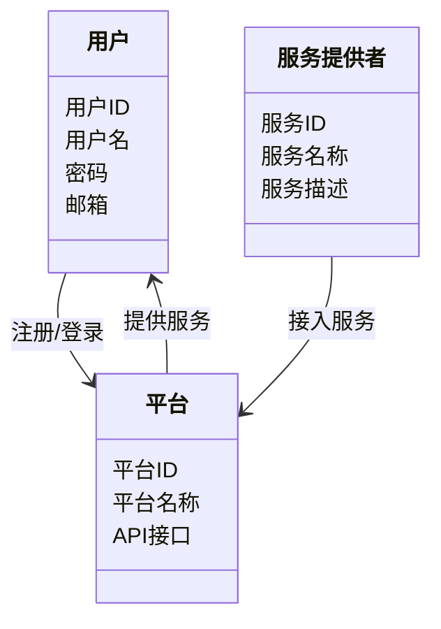
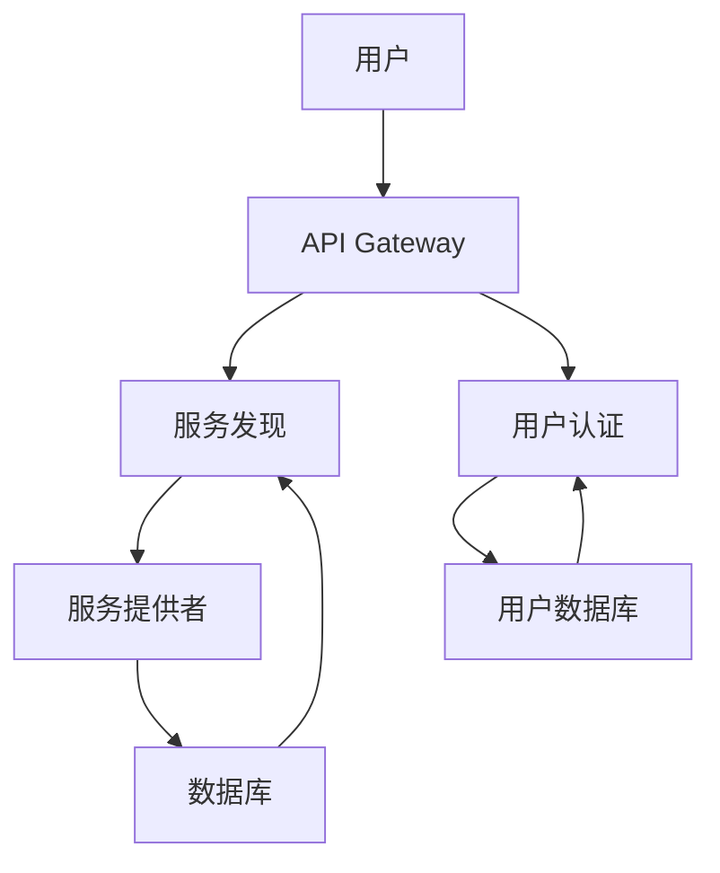
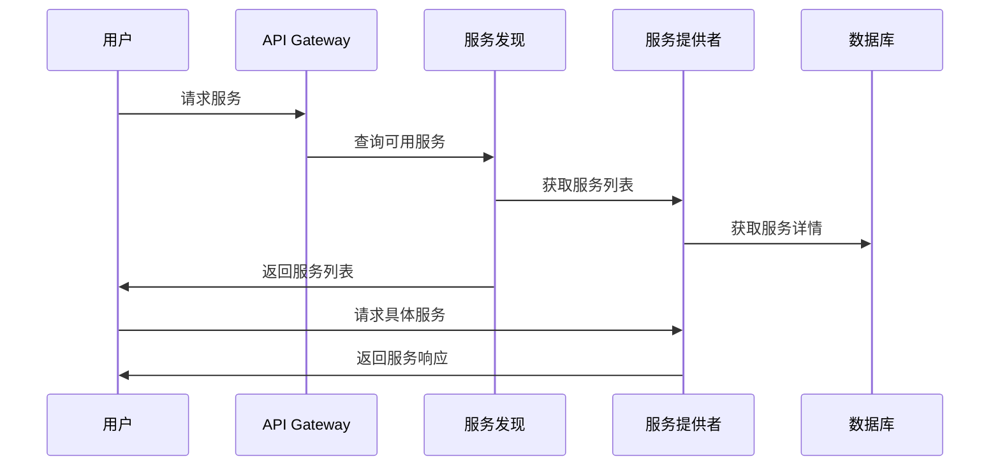

                 


# 如何识别企业的平台化转型优势

> 关键词：平台化转型, 企业优势识别, 平台架构设计, 商业模式创新, 系统分析与设计

> 摘要：本文从平台化转型的背景与概念出发，详细探讨了如何识别平台化转型的优势，分析了平台化转型的商业模式创新，并提供了平台化转型的实施路径。文章结合系统分析与架构设计，通过具体项目实战，总结了平台化转型的关键成功要素和未来发展趋势。

---

## 第一部分: 平台化转型的背景与概念

### 第1章: 平台化转型的背景与问题背景

#### 1.1 什么是平台化转型
##### 1.1.1 平台化转型的定义
平台化转型是指企业通过构建平台化的商业模式和架构，将核心资源和能力开放给生态合作伙伴，形成多方参与、协作共赢的生态系统。这一过程旨在通过平台的网络效应和生态效应，提升企业的市场竞争力和创新能力。

##### 1.1.2 平台化转型的核心概念
- **平台架构**：平台化转型的核心在于构建一个能够支持多方参与者（如供应商、客户、开发者等）协作和创新的平台架构。
- **网络效应**：平台通过吸引更多的参与者，形成正反馈效应，使得平台的价值随着参与者数量的增加而指数级增长。
- **生态系统**：平台化转型不仅仅是技术架构的改变，更是一个生态系统的设计与运营，涉及组织结构、商业模式、技术架构等多个方面。

##### 1.1.3 平台化转型的边界与外延
平台化转型的边界在于企业如何将核心资源和能力开放给外部合作伙伴，同时保持对平台的控制权。其外延则包括从单一产品或服务向平台化服务的扩展，以及从内部协作向外部生态的延伸。

#### 1.2 平台化转型的背景与问题背景
##### 1.2.1 传统企业转型的挑战
传统企业在面对数字化转型和市场竞争加剧的背景下，往往面临以下挑战：
- 业务模式单一，难以适应市场需求的变化。
- 信息技术的快速发展要求企业具备快速迭代和创新能力。
- 传统组织结构和管理模式难以支持创新业务的开展。

##### 1.2.2 平台化转型的必要性
平台化转型是企业在当前环境下实现可持续发展的必然选择，其必要性体现在：
- 提升企业的市场竞争力，通过平台的网络效应快速扩大市场份额。
- 降低企业对单一业务的依赖，通过生态合作分散风险。
- 支持企业的创新，通过平台汇聚多方资源，推动技术和服务的快速迭代。

##### 1.2.3 平台化转型的驱动因素
- **技术进步**：云计算、大数据、人工智能等技术的发展为平台化转型提供了技术支持。
- **市场需求**：用户对个性化、多样化服务的需求推动企业构建开放平台。
- **竞争压力**：行业竞争加剧，企业需要通过平台化转型提升竞争力。

#### 1.3 平台化转型的核心要素
##### 1.3.1 平台化转型的关键特征
- **开放性**：平台必须具备开放接口和标准，支持第三方开发者和合作伙伴接入。
- **模块化**：平台架构应具备模块化设计，便于功能扩展和集成。
- **可扩展性**：平台应具备良好的扩展性，能够支持业务的快速迭代和创新。

##### 1.3.2 平台化转型的核心要素组成
- **技术架构**：包括前端、后端、数据库、API接口等模块的设计。
- **商业模式**：平台的收入模式、定价策略、用户分层等。
- **组织结构**：企业内部组织的调整，包括平台运营团队、生态合作团队等。

##### 1.3.3 平台化转型的实现路径
- **战略规划**：明确平台化转型的目标和路径。
- **组织变革**：调整组织结构，建立平台运营团队。
- **技术选型**：选择适合的平台架构和技术方案。
- **生态建设**：吸引合作伙伴，构建生态系统。

---

### 第2章: 平台化转型的核心概念与联系

#### 2.1 平台化转型的核心概念原理
##### 2.1.1 平台化转型的系统性特征
平台化转型是一种系统性的变革，涉及企业从战略到执行的全方位调整。其系统性特征体现在：
- **整体性**：平台化转型不仅仅是技术的改变，还包括组织、流程、文化的变革。
- **动态性**：平台化转型是一个持续优化和创新的过程，需要根据市场变化进行调整。

##### 2.1.2 平台化转型的网络效应
网络效应是平台化转型的核心驱动力。平台的价值随着参与者数量的增加而增长，这种正反馈效应使得平台能够快速扩大规模。

##### 2.1.3 平台化转型的生态系统构建
平台化转型的目标是构建一个多方参与、协作共赢的生态系统。这个生态系统包括：
- **核心平台**：提供基础功能和服务。
- **合作伙伴**：包括开发者、供应商、服务提供者等。
- **用户群体**：平台的最终用户，包括消费者和企业用户。

#### 2.2 平台化转型的核心概念属性特征对比
##### 2.2.1 平台化转型与传统企业模式的对比
| 特性                | 传统企业模式                   | 平台化转型                  |
|---------------------|-------------------------------|-----------------------------|
| 经营模式            | 以产品或服务为中心             | 以平台和生态系统为中心       |
| 参与者角色          | 单一的供应商和客户关系         | 多方参与者（供应商、开发者、用户） |
| 扩展性              | 有限，依赖内部资源             | 高，通过开放接口扩展         |
| 创新速度            | 较慢，依赖内部团队             | 较快，通过生态合作推动创新     |

##### 2.2.2 平台化转型的核心要素对比
| 要素                | 传统模式                      | 平台化转型                   |
|---------------------|------------------------------|-----------------------------|
| 技术架构            | 单一系统，封闭架构            | 开放架构，模块化设计         |
| 商业模式            | 以产品销售为主                | 平台佣金、服务费、数据变现  |
| 组织结构            | 传统部门划分，层级分明        | 平台运营团队，生态合作团队    |

##### 2.2.3 平台化转型的优劣势对比
| 特性                | 优势                          | 劣势                          |
|---------------------|-------------------------------|-------------------------------|
| 市场扩展性           | 高，通过网络效应快速扩大市场  | 初始投入大，平台构建周期长     |
| 创新能力             | 强，通过生态合作快速创新      | 生态系统建设难度大，依赖合作伙伴 |
| 竞争力               | 强，通过网络效应形成竞争优势  | 可能面临平台被替代的风险        |

#### 2.3 平台化转型的ER实体关系图
```mermaid
erd
  entity 用户 {
    key 用户ID
    属性 用户名
    属性 密码
    属性 邮箱
    关系 订购的服务
  }
  entity 服务提供者 {
    key 服务ID
    属性 服务名称
    属性 服务描述
    关系 提供的服务
  }
  entity 平台 {
    key 平台ID
    属性 平台名称
    关系 提供的接口
    关系 用户
    关系 服务提供者
  }
```

---

## 第二部分: 平台化转型的优势识别

### 第3章: 平台化转型的优势识别方法

#### 3.1 平台化转型的优势识别
##### 3.1.1 平台化转型的优势来源
平台化转型的优势来源于以下几个方面：
- **网络效应**：随着参与者数量的增加，平台价值呈指数级增长。
- **生态效应**：通过生态合作，企业能够快速获取资源和能力。
- **数据驱动**：平台通过数据收集和分析，能够提供更精准的服务。

##### 3.1.2 平台化转型的核心竞争优势
- **快速创新能力**：通过生态合作，企业能够快速推出新产品和服务。
- **成本分担**：平台通过共享资源，降低单个参与者的成本。
- **用户粘性**：平台通过提供多样化的服务，增强用户粘性。

##### 3.1.3 平台化转型的市场竞争力评估
市场竞争力评估可以从以下几个方面进行：
- **市场份额**：平台在目标市场中的占有率。
- **用户增长率**：平台用户数量的增长速度。
- **收入增长**：平台收入的增长情况。

#### 3.2 平台化转型的优势识别工具与方法
##### 3.2.1 优势识别的关键指标
- 用户活跃度
- 平台交易额
- 合作伙伴数量
- 平台功能扩展性

##### 3.2.2 平台化转型的优势识别模型
- **AARRR模型**：获取（Acquisition）、激活（Activation）、 retention（ retention）、推荐（Referral）、收入（Revenue）。
- **SWOT分析**：从优势、劣势、机会、威胁四个维度分析平台化转型的优势。

##### 3.2.3 平台化转型的优势识别流程
1. 明确目标：确定平台化转型的目标和关键成功指标。
2. 数据收集：收集用户、合作伙伴、市场等多方面的数据。
3. 分析评估：通过数据分析和评估模型识别优势。
4. 持续优化：根据评估结果进行优化调整。

---

### 第4章: 平台化转型的商业模式创新

#### 4.1 平台化转型的商业模式
##### 4.1.1 平台化转型的收入模式
- **平台佣金**：基于交易额收取佣金。
- **服务费**：向开发者或合作伙伴收取服务费。
- **数据变现**：通过数据收集和分析，提供精准营销等服务。

##### 4.1.2 平台化转型的成本结构
- **技术开发成本**：平台的开发和维护成本。
- **生态建设成本**：吸引合作伙伴的激励成本。
- **运营成本**：平台的日常运营和维护成本。

##### 4.1.3 平台化转型的价值主张
- 提供一站式解决方案，降低用户的使用门槛。
- 通过数据驱动，提供个性化服务，增强用户体验。
- 通过开放平台，吸引更多的开发者和合作伙伴，形成良性循环。

#### 4.2 平台化转型的商业模式创新
##### 4.2.1 平台化转型的创新路径
- **服务扩展**：从单一产品扩展到平台服务。
- **生态合作**：通过合作伙伴提供多样化的服务。
- **数据驱动**：利用数据优势提供差异化服务。

##### 4.2.2 平台化转型的创新案例分析
- 案例1：某企业通过平台化转型，构建了一个开放的生态系统，吸引了 thousands of合作伙伴，实现了收入的快速增长。
- 案例2：某企业通过数据驱动的精准营销，显著提升了用户留存率和转化率。

##### 4.2.3 平台化转型的创新策略
- **开放API接口**：降低合作伙伴的接入门槛。
- **提供开发者工具**：支持开发者快速构建应用。
- **激励机制**：通过激励措施吸引更多的合作伙伴。

---

### 第5章: 平台化转型的实施路径

#### 5.1 平台化转型的战略规划
##### 5.1.1 平台化转型的战略目标设定
- 明确平台化转型的核心目标，例如：构建开放平台、吸引合作伙伴、提升市场份额等。
- 设定短期和长期目标，确保目标的可行性和可衡量性。

##### 5.1.2 平台化转型的实施步骤
1. **需求分析**：明确企业的转型需求和目标。
2. **架构设计**：设计平台的技术架构和功能模块。
3. **生态建设**：吸引合作伙伴，构建生态系统。
4. **平台开发**：根据设计进行平台开发和测试。
5. **上线运营**：平台上线并进行持续优化。

##### 5.1.3 平台化转型的战略实施的关键成功要素
- **领导力**：企业高层对平台化转型的支持和推动。
- **资源整合**：充分利用企业内外部资源，形成合力。
- **风险管理**：识别和应对转型过程中可能遇到的风险。

#### 5.2 平台化转型的组织变革
##### 5.2.1 平台化转型的组织结构调整
- 建立平台运营团队，负责平台的日常运营和维护。
- 设立生态合作团队，负责合作伙伴的招募和管理。

##### 5.2.2 平台化转型的组织文化重塑
- 强调协作和创新的文化，鼓励员工积极参与平台的建设和运营。
- 建立激励机制，激发员工的创造力和积极性。

#### 5.3 平台化转型的技术选型
##### 5.3.1 平台化转型的技术架构设计
- **前端架构**：采用响应式设计，支持多终端访问。
- **后端架构**：采用微服务架构，支持功能模块的独立开发和部署。
- **数据库设计**：采用分布式数据库，支持高并发和大数据量的存储。

##### 5.3.2 平台化转型的技术实现
- **API接口设计**：提供标准化的API接口，方便合作伙伴接入。
- **安全设计**：确保平台的安全性，防止数据泄露和攻击。
- **性能优化**：通过缓存、分布式计算等技术提升平台性能。

#### 5.4 平台化转型的文化重塑
##### 5.4.1 平台化转型的文化重塑策略
- **开放文化**：鼓励员工分享知识和经验，促进内部协作。
- **创新文化**：支持员工提出创新想法，并提供资源支持。
- **客户导向文化**：以客户需求为导向，持续优化平台功能和服务。

---

## 第三部分: 系统分析与架构设计方案

### 第6章: 平台化转型的系统分析与架构设计

#### 6.1 系统分析
##### 6.1.1 问题场景介绍
- 用户需求：用户需要一个开放平台，支持多种服务的接入和使用。
- 业务需求：企业希望通过平台化转型，构建一个支持生态合作的平台。

##### 6.1.2 项目介绍
- 项目目标：构建一个开放平台，支持合作伙伴接入和用户使用。
- 项目范围：包括平台的设计、开发、测试和上线运营。

#### 6.2 系统功能设计
##### 6.2.1 领域模型设计


##### 6.2.2 系统架构设计


##### 6.2.3 系统接口设计
- **API接口**：定义平台的API接口，包括用户认证、服务接入等功能。
- **数据接口**：定义数据的存储和传输格式，确保数据的安全性和一致性。

##### 6.2.4 系统交互设计


---

## 第四部分: 项目实战

### 第7章: 平台化转型的项目实战

#### 7.1 环境安装
##### 7.1.1 开发环境安装
- 操作系统：Linux/Windows/MacOS
- 开发工具：IntelliJ IDEA/PyCharm
- 依赖管理工具：Maven/Anaconda

##### 7.1.2 服务器环境安装
- 操作系统：Linux（推荐Ubuntu）
- Web服务器：Apache/Nginx
- 数据库：MySQL/PostgreSQL

#### 7.2 系统核心实现
##### 7.2.1 平台核心代码实现
```python
# 平台核心代码实现
class Platform:
    def __init__(self):
        self.users = {}  # 用户信息
        self.service_providers = {}  # 服务提供者信息
        self.apis = {}  # API接口定义

    def register_user(self, user):
        self.users[user.username] = user
        return "注册成功"

    def add_service_provider(self, provider):
        self.service_providers[provider.service_id] = provider
        return "服务提供者接入成功"

    def call_api(self, user, api_name):
        if api_name in self.apis:
            return self.apis[api_name](user)
        else:
            return "API不存在"
```

##### 7.2.2 代码应用解读与分析
- **用户注册**：用户通过调用`register_user`方法完成注册。
- **服务提供者接入**：服务提供者通过调用`add_service_provider`方法接入平台。
- **API调用**：用户通过调用`call_api`方法使用平台提供的服务。

##### 7.2.3 代码运行结果与优化
- **运行结果**：用户成功注册，服务提供者成功接入，API调用成功。
- **优化建议**：增加错误处理机制，优化API调用的性能。

#### 7.3 案例分析与详细解读
##### 7.3.1 案例分析
- 案例1：某企业通过平台化转型，构建了一个开放的生态系统，吸引了 thousands of合作伙伴，实现了收入的快速增长。
- 案例2：某企业通过数据驱动的精准营销，显著提升了用户留存率和转化率。

##### 7.3.2 案例详细解读
- **案例分析**：通过平台化转型，企业能够快速扩展市场，降低运营成本，同时通过生态合作提升创新能力。
- **经验总结**：成功的平台化转型需要企业具备开放的思维、强大的技术能力以及高效的组织管理。

#### 7.4 项目小结
通过平台化转型的项目实战，我们可以看到，平台化转型不仅需要技术实现，更需要企业从战略、组织、文化等多个方面进行全面调整。只有这样，才能真正实现平台化转型的目标，构建一个可持续发展的生态系统。

---

## 第五部分: 总结与展望

### 第8章: 平台化转型的总结与展望

#### 8.1 总结
平台化转型是企业在当前环境下实现可持续发展的必然选择。通过平台化转型，企业能够构建一个开放、协作、创新的生态系统，实现业务的快速扩展和创新能力的提升。本文从背景与概念、优势识别、商业模式创新、实施路径等多个方面，详细探讨了平台化转型的关键要素和成功策略。

#### 8.2 未来展望
随着技术的不断进步和市场需求的变化，平台化转型将面临更多的机遇和挑战。未来的发展趋势包括：
- **智能化**：通过人工智能技术提升平台的智能化水平。
- **区块链技术**：利用区块链技术提升平台的安全性和可信度。
- **全球化**：平台化转型将从本地市场扩展到全球市场，实现跨国协作。

#### 8.3 给读者的建议
- **持续学习**：关注平台化转型的最新动态和技术发展。
- **实践应用**：将平台化转型的理念和方法应用到实际工作中，不断提升自身的竞争力。
- **交流合作**：积极参与行业交流，与同行分享经验和最佳实践。

---

## 作者：AI天才研究院/AI Genius Institute & 禅与计算机程序设计艺术/Zen And The Art of Computer Programming

