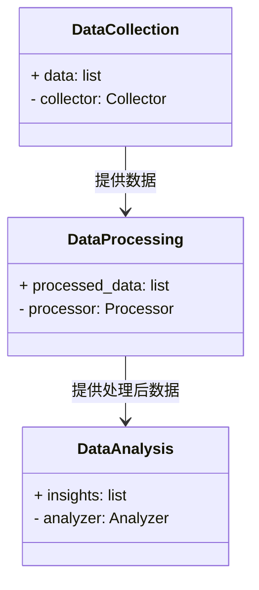
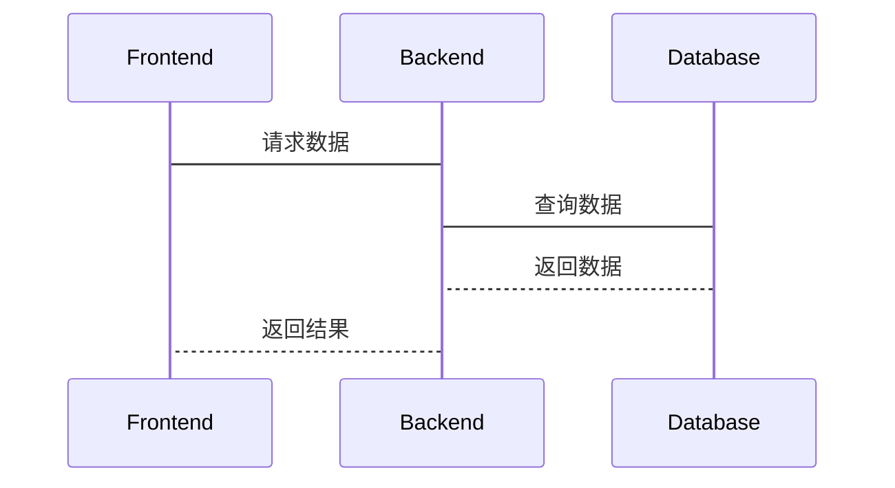

                 


# 如何识别企业的数据货币化潜力

## 目录大纲

# 第一部分：数据货币化潜力的背景与基础

## 第1章：数据货币化的概念与背景

### 1.1 数据货币化的定义与内涵
#### 1.1.1 数据货币化的定义
#### 1.1.2 数据货币化的核心内涵
#### 1.1.3 数据货币化与企业价值的关系

### 1.2 数据货币化的背景与现状
#### 1.2.1 数字经济的兴起
#### 1.2.2 数据作为生产要素的重要性
#### 1.2.3 当前企业数据利用的现状与挑战

### 1.3 数据货币化的价值与意义
#### 1.3.1 数据货币化对企业竞争力的提升作用
#### 1.3.2 数据货币化对商业模式创新的推动作用
#### 1.3.3 数据货币化的社会经济效益

## 第2章：数据货币化的核心概念与关键要素

### 2.1 数据货币化的核心概念
#### 2.1.1 数据资产化
#### 2.1.2 数据产品化
#### 2.1.3 数据服务化

### 2.2 数据货币化的关键要素
#### 2.2.1 数据质量
#### 2.2.2 数据隐私与安全
#### 2.2.3 数据分析能力
#### 2.2.4 数据应用场景

### 2.3 数据货币化的实现路径
#### 2.3.1 数据收集与整合

## 第二部分：数据货币化的技术与方法

## 第3章：数据货币化的算法原理与实现

### 3.1 数据清洗与预处理
#### 3.1.1 数据清洗的必要性
#### 3.1.2 数据清洗的步骤与方法
##### 使用Python代码示例
```python
import pandas as pd
import numpy as np

# 加载数据集
data = pd.read_csv('dataset.csv')

# 处理缺失值
data = data.dropna()

# 去除重复值
data = data.drop_duplicates()

print(data.head())
```

### 3.2 数据特征工程
#### 3.2.1 特征选择
#### 3.2.2 特征变换
##### 使用Python代码示例
```python
from sklearn.preprocessing import StandardScaler

# 标准化处理
scaler = StandardScaler()
scaled_data = scaler.fit_transform(data[['age', 'income']])

print(scaled_data)
```

### 3.3 数据建模与分析
#### 3.3.1 选择合适的算法
#### 3.3.2 模型训练
##### 使用Python代码示例
```python
from sklearn.linear_model import LinearRegression

# 训练线性回归模型
model = LinearRegression()
model.fit(X_train, y_train)

# 预测结果
y_pred = model.predict(X_test)
```

### 3.4 数据可视化与洞察
#### 3.4.1 数据可视化工具
#### 3.4.2 可视化分析
##### 使用Python代码示例
```python
import matplotlib.pyplot as plt

# 绘制散点图
plt.scatter(X_train, y_train)
plt.title('Scatter Plot of Training Data')
plt.xlabel('X')
plt.ylabel('Y')
plt.show()
```

## 第4章：数据货币化的系统架构与设计

### 4.1 系统分析与需求分析
#### 4.1.1 问题场景介绍
#### 4.1.2 需求分析与边界定义

### 4.2 系统架构设计
#### 4.2.1 领域模型设计
##### 使用mermaid类图


#### 4.2.2 系统架构图
##### 使用mermaid架构图


### 4.3 系统接口设计与交互流程
#### 4.3.1 接口设计
##### 使用mermaid序列图


## 第5章：数据货币化项目的实战与案例分析

### 5.1 项目背景与目标
#### 5.1.1 项目背景介绍
#### 5.1.2 项目目标设定

### 5.2 项目实施与代码实现
#### 5.2.1 环境配置
##### 使用Python代码示例
```python
import os

# 设置环境变量
os.environ['DJANGO_SETTINGS'] = 'config.settings'

# 启动Django项目
from django.core.management import call_command
call_command('runserver')
```

#### 5.2.2 核心代码实现
##### 数据清洗与处理
```python
import pandas as pd

# 加载数据
data = pd.read_csv('input.csv')

# 处理缺失值
data.dropna(inplace=True)

# 转换数据类型
data['date'] = pd.to_datetime(data['date'])
```

##### 数据建模与分析
```python
from sklearn.tree import DecisionTreeClassifier

# 训练决策树模型
model = DecisionTreeClassifier()
model.fit(X_train, y_train)

# 预测并评估准确率
print(model.score(X_test, y_test))
```

### 5.3 项目案例分析
#### 5.3.1 案例背景介绍
#### 5.3.2 数据分析与处理
##### 使用Python代码示例
```python
import pandas as pd

# 加载数据
data = pd.read_csv('customer_data.csv')

# 数据分析
data.describe()
data.info()
data.head()
```

#### 5.3.3 模型训练与结果分析
##### 使用Python代码示例
```python
from sklearn.metrics import accuracy_score, classification_report

# 预测结果
y_pred = model.predict(X_test)

# 输出评估结果
print(accuracy_score(y_test, y_pred))
print(classification_report(y_test, y_pred))
```

### 5.4 项目总结与经验分享
#### 5.4.1 项目成果与经验总结
#### 5.4.2 数据货币化项目的注意事项
#### 5.4.3 未来改进方向与建议

## 第三部分：总结与展望

## 第6章：数据货币化的未来与发展

### 6.1 数据货币化的未来趋势
#### 6.1.1 技术进步对数据货币化的推动
#### 6.1.2 数据隐私与安全的挑战与机遇
#### 6.1.3 新兴技术（如人工智能、区块链）在数据货币化中的应用

### 6.2 数据货币化的挑战与应对策略
#### 6.2.1 数据隐私与安全的挑战
#### 6.2.2 数据质量与一致性的挑战
#### 6.2.3 技术与人才的挑战

### 6.3 对企业的建议与展望
#### 6.3.1 如何抓住数据货币化的机遇
#### 6.3.2 如何应对数据货币化的挑战
#### 6.3.3 未来数据货币化的潜力与可能性

## 附录：数据货币化相关工具与资源

## 参考文献与拓展阅读

---

### 作者信息
作者：AI天才研究院/AI Genius Institute  
联系邮箱：contact@aising genius.com  
个人简介：专注于人工智能与计算机程序设计的结合，致力于探索数据货币化、机器学习算法优化以及企业数字化转型的最佳实践。

