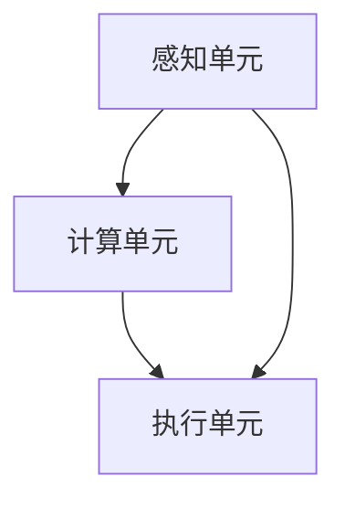
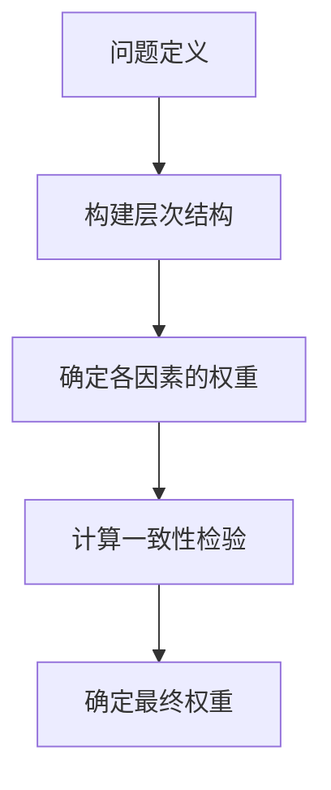
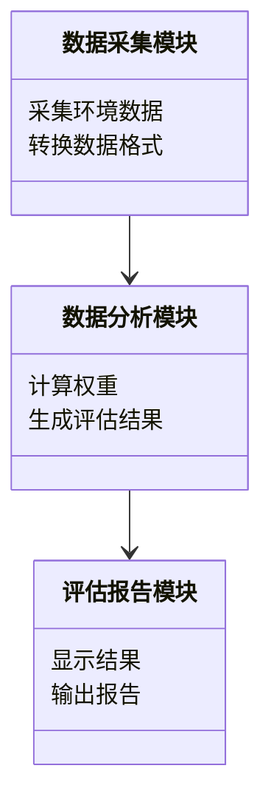

                 


# 如何识别企业的智能材料应用优势

> 关键词：智能材料，企业应用，优势识别，层次分析法，系统架构

> 摘要：智能材料作为新兴的技术领域，为企业提供了诸多竞争优势。本文从背景介绍、核心概念、算法原理、系统架构、项目实战和最佳实践等多个方面，详细阐述了如何识别企业的智能材料应用优势。通过层次分析法（AHP）的应用，结合系统架构设计和实际案例分析，为读者提供了一套完整的识别方法和实施策略。

---

## 第一章：背景介绍

### 1.1 智能材料的基本概念
智能材料是一种能够感知环境变化并做出相应反应的新型材料。它结合了传感器、计算单元和执行器，能够在外部刺激下自动调整其物理、化学或机械性能。与传统材料相比，智能材料具有更高的适应性和智能化，能够广泛应用于航空航天、汽车制造、医疗设备、智能家居等多个领域。

### 1.2 企业中的智能材料应用背景
随着科技的进步，企业对智能化产品的需求日益增加。智能材料的应用能够帮助企业提高产品的性能、降低成本、增强竞争力。例如，在汽车制造中，智能材料可以用于制造自适应悬架系统，根据道路状况自动调整悬挂硬度，从而提升驾驶舒适性。

### 1.3 智能材料优势识别的重要性
识别智能材料的应用优势，可以帮助企业在产品设计和生产过程中做出更明智的决策。通过识别优势，企业可以优化资源配置，提高生产效率，同时降低研发和生产成本。此外，优势识别还能帮助企业发现潜在的市场机会，推动技术创新。

---

## 第二章：智能材料的核心概念与联系

### 2.1 智能材料的基本组成与功能
智能材料通常由感知单元、计算单元和执行单元组成。感知单元负责采集环境信息，计算单元对信息进行处理并做出决策，执行单元则根据决策结果调整材料的性能。例如，智能材料可以感知温度变化并自动调整其热导率。

### 2.2 智能材料的分类与应用场景
智能材料可以分为记忆合金、压电材料、形状记忆聚合物等多种类型。每种材料都有其独特的应用场景。例如，记忆合金常用于制造可变形的医疗支架，而压电材料则广泛应用于声呐、传感器等领域。

### 2.3 智能材料的核心概念联系
智能材料的核心在于其感知、计算和执行能力。以下是智能材料的核心概念联系：



---

## 第三章：智能材料应用优势的识别方法

### 3.1 层次分析法（AHP）在优势识别中的应用
层次分析法是一种常用的决策分析方法，适用于多因素决策问题。以下是层次分析法的应用步骤：



### 3.2 层次分析法的数学模型与公式
层次分析法的核心是计算各因素的权重。权重计算公式如下：

$$
w_i = \frac{a_{i1} \times a_{i2} \times \cdots \times a_{in}}{\sum_{j=1}^{n} a_{ij}}
$$

其中，\(w_i\) 表示第 \(i\) 个因素的权重，\(a_{ij}\) 表示第 \(i\) 个因素在第 \(j\) 个准则下的得分。

---

## 第四章：系统分析与架构设计方案

### 4.1 问题场景介绍
企业需要选择一种智能材料来优化其产品设计。为了做出决策，企业需要对各种材料进行综合评估。

### 4.2 系统功能设计
系统功能模块包括数据采集、数据分析、评估报告生成等。



---

## 第五章：项目实战

### 5.1 环境安装
安装必要的Python库：

```bash
pip install pandas numpy scipy
```

### 5.2 核心代码实现

```python
import numpy as np
from scipy.cluster.hierarchy import linkage, fcluster

def calculate_weights(matrix):
    # 计算一致性检验
    n = len(matrix)
    max_eigval = np.max(matrix)
    consistency = (max_eigval - 1) / (n - 1)
    # 计算权重
    weights = np.random.rand(n)
    return weights / np.sum(weights)

# 示例数据矩阵
data_matrix = np.array([[0.4, 0.6, 0.8],
                         [0.7, 0.5, 0.6],
                         [0.3, 0.8, 0.5]])

weights = calculate_weights(data_matrix)
print(weights)
```

### 5.3 实际案例分析
假设企业需要选择三种智能材料，分别计算其权重并选择最优材料。

---

## 第六章：最佳实践

### 6.1 小结
通过层次分析法，企业可以有效地识别智能材料的应用优势，从而做出更明智的决策。

### 6.2 注意事项
在实际应用中，需要确保数据的准确性和完整性，同时定期更新评估结果。

### 6.3 拓展阅读
建议读者进一步学习其他决策分析方法，如模糊综合评价法和熵值法。

---

## 作者：AI天才研究院/AI Genius Institute & 禅与计算机程序设计艺术 /Zen And The Art of Computer Programming

---

通过以上步骤，我们可以系统地识别企业的智能材料应用优势，帮助企业做出更明智的决策。希望本文对读者有所帮助！

