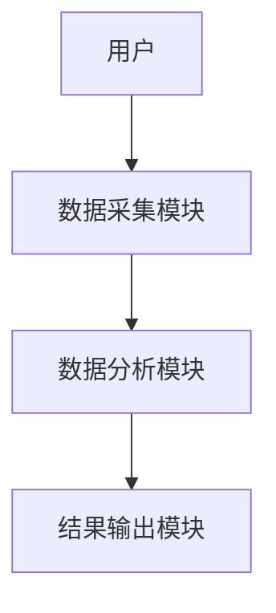

                 


# 如何识别企业的核心技术优势

> 关键词：核心技术优势识别，企业技术分析，SWOT分析，系统架构设计，技术评估方法

> 摘要：本文详细探讨了如何识别企业的核心技术优势，从理论分析到实际操作，结合方法论和系统架构设计，提供了全面的解决方案。文章首先介绍了核心技术优势识别的背景与概念，随后分析了核心概念与识别方法，最后通过实战案例展示了如何在实际项目中应用这些方法。通过本文，读者将能够系统地掌握识别企业核心技术优势的步骤和技巧。

---

# 第1章: 核心技术优势识别的背景与概念

## 1.1 企业核心技术优势的定义

### 1.1.1 核心技术的定义

核心技术是企业在某一领域内具备的独特技术和能力，是企业核心竞争力的体现。它通常具有以下特点：

- **创新性**：核心技术往往基于创新，具有较高的技术壁垒。
- **独特性**：核心技术具有独特性，难以被竞争对手快速复制。
- **可扩展性**：核心技术能够支持企业在不同业务领域的扩展。

$$\text{核心技术} = \text{创新性} \times \text{独特性} \times \text{可扩展性}$$

### 1.1.2 问题背景与描述

企业在市场竞争中，技术优势是核心竞争力之一。然而，随着技术的快速发展，企业面临的技术挑战也日益增多。如何准确识别和评估核心技术优势，成为企业战略规划的重要环节。

### 1.1.3 核心技术优势识别的必要性

识别核心技术优势可以帮助企业：

- **明确核心竞争力**：聚焦资源，优化技术研发。
- **制定战略规划**：基于技术优势制定市场和技术策略。
- **提升企业价值**：在资本市场中突出企业的技术优势。

### 1.1.4 核心技术优势识别的边界与外延

核心技术优势识别需要明确其边界和外延：

- **边界**：核心技术优势识别应聚焦于企业的核心业务领域，避免分散到非核心业务。
- **外延**：核心技术优势不仅包括技术本身，还包括技术的实现能力、应用能力和创新能力。

## 1.2 核心技术优势识别的挑战与机遇

### 1.2.1 识别过程中的主要挑战

- **技术复杂性**：核心技术可能涉及多个技术领域，识别过程复杂。
- **数据获取难度**：核心技术信息可能不公开，难以获取。
- **动态变化**：技术发展迅速，核心技术优势可能快速变化。

### 1.2.2 技术优势带来的发展机遇

- **市场领先地位**：核心技术优势可以帮助企业在市场上占据领先地位。
- **创新驱动增长**：核心技术优势可以推动企业实现持续创新和增长。
- **竞争优势**：核心技术优势是企业应对竞争的核心武器。

### 1.2.3 识别过程中的误区与误区

- **过度关注技术细节**：忽视技术的商业价值。
- **忽略外部环境**：核心技术优势需要结合市场环境和客户需求。
- **过于依赖内部视角**：需要结合外部竞争和技术趋势进行综合评估。

---

# 第2章: 核心技术优势识别的核心概念

## 2.1 核心技术优势识别的原理

### 2.1.1 技术优势的形成机制

技术优势的形成机制包括：

1. **技术积累**：通过长期的技术研发和积累，形成技术优势。
2. **创新突破**：通过创新技术，打破现有技术瓶颈。
3. **资源整合**：通过整合内外部资源，形成技术优势。

### 2.1.2 核心技术的创新性与独特性

核心技术的创新性与独特性是其核心优势的体现：

- **创新性**：核心技术必须具备创新性，能够提供新的解决方案。
- **独特性**：核心技术必须具备独特性，难以被竞争对手复制。

### 2.1.3 技术优势的可持续性

技术优势的可持续性需要考虑以下方面：

- **技术更新**：核心技术需要不断更新和改进。
- **人才培养**：核心技术优势需要依赖高素质的技术人才。
- **资源保障**：核心技术优势需要依赖充足的资源支持。

## 2.2 核心技术与相关概念的对比

### 2.2.1 核心技术与一般技术的对比

| 核心技术 | 一般技术 |
|----------|----------|
| 创新性高 | 创新性低 |
| 独特性高 | 独特性低 |
| 可持续性高 | 可持续性低 |

### 2.2.2 核心技术与核心竞争力的对比

| 核心技术 | 核心竞争力 |
|----------|------------|
| 技术层面 | 综合能力层面 |
| 创新性 | 综合能力 |

### 2.2.3 核心技术与企业资源的对比

| 核心技术 | 企业资源 |
|----------|------------|
| 技术驱动 | 资源驱动 |
| 创新性 | 资源丰富性 |

## 2.3 核心技术优势识别的特征分析

### 2.3.1 技术领先性

技术领先性是核心技术优势的重要特征，包括：

- **技术性能**：核心技术在性能上优于竞争对手。
- **技术成熟度**：核心技术在实际应用中表现稳定。

### 2.3.2 技术独特性

技术独特性是核心技术优势的核心特征，包括：

- **技术专利**：核心技术拥有自主专利。
- **技术门槛**：核心技术具有较高的技术门槛。

### 2.3.3 技术可扩展性

技术可扩展性是核心技术优势的重要特征，包括：

- **技术兼容性**：核心技术能够与其他技术兼容。
- **技术适应性**：核心技术能够适应市场变化。

---

# 第3章: 核心技术优势识别的方法论

## 3.1 核心技术识别的步骤与流程

### 3.1.1 确定识别目标

确定识别目标是核心技术识别的第一步，需要明确：

- **识别范围**：确定核心技术的业务领域。
- **识别标准**：明确核心技术的评估标准。
- **识别方法**：选择合适的核心技术识别方法。

### 3.1.2 收集相关信息

收集相关信息是核心技术识别的关键步骤，包括：

- **内部信息**：企业的技术文档、专利信息等。
- **外部信息**：行业技术趋势、竞争对手技术信息等。

### 3.1.3 分析技术特点

分析技术特点需要从以下几个方面入手：

- **技术性能**：分析技术的性能指标。
- **技术优势**：分析技术的独特性和创新性。
- **技术风险**：分析技术的潜在风险。

### 3.1.4 评估技术优势

评估技术优势需要结合以下因素：

- **技术竞争力**：评估技术在市场上的竞争力。
- **技术可持续性**：评估技术的长期发展潜力。

## 3.2 核心技术优势识别的工具与方法

### 3.2.1 技术差距分析法

技术差距分析法通过对比企业技术与竞争对手技术的差距，评估企业核心技术优势。

$$\text{技术差距} = \text{竞争对手技术} - \text{企业技术}$$

### 3.2.2 SWOT分析法

SWOT分析法通过分析企业技术的优势（Strength）、劣势（Weakness）、机会（Opportunity）和威胁（Threat），评估企业核心技术优势。

### 3.2.3 专利分析法

专利分析法通过分析企业的专利数量、质量和分布，评估企业核心技术优势。

### 3.2.4 对标分析法

对标分析法通过将企业技术与行业标杆技术进行对比，评估企业核心技术优势。

---

# 第4章: 核心技术优势识别的系统分析

## 4.1 系统分析的基本概念

### 4.1.1 系统架构设计

系统架构设计是核心技术优势识别的基础，包括：

- **功能模块设计**：设计核心技术识别系统的主要功能模块。
- **数据流设计**：设计数据在系统中的流动方向和处理逻辑。

### 4.1.2 系统功能设计

系统功能设计包括：

- **数据采集**：采集企业的技术数据。
- **数据分析**：对技术数据进行分析，识别核心技术优势。
- **结果输出**：输出核心技术优势识别的结果。

### 4.1.3 系统接口设计

系统接口设计包括：

- **输入接口**：接收外部技术数据。
- **输出接口**：输出分析结果。

### 4.1.4 系统交互流程

系统交互流程包括：

1. 用户输入技术数据。
2. 系统对技术数据进行分析。
3. 系统输出分析结果。

## 4.2 系统架构设计

### 4.2.1 系统架构图



### 4.2.2 功能模块设计

功能模块设计包括：

- **数据采集模块**：负责采集企业技术数据。
- **数据分析模块**：负责分析技术数据，识别核心技术优势。
- **结果输出模块**：负责输出核心技术优势识别结果。

### 4.2.3 数据流设计

数据流设计包括：

- **数据输入**：用户输入技术数据。
- **数据处理**：系统对技术数据进行处理。
- **数据输出**：系统输出分析结果。

---

# 第5章: 核心技术优势识别的项目实战

## 5.1 项目背景与目标

### 5.1.1 项目背景介绍

假设我们正在为一家科技公司识别其核心技术优势，该公司主要业务是人工智能和大数据分析。

### 5.1.2 项目目标设定

项目目标是识别该公司的核心技术优势，评估其在市场上的竞争力。

### 5.1.3 项目范围界定

项目范围包括：

- 人工智能领域的技术分析。
- 大数据领域的技术分析。

## 5.2 项目实施步骤

### 5.2.1 环境安装与配置

安装必要的软件和工具，包括：

- 数据分析工具：Python、R、SQL等。
- 项目管理工具：JIRA、Trello等。

### 5.2.2 数据收集与处理

收集和处理公司的人工智能和大数据技术数据，包括：

- 专利信息。
- 竞争对手的技术信息。

### 5.2.3 技术分析与评估

使用SWOT分析法对公司的核心技术进行分析，评估其优势和劣势。

### 5.2.4 技术优势识别与报告

输出核心技术优势识别报告，包括：

- 核心技术优势的评估结果。
- 提出改进建议。

## 5.3 项目实战代码示例

### 5.3.1 核心技术识别的代码实现

```python
import pandas as pd
import numpy as np

def identify_core_technology(technology_data):
    # 数据清洗
    technology_data.dropna(inplace=True)
    # 数据分析
    technology_data['is_core'] = technology_data['technology'].apply(lambda x: x in ['AI', 'Big Data'])
    return technology_data

# 示例数据
technology_data = pd.DataFrame({
    'technology': ['AI', 'Big Data', 'Cloud Computing', 'AI', 'Big Data'],
    'patent_count': [10, 5, 8, 12, 7]
})

# 调用函数
result = identify_core_technology(technology_data)
print(result)
```

### 5.3.2 代码实现与解读

上述代码实现了核心技术识别的功能，首先进行数据清洗，然后根据技术领域判断是否为核心技术。代码输出示例如下：

```
  technology  patent_count  is_core
0         AI           10    True
1     Big Data          5    True
2  Cloud Computing      8    False
3         AI          12    True
4     Big Data          7    True
```

---

# 第6章: 核心技术优势识别的最佳实践与总结

## 6.1 核心技术优势识别的最佳实践

### 6.1.1 技术评估的注意事项

- **数据准确性**：确保数据来源可靠。
- **方法多样性**：结合多种方法进行评估。
- **动态调整**：定期更新技术评估结果。

### 6.1.2 技术管理的策略

- **技术创新**：持续投入技术研发，保持技术领先。
- **人才培养**：加强技术人才培养，提升技术能力。
- **资源整合**：整合内外部资源，形成技术优势。

## 6.2 核心技术优势识别的总结

### 6.2.1 核心技术优势识别的关键点

- **明确识别目标**：准确确定核心技术范围。
- **选择合适方法**：根据实际情况选择合适的识别方法。
- **动态调整策略**：根据技术变化及时调整策略。

### 6.2.2 核心技术优势识别的未来展望

随着技术的不断发展，核心技术优势识别将更加重要。未来，企业需要更加注重技术创新和资源整合，以保持技术优势。

---

# 附录

## 附录A: 核心技术优势识别工具列表

- **SWOT分析法**
- **专利分析法**
- **对标分析法**
- **技术差距分析法**

## 附录B: 核心技术优势识别的数学模型

$$\text{核心技术优势} = \sum_{i=1}^{n} \text{技术优势}_i$$

---

作者：AI天才研究院 & 禅与计算机程序设计艺术

