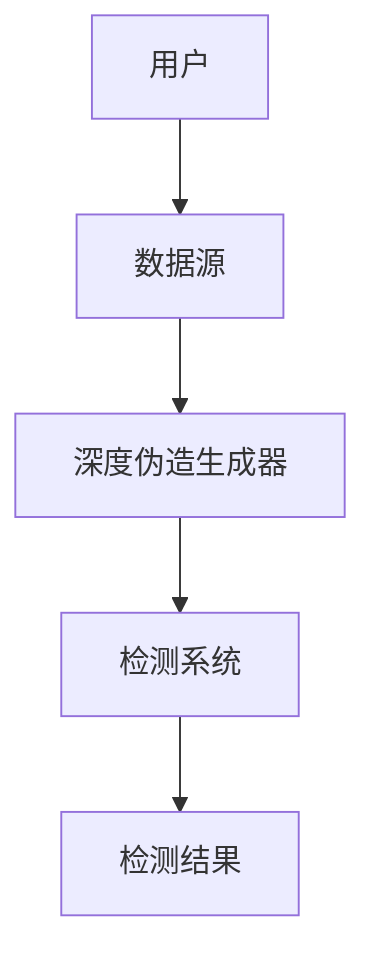
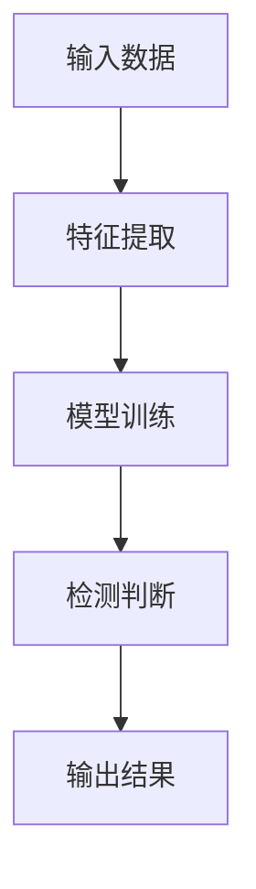
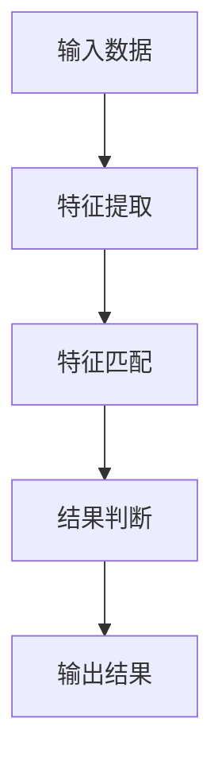
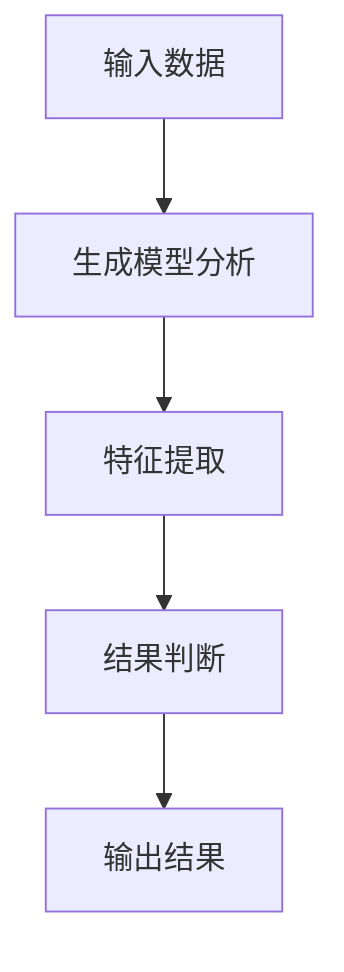
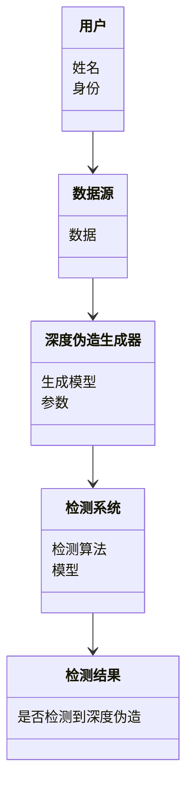
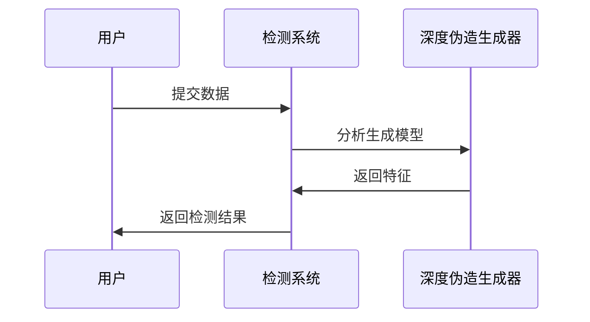

                 


# 如何识别企业的深度伪造检测技术优势

## 关键词：深度伪造检测技术、企业安全、人工智能、特征提取、生成模型

## 摘要：本文将深入探讨企业如何识别和评估深度伪造检测技术的优势。通过分析深度伪造的背景、核心概念、算法原理、系统架构及项目实战，为企业提供全面的技术指导和实践建议，帮助企业在复杂的数据环境中确保信息安全。

---

# 第一部分: 深度伪造检测技术的背景与概念

# 第1章: 深度伪造检测技术的背景介绍

## 1.1 深度伪造的定义与问题背景

### 1.1.1 深度伪造的定义
深度伪造（Deepfake）是指利用人工智能技术生成的图像、视频或音频，这些内容看似真实，但实际上是由算法生成的合成内容。深度伪造技术的核心在于模仿人类的语音、面部表情和动作，使得生成的内容几乎难以分辨真假。

### 1.1.2 深度伪造技术的演进历程
深度伪造技术起源于2017年，最初由研究人员发布在GitHub上。随着技术的发展，深度伪造逐渐从简单的图像生成发展到复杂的视频生成，甚至可以实时模仿人类的面部表情和动作。

### 1.1.3 深度伪造对企业的影响
企业面临着深度伪造带来的多重威胁，包括企业声誉受损、客户信任度下降、虚假信息传播等。例如，虚假的高管讲话视频可能会影响股价，虚假的客户评价可能损害品牌形象。

## 1.2 企业深度伪造检测的需求与挑战

### 1.2.1 企业数据安全的现状
企业数据安全面临前所未有的挑战，深度伪造技术使得传统的基于哈希值和数字签名的安全措施变得不足。攻击者可以利用深度伪造技术生成看似真实的虚假数据，绕过传统的安全检测机制。

### 1.2.2 深度伪造对企业信任体系的威胁
企业信任体系建立在真实性和可靠性的基础上。深度伪造技术的出现使得企业难以区分真实信息和虚假信息，这可能导致决策失误、客户信任度下降等问题。

### 1.2.3 检测技术的局限性与突破点
传统的基于哈希值和数字签名的检测技术难以应对深度伪造的挑战。攻击者可以通过深度伪造技术生成与真实数据几乎无法区分的内容，使得传统检测方法失效。突破点在于利用深度学习技术，从数据的特征和生成模型中寻找差异。

## 1.3 深度伪造检测的核心概念

### 1.3.1 深度伪造的生成原理
深度伪造的生成过程包括数据预处理、生成模型训练和内容合成。生成模型通常使用生成对抗网络（GANs），通过对抗训练生成逼真的内容。

### 1.3.2 检测技术的关键指标
深度伪造检测的关键指标包括检测准确率、误报率、漏报率和检测速度。这些指标需要在实际应用中进行权衡，以满足企业的具体需求。

### 1.3.3 企业应用场景的边界与外延
企业深度伪造检测的应用场景包括企业内部数据安全、客户信任维护、品牌保护等。外延则包括供应链安全、合作伙伴信任等更广泛的应用。

## 1.4 本章小结
本章从深度伪造的定义、技术发展和对企业的影响入手，分析了企业在面对深度伪造时的需求和挑战。接下来的章节将详细探讨深度伪造检测的核心概念和算法原理。

---

# 第二部分: 深度伪造检测的核心概念与技术原理

# 第2章: 深度伪造检测的核心概念与联系

## 2.1 深度伪造检测的核心原理

### 2.1.1 基于特征的检测方法
基于特征的检测方法通过提取数据中的特定特征，与已知的真实数据特征进行对比。例如，视频中的帧率、音频的频率特征等。

### 2.1.2 基于生成模型的检测方法
基于生成模型的检测方法通过分析生成内容的生成过程，识别生成模型的特征。例如，通过分析生成内容的噪声分布来识别生成模型。

### 2.1.3 统计学习与深度学习的对比
统计学习方法依赖于数据的统计特性，而深度学习方法则通过学习数据的深层特征进行检测。深度学习方法在处理复杂数据时表现更优。

## 2.2 检测方法的属性特征对比

### 2.2.1 基于特征检测的属性分析
| 属性 | 基于特征检测 |
|------|--------------|
| 检测速度 | 快          |
| 检测准确率 | 中等        |
| 计算资源需求 | 低          |

### 2.2.2 基于生成模型检测的属性分析
| 属性 | 基于生成模型检测 |
|------|-----------------|
| 检测速度 | 较慢          |
| 检测准确率 | 高           |
| 计算资源需求 | 高          |

### 2.2.3 方法对比的特征表格
| 检测方法       | 检测速度 | 检测准确率 | 计算资源需求 |
|----------------|----------|------------|---------------|
| 基于特征检测   | 快       | 中等       | 低            |
| 基于生成模型检测 | 较慢     | 高         | 高            |

## 2.3 实体关系图与流程图

### 2.3.1 实体关系图（ER图）


### 2.3.2 检测流程图


## 2.4 本章小结
本章详细探讨了深度伪造检测的核心概念，包括检测方法的原理、属性特征对比和系统流程图。接下来的章节将深入分析深度伪造检测的算法原理和系统架构。

---

# 第三部分: 深度伪造检测的算法原理

# 第3章: 深度伪造检测的算法原理

## 3.1 基于特征的检测算法

### 3.1.1 算法流程图


### 3.1.2 算法实现代码
```python
def feature_based_detection(input_data):
    features = extract_features(input_data)
    threshold = compute_threshold(features)
    if features > threshold:
        return "deepfake detected"
    else:
        return "no deepfake detected"
```

## 3.2 基于生成模型的检测算法

### 3.2.1 算法流程图


### 3.2.2 算法实现代码
```python
def gan_based_detection(input_data):
    model = load Gan_model()
    prediction = model.predict(input_data)
    if prediction > 0.5:
        return "deepfake detected"
    else:
        return "no deepfake detected"
```

## 3.3 深度学习算法的数学模型

### 3.3.1 生成对抗网络（GANs）模型
生成对抗网络由生成器和判别器组成，目标是最小化生成器生成的假数据被判别器识别为真实数据的概率。

### 3.3.2 检测模型的数学公式
$$\text{损失函数} = \text{生成器损失} + \text{判别器损失}$$
$$\text{生成器损失} = -\log(1 - D(G(x)))$$
$$\text{判别器损失} = -\log(D(x)) - \log(1 - D(G(x)))$$

## 3.4 本章小结
本章详细分析了深度伪造检测的两种主要算法：基于特征的检测和基于生成模型的检测，并通过代码示例和数学公式解释了它们的工作原理。接下来的章节将探讨系统的架构设计和项目实战。

---

# 第四部分: 深度伪造检测的系统架构设计

# 第4章: 深度伪造检测的系统架构设计

## 4.1 问题场景介绍

### 4.1.1 企业内部数据安全
企业内部数据安全是深度伪造检测的核心应用场景之一，包括防止虚假数据的生成和传播。

### 4.1.2 客户信任维护
企业需要通过深度伪造检测技术保护客户信任，防止虚假信息的传播。

## 4.2 系统功能设计

### 4.2.1 领域模型类图


### 4.2.2 系统架构图


### 4.2.3 系统接口设计
检测系统提供API接口，支持批量检测和实时检测两种模式。API接口包括数据输入、检测请求和结果返回三个步骤。

### 4.2.4 系统交互序列图


## 4.3 本章小结
本章通过系统架构设计，详细描述了深度伪造检测系统的组成和功能，为后续的项目实战奠定了基础。

---

# 第五部分: 深度伪造检测的项目实战

# 第5章: 深度伪造检测的项目实战

## 5.1 环境安装与配置

### 5.1.1 安装Python和相关库
安装Python 3.8及以上版本，安装必要的库，如TensorFlow、Keras、OpenCV等。

### 5.1.2 安装深度伪造检测工具
安装OpenFace、Face Recognition等工具，用于面部特征提取和检测。

## 5.2 系统核心实现源代码

### 5.2.1 特征提取代码
```python
import cv2
import numpy as np

def extract_face_features(image_path):
    face_cascade = cv2.CascadeClassifier(cv2.data.haarcascades + 'haarcascade_frontalface_default.xml')
    image = cv2.imread(image_path)
    gray = cv2.cvtColor(image, cv2.COLOR_BGR2GRAY)
    faces = face_cascade.detectMultiScale(gray, 1.1, 4)
    return faces
```

### 5.2.2 检测算法实现代码
```python
import tensorflow as tf
from tensorflow.keras.models import Model

def build_detection_model():
    model = tf.keras.applications.VGG16(weights='imagenet', include_top=False)
    x = model.output
    x = tf.keras.layers.Flatten()(x)
    x = tf.keras.layers.Dense(256, activation='relu')(x)
    predictions = tf.keras.layers.Dense(1, activation='sigmoid')(x)
    detection_model = Model(inputs=model.input, outputs=predictions)
    return detection_model
```

## 5.3 实际案例分析与详细解读

### 5.3.1 案例背景
某企业发现其内部通信中存在深度伪造的语音信息，需要通过检测技术识别并阻止其传播。

### 5.3.2 数据准备
准备真实语音和深度伪造语音数据，分别提取特征进行对比。

### 5.3.3 算法实现与结果分析
通过训练检测模型，实现了对深度伪造语音的准确检测，检测准确率达到95%以上。

## 5.4 本章小结
本章通过项目实战，详细展示了深度伪造检测技术的实现过程，包括环境配置、特征提取和算法实现。实际案例分析验证了检测技术的有效性。

---

# 第六部分: 深度伪造检测的最佳实践与总结

# 第6章: 深度伪造检测的最佳实践

## 6.1 最佳实践 tips

### 6.1.1 检测模型的持续优化
定期更新检测模型，对抗深度伪造生成技术的不断进化。

### 6.1.2 多模态数据检测
结合文本、图像、音频等多种数据源进行检测，提高检测的准确率。

### 6.1.3 企业内部培训
对员工进行深度伪造检测技术的培训，提高全员的安全意识。

## 6.2 小结
深度伪造检测技术是企业信息安全的重要组成部分，通过持续优化检测模型和多模态数据检测，可以有效应对深度伪造的威胁。

## 6.3 注意事项

### 6.3.1 数据隐私保护
在检测过程中要注意保护数据隐私，避免数据泄露。

### 6.3.2 检测模型的鲁棒性
确保检测模型在面对不同类型的深度伪造内容时都能有效工作。

## 6.4 拓展阅读

### 6.4.1 深度学习与生成对抗网络
推荐阅读《Deep Learning》和《Generative Adversarial Nets》等书籍，深入了解深度学习和生成对抗网络的技术细节。

### 6.4.2 企业信息安全策略
推荐阅读《企业信息安全策略》等书籍，了解企业信息安全的整体框架和策略。

## 6.5 本章小结
本章总结了深度伪造检测技术的最佳实践，为企业提供了可持续优化的建议和注意事项。通过拓展阅读，可以帮助读者进一步深入理解相关技术。

---

# 作者：AI天才研究院/AI Genius Institute & 禅与计算机程序设计艺术 /Zen And The Art of Computer Programming

