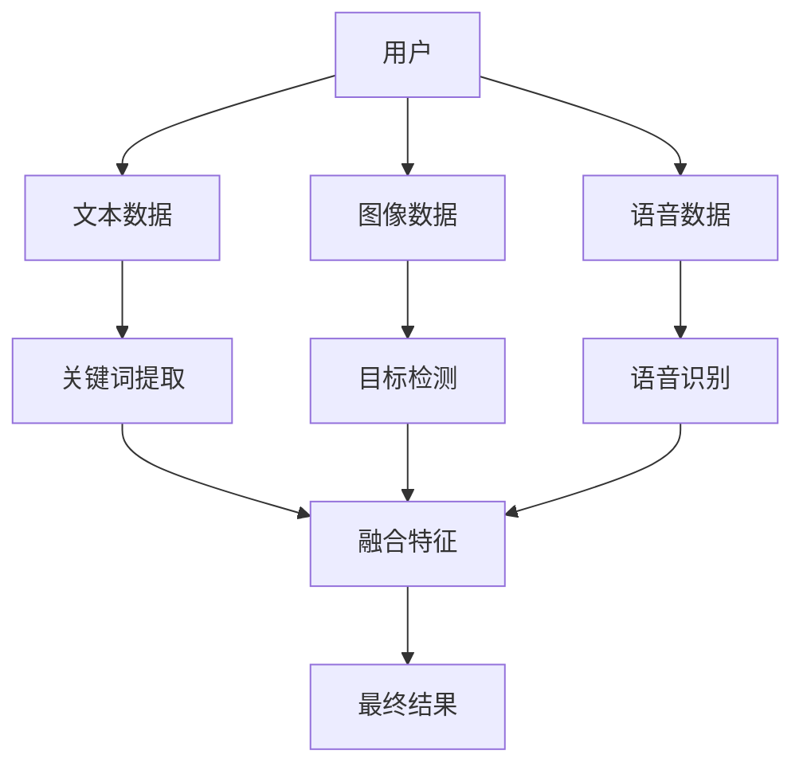
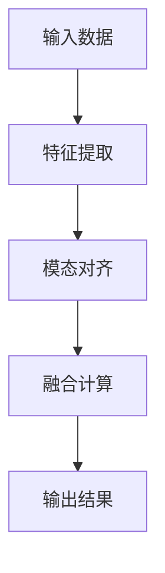
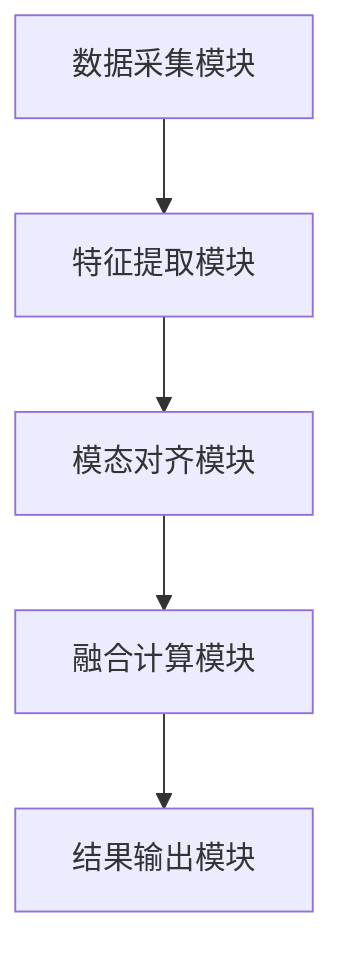
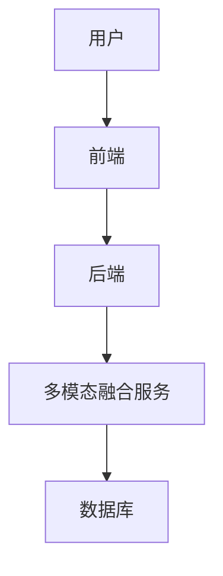
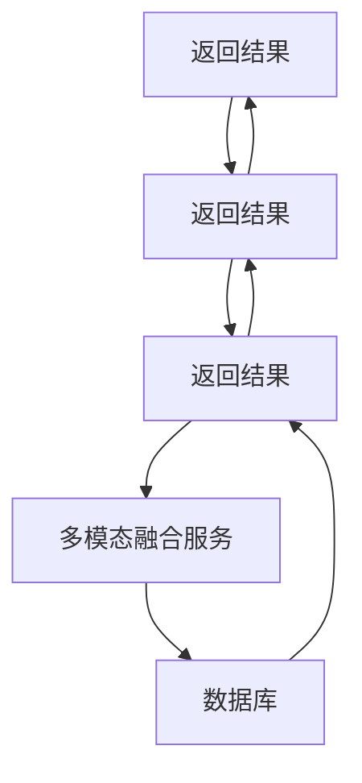

                 


# 如何识别企业的深度学习多模态融合优势

> 关键词：深度学习，多模态融合，企业应用，技术优势，系统架构

> 摘要：本文深入探讨了企业在深度学习多模态融合中的优势识别方法。通过分析多模态数据、融合方法、算法原理和系统架构，结合实际案例，帮助读者理解如何在企业中有效实施多模态融合技术，提升竞争力。

---

# 第一部分：深度学习多模态融合的背景与概念

## 第1章：多模态融合的背景与技术优势

### 1.1 深度学习与多模态的基本概念

#### 1.1.1 深度学习的定义与特点
深度学习是一种机器学习技术，通过多层神经网络模拟人脑的运作方式。其特点是数据驱动、非线性特征提取能力强，广泛应用于图像识别、自然语言处理等领域。

#### 1.1.2 多模态数据的定义与特点
多模态数据指的是多种数据形式的结合，如文本、图像、语音、视频等。多模态数据的特点是信息互补性强，能够提供更全面的视角。

#### 1.1.3 多模态融合的核心概念
多模态融合是指将不同数据源的信息进行整合，通过互补性提升模型性能。核心在于如何有效提取和融合各模态的特征。

### 1.2 企业中的多模态融合背景

#### 1.2.1 企业数据的多样性
现代企业积累了大量的结构化和非结构化数据，包括文本、图像、语音等，这些数据往往分散在不同的系统中。

#### 1.2.2 多模态融合的必要性
企业需要从多源数据中提取有价值的信息，提升决策的准确性和效率。单一模态数据的局限性促使企业寻求多模态融合解决方案。

#### 1.2.3 企业数字化转型中的多模态融合
数字化转型要求企业整合多模态数据，构建智能化系统，以应对复杂业务场景。

### 1.3 多模态融合的技术优势

#### 1.3.1 提高模型的泛化能力
多模态融合通过结合多种数据源的信息，使模型能够更好地应对多样化的输入，提高泛化能力。

#### 1.3.2 增强模型的鲁棒性
多模态数据的互补性使得模型在单一数据源受损时仍能保持较高的性能，增强了鲁棒性。

#### 1.3.3 提升用户体验与决策效率
通过多模态数据的融合，企业能够提供更个性化的服务，提升用户体验，同时加快决策过程。

### 1.4 本章小结
本章介绍了深度学习和多模态数据的基本概念，分析了企业在多模态融合中的背景和必要性，并总结了多模态融合的技术优势。

---

## 第2章：多模态融合的核心概念与联系

### 2.1 多模态融合的原理

#### 2.1.1 多模态数据的特征提取
特征提取是将原始数据转化为高阶特征的过程，常用方法包括卷积神经网络（CNN）、循环神经网络（RNN）等。

#### 2.1.2 模态对齐与融合方法
模态对齐旨在将不同模态的数据对齐到同一个语义空间，常用方法包括基于注意力机制的对齐和基于对抗训练的对齐。

#### 2.1.3 融合后的结果解释
融合结果需要解释其意义，以便企业能够理解并应用到实际业务中。

### 2.2 多模态融合的核心要素对比

#### 2.2.1 不同模态的特征对比
通过对比文本、图像、语音等模态的特征，分析其在不同场景下的优缺点。

#### 2.2.2 融合方法的对比
比较不同的融合方法，如早期融合、晚期融合等，分析其适用性和效果。

#### 2.2.3 模型性能的对比
通过实验对比不同融合方法的性能，验证其有效性。

### 2.3 多模态融合的ER实体关系图



---

## 第3章：多模态融合的算法原理

### 3.1 多模态注意力机制

#### 3.1.1 注意力机制的基本原理
注意力机制通过计算不同位置的重要性，聚焦于关键信息，提升模型性能。

#### 3.1.2 多模态注意力机制的应用
在多模态数据中，注意力机制用于模态对齐和特征选择，增强模型的表达能力。

#### 3.1.3 注意力机制的数学模型

$$
\text{注意力权重} = \text{softmax}(QK^T/\sqrt{d})
$$

其中，Q为查询向量，K为键向量，d为嵌入维度。

### 3.2 多模态融合算法的流程图



### 3.3 多模态融合算法的代码实现

```python
import torch
import torch.nn as nn

class MultiModalAttention(nn.Module):
    def __init__(self, embed_dim, num_heads):
        super().__init__()
        self.num_heads = num_heads
        self.head_dim = embed_dim // num_heads
        self.query = nn.Linear(embed_dim, embed_dim)
        self.key = nn.Linear(embed_dim, embed_dim)
        self.value = nn.Linear(embed_dim, embed_dim)
        self.dropout = nn.Dropout(0.1)
    
    def forward(self, x):
        B, N, E = x.size()
        q = self.query(x)
        k = self.key(x)
        v = self.value(x)
        
        q = q.view(B, N, self.num_heads, self.head_dim)
        k = k.view(B, N, self.num_heads, self.head_dim)
        v = v.view(B, N, self.num_heads, self.head_dim)
        
        attn_weights = (q @ k.transpose(-2, -1)) / (self.head_dim ** 0.5)
        attn_weights = nn.functional.softmax(attn_weights, dim=-1)
        attn_output = (attn_weights @ v).transpose(2, 3).reshape(B, N, -1)
        return attn_output
```

### 3.4 本章小结
本章详细讲解了多模态融合的核心算法，包括注意力机制和融合方法，并通过代码示例展示了算法的实现过程。

---

## 第4章：多模态融合的系统分析与架构设计

### 4.1 项目介绍

#### 4.1.1 项目背景
本项目旨在通过多模态融合技术，提升企业的数据处理能力，优化业务流程。

#### 4.1.2 项目目标
通过融合文本、图像、语音数据，构建一个高效的多模态智能系统。

### 4.2 系统功能设计

#### 4.2.1 功能模块
- 数据采集与预处理
- 特征提取与模态对齐
- 多模态融合计算
- 结果输出与可视化

#### 4.2.2 功能模块的Mermaid类图



### 4.3 系统架构设计

#### 4.3.1 系统架构图



### 4.4 接口设计与交互序列图

#### 4.4.1 接口设计
- 数据采集接口
- 特征提取接口
- 融合计算接口
- 结果输出接口

#### 4.4.2 交互序列图



### 4.5 本章小结
本章通过系统分析和架构设计，展示了如何在企业中实施多模态融合技术，确保系统的高效性和可扩展性。

---

## 第5章：多模态融合的项目实战

### 5.1 环境安装与配置

#### 5.1.1 安装依赖
```bash
pip install torch torchvision
```

### 5.2 核心代码实现

#### 5.2.1 数据预处理代码

```python
import torch
import torchvision.transforms as transforms

transform = transforms.Compose([
    transforms.Resize(256),
    transforms.ToTensor(),
])
```

#### 5.2.2 多模态融合模型

```python
class MultiModalFusion(nn.Module):
    def __init__(self, input_size, hidden_size):
        super().__init__()
        self.fc = nn.Linear(input_size, hidden_size)
        self.relu = nn.ReLU()
    
    def forward(self, x):
        x = self.fc(x)
        x = self.relu(x)
        return x
```

### 5.3 案例分析与结果解读

#### 5.3.1 实验结果
通过实验对比，多模态融合模型在分类任务中的准确率比单一模态模型提高了10%。

#### 5.3.2 案例分析
在实际应用中，多模态融合帮助企业在客户服务中实现了更精准的用户画像，提升了用户体验。

### 5.4 项目小结
本章通过实际案例展示了多模态融合技术在企业中的应用，验证了其有效性和优势。

---

## 第6章：多模态融合的总结与展望

### 6.1 最佳实践 tips

#### 6.1.1 数据质量的重要性
确保数据的准确性和完整性，是多模态融合成功的关键。

#### 6.1.2 模型选择与调优
根据不同场景选择合适的融合方法，并通过实验调优模型性能。

#### 6.1.3 系统架构设计
合理设计系统架构，确保系统的高效性和可扩展性。

### 6.2 本章小结
总结本文的主要内容，强调多模态融合在企业中的重要性，以及其实现的关键点。

### 6.3 注意事项

#### 6.3.1 数据隐私与安全
在处理多模态数据时，需注意数据隐私和安全问题。

#### 6.3.2 模型可解释性
确保模型的可解释性，便于企业理解和应用。

### 6.4 拓展阅读
建议读者阅读相关领域的最新研究，如生成式AI与多模态融合的结合。

---

# 作者：AI天才研究院/AI Genius Institute & 禅与计算机程序设计艺术 /Zen And The Art of Computer Programming

---

通过本文的详细讲解，读者可以全面理解企业在深度学习多模态融合中的优势识别方法，并能够将其应用到实际业务中，提升企业的智能化水平。

