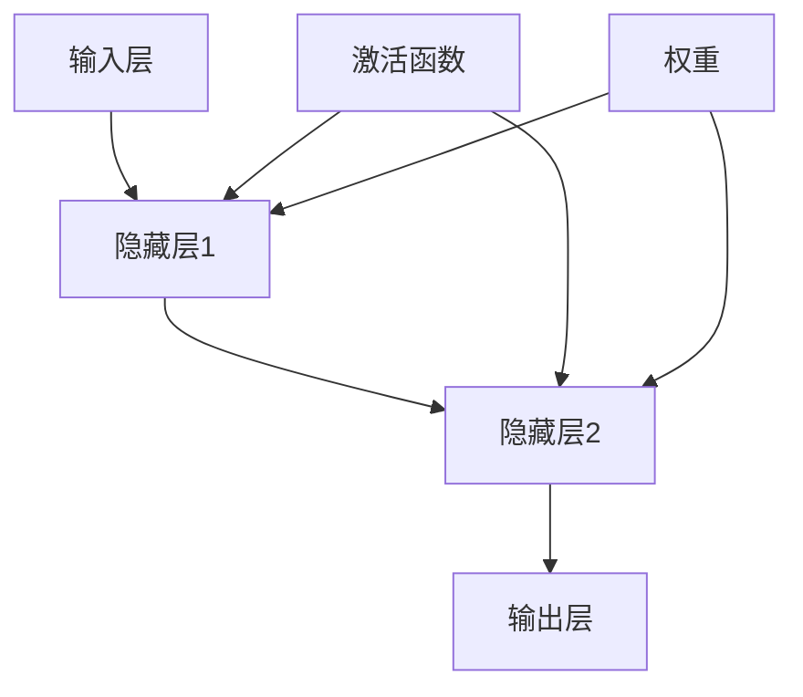
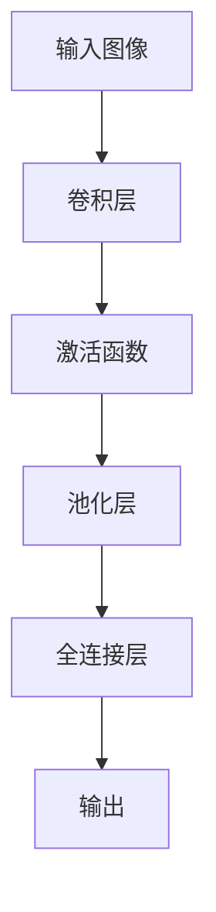
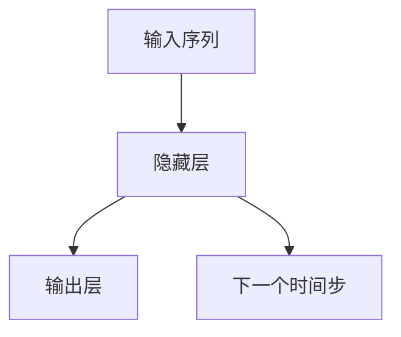
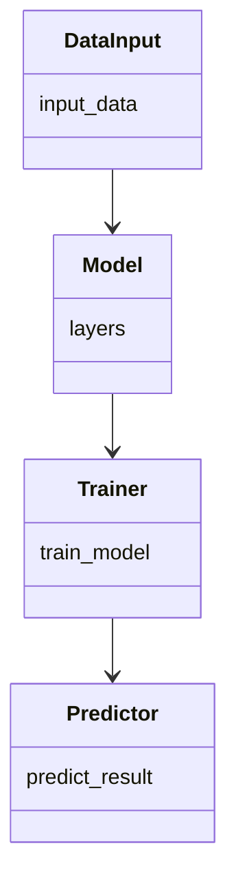
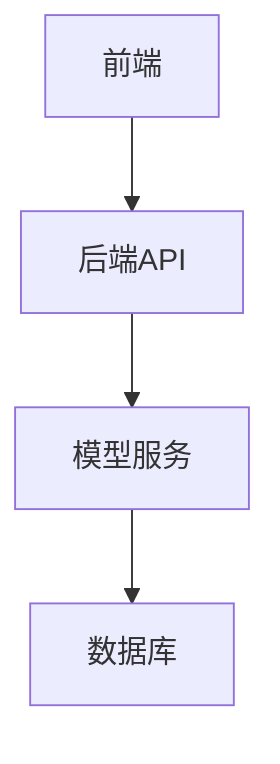

                 


# 如何识别企业的深度学习技术优势

## 关键词：深度学习，企业技术优势，卷积神经网络，循环神经网络，系统架构，项目实战

## 摘要：  
本文将系统地介绍如何识别和评估企业的深度学习技术优势。首先，我们从深度学习的基本概念出发，分析其在企业中的应用背景和技术优势。接着，详细讲解深度学习的核心概念与联系，通过对比分析和ER图展示其内部关系。随后，深入探讨卷积神经网络（CNN）和循环神经网络（RNN）的算法原理，并通过mermaid流程图和Python代码实现来展示其工作流程。之后，我们将从系统架构设计的角度，分析企业深度学习系统的实现方案，包括功能设计、架构图、接口设计和交互流程。最后，通过图像分类和自然语言处理的实际案例，展示如何在企业中识别和利用深度学习技术优势，并总结最佳实践和注意事项。

---

## 第一部分：深度学习技术基础

### 第1章：深度学习技术概述

#### 1.1 深度学习的基本概念

##### 1.1.1 深度学习的定义与特点
深度学习（Deep Learning）是一种机器学习技术，通过多层非线性变换模拟人脑的神经网络结构，具有以下特点：
- **层次化特征提取**：通过多层网络自动提取数据的高层次特征。
- **端到端学习**：从原始数据到输出结果，整个过程由网络自动完成。
- **强大的表示能力**：能够处理复杂的数据模式，如图像、语音和文本。

##### 1.1.2 深度学习与机器学习的区别
| 特性                | 机器学习          | 深度学习          |
|---------------------|-------------------|-------------------|
| 特征工程            | 需要手动设计特征  | 自动提取特征      |
| 模型复杂度          | 模型相对简单      | 模型复杂，层数多  |
| 数据量              | 适合小数据集      | 适合大数据集      |
| 应用场景            | 分类、回归等简单任务 | 图像识别、自然语言处理等复杂任务 |

##### 1.1.3 深度学习的核心技术与应用领域
深度学习的核心技术包括：
- **神经网络**：构建人工神经网络，模拟人脑的结构。
- **训练方法**：如反向传播（Backpropagation）和随机梯度下降（SGD）。
- **优化算法**：如Adam优化器。

深度学习的应用领域包括：
- 图像识别
- 自然语言处理
- 语音识别
- 自动驾驶

#### 1.2 企业的深度学习技术优势

##### 1.2.1 企业为何需要深度学习技术
- **数据驱动**：企业通常拥有大量数据，深度学习能够有效挖掘数据价值。
- **自动化决策**：深度学习模型可以实现自动化决策，提高效率。
- **竞争优势**：在AI领域，深度学习技术成为企业竞争力的重要部分。

##### 1.2.2 深度学习技术对企业竞争力的影响
- **提升效率**：自动化处理和分析数据，减少人工干预。
- **增强用户体验**：通过个性化推荐和智能客服提升用户体验。
- **创新业务模式**：深度学习驱动的新业务模式为企业创造新价值。

##### 1.2.3 识别深度学习技术优势的重要性
- **优化资源分配**：识别优势技术，合理分配资源。
- **提升技术门槛**：通过技术优势建立竞争壁垒。
- **推动业务创新**：技术优势推动业务模式和产品的创新。

### 第2章：深度学习的核心概念与联系

#### 2.1 深度学习的核心原理

##### 2.1.1 神经网络的结构与功能
神经网络由输入层、隐藏层和输出层组成，各层通过权重和激活函数进行数据变换。

##### 2.1.2 深度学习中的特征提取与表示学习
特征提取是深度学习的核心，通过多层网络自动提取高层次特征。

##### 2.1.3 深度学习的训练方法与优化策略
- **训练方法**：反向传播和随机梯度下降。
- **优化策略**：如Adam优化器，学习率衰减等。

#### 2.2 深度学习核心概念的对比分析

##### 2.2.1 深度学习与传统机器学习的对比分析
| 特性                | 深度学习          | 传统机器学习        |
|---------------------|-------------------|---------------------|
| 特征工程            | 自动提取          | 需要手动设计        |
| 模型复杂度          | 复杂，多层网络    | 简单                |
| 数据量              | 大数据集         | 小数据集           |
| 应用场景            | 复杂任务          | 简单任务            |

##### 2.2.2 深度学习中的实体关系图（ER图）解析
ER图展示了深度学习中的核心实体及其关系，如神经网络层、激活函数、权重等。

#### 2.3 深度学习的核心概念与联系的总结

##### 2.3.1 深度学习核心概念的系统架构图（Mermaid流程图）


---

## 第二部分：深度学习算法原理与数学模型

### 第3章：卷积神经网络（CNN）的原理

#### 3.1 CNN的核心概念与工作原理

##### 3.1.1 CNN的结构与特点
CNN由卷积层、池化层和全连接层组成，主要用于图像处理。

##### 3.1.2 CNN的工作流程（Mermaid流程图）


##### 3.1.3 CNN的数学模型与公式
- **卷积操作**：
  $$ (f * w)(i, j) = \sum_{k=0}^{m} \sum_{l=0}^{n} f[i+k, j+l] \cdot w[k, l] $$
- **池化操作**：通常使用最大池化或平均池化。

#### 3.2 CNN的Python实现代码

##### 3.2.1 环境安装与依赖管理
```bash
pip install tensorflow keras matplotlib
```

##### 3.2.2 网络模型实现
```python
import tensorflow as tf
from tensorflow.keras import layers

model = tf.keras.Sequential([
    layers.Conv2D(32, (3,3), activation='relu', input_shape=(224, 224, 3)),
    layers.MaxPooling2D((2,2)),
    layers.Conv2D(64, (3,3), activation='relu'),
    layers.MaxPooling2D((2,2)),
    layers.Flatten(),
    layers.Dense(128, activation='relu'),
    layers.Dense(10, activation='softmax')
])
```

#### 3.3 CNN的案例分析与实际应用
- **案例分析**：图像分类任务，如识别图像中的物体。
- **实际应用**：医学图像分析、自动驾驶中的目标检测。

### 第4章：循环神经网络（RNN）的原理

#### 4.1 RNN的核心概念与工作原理

##### 4.1.1 RNN的结构与特点
RNN适用于序列数据处理，如自然语言处理。

##### 4.1.2 RNN的工作流程（Mermaid流程图）


##### 4.1.3 RNN的数学模型与公式
- **循环过程**：
  $$ h_t = \text{activation}(W_{hh} h_{t-1} + W_{xh} x_t + b) $$
  $$ y_t = W_{hy} h_t + b_y $$

#### 4.2 RNN的Python实现代码

##### 4.2.1 环境安装与依赖管理
```bash
pip install tensorflow keras matplotlib
```

##### 4.2.2 网络模型实现
```python
import tensorflow as tf
from tensorflow.keras import layers

model = tf.keras.Sequential([
    layers.SimpleRNN(32, input_shape=(None, 10)),
    layers.Dense(5, activation='softmax')
])
```

#### 4.3 RNN的案例分析与实际应用
- **案例分析**：时间序列预测，如股票价格预测。
- **实际应用**：自然语言处理中的语言模型、机器翻译。

---

## 第三部分：企业深度学习系统设计

### 第5章：企业深度学习系统的实现方案

#### 5.1 系统功能设计

##### 5.1.1 领域模型设计（Mermaid类图）


##### 5.1.2 系统架构设计（Mermaid架构图）


##### 5.1.3 接口设计与交互流程（Mermaid序列图）
```mermaid
sequenceDiagram
参与者：用户
参与者：系统
用户->系统：发送请求
系统->系统：处理请求
系统->用户：返回结果
```

#### 5.2 系统实现与优化

##### 5.2.1 系统实现的关键步骤
- **数据预处理**：清洗和归一化数据。
- **模型训练**：选择合适的算法，调整超参数。
- **模型部署**：将模型部署到生产环境中。

##### 5.2.2 系统优化策略
- **模型压缩**：减少模型大小，提高推理速度。
- **分布式训练**：利用分布式计算加速训练过程。

---

## 第四部分：项目实战与案例分析

### 第6章：深度学习技术在企业中的应用案例

#### 6.1 图像分类项目实战

##### 6.1.1 环境安装与依赖管理
```bash
pip install tensorflow keras matplotlib
```

##### 6.1.2 网络模型实现
```python
import tensorflow as tf
from tensorflow.keras import layers

model = tf.keras.Sequential([
    layers.Conv2D(32, (3,3), activation='relu', input_shape=(224, 224, 3)),
    layers.MaxPooling2D((2,2)),
    layers.Conv2D(64, (3,3), activation='relu'),
    layers.MaxPooling2D((2,2)),
    layers.Flatten(),
    layers.Dense(128, activation='relu'),
    layers.Dense(10, activation='softmax')
])
```

##### 6.1.3 案例分析与结果解读
- **训练过程**：模型在训练集上的准确率逐步提高。
- **结果分析**：验证集准确率反映了模型的泛化能力。

#### 6.2 自然语言处理项目实战

##### 6.2.1 环境安装与依赖管理
```bash
pip install tensorflow keras matplotlib
```

##### 6.2.2 网络模型实现
```python
import tensorflow as tf
from tensorflow.keras import layers

model = tf.keras.Sequential([
    layers.SimpleRNN(32, input_shape=(None, 10)),
    layers.Dense(5, activation='softmax')
])
```

##### 6.2.3 案例分析与结果解读
- **训练过程**：模型在训练集上的损失逐步降低。
- **结果分析**：测试集准确率反映了模型的性能。

---

## 第五部分：总结与展望

### 第7章：深度学习技术的优势与挑战

#### 7.1 深度学习技术的优势
- **强大的表示能力**：能够处理复杂数据模式。
- **自动化特征提取**：减少人工特征工程的工作量。
- **广泛的应用场景**：在多个领域表现出色。

#### 7.2 深度学习技术的挑战
- **计算资源需求高**：需要大量的计算资源进行训练。
- **模型解释性差**：黑箱模型难以解释。
- **数据依赖性强**：模型性能依赖于数据质量。

### 第8章：深度学习技术的未来发展

#### 8.1 深度学习技术的未来趋势
- **模型压缩与优化**：提高推理速度和降低资源消耗。
- **多模态学习**：结合多种数据类型进行联合分析。
- **可解释性增强**：提升模型的透明度和解释性。

#### 8.2 企业的深度学习技术应用展望
- **智能化升级**：深度学习技术将推动企业智能化转型。
- **数据驱动决策**：深度学习技术将帮助企业做出更科学的决策。
- **创新业务模式**：深度学习技术将催生新的业务模式和机会。

---

## 作者：AI天才研究院/AI Genius Institute & 禅与计算机程序设计艺术 /Zen And The Art of Computer Programming

---

通过以上结构和内容，您可以系统地了解如何识别和评估企业的深度学习技术优势。从理论到实践，从概念到代码，本文为您提供了一条清晰的学习路径。希望对您有所帮助！

