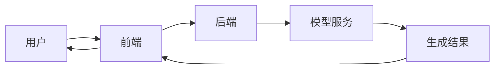

                 


# 如何识别企业的深度学习自然语言生成技术优势

> 关键词：自然语言生成技术、深度学习、企业应用、算法原理、系统架构

> 摘要：深度学习自然语言生成技术在企业中的应用越来越广泛，本文从背景、核心概念、算法原理、系统架构到项目实战，全面解析如何识别和利用这一技术的优势，助力企业提升竞争力。

---

# 第1章: 深度学习自然语言生成技术的背景与应用

## 1.1 什么是自然语言生成技术

### 1.1.1 自然语言生成的定义

自然语言生成（Natural Language Generation, NLG）是人工智能领域的一个重要分支，旨在通过计算机生成人类可读的自然语言文本。简单来说，NLG技术可以让机器像人类一样“写文章”、“回答问题”或“生成描述”。

### 1.1.2 深度学习在自然语言生成中的作用

深度学习的兴起极大地推动了自然语言生成技术的进步。与传统基于规则的生成方法不同，深度学习通过大量数据训练模型，能够生成更自然、更贴近人类语言习惯的文本。

### 1.1.3 自然语言生成的核心要素

自然语言生成的核心要素包括：

1. **输入数据**：高质量的训练数据是生成准确文本的基础。
2. **模型结构**：选择合适的模型架构（如Transformer、LSTM等）。
3. **训练目标**：明确的优化目标（如最小化生成文本与预期的差异）。
4. **生成策略**：如何从模型中提取生成文本（如贪心算法、采样等）。

---

## 1.2 自然语言生成技术的背景与演进

### 1.2.1 自然语言生成技术的发展历程

自然语言生成技术经历了多个阶段：

1. **基于规则的方法**：20世纪60年代至80年代，主要依赖人工制定规则生成文本，方法简单但生成结果受限。
2. **统计机器学习方法**：90年代至21世纪初，基于统计模型（如n-gram）生成文本，但存在数据稀疏性问题。
3. **深度学习方法**：近年来，深度学习模型（如GPT、BERT）在生成质量上取得了突破性进展。

### 1.2.2 深度学习对自然语言生成的推动

深度学习通过以下方式推动了自然语言生成技术的进步：

- **更大规模的训练数据**：深度学习模型能够处理海量数据，提取更丰富的语义信息。
- **更复杂的模型结构**：如Transformer架构在并行计算和长距离依赖捕捉方面的优势。
- **生成结果的多样性和可控制性**：通过调整模型参数或引入外部约束，生成文本可以更灵活地满足特定需求。

### 1.2.3 当前技术的瓶颈与未来趋势

当前，自然语言生成技术仍面临以下挑战：

- **生成结果的相关性不足**：模型有时会生成与输入无关的内容。
- **生成文本的质量不稳定**：特别是在处理复杂语境时，生成结果可能不够准确或连贯。
- **计算资源消耗大**：训练和推理需要大量计算资源。

未来，随着大模型技术的进步和小模型优化策略的发展，自然语言生成技术在企业中的应用将更加广泛和实用。

---

## 1.3 自然语言生成技术在企业中的应用

### 1.3.1 企业级应用的场景分析

在企业中，自然语言生成技术可以应用于多个场景：

- **智能客服**：通过生成自然语言回复，提升客户服务质量。
- **内容生成**：帮助企业自动化生成报告、营销文案等。
- **数据标注**：自动生成数据标签，降低人工成本。
- **多语言支持**：支持多种语言的文本生成，助力国际化业务。

### 1.3.2 自然语言生成技术的优势

企业在应用自然语言生成技术时，可以享受以下优势：

1. **提升效率**：自动化生成文本，节省时间和人力资源。
2. **降低成本**：减少对专业写手的依赖，降低内容生产成本。
3. **增强用户体验**：提供个性化的回复，提升客户满意度。
4. **支持创新**：通过生成创意内容，助力产品开发和市场推广。

### 1.3.3 企业采用自然语言生成技术的挑战

尽管优势明显，但企业在采用自然语言生成技术时也面临一些挑战：

- **技术门槛高**：需要具备一定的技术能力才能进行模型训练和部署。
- **数据隐私问题**：生成模型需要大量数据，可能涉及隐私和数据安全问题。
- **模型调优难度大**：生成结果的质量依赖于模型的调优和优化。

---

## 1.4 本章小结

本章从自然语言生成技术的定义、发展历程、核心要素、应用场景、优势与挑战等方面进行了详细阐述。通过理解这些内容，企业可以更好地认识到深度学习自然语言生成技术的优势，并为后续的技术实现和应用做好准备。

---

# 第2章: 自然语言生成技术的核心概念与联系

## 2.1 自然语言生成技术的核心原理

### 2.1.1 预训练语言模型的原理

预训练语言模型（如GPT、BERT）通过在大规模通用数据上进行预训练，学习语言的语法、语义和上下文信息。这些模型在特定任务上进行微调后，可以用于生成任务。

### 2.1.2 生成机制的数学模型

生成机制通常基于概率模型，通过最大化生成文本的概率来优化生成结果。数学表达式如下：

$$ P(y|x) = \prod_{i=1}^{n} P(y_i | y_{<i}, x) $$

其中，$x$ 是输入，$y$ 是生成的文本序列。

### 2.1.3 模型训练与优化方法

模型训练通常采用最大似然估计（MLE）或其变体（如KL散度）进行优化。优化目标是最大化生成文本的概率：

$$ \text{Loss} = -\log P(y|x) $$

---

## 2.2 核心概念对比与ER实体关系图

### 2.2.1 概念属性特征对比表格

| 概念       | 属性                 | 特征描述                                   |
|------------|----------------------|------------------------------------------|
| 输入数据   | 数据类型             | 文本、结构化数据                          |
| 模型结构   | 参数数量             | 高（如亿级别）                            |
| 生成策略   | 方法                 | 贪心算法、采样                            |
| 优化目标   | 函数                 | 负对数似然函数                            |

### 2.2.2 ER实体关系图架构


---

## 2.3 本章小结

本章通过数学模型和对比分析，深入阐述了自然语言生成技术的核心原理和概念之间的联系，为后续章节的算法实现奠定了基础。

---

# 第3章: 自然语言生成技术的算法原理

## 3.1 序列到序列模型

### 3.1.1 模型结构与工作流程

序列到序列（Sequence-to-Sequence, Seq2Seq）模型通常由编码器（Encoder）和解码器（Decoder）两部分组成。编码器将输入序列映射为一个固定长度的向量，解码器将该向量解码为输出序列。

### 3.1.2 注意力机制的实现

注意力机制（Attention）通过计算输入序列中每个词的重要性权重，生成更合理的输出。权重计算公式如下：

$$ \alpha_i = \frac{\exp(s_i)}{\sum_{j} \exp(s_j)} $$

其中，$s_i$ 是第i个词的评分。

### 3.1.3 梯度下降与优化算法

常用的优化算法包括随机梯度下降（SGD）和Adam优化器。Adam优化器的更新公式如下：

$$ \theta_{t+1} = \theta_t - \eta \frac{\rho_1 g_t + \rho_2 g_{t-1}}{1 - \beta_1 + \beta_2 g_t^2} $$

其中，$\eta$ 是学习率，$\rho_1$ 和 $\rho_2$ 是动量系数。

---

## 3.2 深度学习算法的数学模型

### 3.2.1 编码器-解码器结构

编码器和解码器的数学表达式如下：

编码器：
$$ z = f(x) $$

解码器：
$$ y = g(z) $$

### 3.2.2 变量关系与概率分布

生成模型的概率分布可以表示为：

$$ P(y|x) = \prod_{i=1}^{n} P(y_i | y_{<i}, x) $$

### 3.2.3 损失函数与优化目标

常用的损失函数是交叉熵损失：

$$ \text{Loss} = -\sum_{i=1}^{n} \log P(y_i | y_{<i}, x) $$

---

## 3.3 算法实现与代码示例

### 3.3.1 Python源代码实现

以下是一个简单的序列到序列模型的代码示例：

```python
import torch
import torch.nn as nn

class Seq2Seq(nn.Module):
    def __init__(self, encoder_input_size, decoder_input_size):
        super(Seq2Seq, self).__init__()
        self.encoder = nn.LSTM(encoder_input_size, 64, batch_first=True)
        self.decoder = nn.LSTM(decoder_input_size, 64, batch_first=True)
        self.fc = nn.Linear(64, 10)

    def forward(self, x, y):
        # 编码
        enc_output, _ = self.encoder(x)
        # 解码
        dec_output, _ = self.decoder(y, enc_output)
        # 全连接层
        output = self.fc(dec_output[:, -1, :])
        return output

model = Seq2Seq(10, 10)
criterion = nn.CrossEntropyLoss()
optimizer = torch.optim.Adam(model.parameters(), lr=0.001)
```

### 3.3.2 代码功能解读与分析

上述代码实现了以下功能：

1. **编码器**：将输入序列编码为一个固定长度的向量。
2. **解码器**：根据编码结果生成输出序列。
3. **全连接层**：将解码结果映射到目标词表。

---

## 3.4 本章小结

本章详细讲解了自然语言生成技术的核心算法原理，包括序列到序列模型、注意力机制和优化算法的实现。通过代码示例，读者可以更好地理解这些算法的实际应用。

---

# 第4章: 自然语言生成技术的系统分析与架构设计

## 4.1 系统分析与设计

### 4.1.1 问题场景介绍

假设我们正在开发一个智能客服系统，需要生成自然语言回复。系统需要处理以下问题：

1. **输入数据的多样性**：用户输入的问题可能多种多样。
2. **生成结果的准确性**：回复需要准确回答用户的问题。
3. **系统的实时性**：需要快速生成回复。

### 4.1.2 系统功能设计

系统功能包括：

1. **用户输入处理**：解析用户输入，提取关键信息。
2. **模型调用**：调用生成模型生成回复。
3. **结果输出**：将生成的回复返回给用户。

### 4.1.3 系统架构设计

系统架构包括以下几个部分：

- **前端**：接收用户输入，显示生成结果。
- **后端**：处理用户请求，调用生成模型。
- **模型服务**：提供生成文本的API。

---

## 4.2 系统架构图



---

## 4.3 本章小结

本章通过系统分析与架构设计，为自然语言生成技术的实现提供了清晰的框架。通过合理的系统设计，可以确保生成模型在企业中的高效应用。

---

# 第5章: 自然语言生成技术的项目实战

## 5.1 环境安装与配置

### 5.1.1 开发环境搭建

推荐使用Python 3.8及以上版本，并安装以下库：

- `torch`
- `transformers`

### 5.1.2 依赖库安装与配置

运行以下命令安装依赖：

```bash
pip install torch transformers
```

### 5.1.3 数据集准备与预处理

准备一个简单的对话数据集，格式如下：

```
输入：我需要帮助。
输出：您想了解什么？
```

---

## 5.2 系统核心实现源代码

### 5.2.1 Python源代码实现

以下是一个简单的生成模型实现：

```python
from transformers import AutoTokenizer, AutoModelForSeq2Seq
import torch

tokenizer = AutoTokenizer.from_pretrained("t5-base")
model = AutoModelForSeq2Seq.from_pretrained("t5-base")

def generate_response(input_text):
    inputs = tokenizer(input_text, return_tensors="pt")
    outputs = model.generate(**inputs)
    response = tokenizer.decode(outputs[0], skip_special_tokens=True)
    return response

print(generate_response("我需要帮助。"))
```

---

## 5.3 代码功能解读与分析

上述代码实现了以下功能：

1. **加载预训练模型和分词器**：使用T5模型进行生成任务。
2. **输入文本处理**：将输入文本转换为模型所需的格式。
3. **生成回复**：调用模型生成回复文本。

---

## 5.4 实际案例分析与详细讲解剖析

以智能客服场景为例：

1. **输入处理**：用户输入“我的订单在哪里？”。
2. **模型生成**：生成回复“您可以在我的账户中查看订单详情。”。
3. **输出结果**：将生成的回复返回给用户。

---

## 5.5 项目小结

本章通过实际案例，详细讲解了自然语言生成技术在企业中的具体应用。通过项目实战，读者可以掌握从环境搭建到模型实现的完整流程。

---

# 作者：AI天才研究院/AI Genius Institute & 禅与计算机程序设计艺术 /Zen And The Art of Computer Programming

---

通过以上章节的详细讲解，读者可以系统地了解如何识别和利用企业的深度学习自然语言生成技术优势。从理论到实践，从概念到代码，本文为企业的技术决策者和开发者提供了全面的指导。

