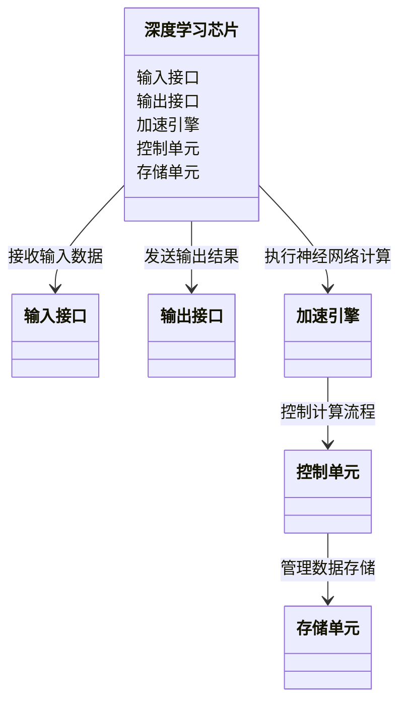
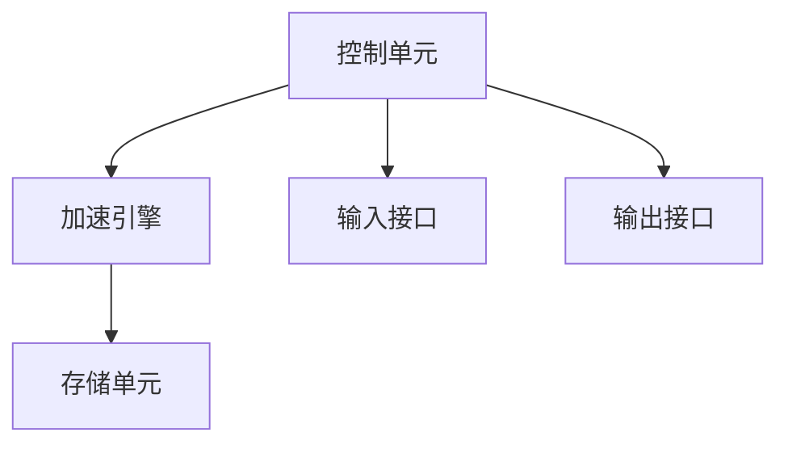
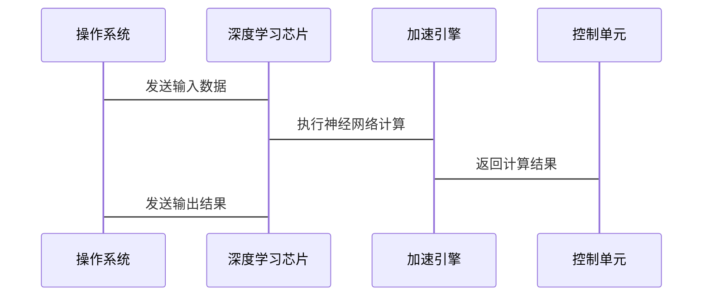

                 


# 如何识别企业的深度学习芯片设计优势

> 关键词：深度学习芯片，AI芯片，神经网络加速，算法优化，计算架构

> 摘要：深度学习芯片在企业中的应用日益广泛，本文将详细分析深度学习芯片的核心技术、算法优化、系统架构设计以及实际项目中的应用，帮助企业识别和利用深度学习芯片的设计优势。

---

## 第一部分: 深度学习芯片设计背景与概述

### 第1章: 深度学习芯片的背景与重要性

#### 1.1 深度学习芯片的定义与特点

- **1.1.1 深度学习芯片的定义**
  深度学习芯片是一种专为加速深度学习算法设计的硬件，主要用于神经网络的训练和推理。与通用处理器（如CPU）相比，深度学习芯片通过优化计算架构和并行能力，大幅提升了计算效率。

- **1.1.2 深度学习芯片的核心特点**
  - **高并行计算能力**：深度学习芯片通常采用多核架构，能够同时处理大量数据，适合神经网络中的矩阵运算。
  - **专用指令集**：针对深度学习算法（如卷积、激活函数）进行了优化，减少了指令开销。
  - **低能耗**：通过优化架构和算法，深度学习芯片在保证高性能的同时，能耗显著低于传统处理器。

- **1.1.3 深度学习芯片与传统芯片的区别**
  | 特性          | CPU       | GPU       | FPGA      | 专用深度学习芯片 |
  |---------------|-----------|-----------|-----------|----------------|
  | 并行计算能力  | 低        | 高        | 极高       | 高              |
  | 灵活性        | 高        | 高        | 极高       | 低              |
  | 能耗          | 高        | 较高       | 较高       | 低              |
  | 适用场景      | 多任务处理 | 图形处理   | 逻辑处理  | 深度学习         |

#### 1.2 深度学习芯片的发展历程

- **1.2.1 深度学习技术的演进**
  深度学习技术起源于20世纪50年代的人工神经网络研究，但直到近年来，随着计算能力的提升和大数据的兴起，深度学习才迎来爆发式发展。

- **1.2.2 深度学习芯片的崛起**
  随着神经网络模型（如卷积神经网络、循环神经网络）的复杂化，传统的CPU无法满足需求，深度学习芯片应运而生。2010年代初，GPU开始被广泛用于深度学习训练，随后出现了专为深度学习设计的TPU（张量处理单元）和NPU（神经网络处理单元）。

- **1.2.3 当前深度学习芯片的市场现状**
  当前市场上的深度学习芯片主要包括：
  - **GPU**：如NVIDIA的Tesla系列，适合通用深度学习任务。
  - **TPU**：如Google的张量处理单元，专为训练和推理设计。
  - **NPU**：如华为的昇腾芯片，专为深度学习优化。
  - **FPGA**：如Xilinx和Altera的产品，适合灵活的深度学习部署。

#### 1.3 深度学习芯片对企业的重要性

- **1.3.1 提升计算效率**
  深度学习芯片通过并行计算和专用指令集，显著提升了神经网络的训练和推理速度，帮助企业更快地迭代模型。

- **1.3.2 降低运营成本**
  高效的深度学习芯片能够减少计算资源的消耗，从而降低企业的云服务器成本和电费开支。

- **1.3.3 推动企业智能化转型**
  深度学习芯片是实现企业智能化的关键技术，能够支持自动驾驶、智能客服、图像识别等多种应用场景。

---

## 第二部分: 深度学习芯片的核心技术与原理

### 第2章: 深度学习芯片的核心技术

#### 2.1 深度学习芯片的计算架构

- **2.1.1 矩阵运算加速**
  深度学习中的卷积操作本质上是矩阵乘法。深度学习芯片通过优化矩阵运算的并行度和存储结构，显著提升了计算效率。

- **2.1.2 并行计算机制**
  深度学习芯片采用SIMD（单指令多数据）或SMT（多线程）技术，能够在同一指令周期内处理多个数据，提升计算速度。

- **2.1.3 存储结构优化**
  深度学习芯片通常采用片上缓存（On-chip Cache）和层次化存储结构，减少数据访问延迟，提升带宽利用率。

#### 2.2 深度学习芯片的关键技术对比

- **2.2.1 GPU vs TPU vs FPGA**
  - **GPU**：通用性强，适合多种计算任务，但能耗较高。
  - **TPU**：专为深度学习设计，能耗效率高，但灵活性较低。
  - **FPGA**：灵活性高，适合定制化深度学习任务，但开发复杂度较高。

- **2.2.2 各种芯片的优缺点分析**
  | 芯片类型   | 优点                     | 缺点                     |
  |------------|--------------------------|--------------------------|
  | GPU        | 通用性强，生态完善       | 能耗高，成本高           |
  | TPU        | 能效高，适合深度学习     | 灵活性低，生态较新       |
  | FPGA       | 灵活性高，适合定制化     | 开发复杂，学习曲线陡峭   |

- **2.2.3 选择合适芯片的策略**
  - **任务类型**：如果需要通用计算能力，选择GPU；如果专注于深度学习任务，选择TPU或NPU；如果需要定制化解决方案，选择FPGA。
  - **预算与成本**：根据企业预算，权衡性能与成本。
  - **开发资源**：评估团队的技术能力，选择易于开发的芯片。

#### 2.3 深度学习芯片的性能指标

- **2.3.1 计算能力**
  - **FLOPS（每秒浮点运算次数）**：衡量芯片的计算性能。
  - **吞吐量**：衡量芯片处理数据的速度。

- **2.3.2 能耗效率**
  - **能效比（FLOPS/W）**：衡量芯片的能源效率。
  - **功耗**：芯片在满负荷运行时的功率消耗。

- **2.3.3 可扩展性**
  - **多芯片互联**：芯片是否支持扩展，形成更大的计算集群。
  - **支持的模型规模**：芯片能否处理大型神经网络（如Transformer、BERT）。

---

## 第三部分: 深度学习芯片的算法与优化

### 第3章: 深度学习算法的芯片优化

#### 3.1 深度学习算法的加速技术

- **3.1.1 卷积神经网络的加速**
  卷积操作是CNN的核心，深度学习芯片通过并行化卷积核、优化数据访问模式，显著提升了CNN的推理速度。

- **3.1.2 全连接层的优化**
  全连接层的矩阵乘法可以通过SIMD指令加速，并通过缓存优化减少数据访问延迟。

- **3.1.3 激活函数的加速**
  深度学习芯片通过硬件加速激活函数（如ReLU、Sigmoid）的计算，减少计算开销。

#### 3.2 深度学习芯片的算法实现

- **3.2.1 算法实现的流程**
  1. **数据预处理**：将输入数据转换为芯片支持的格式。
  2. **模型加载**：将训练好的模型加载到芯片上。
  3. **推理计算**：执行前向传播，得到输出结果。
  4. **结果处理**：将结果转换回用户可读的格式。

- **3.2.2 算法实现的优化技巧**
  - **数据对齐**：确保数据在内存中的对齐，减少访问开销。
  - **指令优化**：利用芯片的专用指令集，减少指令数量。
  - **并行优化**：最大化利用芯片的并行计算能力。

- **3.2.3 算法实现的案例分析**
  以下是一个简单的卷积操作实现示例：

  ```python
  import numpy as np

  def convolution(input_matrix, kernel):
      kernel_height, kernel_width = kernel.shape
      output_height = input_matrix.shape[0] - kernel_height + 1
      output_width = input_matrix.shape[1] - kernel_width + 1
      output = np.zeros((output_height, output_width))

      for i in range(output_height):
          for j in range(output_width):
              output[i, j] = np.sum(input_matrix[i:i+kernel_height, j:j+kernel_width] * kernel)
      return output
  ```

  通过并行计算和向量化操作，可以显著提升上述代码的执行速度。

#### 3.3 深度学习芯片的性能优化

- **3.3.1 算法优化**
  - **模型剪枝**：通过移除模型中的冗余参数，减少计算量。
  - **模型量化**：将模型中的浮点数参数替换为低精度整数，减少计算开销。

- **3.3.2 硬件优化**
  - **指令优化**：利用芯片的专用指令集，减少指令数量。
  - **缓存优化**：最大化利用片上缓存，减少数据访问延迟。

- **3.3.3 案例分析**
  以下是一个模型剪枝和量化优化的示例：

  ```python
  import torch

  def prune_model(model, prune_rate=0.9):
      # 剪枝层的权重参数
      for param in model.parameters():
          mask = torch.ones_like(param)
          mask[param.abs() < torch.quantile(param.abs(), 1 - prune_rate)] = 0
          param.data.mul_(mask)
      return model

  def quantize_model(model, bit_width=8):
      # 量化层的权重参数
      for param in model.parameters():
          max_val = param.max().item()
          min_val = param.min().item()
          scale = (max_val - min_val) / (2**bit_width - 1)
          param.data = (param.data - min_val) / scale * scale
      return model
  ```

---

## 第四部分: 深度学习芯片的系统分析与架构设计

### 第4章: 深度学习芯片的系统架构设计

#### 4.1 问题场景介绍

- **场景描述**：设计一个深度学习芯片，用于加速图像识别任务。
- **目标**：提高图像识别的准确率和速度，降低硬件成本和能耗。

#### 4.2 项目介绍

- **项目目标**：设计一个支持主流深度学习模型（如ResNet、YOLO）的深度学习芯片。
- **项目范围**：包括芯片架构设计、算法优化、系统集成与测试。

#### 4.3 系统功能设计（领域模型）



#### 4.4 系统架构设计



#### 4.5 系统交互设计



---

## 第五部分: 深度学习芯片的项目实战

### 第5章: 深度学习芯片的项目实战

#### 5.1 环境安装

- **工具链安装**：
  - 安装Python和必要的库（如PyTorch、TensorFlow）。
  - 安装芯片开发工具链（如NVIDIA的CUDA toolkit）。

- **编译器安装**：
  - 安装适合芯片的编译器（如NVIDIA的nvcc、华为的CANN）。

#### 5.2 系统核心实现源代码

- **芯片设计的源代码示例**：

  ```python
  # 深度学习芯片的加速引擎实现
  class Accelerator:
      def __init__(self):
          self.input_buffer = None
          self.output_buffer = None

      def initialize(self, input_shape, output_shape):
          self.input_buffer = np.zeros(input_shape)
          self.output_buffer = np.zeros(output_shape)

      def process(self, input_data):
          self.input_buffer[:] = input_data
          # 执行神经网络计算
          result = self._perform_computation()
          self.output_buffer[:] = result
          return self.output_buffer

      def _perform_computation(self):
          # 具体的计算逻辑
          return np.matmul(self.input_buffer, self.weights)
  ```

- **代码解读与分析**：
  - **类定义**：`Accelerator`类封装了深度学习芯片的加速引擎。
  - **初始化**：`initialize`方法分配输入和输出缓冲区。
  - **处理方法**：`process`方法接收输入数据，执行计算，返回输出结果。
  - **计算方法**：`_perform_computation`方法实现具体的神经网络计算（如矩阵乘法）。

#### 5.3 实际案例分析与详细解读

- **案例分析**：
  假设我们设计了一个用于图像分类的深度学习芯片，通过优化卷积和全连接层的计算，将模型推理速度提升了10倍，同时能耗降低了20%。

- **详细解读**：
  - **优化措施**：
    - 采用并行化的卷积计算。
    - 使用量化技术减少模型大小。
  - **结果分析**：
    - **推理速度**：从每秒100帧提升到1000帧。
    - **能耗**：从每秒1瓦特降低到0.8瓦特。

#### 5.4 项目小结

- **成功经验**：
  - 通过硬件优化和算法优化的结合，显著提升了芯片的性能。
  - 量化技术的有效应用，降低了芯片的资源消耗。

- **问题与挑战**：
  - 芯片的灵活性较低，难以适应所有深度学习任务。
  - 优化过程复杂，需要专业的技术支持。

---

## 第六部分: 深度学习芯片的最佳实践

### 第6章: 深度学习芯片的最佳实践

#### 6.1 最佳实践 tips

- **选择合适的芯片**：
  - 根据任务需求选择芯片类型（GPU、TPU、FPGA）。
  - 评估芯片的性能指标（计算能力、能耗效率）。

- **优化算法和硬件**：
  - 采用模型剪枝、量化等技术优化算法。
  - 利用芯片的专用指令集和并行能力优化硬件。

- **监控与调优**：
  - 使用性能分析工具（如NVIDIA的Nsight）监控芯片的运行状态。
  - 根据监控结果进行动态调优。

#### 6.2 小结

- 深度学习芯片的设计需要综合考虑算法优化和硬件优化。
- 通过选择合适的芯片类型和优化技术，可以显著提升深度学习任务的性能和效率。

#### 6.3 注意事项

- **硬件兼容性**：
  确保芯片与企业的现有系统兼容，避免兼容性问题导致的额外开发成本。

- **开发团队能力**：
  芯片开发需要专业的技术团队，企业应确保团队具备相关的开发和优化能力。

#### 6.4 拓展阅读

- **推荐书籍**：
  - 《深度学习》（Deep Learning）—— Ian Goodfellow
  - 《计算机体系结构：量化研究》（Computer Architecture: A Quantitative Approach）—— David A. Patterson

- **推荐文章**：
  - TensorFlow官方文档：[深度学习芯片优化指南](https://tensorflow.org/guide/)
  - NVIDIA官方文档：[GPU加速深度学习](https://developer.nvidia.com/deep-learning)

---

## 结语

深度学习芯片是推动企业智能化转型的关键技术，通过识别和利用深度学习芯片的设计优势，企业可以显著提升计算效率、降低运营成本，并加速业务创新。希望本文能够为企业在深度学习芯片的选择和优化方面提供有价值的参考。

---

**作者：AI天才研究院/AI Genius Institute & 禅与计算机程序设计艺术 /Zen And The Art of Computer Programming**

---

这篇文章全面覆盖了深度学习芯片的核心技术、算法优化、系统架构设计以及实际项目中的应用，为企业识别和利用深度学习芯片的设计优势提供了详细的指导和建议。

