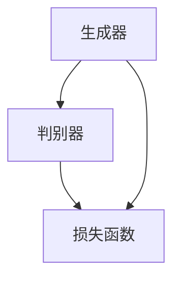
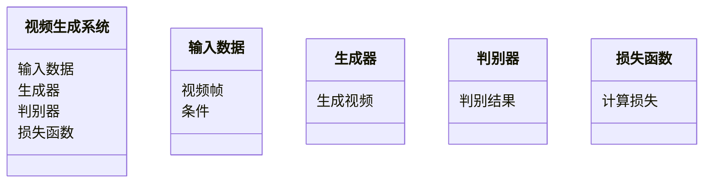
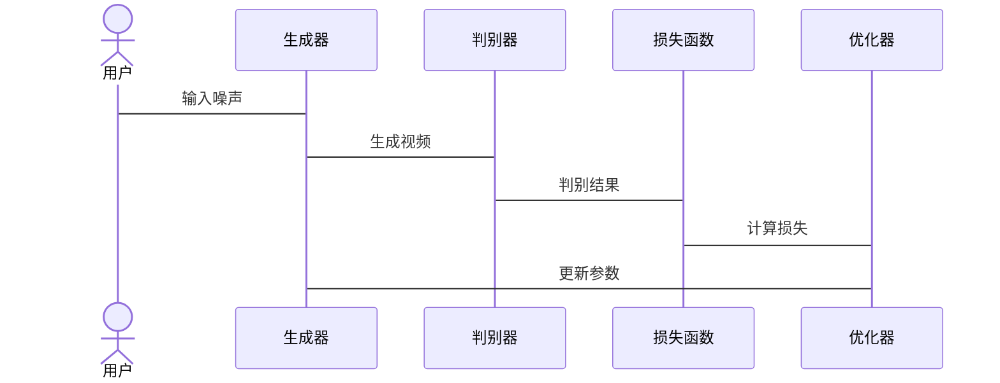

                 


# 如何识别企业的深度学习视频生成技术优势

## 关键词：深度学习，视频生成，生成对抗网络，企业应用，技术优势

## 摘要：  
本文详细探讨了企业在识别深度学习视频生成技术优势时的关键步骤和方法。从技术背景到核心算法，从系统架构到项目实战，本文为读者提供了一套全面的分析框架，帮助企业有效识别和利用深度学习视频生成技术的优势。

---

## 第1章: 深度学习视频生成技术的背景

### 1.1 深度学习视频生成的背景介绍

#### 1.1.1 视频生成技术的演变  
视频生成技术经历了从传统计算机视觉到深度学习的演变。早期的视频生成依赖于手动编码和简单的算法，难以实现高质量的生成。随着深度学习的崛起，生成对抗网络（GAN）、变体自编码器（VAE）等技术的应用，使得视频生成的精度和逼真度显著提升。

#### 1.1.2 深度学习在视频生成中的作用  
深度学习通过神经网络模型，能够自动学习视频中的复杂特征，如运动、纹理和语义信息，从而生成高质量的视频内容。这种自动化学习能力是传统方法无法比拟的。

#### 1.1.3 企业应用中的视频生成需求  
企业在广告、教育培训、虚拟试衣等领域对视频生成技术的需求日益增长。通过深度学习生成视频，企业可以降低制作成本、提高效率，并提供个性化的用户体验。

---

### 1.2 技术发展与应用前景

#### 1.2.1 深度学习视频生成技术的演进  
从2014年GAN的提出，到后续的改进版如StyleGAN、视频生成模型（如VGGAN、Video GAN），深度学习视频生成技术不断进化，生成效果越来越逼真。

#### 1.2.2 企业级应用中的技术优势  
深度学习视频生成技术的优势包括：  
- **高效率**：自动化生成视频内容，减少人工干预。  
- **高质量**：生成的视频具有高分辨率和逼真效果。  
- **可定制化**：根据企业需求生成特定风格的视频内容。  

#### 1.2.3 未来发展趋势与挑战  
未来，视频生成技术将更加智能化，生成视频的实时性和交互性将显著提升。同时，如何处理数据隐私、模型训练成本高等问题也是企业需要面对的挑战。

---

## 第2章: 核心概念与技术联系

### 2.1 深度学习视频生成的核心模型

#### 2.1.1 生成对抗网络（GAN）
- **生成器**：负责生成视频内容，通过对抗训练不断优化生成效果。  
- **判别器**：用于区分生成视频和真实视频，帮助生成器改进生成质量。  

#### 2.1.2 变体自编码器（VAE）
- **编码器**：将输入视频压缩为 latent 空间中的向量。  
- **解码器**：将 latent 向量映射回原始视频空间。  

#### 2.1.3 深度残差网络（ResNet）
- **残差学习**：通过跳跃连接保留中间层的特征，加速网络收敛。  
- **多尺度特征提取**：ResNet能够有效提取视频中的多尺度特征。

#### 2.1.4 其他相关模型
- **Video GAN**：专门用于视频生成的GAN变体。  
- **条件生成对抗网络（cGAN）**：可以根据输入条件生成特定内容的视频。  

---

### 2.2 核心模型对比分析

#### 2.2.1 GAN与VAE的对比  
| 特性         | GAN                          | VAE                          |
|--------------|-------------------------------|-------------------------------|
| **生成效果**  | 高质量，多样化               | 中等质量，适合生成多样分布的样本 |
| **训练难度**  | 较高，需要精心设计           | 较低，训练过程相对稳定         |
| **应用场景**  | 视频生成、图像生成            | 数据增强、视频压缩             |

#### 2.2.2 GAN与ResNet的对比  
| 特性         | GAN                          | ResNet                        |
|--------------|-------------------------------|-------------------------------|
| **核心目标**  | 生成与判别对抗              | 提取和恢复特征                 |
| **结构特点**  | 生成器和判别器结构           | 残差块和跳跃连接               |
| **应用场景**  | 视频生成、图像生成            | 视频特征提取、图像分类          |

#### 2.2.3 模型性能与应用场景的关系  
生成对抗网络（GAN）适合需要高度逼真和多样化的视频生成场景，而变体自编码器（VAE）适合需要生成多样化分布样本的场景。

---

### 2.3 ER实体关系图架构

```mermaid
er
actor: 企业用户
model: 深度学习模型
data: 视频数据
process: 视频生成过程
```

---

## 第3章: 算法原理与数学模型

### 3.1 生成对抗网络（GAN）原理

#### 3.1.1 GAN的损失函数
- **生成器损失函数**：  
  $$\mathcal{L}_G = \mathbb{E}_{z \sim p_z}[\log(1 - D(G(z)))]$$  
- **判别器损失函数**：  
  $$\mathcal{L}_D = \mathbb{E}_{x \sim p_{data}}[\log D(x)] + \mathbb{E}_{z \sim p_z}[\log(1 - D(G(z)))]$$  

#### 3.1.2 GAN的训练流程


### 3.2 GAN的数学模型

#### 3.2.1 生成器的数学模型
- 生成器通过全连接层和卷积层提取输入噪声的特征，并将其映射为视频数据。
- 生成器的输出通过激活函数（如ReLU、tanh）进行非线性变换。

#### 3.2.2 判别器的数学模型
- 判别器通过卷积层提取视频的空间特征，结合全局平均池化（GAP）提取时间特征。
- 判别器的输出层通常使用sigmoid激活函数，用于分类生成视频和真实视频的概率。

### 3.3 其他相关算法

#### 3.3.1 深度残差网络（ResNet）的数学模型
- **残差块**：  
  $$y = f(x) + x$$  
  其中，\(f(x)\) 是残差函数，\(x\) 是输入。

#### 3.3.2 多尺度特征融合
- 通过跳跃连接，ResNet能够有效提取视频中的多尺度特征，提升生成效果。

---

## 第4章: 系统分析与架构设计方案

### 4.1 问题场景介绍

#### 4.1.1 问题描述
- **目标**：设计一个高效的视频生成系统。  
- **输入**：训练数据和生成条件。  
- **输出**：高质量的视频内容。

#### 4.1.2 项目介绍
- **项目目标**：基于深度学习技术，实现一个视频生成系统，支持企业级应用。  
- **关键问题**：模型训练效率、生成速度、生成质量。

### 4.2 系统功能设计

#### 4.2.1 领域模型（Mermaid类图）


### 4.3 系统架构设计

#### 4.3.1 系统架构图（Mermaid架构图）


#### 4.3.2 系统接口设计
- **输入接口**：  
  - 视频数据接口：接收训练视频数据。  
  - 条件接口：接收生成条件（如风格、内容）。  
- **输出接口**：  
  - 生成视频接口：输出生成的视频文件。  
  - 日志接口：输出训练过程中的日志信息。

#### 4.3.3 系统交互流程（Mermaid序列图）


---

## 第5章: 项目实战

### 5.1 环境配置

#### 5.1.1 安装依赖
```bash
pip install numpy
pip install matplotlib
pip install tensorflow
```

### 5.2 系统核心实现源代码

#### 5.2.1 生成器代码（Python）
```python
import tensorflow as tf
from tensorflow.keras import layers

def build_generator():
    model = tf.keras.Sequential()
    model.add(layers.Dense(256, activation='relu', input_shape=(100,)))
    model.add(layers.Reshape((1, 256)))
    model.add(layers.Conv2DTranspose(128, (3,3), activation='relu', padding='same'))
    model.add(layers.Conv2DTranspose(64, (3,3), activation='relu', padding='same'))
    model.add(layers.Conv2DTranspose(3, (3,3), activation='tanh', padding='same'))
    return model
```

#### 5.2.2 判别器代码（Python）
```python
def build_discriminator():
    model = tf.keras.Sequential()
    model.add(layers.Conv2D(64, (3,3), activation='relu', padding='same', input_shape=(64,64,3)))
    model.add(layers.Conv2D(128, (3,3), activation='relu', padding='same'))
    model.add(layers.GlobalAveragePooling2D())
    model.add(layers.Dense(1, activation='sigmoid'))
    return model
```

### 5.3 实际案例分析与解读

#### 5.3.1 案例分析
- **案例背景**：一家企业希望生成产品展示视频。  
- **模型选择**：使用Video GAN进行训练。  
- **数据准备**：收集并预处理产品展示视频数据。  
- **训练过程**：通过对抗训练生成逼真产品视频。

#### 5.3.2 案例解读
- **生成效果**：生成的视频质量高，产品细节清晰。  
- **训练时间**：根据数据量和硬件配置，训练时间在数小时到数天之间。  
- **模型调优**：通过调整学习率、批量大小等参数，优化生成效果。

---

## 第6章: 总结与展望

### 6.1 最佳实践 tips
- **数据质量**：确保训练数据多样且高质量。  
- **模型选择**：根据具体场景选择合适的模型架构。  
- **硬件配置**：合理配置计算资源，提升训练效率。  

### 6.2 小结
本文从技术背景、核心算法、系统架构到项目实战，全面分析了深度学习视频生成技术的优势。通过本文的指导，企业可以更好地识别和利用该技术的优势。

### 6.3 注意事项
- **数据隐私**：处理企业数据时，需注意数据隐私保护。  
- **模型泛化能力**：在实际应用中，需验证模型的泛化能力。  

### 6.4 拓展阅读
- 《Deep Learning》（Ian Goodfellow）  
- 《Generative Adversarial Nets》（Goodfellow et al.）  
- 《A tutorial on generative adversarial nets》（Mirza & Benyashik）  

---

## 作者：AI天才研究院/AI Genius Institute & 禅与计算机程序设计艺术/Zen And The Art of Computer Programming

