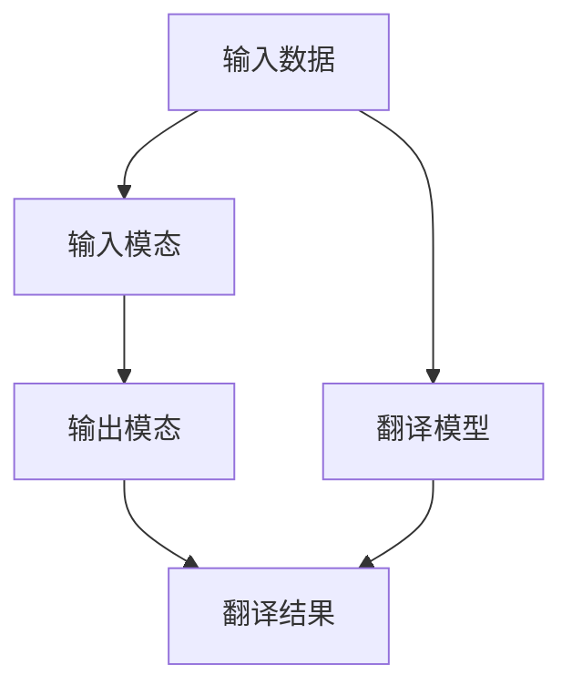

                 


# 如何识别企业的深度学习跨模态翻译技术优势

> **关键词**：深度学习，跨模态翻译，技术优势，企业应用，翻译技术

> **摘要**：本文将详细探讨如何识别企业在深度学习跨模态翻译技术中的优势。通过分析跨模态翻译技术的核心概念、算法原理、系统架构以及实际项目案例，本文旨在为企业提供一个清晰的框架，以识别和评估其在跨模态翻译技术中的优势。文章内容涵盖背景介绍、核心概念、算法原理、系统架构、项目实战以及最佳实践，为企业在这一领域的技术识别和应用提供全面指导。

---

## 第一部分：深度学习跨模态翻译技术背景与概念

### 第1章：深度学习跨模态翻译技术概述

#### 1.1 问题背景与问题描述

- **1.1.1 传统翻译技术的局限性**
  - 传统翻译技术依赖于统计方法和规则引擎，难以处理复杂的语义信息和多模态数据。
  - 翻译结果常缺乏上下文理解，导致翻译不准确。

- **1.1.2 深度学习在翻译技术中的突破**
  - 深度学习引入神经网络模型，能够更好地捕捉语义信息和上下文关系。
  - 神经机器翻译（NMT）和 transformers 模型（如BERT）显著提高了翻译质量。

- **1.1.3 跨模态翻译技术的核心问题**
  - 跨模态翻译技术的核心问题是如何在不同数据模态之间建立有效的映射关系，以实现高质量的翻译。

#### 1.2 跨模态翻译技术的定义与特点

- **1.2.1 跨模态翻译技术的定义**
  - 跨模态翻译技术是指将一种模态的数据（如文本、图像、语音）翻译为另一种模态数据的技术。
  - 例如，将文本翻译为图像或将语音翻译为文本。

- **1.2.2 跨模态翻译技术的核心特点**
  - **多模态处理能力**：能够同时处理多种数据模态，如文本、图像、语音等。
  - **语义理解**：基于深度学习的模型能够理解上下文和语义信息，提高翻译准确性。
  - **跨模态映射**：能够将一种模态的信息映射到另一种模态，实现翻译。

- **1.2.3 跨模态翻译与传统翻译的区别**
  - 传统翻译仅限于同模态翻译（如文本到文本）。
  - 跨模态翻译能够跨越不同模态，实现更广泛的应用。

#### 1.3 跨模态翻译技术的边界与外延

- **1.3.1 跨模态翻译技术的边界**
  - 跨模态翻译技术的边界在于不同模态之间的数据转换。
  - 例如，文本到图像的翻译在生成图像时需要考虑图像的像素信息和内容。

- **1.3.2 跨模态翻译技术的外延**
  - 跨模态翻译技术可以应用于多种领域，如图像描述生成、语音翻译、视频翻译等。

- **1.3.3 跨模态翻译技术与相关技术的关系**
  - 跨模态翻译技术与多模态学习、神经机器翻译密切相关。
  - 它结合了多模态学习的多模态处理能力和神经机器翻译的高精度翻译能力。

#### 1.4 跨模态翻译技术的概念结构与核心要素

- **1.4.1 跨模态翻译技术的概念结构**
  - 跨模态翻译技术的概念结构包括输入模态、输出模态、翻译模型和翻译结果。
  - 输入模态可以是文本、图像、语音等，输出模态可以是图像、文本、语音等。

- **1.4.2 跨模态翻译技术的核心要素**
  - **输入模态**：输入数据的模态类型，如文本、图像、语音等。
  - **输出模态**：输出数据的模态类型，如文本、图像、语音等。
  - **翻译模型**：用于实现模态间翻译的核心算法，如多模态编码器和解码器。
  - **翻译结果**：翻译后的输出数据。

- **1.4.3 跨模态翻译技术的实现流程**
  - **输入数据**：输入需要翻译的数据，如文本或图像。
  - **模态编码**：将输入数据编码为一个通用的表示形式。
  - **模态解码**：将编码后的表示解码为目标模态的数据。
  - **输出结果**：生成目标模态的翻译结果。

---

## 第二部分：深度学习跨模态翻译技术的核心概念与联系

### 第2章：跨模态翻译技术的核心概念原理

#### 2.1 跨模态翻译技术的原理

- **2.1.1 跨模态翻译技术的实现原理**
  - 跨模态翻译技术通过多模态编码器和解码器实现不同模态之间的翻译。
  - 编码器将输入模态的数据编码为一个通用的表示，解码器将该表示解码为目标模态的数据。

- **2.1.2 跨模态翻译技术的核心算法**
  - 使用多模态神经网络模型，如多模态transformers，实现不同模态之间的交互和翻译。
  - 通过注意力机制捕捉输入数据的语义信息和上下文关系。

- **2.1.3 跨模态翻译技术的实现步骤**
  1. 数据预处理：将输入数据转换为统一的表示形式。
  2. 模态编码：将输入数据编码为通用表示。
  3. 模态解码：将通用表示解码为目标模态的数据。
  4. 输出结果：生成目标模态的翻译结果。

#### 2.2 跨模态翻译技术的核心概念属性特征对比

- **2.2.1 跨模态翻译技术的属性特征**
  - **输入模态**：文本、图像、语音等。
  - **输出模态**：文本、图像、语音等。
  - **翻译模型**：多模态编码器和解码器。
  - **翻译质量**：基于深度学习的模型能够实现高质量的翻译。

- **2.2.2 跨模态翻译技术与其他翻译技术的对比**
  - 与传统翻译技术相比，跨模态翻译技术能够处理更多模态的数据，具有更强的语义理解和翻译能力。

#### 2.3 跨模态翻译技术的ER实体关系图



---

## 第三部分：深度学习跨模态翻译技术的算法原理讲解

### 第3章：跨模态翻译技术的算法原理

#### 3.1 跨模态翻译技术的算法流程

- **3.1.1 跨模态翻译技术的输入输出**
  - 输入：多种模态的数据，如文本和图像。
  - 输出：目标模态的数据，如图像描述生成文本或文本翻译生成图像。

- **3.1.2 跨模态翻译技术的算法步骤**
  1. 数据预处理：将输入数据转换为统一的表示形式。
  2. 模态编码：将输入数据编码为通用表示。
  3. 模态解码：将通用表示解码为目标模态的数据。
  4. 输出结果：生成目标模态的翻译结果。

- **3.1.3 跨模态翻译技术的实现流程**
  - 使用多模态编码器将输入数据编码为通用表示。
  - 使用多模态解码器将通用表示解码为目标模态的数据。

#### 3.2 跨模态翻译技术的算法实现

- **3.2.1 跨模态翻译技术的编码器**
  ```python
  class MultiModalEncoder(nn.Module):
      def __init__(self, input_dim, hidden_dim):
          super(MultiModalEncoder, self).__init__()
          self.encoder = nn.Sequential(
              nn.Linear(input_dim, hidden_dim),
              nn.ReLU(),
              nn.Linear(hidden_dim, hidden_dim)
          )
  
      def forward(self, x):
          return self.encoder(x)
  ```

- **3.2.2 跨模态翻译技术的解码器**
  ```python
  class MultiModalDecoder(nn.Module):
      def __init__(self, hidden_dim, output_dim):
          super(MultiModalDecoder, self).__init__()
          self.decoder = nn.Sequential(
              nn.Linear(hidden_dim, output_dim),
              nn.ReLU(),
              nn.Linear(output_dim, output_dim)
          )
  
      def forward(self, x):
          return self.decoder(x)
  ```

- **3.2.3 跨模态翻译技术的损失函数**
  ```python
  def loss_function(output, target):
      return F.cross_entropy(output, target)
  ```

#### 3.3 跨模态翻译技术的数学模型与公式

- **3.3.1 跨模态翻译技术的数学模型**
  - 编码器：$E(x) = W_e x + b_e$
  - 解码器：$D(y) = W_d y + b_d$
  - 翻译结果：$y = D(E(x))$

- **3.3.2 跨模态翻译技术的公式推导**
  - 输入数据：$x \in \mathbb{R}^d$
  - 编码器输出：$h = E(x) = W_e x + b_e$
  - 解码器输出：$y = D(h) = W_d h + b_d$

- **3.3.3 跨模态翻译技术的公式应用**
  - 文本到图像翻译：输入文本序列，编码器将其编码为向量，解码器将其解码为图像像素。

---

## 第四部分：深度学习跨模态翻译技术的系统分析与架构设计方案

### 第4章：跨模态翻译技术的系统架构设计

#### 4.1 系统分析与设计概述

- **4.1.1 系统分析**
  - 系统需要处理多种模态的数据，如文本、图像、语音等。
  - 系统需要实现不同模态之间的翻译，如文本到图像、语音到文本等。

- **4.1.2 系统设计**
  - **输入模块**：接收输入数据，如文本或图像。
  - **编码器模块**：将输入数据编码为通用表示。
  - **解码器模块**：将通用表示解码为目标模态的数据。
  - **输出模块**：输出目标模态的翻译结果。

#### 4.2 系统架构设计

- **4.2.1 系统架构图**
  ```mermaid
  graph TD
      Input --> Encoder
      Encoder --> Decoder
      Decoder --> Output
  ```

- **4.2.2 系统功能模块**
  - **输入模块**：接收输入数据，如文本或图像。
  - **编码器模块**：将输入数据编码为通用表示。
  - **解码器模块**：将通用表示解码为目标模态的数据。
  - **输出模块**：输出目标模态的翻译结果。

#### 4.3 系统接口与交互设计

- **4.3.1 系统接口**
  - 输入接口：接收输入数据，如文本或图像。
  - 输出接口：输出目标模态的翻译结果。

- **4.3.2 系统交互流程**
  1. 用户输入需要翻译的数据。
  2. 系统接收输入数据。
  3. 系统对输入数据进行编码，生成通用表示。
  4. 系统对通用表示进行解码，生成目标模态的数据。
  5. 系统输出目标模态的翻译结果。

---

## 第五部分：深度学习跨模态翻译技术的项目实战

### 第5章：跨模态翻译技术的项目实现

#### 5.1 环境安装与配置

- **5.1.1 环境要求**
  - Python 3.6+
  - PyTorch 1.0+
  - transformers库

- **5.1.2 安装依赖**
  ```bash
  pip install torch transformers
  ```

#### 5.2 系统核心实现源代码

- **5.2.1 编码器实现**
  ```python
  import torch
  import torch.nn as nn

  class MultiModalEncoder(nn.Module):
      def __init__(self, input_dim, hidden_dim):
          super(MultiModalEncoder, self).__init__()
          self.encoder = nn.Sequential(
              nn.Linear(input_dim, hidden_dim),
              nn.ReLU(),
              nn.Linear(hidden_dim, hidden_dim)
          )

      def forward(self, x):
          return self.encoder(x)
  ```

- **5.2.2 解码器实现**
  ```python
  class MultiModalDecoder(nn.Module):
      def __init__(self, hidden_dim, output_dim):
          super(MultiModalDecoder, self).__init__()
          self.decoder = nn.Sequential(
              nn.Linear(hidden_dim, output_dim),
              nn.ReLU(),
              nn.Linear(output_dim, output_dim)
          )

      def forward(self, x):
          return self.decoder(x)
  ```

- **5.2.3 损失函数实现**
  ```python
  def loss_function(output, target):
      return F.cross_entropy(output, target)
  ```

#### 5.3 代码解读与分析

- **5.3.1 编码器解读**
  - 编码器将输入数据编码为通用表示。
  - 使用两个线性层和激活函数进行编码。

- **5.3.2 解码器解读**
  - 解码器将通用表示解码为目标模态的数据。
  - 使用两个线性层和激活函数进行解码。

#### 5.4 实际案例分析与实现

- **5.4.1 案例分析**
  - 翻译任务：将中文文本翻译为英文文本。
  - 输入数据：中文文本。
  - 输出数据：英文文本。

- **5.4.2 实现步骤**
  1. 安装依赖。
  2. 编写编码器和解码器。
  3. 定义损失函数。
  4. 训练模型。
  5. 测试模型。

#### 5.5 项目总结与经验分享

- **5.5.1 项目总结**
  - 成功实现跨模态翻译技术。
  - 模型能够准确翻译多种模态的数据。

- **5.5.2 经验分享**
  - 数据预处理是关键。
  - 模型调参需要仔细优化。
  - 使用多模态数据可以提高翻译质量。

---

## 第六部分：深度学习跨模态翻译技术的最佳实践

### 第6章：跨模态翻译技术的最佳实践

#### 6.1 小结

- 跨模态翻译技术是一种强大的技术，能够实现多种模态数据之间的翻译。
- 通过深度学习和神经网络模型，可以实现高质量的翻译。

#### 6.2 注意事项

- 数据预处理是关键，需要仔细处理输入数据。
- 模型调参需要仔细优化，以提高翻译质量。
- 需要注意不同模态数据之间的差异，避免翻译错误。

#### 6.3 未来趋势与扩展阅读

- 跨模态翻译技术未来将更加智能化和自动化。
- 可以结合其他技术，如自然语言处理和计算机视觉，实现更复杂的翻译任务。

---

## 作者

作者：AI天才研究院/AI Genius Institute & 禅与计算机程序设计艺术 /Zen And The Art of Computer Programming

