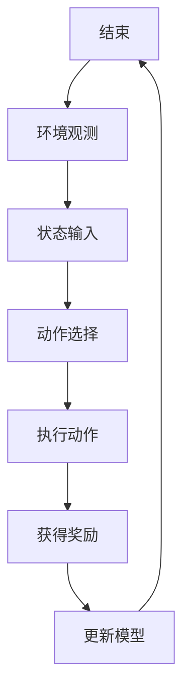
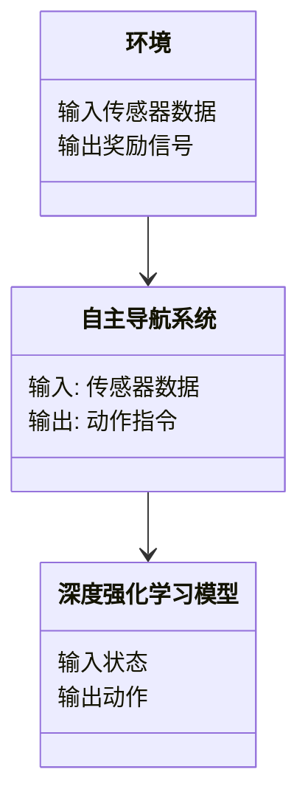
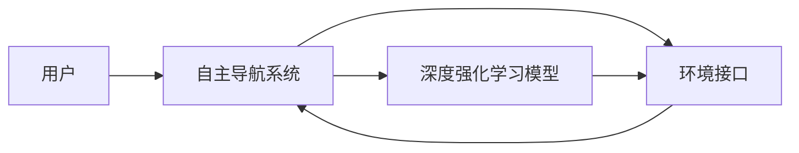
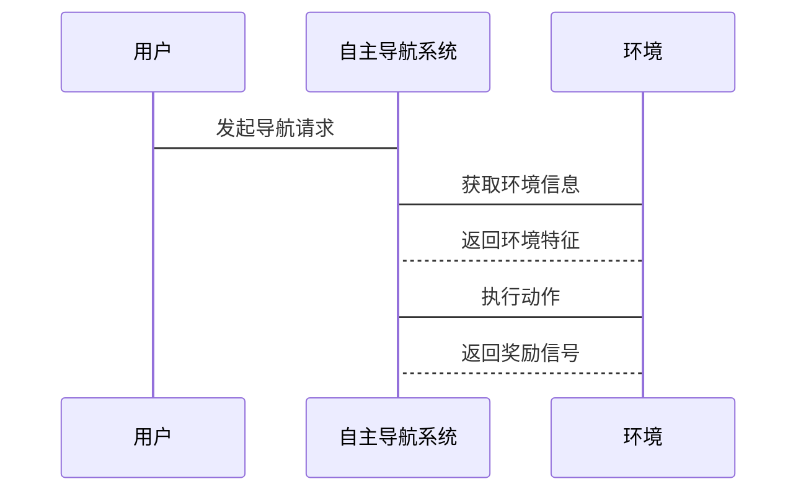

                 


# 如何识别企业的深度强化学习自主导航优势

## 关键词：深度强化学习，自主导航，企业应用，系统架构，算法实现

## 摘要

深度强化学习在企业自主导航中的应用正在变得越来越重要。本文通过详细分析深度强化学习的核心原理、算法实现、系统架构及实际案例，帮助读者识别企业在自主导航中的优势，为企业技术决策者提供实用的指导。

---

# 第1章: 问题背景与核心概念

## 1.1 问题背景

### 1.1.1 企业自主导航的核心需求

企业的自主导航系统需要具备以下核心需求：

1. **自主性**：系统能够在无外部干预的情况下完成任务。
2. **环境适应性**：能够感知并适应动态变化的环境。
3. **决策优化**：通过学习不断优化决策策略。

### 1.1.2 深度强化学习在自主导航中的作用

深度强化学习（Deep Reinforcement Learning, DRL）通过结合深度学习和强化学习，为自主导航提供了强大的决策能力。深度学习擅长特征提取，强化学习擅长策略优化，两者的结合使系统能够在复杂环境中实现自主导航。

### 1.1.3 问题的边界与外延

- **边界**：自主导航仅关注系统在特定环境中的决策，不涉及外部系统的交互。
- **外延**：深度强化学习可以应用于机器人、自动驾驶、智能助手等领域。

## 1.2 核心概念与问题解决

### 1.2.1 深度强化学习的基本原理

深度强化学习通过神经网络提取环境特征，并通过强化学习优化决策策略。其核心步骤包括：

1. **环境观测**：系统通过传感器获取环境信息。
2. **状态表示**：将观测信息映射为状态。
3. **动作选择**：根据当前状态选择最优动作。
4. **奖励机制**：通过奖励信号优化策略。

### 1.2.2 自主导航的关键技术

- **路径规划**：基于环境信息生成最优路径。
- **障碍物规避**：实时检测并规避障碍物。
- **目标追踪**：持续追踪目标位置。

### 1.2.3 问题解决的路径与方法

1. **路径规划**：使用A*算法或RRT算法。
2. **障碍物规避**：基于实时传感器数据调整路径。
3. **目标追踪**：通过卡尔曼滤波或粒子滤波实现。

---

# 第2章: 核心概念与联系

## 2.1 深度强化学习的原理

### 2.1.1 深度学习与强化学习的结合

深度强化学习通过神经网络将原始观测数据映射为高维特征，强化学习利用这些特征进行策略优化。

### 2.1.2 神经网络在自主导航中的应用

神经网络用于处理传感器数据，提取环境特征，并生成决策动作。

### 2.1.3 状态、动作与奖励的关系

- **状态**：系统当前的环境信息。
- **动作**：系统选择的行为。
- **奖励**：系统行为的价值反馈。

## 2.2 核心概念属性对比表

| 对比维度 | 深度强化学习 | 传统强化学习 |
|----------|--------------|---------------|
| 特征提取 | 使用神经网络 | 使用手动特征 | 
| 决策优化 | 高度自主 | 需要人工干预 |
| 应用场景 | 复杂动态环境 | 简单静态环境 |

## 2.3 ER实体关系图

```mermaid
er
    actor(用户)
    actor --> system(自主导航系统)
    system --> environment(环境)
    system --> model(深度强化学习模型)
    model --> actions(动作)
```

---

# 第3章: 算法原理讲解

## 3.1 算法原理概述

### 3.1.1 深度强化学习的基本框架

深度强化学习的基本框架包括：

1. **神经网络**：负责状态到动作的映射。
2. **策略优化**：通过奖励信号优化策略。

### 3.1.2 策略梯度与值函数的结合

策略梯度方法通过梯度下降优化策略，值函数方法通过预测值函数优化策略。

### 3.1.3 算法的收敛性分析

深度强化学习算法在复杂环境中的收敛性依赖于环境的马尔可夫性质和奖励设计。

## 3.2 算法流程图



## 3.3 Python代码实现

### 代码3-1: 深度强化学习模型的基本结构

```python
import torch
import torch.nn as nn

class DQN(nn.Module):
    def __init__(self, input_dim, output_dim):
        super(DQN, self).__init__()
        self.fc1 = nn.Linear(input_dim, 64)
        self.fc2 = nn.Linear(64, output_dim)
        self.relu = nn.ReLU()
        self.softmax = nn.Softmax(dim=1)

    def forward(self, x):
        x = self.fc1(x)
        x = self.relu(x)
        x = self.fc2(x)
        x = self.softmax(x)
        return x
```

---

# 第4章: 数学模型与公式推导

## 4.1 策略梯度方法

策略梯度方法通过最大化期望奖励来优化策略。其目标函数为：

$$ J(\theta) = \mathbb{E}_{\tau \sim \pi_\theta}[\sum_{t=0}^\infty \gamma^t r_t] $$

其中，$\theta$ 是模型参数，$\gamma$ 是折扣因子。

## 4.2 值函数方法

值函数方法通过预测值函数来优化策略。其目标函数为：

$$ V_\pi(s) = \mathbb{E}[r_{t+1} + \gamma r_{t+2} + \dots] $$

---

# 第5章: 系统分析与架构设计

## 5.1 系统功能设计

### 5.1.1 领域模型



## 5.2 系统架构设计



## 5.3 接口设计

### 5.3.1 传感器接口

- 输入：传感器数据（如激光雷达、摄像头）
- 输出：环境特征

### 5.3.2 动作接口

- 输入：模型输出的动作指令
- 输出：执行动作

## 5.4 交互序列图



---

# 第6章: 项目实战

## 6.1 环境安装

安装必要的库：

```bash
pip install torch numpy matplotlib
```

## 6.2 核心代码实现

### 代码6-1: 自主导航系统的实现

```python
import torch
import torch.nn as nn
import torch.optim as optim

class DQN(nn.Module):
    def __init__(self, input_dim, output_dim):
        super(DQN, self).__init__()
        self.fc1 = nn.Linear(input_dim, 64)
        self.fc2 = nn.Linear(64, output_dim)
        self.relu = nn.ReLU()
        self.softmax = nn.Softmax(dim=1)

    def forward(self, x):
        x = self.fc1(x)
        x = self.relu(x)
        x = self.fc2(x)
        x = self.softmax(x)
        return x

def train_model(model, optimizer, criterion, input_data, target_output):
    outputs = model(input_data)
    loss = criterion(outputs, target_output)
    loss.backward()
    optimizer.step()
    return loss.item()

# 示例训练
input_data = torch.randn(1, 4)
target_output = torch.randn(1, 4)

model = DQN(4, 4)
optimizer = optim.Adam(model.parameters(), lr=0.001)
criterion = nn.MSELoss()

for epoch in range(100):
    loss = train_model(model, optimizer, criterion, input_data, target_output)
    print(f"Epoch {epoch+1}, Loss: {loss}")
```

---

# 第7章: 总结与展望

## 7.1 总结

深度强化学习在企业自主导航中的应用为企业提供了强大的决策能力和灵活性。通过本文的分析，读者可以更好地理解深度强化学习的核心原理、算法实现和系统架构，并能够在实际项目中应用这些技术。

## 7.2 展望

未来，随着深度强化学习技术的不断发展，企业自主导航系统将更加智能化和高效化。通过结合边缘计算和物联网技术，自主导航系统将能够在更复杂的环境中实现自主决策。

---

# 最佳实践 Tips

1. 在实际项目中，建议先从简单的场景入手，逐步扩展到复杂场景。
2. 确保传感器数据的准确性和实时性，这对系统的性能至关重要。
3. 定期对模型进行调优，以提高系统的稳定性和响应速度。

---

# 小结

本文详细介绍了深度强化学习在企业自主导航中的应用，从理论到实践，为企业技术决策者提供了全面的指导。

---

# 注意事项

- 在部署深度强化学习系统时，需注意系统的实时性和安全性。
- 定期对系统进行维护和更新，以适应环境的变化。

---

# 拓展阅读

- 《Deep Learning》 - Ian Goodfellow
- 《Reinforcement Learning: Theory and Algorithms》 - Richard S. Sutton

---

# 作者

作者：AI天才研究院/AI Genius Institute & 禅与计算机程序设计艺术/Zen And The Art of Computer Programming

---

**全文完**

