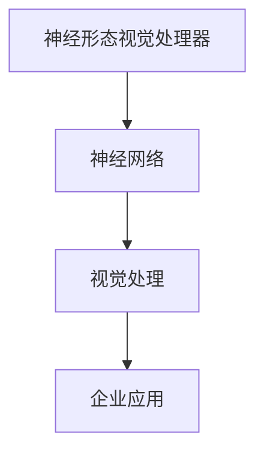
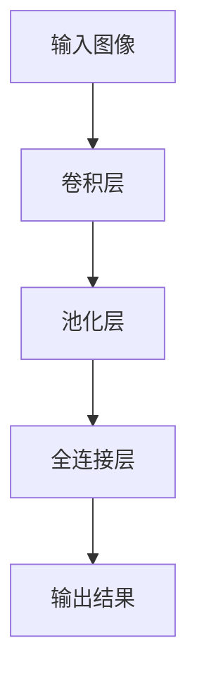
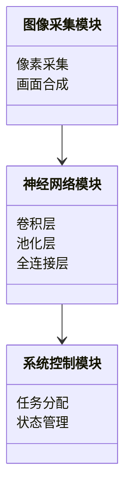
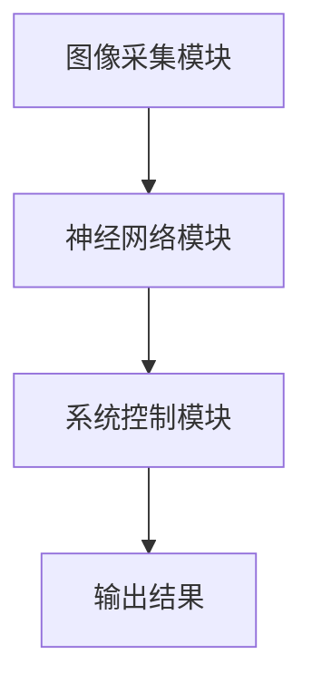
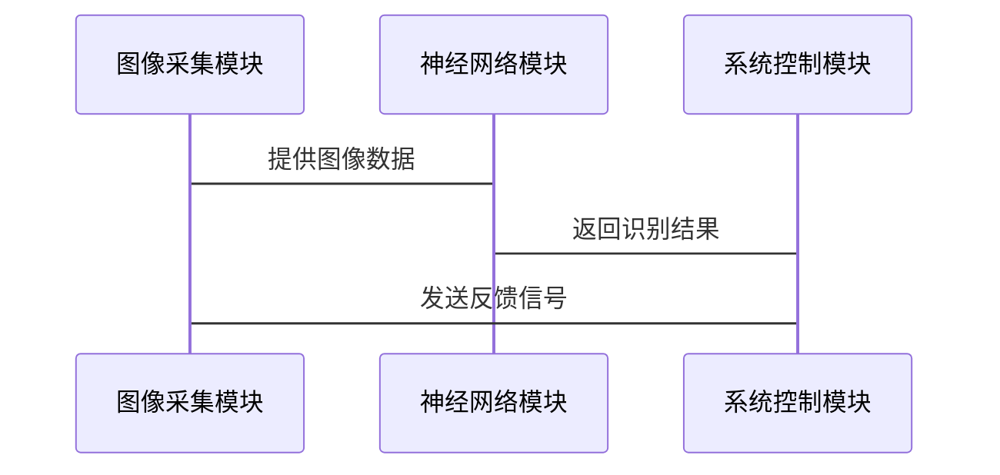

                 


# 如何识别企业的神经形态视觉处理器优势

## 关键词：
神经形态视觉处理器、企业优势识别、视觉处理技术、神经网络、算法原理、系统架构、项目实战

## 摘要：
神经形态视觉处理器是一种结合了神经科学和计算机视觉技术的新型处理器，能够高效地处理复杂的视觉任务。本文将从背景介绍、核心概念、算法原理、系统架构、项目实战等多方面，详细讲解如何识别企业的神经形态视觉处理器优势。通过理论与实践相结合的方式，帮助读者全面理解神经形态视觉处理器的技术特点和应用价值。

## 第一部分：背景介绍

### 第1章：神经形态视觉处理器概述
#### 1.1 问题背景
- 1.1.1 传统视觉处理器的局限性
  - 传统视觉处理器在处理复杂视觉任务时，如实时图像识别和深度学习，存在计算效率低下、功耗高等问题。
- 1.1.2 神经形态计算的兴起
  - 神经形态计算是一种模拟生物神经系统信息处理方式的计算模式，具有低功耗、高并行计算能力等优势。
- 1.1.3 企业视觉处理需求的演变
  - 随着人工智能技术的发展，企业对视觉处理的需求逐渐从简单的图像处理向复杂的模式识别和实时分析转变。

#### 1.2 问题描述
- 1.2.1 神经形态视觉处理器的核心问题
  - 如何在保持低功耗的同时，实现高效的视觉信息处理和识别。
- 1.2.2 企业视觉处理中的挑战
  - 传统视觉处理器在处理大规模数据时效率不足，且难以满足实时性和准确性要求。
- 1.2.3 神经形态视觉处理器的潜在解决方案
  - 利用神经网络的并行计算能力和低功耗特点，提升视觉处理的效率和准确性。

#### 1.3 问题解决
- 1.3.1 神经形态视觉处理器的基本原理
  - 神经形态视觉处理器通过模拟生物神经元的信息处理方式，结合视觉传感器的输入，实现高效的视觉信息处理。
- 1.3.2 神经网络在视觉处理中的应用
  - 神经网络（如卷积神经网络CNN）在图像识别、目标检测等领域表现出色。
- 1.3.3 神经形态视觉处理器的优势
  - 高效性：相比传统处理器，神经形态视觉处理器在视觉任务中的计算效率显著提升。
  - 低功耗：采用生物启发式设计，大幅降低了功耗。
  - 实时性：能够实现实时的视觉信息处理和反馈。

#### 1.4 边界与外延
- 1.4.1 神经形态视觉处理器的适用范围
  - 适用于需要高效视觉处理和实时反馈的场景，如自动驾驶、智能安防、机器人视觉等。
- 1.4.2 与传统视觉处理器的对比
  - 从硬件架构、计算模式、功耗等方面进行对比，明确神经形态视觉处理器的优势和适用场景。
- 1.4.3 神经形态视觉处理器的未来发展
  - 随着技术进步，神经形态视觉处理器将在更多领域得到应用，并推动人工智能技术的发展。

#### 1.5 概念结构与核心要素
- 1.5.1 神经形态视觉处理器的核心要素
  - 神经网络架构、视觉传感器接口、低功耗计算单元、实时处理能力。
- 1.5.2 概念结构图
  - 使用Mermaid图展示神经形态视觉处理器的核心要素及其相互关系。

## 第二部分：核心概念与联系

### 第2章：神经形态视觉处理器的核心概念
#### 2.1 神经形态视觉处理器的工作原理
- 2.1.1 神经网络的基本原理
  - 神经网络通过多层神经元和权重参数，实现对输入数据的特征提取和分类。
- 2.1.2 视觉处理器的功能特点
  - 视觉处理器通过硬件加速，实现高效的图像采集、处理和分析。
- 2.1.3 神经形态视觉处理器的整合机制
  - 神经形态视觉处理器通过整合神经网络和视觉处理器的功能，实现高效的视觉信息处理。

#### 2.2 核心概念对比
- 2.2.1 神经形态视觉处理器与传统视觉处理器的对比
  - 从硬件架构、计算模式、功耗等方面进行对比，明确神经形态视觉处理器的优势。
- 2.2.2 神经网络与传统算法的对比
  - 从算法效率、计算模式、适用场景等方面进行对比，分析神经网络在视觉处理中的优势。
- 2.2.3 神经形态视觉处理器与其他神经形态芯片的对比
  - 从应用领域、硬件架构、性能指标等方面进行对比，明确神经形态视觉处理器的独特性。

#### 2.3 实体关系图


## 第三部分：算法原理讲解

### 第3章：神经形态视觉处理器的算法原理
#### 3.1 神经网络模型
- 3.1.1 卷积神经网络（CNN）
  - 通过卷积层、池化层和全连接层，实现图像的特征提取和分类。
- 3.1.2 深度神经网络（DNN）
  - 通过多层神经网络，实现复杂视觉任务的深度学习。
- 3.1.3 神经网络的训练与推理
  - 神经网络的训练过程包括正向传播、损失计算和反向传播，推理过程则是将输入数据通过训练好的模型进行预测。

#### 3.2 算法流程


#### 3.3 神经网络的数学模型
- 3.3.1 卷积层的数学表达
  - $$ y = \sum_{i=1}^{k} w_i \cdot x_i + b $$
- 3.3.2 池化层的数学表达
  - $$ y = \max(x_1, x_2, x_3, x_4) $$
- 3.3.3 损失函数的数学表达
  - $$ L = -\sum_{i=1}^{n} y_i \log p_i + (1 - y_i) \log (1 - p_i) $$

#### 3.4 神经网络的训练与优化
- 3.4.1 梯度下降算法
  - 使用反向传播算法计算梯度，并通过调整权重参数实现模型优化。
- 3.4.2 正则化技术
  - 使用L2正则化（权重衰减）和Dropout技术，防止模型过拟合。

#### 3.5 神经网络的实现代码
```python
import torch
import torch.nn as nn
import torch.optim as optim

class NeuralNetwork(nn.Module):
    def __init__(self):
        super(NeuralNetwork, self).__init__()
        self.conv1 = nn.Conv2d(in_channels=3, out_channels=6, kernel_size=5)
        self.pool = nn.MaxPool2d(kernel_size=2, stride=2)
        self.conv2 = nn.Conv2d(in_channels=6, out_channels=16, kernel_size=5)
        self.fc1 = nn.Linear(16 * 5 * 5, 120)
        self.fc2 = nn.Linear(120, 84)
        self.fc3 = nn.Linear(84, 10)

    def forward(self, x):
        x = self.pool(F.relu(self.conv1(x)))
        x = self.pool(F.relu(self.conv2(x)))
        x = x.view(-1, 16 * 5 * 5)
        x = F.relu(self.fc1(x))
        x = F.relu(self.fc2(x))
        x = self.fc3(x)
        return x

net = NeuralNetwork()
criterion = nn.CrossEntropyLoss()
optimizer = optim.SGD(net.parameters(), lr=0.001)
```

#### 3.6 算法原理的总结与分析
- 通过分析神经网络的数学模型和实现代码，理解神经形态视觉处理器在视觉处理中的优势，包括高效的特征提取、强大的并行计算能力和低功耗等特点。

## 第四部分：系统分析与架构设计

### 第4章：神经形态视觉处理器的系统架构
#### 4.1 项目介绍
- 本项目旨在设计并实现一个基于神经形态视觉处理器的图像识别系统，利用神经网络模型进行图像分类和目标检测。

#### 4.2 系统功能设计
- 4.2.1 领域模型设计
  - 使用Mermaid类图展示系统中的各个组件及其关系。

- 4.2.2 系统架构设计
  - 使用Mermaid架构图展示系统的整体架构。

- 4.2.3 系统接口设计
  - 系统接口包括图像采集接口、神经网络接口和输出接口，每个接口的功能和调用方式需要详细说明。

#### 4.3 系统交互设计
- 使用Mermaid序列图展示系统中的交互流程。


## 第五部分：项目实战

### 第5章：神经形态视觉处理器的项目实战
#### 5.1 环境安装
- 需要安装的工具和库包括Python、PyTorch、OpenCV等，详细安装步骤需要列出。

#### 5.2 核心代码实现
- 实现神经网络模型的训练和推理功能，详细解读代码的每一部分，包括数据预处理、模型训练、模型推理等。

#### 5.3 代码应用解读与分析
- 通过具体案例分析，解读代码在实际应用中的表现，包括训练效果、推理速度、准确率等指标。

#### 5.4 实际案例分析
- 分析一个实际案例，如自动驾驶中的图像识别，展示神经形态视觉处理器在实际场景中的应用效果。

#### 5.5 项目小结
- 总结项目实现过程中的经验和教训，提出改进建议，并展望未来的发展方向。

## 第六部分：最佳实践

### 第6章：神经形态视觉处理器的最佳实践
#### 6.1 小结
- 总结全文的主要内容，强调神经形态视觉处理器的优势和应用前景。

#### 6.2 注意事项
- 提醒读者在实际应用中需要注意的问题，如硬件兼容性、算法优化、数据隐私等。

#### 6.3 拓展阅读
- 推荐相关领域的书籍和论文，供读者进一步学习和研究。

## 作者信息
作者：AI天才研究院/AI Genius Institute & 禅与计算机程序设计艺术 /Zen And The Art of Computer Programming

---

以上是《如何识别企业的神经形态视觉处理器优势》的详细目录大纲，涵盖了从背景介绍到项目实战的各个方面，确保读者能够全面理解神经形态视觉处理器的优势及其在企业中的应用。

