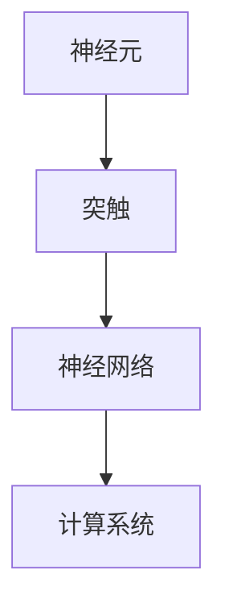
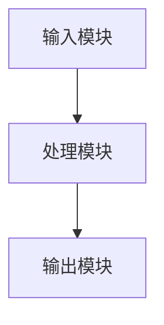
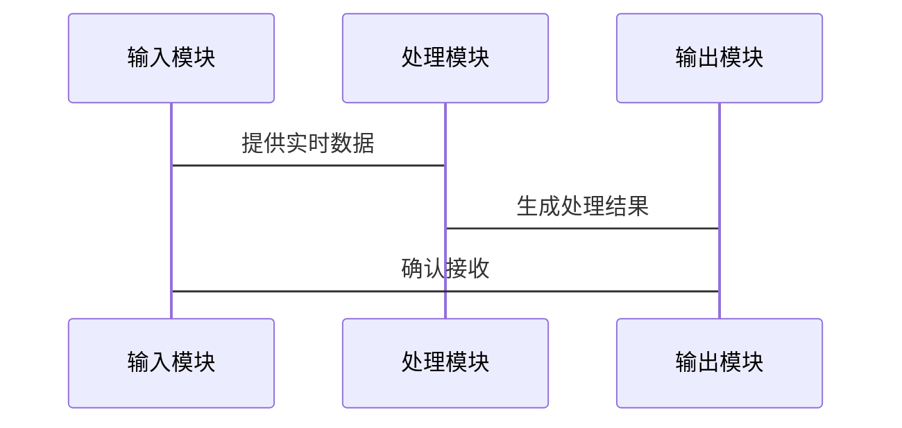

                 

<think>
好的，我现在需要根据用户的详细要求，逐步构建一篇关于“如何识别企业的神经形态计算优势”的技术博客文章。用户提供了详细的目录结构，我需要按照这个结构逐步填充内容，确保每个部分都符合要求。

首先，我会先理解每个章节的内容和要求，然后逐步填充每个小节，确保内容详细、逻辑清晰，并且符合技术博客的风格。

让我们一步一步来思考和撰写这篇文章。

---

# 如何识别企业的神经形态计算优势

## 关键词：
神经形态计算, 企业优势识别, 算法原理, 系统架构, 项目实战

## 摘要：
神经形态计算是一种革命性的计算模式，模拟生物神经系统的结构和功能，具有低功耗、实时处理和高并行性等优势。本文从背景、核心概念、算法原理、系统架构、项目实战等多个维度，详细解析神经形态计算的优势，帮助企业识别和利用这一技术，提升竞争力。

---

# 第一部分: 神经形态计算的背景与概述

## 第1章: 神经形态计算的背景与核心概念

### 1.1 神经形态计算的定义与特点

#### 1.1.1 神经形态计算的定义
神经形态计算（Neuromorphic Computing）是一种模拟生物神经系统结构和功能的计算范式。它通过模拟神经元和突触的特性，实现信息处理和计算任务。神经形态计算强调低功耗、实时性、高并行性和事件驱动的特点，适用于复杂模式识别和实时数据处理场景。

#### 1.1.2 神经形态计算的核心特点
1. **事件驱动**：仅在有事件发生时触发计算，减少无用的计算。
2. **低功耗**：通过模拟生物神经系统的能量效率，降低功耗。
3. **高并行性**：模拟生物神经系统中的并行处理能力。
4. **自适应性**：能够动态调整计算参数，适应不同场景。

#### 1.1.3 神经形态计算与传统计算的区别
| 特性               | 神经形态计算             | 传统计算             |
|--------------------|--------------------------|----------------------|
| 处理模式           | 事件驱动、并行处理       | 批处理、串行处理     |
| 功耗               | 低功耗                   | 高功耗               |
| 适应性             | 高度自适应               | 较低                 |
| 应用场景           | 实时处理、模式识别       | 批处理、数据存储     |

### 1.2 神经形态计算的核心概念

#### 1.2.1 生物神经元模型
生物神经元通过电化学信号传递信息，具有以下特性：
1. **阈值特性**：当输入信号达到阈值时，触发动作电位。
2. **脉冲传递**：信息通过电脉冲形式传递。
3. **可塑性**：神经元之间通过突触强度变化实现学习和记忆。

#### 1.2.2 神经网络的结构与功能
神经网络由神经元和突触构成，通过层次化结构实现复杂功能：
1. **输入层**：接收外部输入信号。
2. **隐藏层**：通过非线性变换提取特征。
3. **输出层**：生成最终的输出结果。

#### 1.2.3 神经形态计算的事件驱动特性
事件驱动计算仅在有事件发生时触发计算，减少无用的计算，提高效率。

### 1.3 神经形态计算的应用场景

#### 1.3.1 实时数据处理
神经形态计算能够实时处理数据，适用于自动驾驶、实时监控等领域。

#### 1.3.2 低功耗计算
通过低功耗特性，神经形态计算适用于移动设备和物联网设备。

#### 1.3.3 模式识别与分类
神经形态计算在图像识别、语音识别等领域表现出色。

### 1.4 本章小结
本章介绍了神经形态计算的定义、特点、核心概念及其应用场景，为后续内容打下基础。

---

## 第2章: 神经形态计算的核心概念与联系

### 2.1 神经形态计算的核心原理

#### 2.1.1 神经元模型的数学表示
神经元模型通常采用霍奇金-哈考斯方程（Hodgkin-Huxley equations）描述动作电位的产生：
$$
I_{Na} = g_{Na} \cdot V \cdot m \cdot h \\
I_{K} = g_{K} \cdot V \cdot n \\
I_{L} = g_{L} \cdot V
$$
其中，$V$ 是膜电位，$m$ 和 $n$ 是离子通道的状态变量。

#### 2.1.2 神经网络的计算机制
神经网络通过层次化结构和权重调整，实现信息的非线性变换：
$$
a^{(l+1)} = \sigma(w^{(l)} \cdot a^{(l)} + b^{(l)})
$$
其中，$\sigma$ 是激活函数，$w$ 是权重矩阵，$b$ 是偏置。

#### 2.1.3 神经形态计算的并行性
神经形态计算通过模拟生物神经系统的并行性，实现高效的信息处理。

### 2.2 神经形态计算的核心概念对比

#### 2.2.1 神经元与传统计算单元的对比
| 特性       | 神经元         | 传统计算单元       |
|------------|---------------|-------------------|
| 处理模式   | 事件驱动       | 批处理             |
| 功耗       | 低功耗         | 高功耗             |
| 并行性     | 高             | 低                 |

#### 2.2.2 神经网络与传统网络的对比
神经网络通过层次化结构和权重调整，实现复杂功能，而传统网络通过规则结构和算法处理数据。

### 2.3 神经形态计算的ER实体关系图


### 2.4 本章小结
本章详细讲解了神经形态计算的核心原理和概念，并通过对比分析，进一步加深理解。

---

## 第3章: 神经形态计算的算法原理

### 3.1 神经形态计算的算法概述

#### 3.1.1 基于脉冲的神经网络（SNN）
基于脉冲的神经网络（SNN）是一种模拟生物神经系统的计算模型，通过脉冲传递信息。

#### 3.1.2 神经形态计算的脉冲传播
脉冲传播是SNN的核心机制，通过事件驱动的方式传递信息。

### 3.2 神经形态计算的算法实现

#### 3.2.1 神经网络的数学模型
神经网络的数学模型包括输入层、隐藏层和输出层，通过权重和激活函数实现信息处理。

#### 3.2.2 算法实现的代码示例
以下是一个简单的SNN实现代码示例：
```python
import numpy as np

def neuron_model(input, weights, bias):
    output = np.dot(input, weights) + bias
    spike = np.where(output > 0, 1, 0)
    return spike

input_data = np.random.rand(10, 1)
weights = np.random.rand(10, 1)
bias = np.random.rand(1)

spike_output = neuron_model(input_data, weights, bias)
print("Spike Output:", spike_output)
```

#### 3.2.3 算法实现的数学模型
SNN的数学模型包括权重矩阵、激活函数和损失函数：
$$
y = \sigma(wx + b)
$$
$$
L = \frac{1}{n}\sum_{i=1}^{n} (y_i - y_i^{\text{true}})^2
$$

### 3.3 神经形态计算的算法优化

#### 3.3.1 算法优化的策略
1. **权重优化**：通过梯度下降优化权重。
2. **激活函数选择**：选择适合的激活函数提高性能。
3. **网络结构优化**：调整网络结构提高效率。

#### 3.3.2 算法优化的代码实现
```python
def optimize_weights(input_data, target_output, learning_rate=0.1):
    weights = np.random.rand(input_data.shape[1], 1)
    bias = np.random.rand(1)
    
    for _ in range(100):
        output = np.dot(input_data, weights) + bias
        spike = np.where(output > 0, 1, 0)
        error = (spike - target_output).mean()
        delta = (spike - target_output) * input_data.T
        weights -= learning_rate * delta.mean(axis=1).reshape(-1, 1)
        bias -= learning_rate * (spike - target_output).mean()
        
    return weights, bias

optimized_weights, optimized_bias = optimize_weights(input_data, target_output)
print("Optimized Weights:", optimized_weights)
print("Optimized Bias:", optimized_bias)
```

### 3.4 本章小结
本章详细讲解了神经形态计算的算法原理，包括SNN模型、脉冲传播机制和算法优化策略，并通过代码示例加深理解。

---

## 第4章: 神经形态计算的系统分析与架构设计方案

### 4.1 系统分析

#### 4.1.1 问题场景介绍
神经形态计算适用于实时数据处理、低功耗计算和模式识别等场景。

#### 4.1.2 项目介绍
本项目旨在设计一个基于神经形态计算的实时数据处理系统。

### 4.2 系统功能设计

#### 4.2.1 系统功能模块
1. **输入模块**：接收实时数据。
2. **处理模块**：基于SNN模型进行数据处理。
3. **输出模块**：生成处理结果。

#### 4.2.2 系统功能模块的ER类图


### 4.3 系统架构设计

#### 4.3.1 系统架构图


#### 4.3.2 系统接口设计
1. **输入接口**：接收实时数据。
2. **输出接口**：输出处理结果。
3. **控制接口**：控制系统运行。

#### 4.3.3 系统交互序列图


### 4.4 本章小结
本章详细分析了神经形态计算系统的架构设计，包括功能模块、架构图和接口设计。

---

## 第5章: 神经形态计算的项目实战

### 5.1 项目环境安装

#### 5.1.1 安装必要的库
1. **Nengo**：神经网络模拟库。
2. **NEST**：神经网络模拟工具。
3. **Python**：编程语言。

#### 5.1.2 安装命令
```bash
pip install nengo nest
```

### 5.2 系统核心实现

#### 5.2.1 核心代码实现
```python
import nengo
import numpy as np

class SNNModel:
    def __init__(self, input_dim, output_dim):
        self.input_dim = input_dim
        self.output_dim = output_dim
        self.weights = np.random.rand(input_dim, output_dim)
        self.bias = np.random.rand(output_dim)

    def forward_pass(self, input_data):
        output = np.dot(input_data, self.weights) + self.bias
        spike = np.where(output > 0, 1, 0)
        return spike

# 初始化模型
snn_model = SNNModel(10, 1)
input_data = np.random.rand(10, 1)

# 前向传播
output = snn_model.forward_pass(input_data)
print("输出结果:", output)
```

#### 5.2.2 代码实现的详细解读
1. **模型初始化**：定义输入维度和输出维度，初始化权重和偏置。
2. **前向传播**：计算输出并生成脉冲。
3. **输出结果**：展示最终的输出结果。

### 5.3 实际案例分析

#### 5.3.1 案例背景
本案例旨在实现一个简单的图像分类系统，使用神经形态计算进行实时分类。

#### 5.3.2 案例实现
```python
import cv2
import numpy as np

class ImageClassifier:
    def __init__(self, input_dim, output_dim):
        self.input_dim = input_dim
        self.output_dim = output_dim
        self.weights = np.random.rand(input_dim, output_dim)
        self.bias = np.random.rand(output_dim)

    def forward_pass(self, input_data):
        output = np.dot(input_data, self.weights) + self.bias
        spike = np.where(output > 0, 1, 0)
        return spike

# 初始化模型
classifier = ImageClassifier(784, 10)
input_image = cv2.imread("test.jpg")
input_data = input_image.reshape(784, 1)

# 前向传播
output = classifier.forward_pass(input_data)
print("分类结果:", output)
```

#### 5.3.3 案例分析
通过上述代码实现，可以实现一个简单的图像分类系统，验证神经形态计算在实际场景中的应用。

### 5.4 本章小结
本章通过项目实战，详细讲解了神经形态计算的环境安装、代码实现和实际案例分析。

---

## 第6章: 神经形态计算的最佳实践与注意事项

### 6.1 小结

#### 6.1.1 核心内容回顾
神经形态计算是一种革命性的计算范式，具有低功耗、实时处理和高并行性等优势。

### 6.2 注意事项

#### 6.2.1 算法选择
选择适合的神经网络模型和激活函数，提高系统性能。

#### 6.2.2 系统优化
通过权重优化和网络结构调整，进一步提高系统效率。

#### 6.2.3 实际应用
神经形态计算适用于实时数据处理和模式识别等领域。

### 6.3 拓展阅读

#### 6.3.1 推荐书籍
1.《神经形态计算入门》
2.《深度学习与神经网络》

#### 6.3.2 推荐文章
1.《神经形态计算的应用与挑战》
2.《基于脉冲的神经网络研究进展》

### 6.4 本章小结
本章总结了神经形态计算的最佳实践和注意事项，并推荐了进一步学习的资源。

---

## 作者：AI天才研究院/AI Genius Institute & 禅与计算机程序设计艺术 /Zen And The Art of Computer Programming

---

### 总结
通过以上详细的内容，我们系统地介绍了神经形态计算的背景、核心概念、算法原理、系统架构、项目实战和最佳实践，帮助企业识别和利用神经形态计算的优势，提升竞争力。

