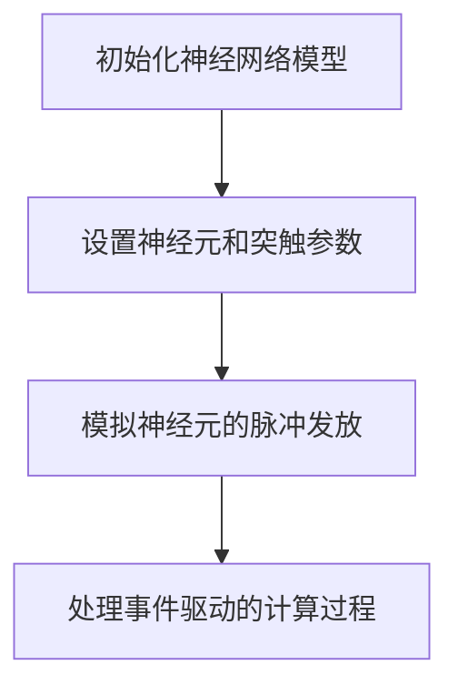
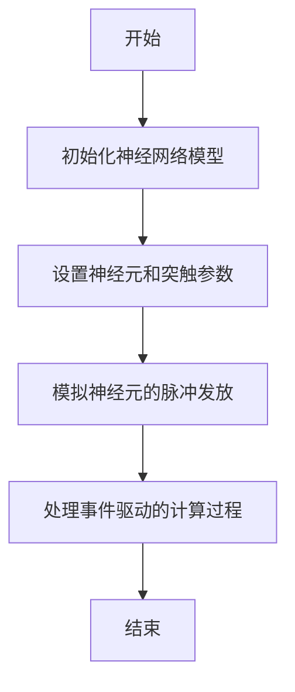
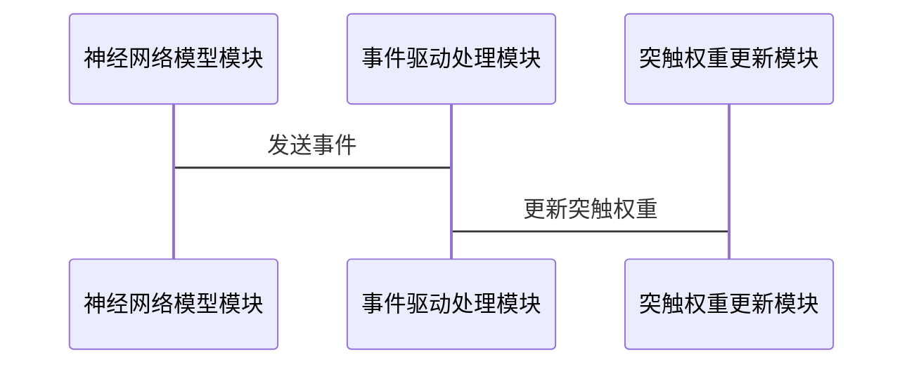

                 


# 如何识别企业的神经形态计算芯片优势

## 关键词：神经形态计算芯片, 企业优势, 计算模型, 系统架构, 边缘计算

## 摘要：神经形态计算芯片是一种结合了神经科学和计算机技术的创新芯片，能够在企业中提供高效的计算能力，特别是在AI和边缘计算领域。本文将从背景介绍、核心概念、算法原理、系统架构、项目实战和最佳实践等方面，详细分析如何识别和利用神经形态计算芯片的优势，帮助企业提升技术竞争力。

---

## 第一部分: 神经形态计算芯片的背景与概念

### 第1章: 神经形态计算芯片的背景介绍

#### 1.1 神经形态计算芯片的定义与特点
##### 1.1.1 神经形态计算芯片的定义
神经形态计算芯片是一种模拟人脑神经网络的计算芯片，通过模拟生物神经系统的运作方式，实现高效的数据处理和计算。

##### 1.1.2 神经形态计算芯片的核心特点
- **事件驱动**：基于事件的处理方式，减少无效计算，提高效率。
- **低功耗**：通过生物神经网络的特性，大幅降低能源消耗。
- **并行计算**：支持大规模并行计算，提升处理速度。

##### 1.1.3 神经形态计算芯片与传统芯片的对比
| 对比维度 | 神经形态计算芯片 | 传统计算芯片 |
|----------|-----------------|--------------|
| 处理方式 | 事件驱动，模拟神经网络 | 时序驱动，线性处理 |
| 能耗     | 低功耗          | 高功耗        |
| 并行性   | 高度并行       | 串行处理为主 |

#### 1.2 神经形态计算芯片的发展历程
##### 1.2.1 神经形态计算芯片的起源
神经形态计算的概念起源于20世纪80年代，旨在模拟生物神经系统的计算方式。

##### 1.2.2 神经形态计算芯片的发展阶段
- **理论研究阶段**：主要集中在神经网络模型的研究。
- **实验芯片阶段**：开始出现一些实验性的神经形态芯片。
- **商业化应用阶段**：逐渐应用于AI和边缘计算领域。

#### 1.3 神经形态计算芯片在企业中的应用价值
##### 1.3.1 提高计算效率
通过模拟神经网络，大幅提高计算效率，尤其是在AI任务中表现优异。

##### 1.3.2 降低能耗
神经形态计算芯片的低功耗特性，为企业节省能源成本。

##### 1.3.3 支持边缘计算
神经形态计算芯片的高效处理能力，使其在边缘计算中具有重要应用。

### 第2章: 神经形态计算芯片的核心概念与联系

#### 2.1 神经形态计算芯片的核心原理
##### 2.1.1 神经网络模型
神经网络模型是神经形态计算芯片的核心，通过模拟生物神经网络的结构和功能，实现高效的计算。

##### 2.1.2 神经形态计算的数学模型
神经形态计算的数学模型包括脉冲函数、突触权重等，用于描述神经元之间的信息传递和处理。

##### 2.1.3 神经形态计算的硬件实现
神经形态计算芯片的硬件实现包括神经元电路、突触电路等，模拟生物神经网络的物理结构。

#### 2.2 神经形态计算芯片的属性特征对比
##### 2.2.1 计算模型对比
| 计算模型 | 神经形态计算 | 传统计算 |
|----------|--------------|----------|
| 驱动方式 | 事件驱动     | 时序驱动 |
| 并行性   | 高度并行     | 串行处理 |

##### 2.2.2 硬件架构对比
| 硬件架构 | 神经形态计算 | 传统计算 |
|----------|--------------|----------|
| 结构     | 类似生物神经网络 | 中央处理器+存储器 |
| 并行性   | 高度并行     | 串行处理 |

#### 2.3 神经形态计算芯片的ER实体关系图
```mermaid
erDiagram
    customer[客户] {
        sno : string
        name : string
        address : string
    }
    order[订单] {
        ono : string
        date : date
        total : integer
    }
    product[产品] {
        pno : string
        name : string
        price : integer
    }
    customer --> order : 下单
    order --> product : 订单包含产品
```

### 第3章: 神经形态计算芯片的算法原理

#### 3.1 神经形态计算芯片的算法概述
##### 3.1.1 脉冲计算模型
神经形态计算中的脉冲计算模型通过模拟生物神经元的脉冲发放，实现信息的传递和处理。

##### 3.1.2 事件驱动处理
事件驱动处理是神经形态计算的核心特点，通过检测事件的发生，触发相应的计算过程。

##### 3.1.3 神经形态计算的数学模型
神经形态计算的数学模型包括脉冲函数、突触权重等，用于描述神经元之间的信息传递和处理。

#### 3.2 神经形态计算芯片的算法实现
##### 3.2.1 算法实现步骤
1. 初始化神经网络模型。
2. 设置神经元和突触的参数。
3. 模拟神经元的脉冲发放。
4. 处理事件驱动的计算过程。

##### 3.2.2 算法实现的mermaid流程图


#### 3.3 神经形态计算芯片的数学模型
##### 3.3.1 脉冲函数
脉冲函数用于描述神经元的脉冲发放过程，通常采用Sigmoid函数或其他非线性函数。

##### 3.3.2 突触权重
突触权重用于描述神经元之间的连接强度，通常采用可塑性规则，如Hebbian学习规则。

##### 3.3.3 神经网络的数学模型
$$ y = f(x) $$

其中，\( y \) 是输出，\( x \) 是输入，\( f \) 是神经网络的激活函数。

---

## 第二部分: 神经形态计算芯片的系统分析与架构设计

### 第4章: 神经形态计算芯片的系统分析

#### 4.1 系统分析与项目介绍
##### 4.1.1 项目背景
神经形态计算芯片的应用场景包括AI、边缘计算等领域。

##### 4.1.2 项目目标
通过神经形态计算芯片实现高效的计算任务，提升企业的技术竞争力。

##### 4.1.3 项目需求
- 实现神经网络模型的模拟。
- 实现事件驱动的计算过程。
- 实现低功耗的硬件设计。

#### 4.2 系统功能设计
##### 4.2.1 系统功能模块
- 神经网络模型模块
- 事件驱动处理模块
- 突触权重更新模块

##### 4.2.2 系统功能流程图


### 第5章: 神经形态计算芯片的系统架构设计

#### 5.1 系统架构设计
##### 5.1.1 系统架构图


##### 5.1.2 系统接口设计
- 神经网络模型接口
- 事件驱动处理接口
- 突触权重更新接口

##### 5.1.3 系统交互设计


### 第6章: 神经形态计算芯片的项目实战

#### 6.1 环境安装与配置
##### 6.1.1 环境要求
- 操作系统：Linux/Windows/MacOS
- 开发工具：Python/IDE
- 神经形态计算芯片驱动

##### 6.1.2 环境配置步骤
1. 安装Python环境。
2. 安装神经形态计算芯片驱动。
3. 配置开发工具。

#### 6.2 系统核心实现源代码
##### 6.2.1 神经网络模型实现
```python
class Neuron:
    def __init__(self, threshold=1.0):
        self.threshold = threshold
        self.v = 0.0  # membrane potential

    def activate(self, input_current):
        self.v += input_current
        if self.v >= self.threshold:
            self.v = 0.0
            return True
        return False
```

##### 6.2.2 事件驱动处理实现
```python
class EventDrivenProcessor:
    def __init__(self, neurons):
        self.neurons = neurons

    def process_events(self):
        for neuron in self.neurons:
            if neuron.activate():
                # Handle the event
                print("Neuron fired!")
```

#### 6.3 代码应用解读与分析
##### 6.3.1 代码实现解读
上述代码实现了一个简单的神经网络模型和事件驱动处理器，展示了神经形态计算芯片的基本功能。

##### 6.3.2 代码运行分析
通过运行上述代码，可以观察到神经元的脉冲发放过程，以及事件驱动处理器对事件的处理过程。

#### 6.4 实际案例分析与详细讲解
##### 6.4.1 案例介绍
通过一个简单的神经网络模型，展示神经形态计算芯片的应用场景。

##### 6.4.2 案例分析
分析案例中的神经网络模型和事件驱动处理器的实现，总结其优缺点。

### 第7章: 神经形态计算芯片的最佳实践

#### 7.1 最佳实践 tips
##### 7.1.1 系统设计建议
- 确保神经网络模型的正确性。
- 优化事件驱动处理的效率。
- 定期更新突触权重，保持系统的适应性。

##### 7.1.2 系统实现建议
- 使用高效的编程语言和工具。
- 优化硬件设计，降低能耗。
- 确保系统的可扩展性。

#### 7.2 小结
神经形态计算芯片在企业中的应用前景广阔，通过合理的设计和实现，可以显著提升企业的技术竞争力。

#### 7.3 注意事项
##### 7.3.1 系统设计注意事项
- 确保神经网络模型的正确性。
- 优化事件驱动处理的效率。
- 定期更新突触权重，保持系统的适应性。

##### 7.3.2 系统实现注意事项
- 使用高效的编程语言和工具。
- 优化硬件设计，降低能耗。
- 确保系统的可扩展性。

#### 7.4 拓展阅读
##### 7.4.1 推荐书籍
- 《神经网络与深度学习》
- 《神经形态计算：原理与应用》

##### 7.4.2 推荐博客与技术文章
- 神经形态计算芯片的技术博客
- 神经网络与深度学习的技术文章

---

## 作者：AI天才研究院/AI Genius Institute & 禅与计算机程序设计艺术 /Zen And The Art of Computer Programming

